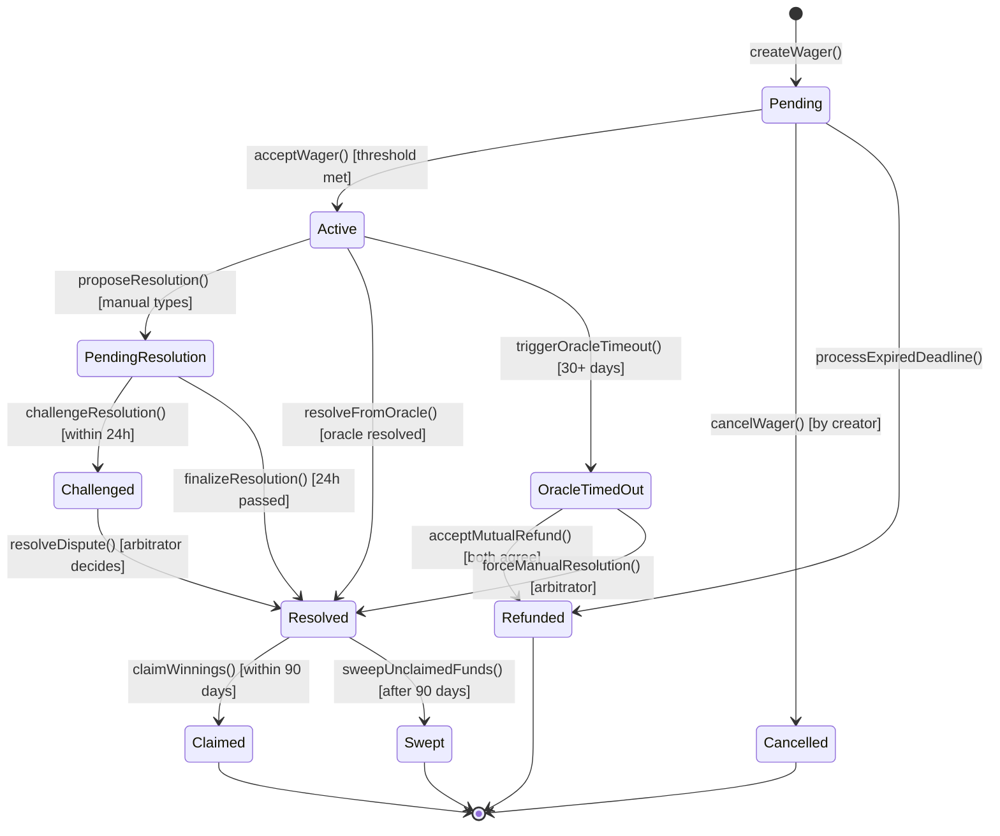
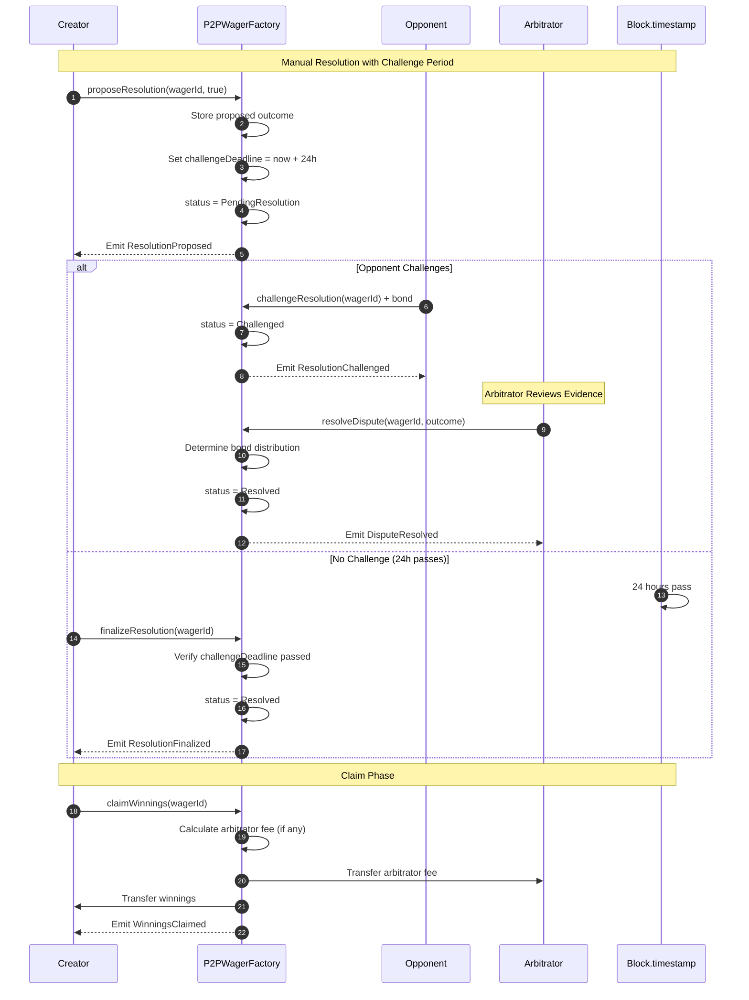
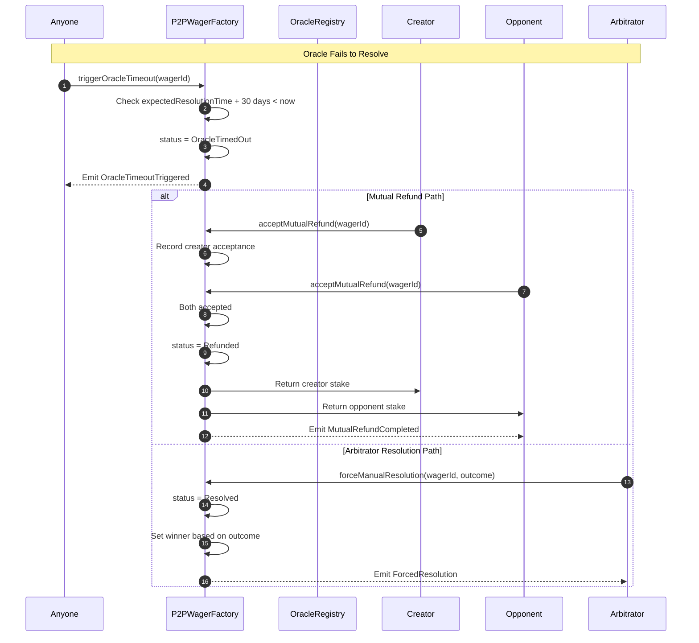
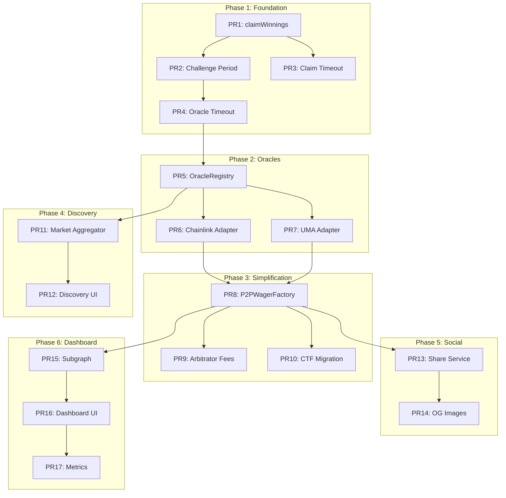

# FairWins Platform Transformation - Complete Implementation Plan

## Executive Summary

This document outlines the complete transformation of FairWins from a prediction market platform to a **P2P wager management layer**. It integrates the consistency fixes identified in the system flow analysis with the architectural changes needed to support the new primary focus.

### Transformation Goals

1. **P2P wagers as primary product** - Simple, direct bets between parties
2. **External markets as infrastructure** - Polymarket, Chainlink, UMA for resolution
3. **Social platforms as distribution** - Share to Twitter/Discord/Telegram
4. **User dashboard as interface** - Track positions, metrics, analytics
5. **No liquidity fragmentation** - Leverage existing market depth

### Critical Fixes Required

1. Implement `claimWinnings()` - Transfer stakes after resolution
2. Add challenge period for manual resolutions
3. Add claim timeout with treasury fallback
4. Add oracle timeout fallback mechanism
5. Add optional arbitrator fee mechanism

---

## Phase Overview

```
┌─────────────────────────────────────────────────────────────────────────────┐
│                    IMPLEMENTATION PHASES                                     │
├─────────────────────────────────────────────────────────────────────────────┤
│                                                                              │
│  PHASE 1: Core Fixes (Foundation)                          [2-3 weeks]     │
│  ├── PR1: Implement claimWinnings()                                         │
│  ├── PR2: Add challenge period for disputes                                 │
│  ├── PR3: Add claim timeout mechanism                                       │
│  └── PR4: Add oracle timeout fallback                                       │
│                                                                              │
│  PHASE 2: Oracle Expansion                                  [2 weeks]       │
│  ├── PR5: Create OracleRegistry contract                                    │
│  ├── PR6: Implement ChainlinkOracleAdapter                                  │
│  └── PR7: Implement UMAOracleAdapter                                        │
│                                                                              │
│  PHASE 3: P2P Simplification                                [2-3 weeks]     │
│  ├── PR8: Create standalone P2PWagerFactory                                 │
│  ├── PR9: Add arbitrator fee mechanism                                      │
│  └── PR10: Migrate from CTF dependency                                      │
│                                                                              │
│  PHASE 4: Market Discovery                                  [2 weeks]       │
│  ├── PR11: Build market aggregator service                                  │
│  └── PR12: Add discovery UI components                                      │
│                                                                              │
│  PHASE 5: Social Share-out                                  [1-2 weeks]     │
│  ├── PR13: Implement share service                                          │
│  └── PR14: Add OG image generation                                          │
│                                                                              │
│  PHASE 6: Dashboard & Metrics                               [2 weeks]       │
│  ├── PR15: Deploy subgraph for indexing                                     │
│  ├── PR16: Build position dashboard                                         │
│  └── PR17: Add metrics and analytics                                        │
│                                                                              │
└─────────────────────────────────────────────────────────────────────────────┘
```

---

## Detailed PR Specifications

### PHASE 1: Core Fixes (Foundation)

#### PR1: Implement claimWinnings() Function

**Priority:** CRITICAL
**Estimated Effort:** 3-4 days
**Dependencies:** None

**Problem:**
Resolution marks wager as resolved but doesn't transfer funds. Stakes remain locked in contract.

**Solution:**
Add `claimWinnings()` function that transfers stakes to winner after resolution.

**Files to Create/Modify:**
- `contracts/markets/FriendGroupMarketFactory.sol` - Add claimWinnings function
- `contracts/markets/FriendGroupMarketLib.sol` - Add payout calculation helpers
- `test/FriendGroupMarketFactory.Claim.test.js` - New test file

**Contract Changes:**
```solidity
// New storage
mapping(uint256 => bool) public winningsClaimed;
mapping(uint256 => address) public wagerWinner;
mapping(uint256 => bool) public wagerOutcome; // true = creator wins, false = opponent wins

// New events
event WinningsClaimed(
    uint256 indexed friendMarketId,
    address indexed winner,
    uint256 amount,
    address token
);

// New function
function claimWinnings(uint256 friendMarketId) external nonReentrant;
```

**State Transitions:**
```
Resolved + !claimed → Resolved + claimed (funds transferred)
```

**Acceptance Criteria:**
- [ ] Winner can claim after resolution
- [ ] Non-winner cannot claim
- [ ] Cannot claim twice
- [ ] Supports native and ERC20 tokens
- [ ] Emits WinningsClaimed event
- [ ] Gas optimized (<100k gas)

---

#### PR2: Add Challenge Period for Manual Resolutions

**Priority:** HIGH
**Estimated Effort:** 4-5 days
**Dependencies:** PR1

**Problem:**
Manual resolutions are immediately final. No recourse for dishonest resolution.

**Solution:**
Add 24-48 hour challenge window before resolution is finalized.

**Files to Create/Modify:**
- `contracts/markets/FriendGroupMarketFactory.sol` - Add challenge logic
- `contracts/markets/DisputeManager.sol` - New contract for dispute handling
- `test/FriendGroupMarketFactory.Dispute.test.js` - New test file

**New State Machine:**
```
Active → PendingResolution → Challenged → Resolved
                          → Finalized → Resolved
```

**Contract Changes:**
```solidity
// New enum value
enum FriendMarketStatus {
    PendingAcceptance,
    Active,
    PendingResolution,  // NEW: Waiting for challenge period
    Challenged,         // NEW: Under dispute
    Resolved,
    Cancelled,
    Refunded
}

// New storage
struct PendingResolution {
    bool proposedOutcome;
    address proposer;
    uint256 proposedAt;
    uint256 challengeDeadline;
}
mapping(uint256 => PendingResolution) public pendingResolutions;

uint256 public challengePeriod = 24 hours;
uint256 public challengeBond = 0.1 ether;

// New functions
function proposeResolution(uint256 friendMarketId, bool outcome) external;
function challengeResolution(uint256 friendMarketId) external payable;
function finalizeResolution(uint256 friendMarketId) external;
function resolveDispute(uint256 friendMarketId, bool outcome) external; // arbitrator only
```

**Acceptance Criteria:**
- [ ] Manual resolutions enter PendingResolution state
- [ ] 24-hour challenge window before finalization
- [ ] Either party can challenge with bond
- [ ] Arbitrator resolves disputes
- [ ] Bonds distributed based on outcome
- [ ] Existing oracle resolutions skip challenge period

---

#### PR3: Add Claim Timeout Mechanism

**Priority:** MEDIUM
**Estimated Effort:** 2-3 days
**Dependencies:** PR1

**Problem:**
If winner never claims, funds locked forever. No recovery mechanism.

**Solution:**
Add 90-day claim window. Unclaimed funds go to DAO treasury.

**Files to Create/Modify:**
- `contracts/markets/FriendGroupMarketFactory.sol` - Add timeout logic
- `test/FriendGroupMarketFactory.Timeout.test.js` - New test file

**Contract Changes:**
```solidity
// New storage
uint256 public claimTimeout = 90 days;
address public treasury;
mapping(uint256 => uint256) public resolutionTimestamp;

// New events
event UnclaimedFundsSwept(
    uint256 indexed friendMarketId,
    uint256 amount,
    address token
);

// New functions
function sweepUnclaimedFunds(uint256 friendMarketId) external;
function setTreasury(address _treasury) external onlyOwner;
function setClaimTimeout(uint256 _timeout) external onlyOwner;
```

**Acceptance Criteria:**
- [ ] Winner can claim within 90 days
- [ ] After 90 days, anyone can sweep to treasury
- [ ] Sweep only works if not claimed
- [ ] Treasury address configurable
- [ ] Timeout duration configurable

---

#### PR4: Add Oracle Timeout Fallback

**Priority:** HIGH
**Estimated Effort:** 3-4 days
**Dependencies:** PR2

**Problem:**
If Polymarket/external oracle never resolves, wager stuck forever.

**Solution:**
Add timeout mechanism that enables manual override or mutual refund.

**Files to Create/Modify:**
- `contracts/markets/FriendGroupMarketFactory.sol` - Add fallback logic
- `contracts/oracles/PolymarketOracleAdapter.sol` - Add timeout tracking
- `test/FriendGroupMarketFactory.OracleTimeout.test.js` - New test file

**Contract Changes:**
```solidity
// New storage
uint256 public oracleTimeout = 30 days;
mapping(uint256 => uint256) public expectedResolutionTime;

// New events
event OracleTimeoutTriggered(
    uint256 indexed friendMarketId,
    bytes32 conditionId,
    uint256 expectedTime,
    uint256 actualTime
);

event MutualRefundInitiated(
    uint256 indexed friendMarketId,
    address indexed initiator
);

// New functions
function setExpectedResolutionTime(uint256 friendMarketId, uint256 timestamp) external;
function triggerOracleTimeout(uint256 friendMarketId) external;
function acceptMutualRefund(uint256 friendMarketId) external;
function forceManualResolution(uint256 friendMarketId) external; // requires both parties or arbitrator
```

**State Transitions:**
```
Active + OracleTimeout → OracleTimedOut → MutualRefund (if both agree)
                                        → ManualResolution (if arbitrator)
```

**Acceptance Criteria:**
- [ ] After 30 days past expected resolution, timeout can be triggered
- [ ] Both parties can agree to mutual refund
- [ ] Arbitrator can force manual resolution
- [ ] Original resolution type is preserved if oracle resolves late
- [ ] Timeout period configurable

---

### PHASE 2: Oracle Expansion

#### PR5: Create OracleRegistry Contract

**Priority:** HIGH
**Estimated Effort:** 3-4 days
**Dependencies:** PR4

**Problem:**
Only Polymarket adapter exists. No unified interface for multiple oracles.

**Solution:**
Create registry pattern with pluggable adapters.

**Files to Create:**
- `contracts/oracles/OracleRegistry.sol` - Main registry contract
- `contracts/oracles/IOracleAdapter.sol` - Standard adapter interface
- `test/OracleRegistry.test.js` - Test file

**Contract Structure:**
```solidity
// contracts/oracles/IOracleAdapter.sol
interface IOracleAdapter {
    function oracleType() external view returns (string memory);
    function isConditionSupported(bytes32 conditionId) external view returns (bool);
    function isConditionResolved(bytes32 conditionId) external view returns (bool);
    function getOutcome(bytes32 conditionId) external view returns (
        bool outcome,
        uint256 confidence,
        uint256 resolvedAt
    );
    function getConditionMetadata(bytes32 conditionId) external view returns (
        string memory description,
        uint256 expectedResolutionTime
    );
}

// contracts/oracles/OracleRegistry.sol
contract OracleRegistry is Ownable {
    mapping(bytes32 => address) public adapters; // oracleId => adapter
    mapping(address => bool) public verifiedAdapters;
    bytes32[] public registeredOracleIds;

    function registerAdapter(bytes32 oracleId, address adapter) external onlyOwner;
    function removeAdapter(bytes32 oracleId) external onlyOwner;
    function verifyAdapter(address adapter, bool verified) external onlyOwner;
    function resolveCondition(bytes32 oracleId, bytes32 conditionId) external view returns (bool, uint256);
    function findAdaptersForCondition(bytes32 conditionId) external view returns (address[] memory);
}
```

**Acceptance Criteria:**
- [ ] Registry can store multiple adapters
- [ ] Adapters implement standard interface
- [ ] Verification status for trust levels
- [ ] Query across all adapters for condition
- [ ] Events for registration/removal

---

#### PR6: Implement ChainlinkOracleAdapter

**Priority:** MEDIUM
**Estimated Effort:** 3-4 days
**Dependencies:** PR5

**Files to Create:**
- `contracts/oracles/ChainlinkOracleAdapter.sol`
- `contracts/interfaces/IChainlinkAggregator.sol`
- `test/ChainlinkOracleAdapter.test.js`

**Contract Structure:**
```solidity
contract ChainlinkOracleAdapter is IOracleAdapter, Ownable {
    struct PriceCondition {
        address feedAddress;
        int256 threshold;
        bool isAbove; // true = price > threshold wins
        uint256 resolutionTime;
        bool resolved;
        bool outcome;
    }

    mapping(bytes32 => PriceCondition) public conditions;

    function createPriceCondition(
        address feedAddress,
        int256 threshold,
        bool isAbove,
        uint256 resolutionTime
    ) external returns (bytes32 conditionId);

    function checkAndResolve(bytes32 conditionId) external;
}
```

**Supported Use Cases:**
- "ETH above $5000 by Dec 31"
- "BTC below $30000 by end of month"
- Any Chainlink price feed comparison

---

#### PR7: Implement UMAOracleAdapter

**Priority:** MEDIUM
**Estimated Effort:** 4-5 days
**Dependencies:** PR5

**Files to Create:**
- `contracts/oracles/UMAOracleAdapter.sol`
- `contracts/interfaces/IOptimisticOracleV3.sol`
- `test/UMAOracleAdapter.test.js`

**Contract Structure:**
```solidity
contract UMAOracleAdapter is IOracleAdapter, Ownable {
    OptimisticOracleV3 public immutable oo;

    struct Assertion {
        bytes32 assertionId;
        string ancillaryData;
        uint256 bond;
        uint256 liveness;
        bool resolved;
        bool outcome;
    }

    mapping(bytes32 => Assertion) public assertions;

    function createAssertion(
        string memory ancillaryData,
        uint256 bond,
        uint256 liveness
    ) external returns (bytes32 conditionId);

    function settleAssertion(bytes32 conditionId) external;
}
```

---

### PHASE 3: P2P Simplification

#### PR8: Create Standalone P2PWagerFactory

**Priority:** HIGH
**Estimated Effort:** 5-7 days
**Dependencies:** PR1-PR7

**Problem:**
Current FriendGroupMarketFactory has CTF dependency and complexity not needed for simple P2P wagers.

**Solution:**
Create simplified standalone contract focused purely on P2P wagers.

**Files to Create:**
- `contracts/wagers/P2PWagerFactory.sol` - Main wager contract
- `contracts/wagers/WagerLib.sol` - Helper library
- `test/P2PWagerFactory.test.js` - Test file

**Contract Structure:**
```solidity
contract P2PWagerFactory is Ownable, ReentrancyGuard {
    struct Wager {
        uint256 wagerId;
        address creator;
        address opponent;
        address arbitrator;
        uint256 creatorStake;
        uint256 opponentStake;
        address stakeToken;
        string description;
        bytes32 oracleId;
        bytes32 externalCondition;
        WagerStatus status;
        ResolutionType resolutionType;
        uint256 acceptanceDeadline;
        uint256 expectedResolutionTime;
        uint256 createdAt;
        uint256 resolvedAt;
        bool outcome;
        address winner;
        uint256 arbitratorFee; // basis points (100 = 1%)
    }

    enum WagerStatus {
        Pending,
        Active,
        PendingResolution,
        Challenged,
        Resolved,
        Disputed,
        Cancelled,
        Refunded,
        OracleTimedOut
    }

    enum ResolutionType {
        CreatorResolves,
        OpponentResolves,
        EitherResolves,
        Arbitrator,
        ExternalOracle
    }

    // Core functions - Lifecycle
    function createWager(...) external payable returns (uint256);
    function acceptWager(uint256 wagerId) external payable;
    function cancelWager(uint256 wagerId) external;

    // Core functions - Resolution
    function proposeResolution(uint256 wagerId, bool outcome) external;
    function challengeResolution(uint256 wagerId) external payable;
    function finalizeResolution(uint256 wagerId) external;
    function resolveFromOracle(uint256 wagerId) external;

    // Core functions - Claims
    function claimWinnings(uint256 wagerId) external;
    function sweepUnclaimedFunds(uint256 wagerId) external;

    // Timeout handling
    function triggerOracleTimeout(uint256 wagerId) external;
    function acceptMutualRefund(uint256 wagerId) external;
}
```

**Key Differences from FriendGroupMarketFactory:**
1. No CTF/ConditionalMarket dependency
2. Direct stake escrow and transfer
3. Built-in challenge period
4. Built-in claim timeout
5. Built-in oracle timeout
6. Built-in arbitrator fees
7. Simpler state machine

---

#### PR9: Add Arbitrator Fee Mechanism

**Priority:** MEDIUM
**Estimated Effort:** 2-3 days
**Dependencies:** PR8

**Problem:**
Arbitrators have no economic incentive for timely resolution.

**Solution:**
Allow optional arbitrator fee (% of stakes) paid on resolution.

**Contract Changes (in P2PWagerFactory):**
```solidity
// In Wager struct
uint256 arbitratorFee; // basis points (100 = 1%, max 1000 = 10%)

// New storage
uint256 public maxArbitratorFee = 1000; // 10% max

// Events
event ArbitratorPaid(
    uint256 indexed wagerId,
    address indexed arbitrator,
    uint256 amount,
    address token
);

// Logic in claimWinnings
function claimWinnings(uint256 wagerId) external {
    // ... validation ...

    uint256 totalPot = wager.creatorStake + wager.opponentStake;
    uint256 arbFee = 0;

    if (wager.arbitrator != address(0) && wager.arbitratorFee > 0) {
        arbFee = (totalPot * wager.arbitratorFee) / 10000;
        _transferStake(wager.arbitrator, wager.stakeToken, arbFee);
        emit ArbitratorPaid(wagerId, wager.arbitrator, arbFee, wager.stakeToken);
    }

    uint256 winnings = totalPot - arbFee;
    _transferStake(wager.winner, wager.stakeToken, winnings);
}
```

---

#### PR10: Migrate from CTF Dependency

**Priority:** MEDIUM
**Estimated Effort:** 3-4 days
**Dependencies:** PR8

**Problem:**
FriendGroupMarketFactory creates underlying CTF markets unnecessarily.

**Solution:**
Update to use P2PWagerFactory or remove CTF creation for simple wagers.

**Files to Modify:**
- `contracts/markets/FriendGroupMarketFactory.sol` - Remove CTF creation for P2P
- `contracts/core/DAOFactory.sol` - Deploy P2PWagerFactory
- Migration scripts

**Approach:**
1. Keep FriendGroupMarketFactory for CTF-backed complex markets
2. Add P2PWagerFactory for simple P2P wagers
3. Frontend routes to appropriate factory based on wager type

---

### PHASE 4: Market Discovery

#### PR11: Build Market Aggregator Service

**Priority:** MEDIUM
**Estimated Effort:** 5-7 days
**Dependencies:** PR5-PR7

**Files to Create:**
- `services/market-aggregator/` - New service directory
- `services/market-aggregator/src/index.ts`
- `services/market-aggregator/src/sources/polymarket.ts`
- `services/market-aggregator/src/sources/chainlink.ts`
- `services/market-aggregator/src/sources/uma.ts`
- `services/market-aggregator/src/api/routes.ts`

**API Endpoints:**
```typescript
// Search markets across all sources
GET /api/markets/search?q={query}&sources={polymarket,chainlink,uma}

// Get market details
GET /api/markets/{source}/{conditionId}

// Get trending markets
GET /api/markets/trending?limit=10

// Get markets resolving soon
GET /api/markets/resolving-soon?days=7
```

**Data Model:**
```typescript
interface AggregatedMarket {
  id: string;
  source: 'polymarket' | 'chainlink' | 'uma' | 'manual';
  conditionId: string;
  oracleId: string;
  question: string;
  description?: string;
  resolutionTime?: number;
  currentOdds?: { yes: number; no: number };
  volume?: string;
  resolved: boolean;
  outcome?: boolean;
  chainId: number;
  contractAddress: string;
}
```

---

#### PR12: Add Discovery UI Components

**Priority:** MEDIUM
**Estimated Effort:** 3-4 days
**Dependencies:** PR11

**Files to Create:**
- `frontend/src/components/discovery/MarketSearch.jsx`
- `frontend/src/components/discovery/MarketCard.jsx`
- `frontend/src/components/discovery/MarketFilters.jsx`
- `frontend/src/hooks/useMarketSearch.js`
- `frontend/src/services/marketAggregator.js`

---

### PHASE 5: Social Share-out

#### PR13: Implement Share Service

**Priority:** MEDIUM
**Estimated Effort:** 3-4 days
**Dependencies:** PR8

**Files to Create:**
- `frontend/src/services/shareService.js`
- `frontend/src/components/share/ShareModal.jsx`
- `frontend/src/components/share/ShareButtons.jsx`

**Share Service:**
```javascript
export const ShareService = {
  // Twitter/X
  generateTwitterIntent(wager) {
    const text = `🎯 New wager challenge!\n\n"${wager.description}"\n\nStakes: ${wager.stake} ${wager.token}\n\nAccept the challenge:`;
    const url = `https://fairwins.io/wager/${wager.id}`;
    return `https://twitter.com/intent/tweet?text=${encodeURIComponent(text)}&url=${encodeURIComponent(url)}`;
  },

  // Discord
  generateDiscordWebhook(wager, webhookUrl) { ... },

  // Telegram
  generateTelegramShare(wager) {
    const text = `🎯 New wager: "${wager.description}"`;
    const url = `https://fairwins.io/wager/${wager.id}`;
    return `https://t.me/share/url?url=${encodeURIComponent(url)}&text=${encodeURIComponent(text)}`;
  },

  // Universal link
  generateShareLink(wager) {
    return `https://fairwins.io/wager/${wager.id}`;
  },

  // Copy to clipboard
  copyToClipboard(text) { ... }
};
```

---

#### PR14: Add OG Image Generation

**Priority:** LOW
**Estimated Effort:** 2-3 days
**Dependencies:** PR13

**Files to Create:**
- `services/og-image/` - Vercel OG or similar
- `frontend/src/pages/api/og.js` - Next.js API route (or equivalent)

**OG Image Content:**
```
┌─────────────────────────────────────────┐
│  🎯 FairWins Wager                      │
│                                         │
│  "ETH above $5000 by Dec 31, 2024"     │
│                                         │
│  Stakes: 0.5 ETH each                   │
│  Resolution: Polymarket                 │
│                                         │
│  [Accept Challenge]                     │
└─────────────────────────────────────────┘
```

---

### PHASE 6: Dashboard & Metrics

#### PR15: Deploy Subgraph for Indexing

**Priority:** HIGH
**Estimated Effort:** 4-5 days
**Dependencies:** PR8

**Files to Create:**
- `subgraph/subgraph.yaml`
- `subgraph/schema.graphql`
- `subgraph/src/mappings/wagerFactory.ts`
- `subgraph/src/mappings/oracleRegistry.ts`

**Schema:**
```graphql
type User @entity {
  id: Bytes!
  wagersCreated: [Wager!]! @derivedFrom(field: "creator")
  wagersAccepted: [Wager!]! @derivedFrom(field: "opponent")
  wagersArbitrated: [Wager!]! @derivedFrom(field: "arbitrator")
  totalWagered: BigInt!
  totalWon: BigInt!
  totalLost: BigInt!
  winCount: Int!
  lossCount: Int!
  activeWagerCount: Int!
  createdAt: BigInt!
}

type Wager @entity {
  id: ID!
  wagerId: BigInt!
  creator: User!
  opponent: User
  arbitrator: User
  creatorStake: BigInt!
  opponentStake: BigInt!
  stakeToken: Bytes!
  description: String!
  oracleId: Bytes
  externalCondition: Bytes
  status: WagerStatus!
  resolutionType: ResolutionType!
  outcome: Boolean
  winner: User
  arbitratorFee: BigInt
  arbitratorPaid: BigInt
  createdAt: BigInt!
  acceptedAt: BigInt
  resolvedAt: BigInt
  claimedAt: BigInt
  challengeDeadline: BigInt
  expectedResolutionTime: BigInt
}

enum WagerStatus {
  PENDING
  ACTIVE
  PENDING_RESOLUTION
  CHALLENGED
  RESOLVED
  DISPUTED
  CANCELLED
  REFUNDED
  ORACLE_TIMED_OUT
}

enum ResolutionType {
  CREATOR_RESOLVES
  OPPONENT_RESOLVES
  EITHER_RESOLVES
  ARBITRATOR
  EXTERNAL_ORACLE
}

type DailyStats @entity {
  id: ID! # date string
  date: BigInt!
  wagersCreated: Int!
  wagersResolved: Int!
  totalVolume: BigInt!
  uniqueUsers: Int!
}
```

---

#### PR16: Build Position Dashboard

**Priority:** HIGH
**Estimated Effort:** 4-5 days
**Dependencies:** PR15

**Files to Create:**
- `frontend/src/components/dashboard/PositionDashboard.jsx`
- `frontend/src/components/dashboard/OpenPositions.jsx`
- `frontend/src/components/dashboard/PendingInvitations.jsx`
- `frontend/src/components/dashboard/ResolvedWagers.jsx`
- `frontend/src/components/dashboard/WagerCard.jsx`
- `frontend/src/hooks/useUserWagers.js`
- `frontend/src/hooks/useWagerMetrics.js`

**Dashboard Layout:**
```
┌─────────────────────────────────────────────────────────────────┐
│  MY WAGERS                                    [Create Wager]    │
├─────────────────────────────────────────────────────────────────┤
│  ┌─────────┐ ┌─────────┐ ┌─────────┐ ┌─────────┐               │
│  │ Active  │ │ Pending │ │ To Claim│ │ History │               │
│  │   (4)   │ │   (2)   │ │   (1)   │ │  (23)   │               │
│  └─────────┘ └─────────┘ └─────────┘ └─────────┘               │
├─────────────────────────────────────────────────────────────────┤
│                                                                  │
│  OPEN POSITIONS                                                  │
│  ┌─────────────────────────────────────────────────────────────┐│
│  │ 📊 ETH > $5000 by Dec 2024                                  ││
│  │    Staked: 0.5 ETH | Side: YES | vs: 0x1234...              ││
│  │    Resolution: Polymarket | Resolves: Dec 31                ││
│  │    [Share] [View Details]                                    ││
│  └─────────────────────────────────────────────────────────────┘│
│  ┌─────────────────────────────────────────────────────────────┐│
│  │ 🏈 Chiefs win Super Bowl                                    ││
│  │    Staked: 100 USDC | Side: NO | vs: 0x5678...              ││
│  │    Resolution: Manual | Arbitrator: 0xABCD...               ││
│  │    [Share] [View Details]                                    ││
│  └─────────────────────────────────────────────────────────────┘│
│                                                                  │
│  PENDING INVITATIONS                                             │
│  ┌─────────────────────────────────────────────────────────────┐│
│  │ BTC halving date prediction                                 ││
│  │    From: 0x9999... | Stake: 0.1 BTC | Expires: 2h           ││
│  │    [Accept] [Decline] [Counter-offer]                        ││
│  └─────────────────────────────────────────────────────────────┘│
│                                                                  │
└─────────────────────────────────────────────────────────────────┘
```

---

#### PR17: Add Metrics and Analytics

**Priority:** MEDIUM
**Estimated Effort:** 3-4 days
**Dependencies:** PR15, PR16

**Files to Create:**
- `frontend/src/components/metrics/UserMetrics.jsx`
- `frontend/src/components/metrics/MetricCard.jsx`
- `frontend/src/components/metrics/WinRateChart.jsx`
- `frontend/src/components/metrics/VolumeChart.jsx`

**Metrics Displayed:**
```
┌─────────────────────────────────────────────────────────────────┐
│  MY STATS                                                        │
├─────────────────────────────────────────────────────────────────┤
│  ┌───────────────┐ ┌───────────────┐ ┌───────────────┐          │
│  │ Total Wagered │ │   Win Rate    │ │  Lifetime P&L │          │
│  │   $12,450     │ │     62%       │ │   +$2,340     │          │
│  │   ↑ 15% MTD   │ │  31W / 19L    │ │   ↑ $450 MTD  │          │
│  └───────────────┘ └───────────────┘ └───────────────┘          │
│                                                                  │
│  ┌───────────────┐ ┌───────────────┐ ┌───────────────┐          │
│  │ Active Wagers │ │  Avg. Stake   │ │  Best Streak  │          │
│  │      4        │ │    $250       │ │    7 wins     │          │
│  └───────────────┘ └───────────────┘ └───────────────┘          │
│                                                                  │
│  ACTIVITY BY CATEGORY                                            │
│  ┌─────────────────────────────────────────────────────────────┐│
│  │  Crypto: ████████████████ 45%                               ││
│  │  Sports: ████████ 25%                                        ││
│  │  Politics: ██████ 18%                                        ││
│  │  Other: ████ 12%                                             ││
│  └─────────────────────────────────────────────────────────────┘│
└─────────────────────────────────────────────────────────────────┘
```

---

## Updated System Flows

### Complete Wager Lifecycle (With Fixes)



### Resolution Flow (With Challenge Period)



### Oracle Timeout Flow



---

## Dependency Graph



---

## Testing Strategy

### Unit Tests (per PR)
- Each PR includes comprehensive unit tests
- Minimum 90% code coverage for new contracts
- All error paths tested

### Integration Tests
- Cross-contract interactions
- Oracle resolution flows
- Token transfer scenarios

### E2E Tests
- Full wager lifecycle
- Multi-user scenarios
- Timeout handling

### Testnet Deployment
- Deploy to Mordor (ETC testnet) after each phase
- Manual QA before mainnet

---

## Risk Assessment

| Risk | Likelihood | Impact | Mitigation |
|------|------------|--------|------------|
| Oracle never resolves | Medium | High | PR4: Timeout fallback |
| Dishonest manual resolution | Medium | High | PR2: Challenge period |
| Winner doesn't claim | Low | Medium | PR3: Treasury sweep |
| Arbitrator doesn't act | Medium | Medium | PR9: Fee incentives |
| Contract upgrade needed | Low | High | Proxy pattern consideration |
| Subgraph indexing lag | Medium | Low | Cache + direct RPC fallback |

---

## Success Metrics

| Metric | Current | Phase 1 Target | Phase 6 Target |
|--------|---------|----------------|----------------|
| Wager completion rate | N/A | >90% | >95% |
| Average claim time | N/A | <24h | <12h |
| Dispute rate | N/A | <5% | <2% |
| Oracle timeout rate | N/A | <1% | <0.5% |
| User retention (30d) | N/A | >30% | >50% |
| Social share rate | 0% | >10% | >25% |

---

## Appendix: Contract Size Considerations

Current FriendGroupMarketFactory is near EIP-170 limit (24KB).

**Strategy:**
1. P2PWagerFactory is a new contract (starts fresh)
2. Use libraries for shared logic (WagerLib)
3. Split DisputeManager into separate contract
4. Use proxy pattern for upgradeability
