# FairWins P2P Wager System - Flow Diagrams

## Table of Contents
1. [System Overview](#system-overview)
2. [Entity Relationship Diagram](#entity-relationship-diagram)
3. [Wager State Machine](#wager-state-machine)
4. [User Flows](#user-flows)
5. [Sequence Diagrams](#sequence-diagrams)
6. [Error Handling Paths](#error-handling-paths)
7. [Consistency Analysis](#consistency-analysis)

---

## System Overview

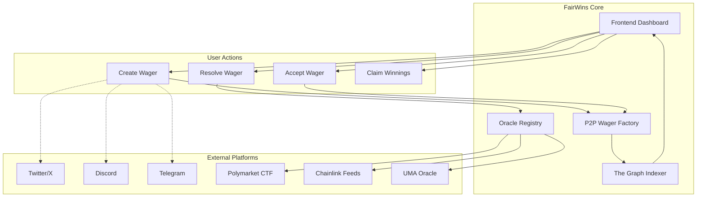

---

## Entity Relationship Diagram

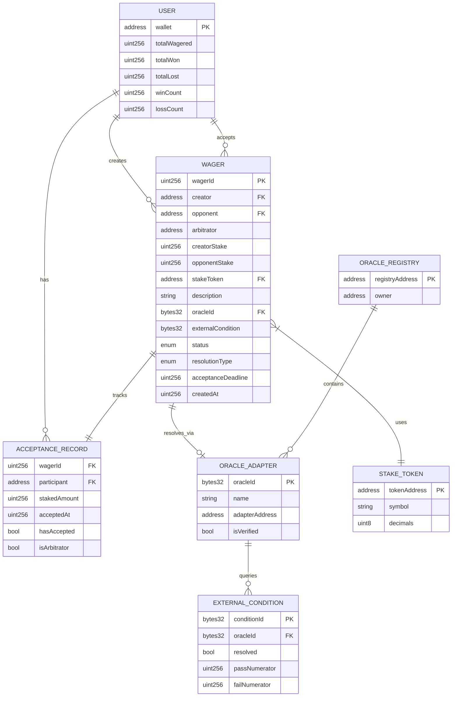

---

## Wager State Machine

### Primary State Transitions

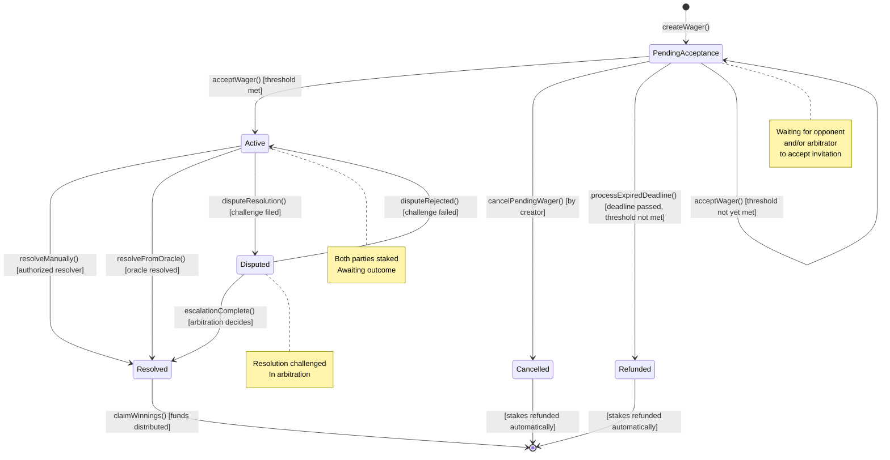

### Resolution Type State Branches

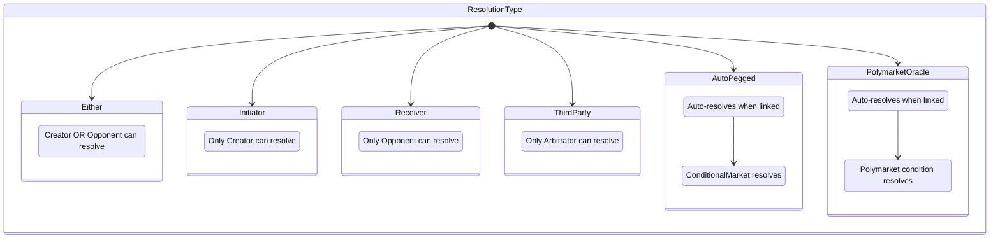

---

## User Flows

### Flow 1: Create Wager (1v1 Equal Stakes)

```mermaid
flowchart TD
    Start([User Opens App]) --> Dashboard[View Dashboard]
    Dashboard --> CreateBtn[Click "Create Wager"]
    CreateBtn --> DescForm[Enter Wager Description]

    DescForm --> ResChoice{Choose Resolution<br/>Method}

    ResChoice -->|Find Existing| Search[Search External Markets]
    ResChoice -->|Price Oracle| Oracle[Select Chainlink Feed]
    ResChoice -->|Manual| Manual[Choose Resolver Type]
    ResChoice -->|Arbitrator| Arb[Enter Arbitrator Address]

    Search --> SelectMarket[Select Polymarket/Kalshi Market]
    SelectMarket --> Stakes
    Oracle --> ConfigThreshold[Set Price Threshold]
    ConfigThreshold --> Stakes
    Manual --> Stakes
    Arb --> Stakes

    Stakes[Set Stake Amount] --> Token[Select Payment Token]
    Token --> Odds{Equal Stakes?}

    Odds -->|Yes| Equal[1:1 Odds]
    Odds -->|No| Custom[Set Custom Odds Multiplier]

    Equal --> Opponent
    Custom --> Opponent

    Opponent[Enter Opponent Address<br/>or Create Open Wager] --> Deadline[Set Acceptance Deadline]

    Deadline --> Review[Review Wager Terms]
    Review --> Confirm{Confirm &<br/>Sign Transaction?}

    Confirm -->|Yes| Submit[Submit to Blockchain]
    Confirm -->|No| Edit[Edit Terms]
    Edit --> DescForm

    Submit --> TxPending{Transaction<br/>Status?}

    TxPending -->|Success| Created[Wager Created]
    TxPending -->|Failed| Error[Show Error]
    Error --> Review

    Created --> Share{Share Wager?}
    Share -->|Twitter| Twitter[Open Twitter Intent]
    Share -->|Discord| Discord[Copy Discord Embed]
    Share -->|Link| Link[Copy Shareable Link]
    Share -->|Skip| Dashboard2[Return to Dashboard]

    Twitter --> Dashboard2
    Discord --> Dashboard2
    Link --> Dashboard2
```

### Flow 2: Accept Wager Invitation

```mermaid
flowchart TD
    Start([User Receives Invitation]) --> Source{Invitation<br/>Source?}

    Source -->|Social Media Link| OpenLink[Click Link]
    Source -->|Direct Notification| OpenApp[Open App]
    Source -->|QR Code| ScanQR[Scan QR Code]

    OpenLink --> DeepLink[Deep Link to Wager]
    ScanQR --> DeepLink
    OpenApp --> Invitations[View Pending Invitations]
    Invitations --> SelectWager[Select Wager]

    DeepLink --> WagerDetails
    SelectWager --> WagerDetails

    WagerDetails[View Wager Details] --> CheckMembership{Has Required<br/>Membership?}

    CheckMembership -->|No| PurchaseTier[Purchase Membership Tier]
    PurchaseTier --> CheckMembership
    CheckMembership -->|Yes| CheckDeadline{Deadline<br/>Passed?}

    CheckDeadline -->|Yes| Expired[Show "Wager Expired"]
    Expired --> End([End])

    CheckDeadline -->|No| CheckFunds{Sufficient<br/>Funds?}

    CheckFunds -->|No| AddFunds[Add Funds / Swap]
    AddFunds --> CheckFunds

    CheckFunds -->|Yes| ReviewTerms[Review Wager Terms]

    ReviewTerms --> Decision{Accept or<br/>Decline?}

    Decision -->|Decline| Decline[Decline Invitation]
    Decline --> End

    Decision -->|Counter| Counter[Propose Counter-terms]
    Counter --> NewWager[Create New Wager<br/>with Modified Terms]
    NewWager --> End

    Decision -->|Accept| Approve[Approve Token Spend<br/>if ERC20]

    Approve --> SignAccept[Sign Accept Transaction]

    SignAccept --> TxStatus{Transaction<br/>Status?}

    TxStatus -->|Success| CheckThreshold{Threshold<br/>Met?}
    TxStatus -->|Failed| Error[Show Error]
    Error --> ReviewTerms

    CheckThreshold -->|Yes| Activated[Wager Activated!]
    CheckThreshold -->|No| Pending[Waiting for<br/>Other Participants]

    Activated --> ViewActive[View in Active Wagers]
    Pending --> ViewPending[View in Pending]

    ViewActive --> End
    ViewPending --> End
```

### Flow 3: Resolve Wager

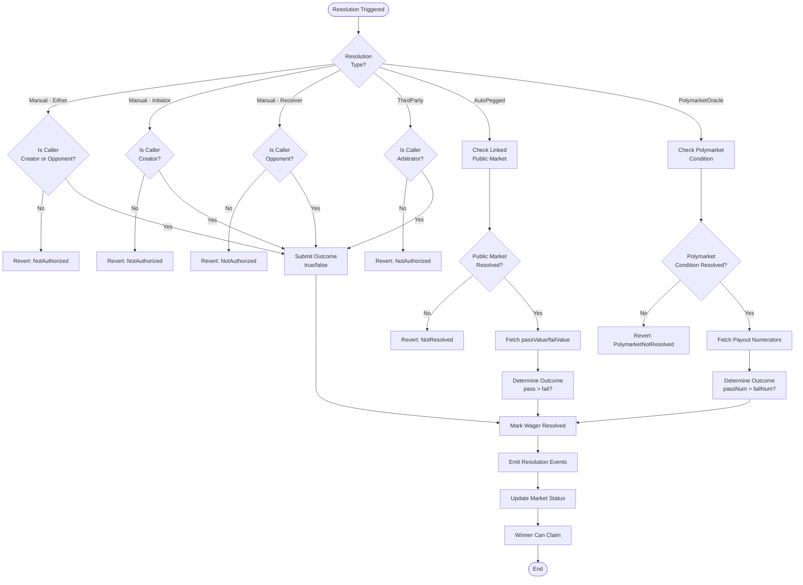

### Flow 4: Claim Winnings

```mermaid
flowchart TD
    Start([User Views Resolved Wager]) --> CheckWinner{Is User<br/>the Winner?}

    CheckWinner -->|No| NoAction[No Claim Available]
    NoAction --> End([End])

    CheckWinner -->|Yes| CheckClaimed{Already<br/>Claimed?}

    CheckClaimed -->|Yes| AlreadyClaimed[Show "Already Claimed"]
    AlreadyClaimed --> End

    CheckClaimed -->|No| ShowAmount[Display Winnable Amount]
    ShowAmount --> ClickClaim[Click "Claim Winnings"]

    ClickClaim --> SignTx[Sign Claim Transaction]

    SignTx --> TxStatus{Transaction<br/>Status?}

    TxStatus -->|Failed| Error[Show Error<br/>Retry Option]
    Error --> SignTx

    TxStatus -->|Success| Transfer{Token<br/>Type?}

    Transfer -->|Native| NativeTransfer[Transfer Native Token]
    Transfer -->|ERC20| ERC20Transfer[Transfer ERC20]

    NativeTransfer --> Confirmed
    ERC20Transfer --> Confirmed

    Confirmed[Funds Received] --> UpdateBalance[Update UI Balance]
    UpdateBalance --> ShowSuccess[Show Success Message]
    ShowSuccess --> End
```

---

## Sequence Diagrams

### Sequence 1: Complete Wager Lifecycle

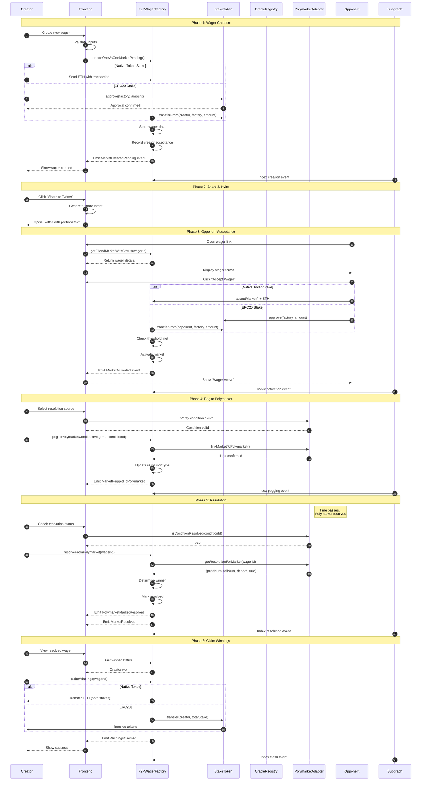

### Sequence 2: Batch Resolution from Polymarket

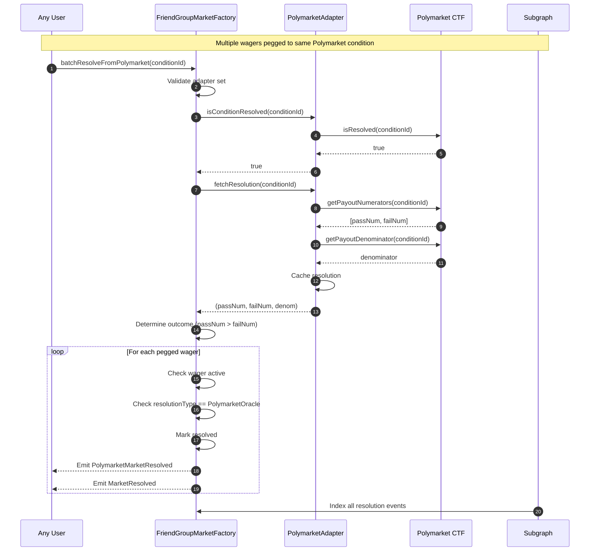

### Sequence 3: Expired Deadline Handling

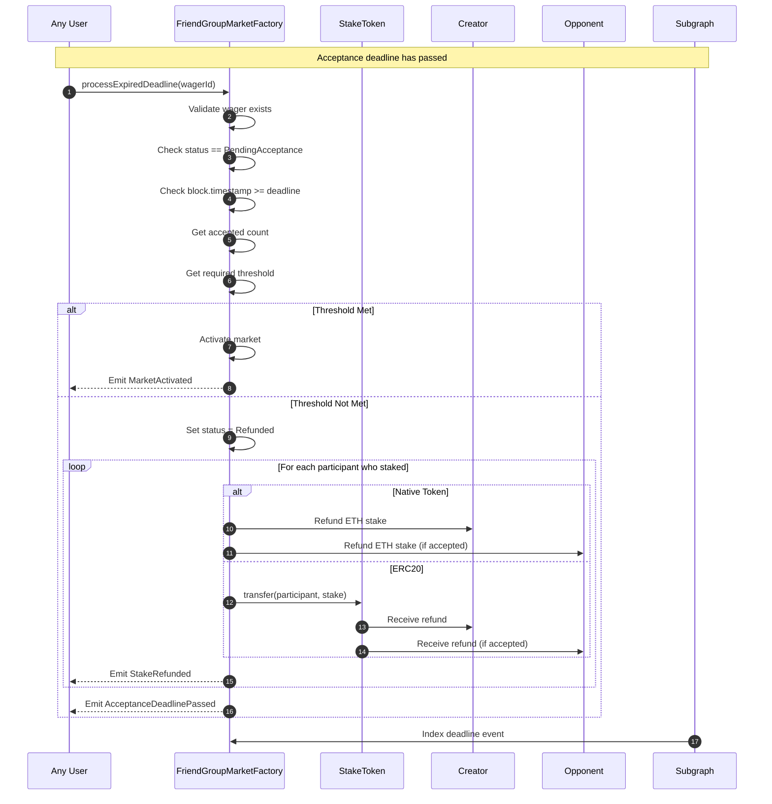

### Sequence 4: Oracle Registry Lookup

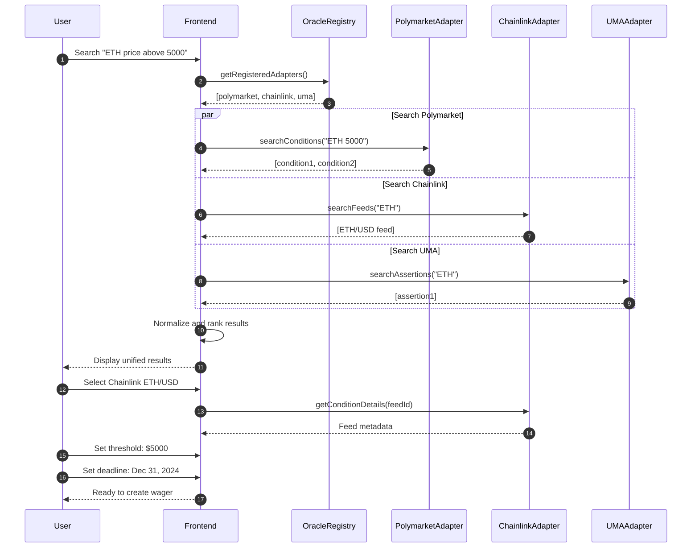

---

## Error Handling Paths

### Error Flow: Wager Creation Failures

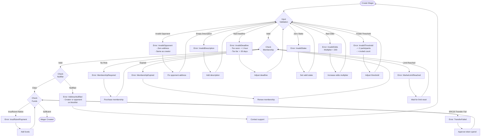

### Error Flow: Resolution Failures

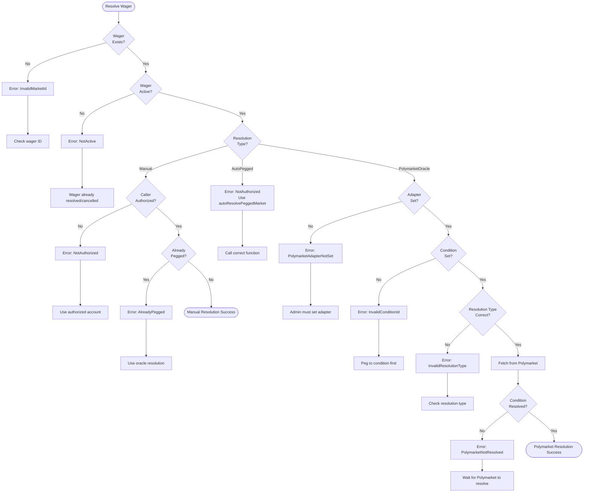

---

## Consistency Analysis

### State Transition Validity Matrix

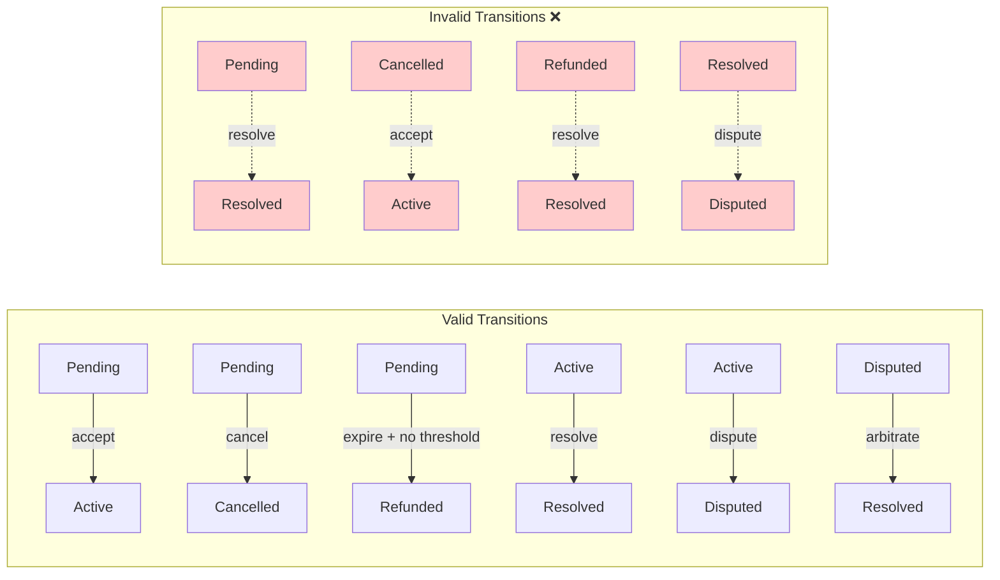

### Identified Consistency Issues

```mermaid
flowchart TD
    subgraph "Issue 1: Missing Dispute Flow"
        I1A[Active Wager] --> I1B{Manual Resolution<br/>Submitted}
        I1B --> I1C[Immediately Resolved]
        I1D[⚠️ No challenge window<br/>for manual resolutions]
        I1C -.-> I1D
    end

    subgraph "Issue 2: Orphaned Stakes"
        I2A[Wager Resolved] --> I2B{Winner Claims?}
        I2B -->|No| I2C[Stakes locked forever]
        I2D[⚠️ No timeout for<br/>unclaimed winnings]
        I2C -.-> I2D
    end

    subgraph "Issue 3: Arbitrator Incentives"
        I3A[ThirdParty Resolution] --> I3B{Arbitrator Resolves}
        I3B --> I3C[No payment to arbitrator]
        I3D[⚠️ No incentive for<br/>timely resolution]
        I3C -.-> I3D
    end

    subgraph "Issue 4: Oracle Failure"
        I4A[PolymarketOracle Type] --> I4B{Polymarket Never<br/>Resolves}
        I4B --> I4C[Wager stuck Active]
        I4D[⚠️ No fallback<br/>resolution mechanism]
        I4C -.-> I4D
    end
```

### Recommended Fixes

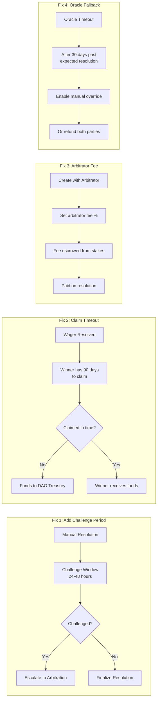

---

## Cross-Reference: Contract Functions to States

| Function | Required State | New State | Events Emitted |
|----------|---------------|-----------|----------------|
| `createOneVsOneMarketPending` | N/A | PendingAcceptance | MarketCreatedPending, ArbitratorSet |
| `createBookmakerMarket` | N/A | PendingAcceptance | MarketCreatedPending, ArbitratorSet |
| `createSmallGroupMarketPending` | N/A | PendingAcceptance | MarketCreatedPending, ArbitratorSet |
| `acceptMarket` | PendingAcceptance | PendingAcceptance or Active | ParticipantAccepted, MarketActivated |
| `cancelPendingMarket` | PendingAcceptance | Cancelled | MarketCancelledByCreator, StakeRefunded |
| `processExpiredDeadline` | PendingAcceptance | Refunded or Active | AcceptanceDeadlinePassed, StakeRefunded or MarketActivated |
| `pegToPublicMarket` | Active | Active | MarketPeggedToPublic |
| `pegToPolymarketCondition` | Active | Active | MarketPeggedToPolymarket |
| `autoResolvePeggedMarket` | Active + AutoPegged | Resolved | PeggedMarketAutoResolved, MarketResolved |
| `resolveFromPolymarket` | Active + PolymarketOracle | Resolved | PolymarketMarketResolved, MarketResolved |
| `batchResolveFromPolymarket` | Active + PolymarketOracle | Resolved | PolymarketMarketResolved, MarketResolved (multiple) |
| `resolveFriendMarket` | Active + Manual type | Resolved | MarketResolved |

---

## Summary

This document provides complete visibility into the FairWins P2P wager system architecture. Key findings:

### Strengths
1. Clear state machine with well-defined transitions
2. Multiple resolution types supporting various use cases
3. Robust acceptance flow with deadlines and thresholds
4. External oracle integration (Polymarket) already implemented

### Areas Requiring Attention
1. **No dispute mechanism** for manual resolutions
2. **No claim timeout** - stakes could be locked forever
3. **No arbitrator incentives** - may lead to slow resolution
4. **No oracle fallback** - stuck wagers if oracle fails
5. **Missing claim function** - currently only events emitted, no fund transfer

### Next Steps
1. Implement `claimWinnings()` function
2. Add challenge period for manual resolutions
3. Add claim timeout with DAO treasury fallback
4. Add optional arbitrator fee mechanism
5. Add oracle timeout with manual override option
