# FairWins P2P Wager System - Flow Diagrams V2 (With Fixes)

## Overview

This document contains the updated system flow diagrams incorporating all recommended fixes:
1. ✅ claimWinnings() function
2. ✅ Challenge period for disputes
3. ✅ Claim timeout with treasury fallback
4. ✅ Oracle timeout fallback
5. ✅ Arbitrator fee mechanism

---

## Updated Entity Relationship Diagram


---

## Updated State Machine (Complete)


---

## User Flows (Updated)

### Flow 1: Create Wager (Complete)

```mermaid
flowchart TD
    Start([User Opens App]) --> Dashboard[View Dashboard]
    Dashboard --> CreateBtn[Click "Create Wager"]

    CreateBtn --> DescForm[Enter Wager Description]
    DescForm --> ResChoice{Choose Resolution<br/>Method}

    ResChoice -->|Find Existing| SearchMarket[Search External Markets]
    ResChoice -->|Price Oracle| SelectChainlink[Select Chainlink Feed]
    ResChoice -->|Manual| SelectResolver[Choose Who Resolves]
    ResChoice -->|Arbitrator| EnterArb[Enter Arbitrator Address]

    SearchMarket --> SelectCondition[Select Market/Condition]
    SelectCondition --> SetExpectedTime[Set Expected Resolution Time]
    SetExpectedTime --> Stakes

    SelectChainlink --> ConfigThreshold[Set Price Threshold & Date]
    ConfigThreshold --> Stakes

    SelectResolver --> Stakes[Set Stake Amount]
    EnterArb --> SetArbFee[Set Arbitrator Fee %]
    SetArbFee --> Stakes

    Stakes --> Token[Select Payment Token]
    Token --> Odds{Equal Stakes?}
    Odds -->|Yes| Equal[1:1 Odds]
    Odds -->|No| Custom[Set Custom Odds]
    Equal --> Opponent
    Custom --> Opponent

    Opponent[Enter Opponent Address] --> Deadline[Set Acceptance Deadline]
    Deadline --> Review[Review All Terms]

    Review --> Confirm{Confirm?}
    Confirm -->|No| Edit[Edit Terms]
    Edit --> DescForm

    Confirm -->|Yes| ApproveToken{ERC20?}
    ApproveToken -->|Yes| Approve[Approve Token Spend]
    ApproveToken -->|No| Submit

    Approve --> Submit[Submit Transaction]
    Submit --> TxStatus{Status?}

    TxStatus -->|Failed| Error[Show Error]
    Error --> Review

    TxStatus -->|Success| Created[Wager Created!]
    Created --> SharePrompt{Share?}

    SharePrompt -->|Twitter| Twitter[Open Twitter]
    SharePrompt -->|Discord| Discord[Copy Embed]
    SharePrompt -->|Telegram| Telegram[Open Telegram]
    SharePrompt -->|Link| CopyLink[Copy Link]
    SharePrompt -->|Skip| Done

    Twitter --> Done[Return to Dashboard]
    Discord --> Done
    Telegram --> Done
    CopyLink --> Done
```

### Flow 2: Accept Wager (Complete)


### Flow 3: Manual Resolution (With Challenge Period)


### Flow 4: Oracle Timeout Handling


### Flow 5: Claim Winnings (With Timeout)


### Flow 6: Treasury Sweep (Unclaimed Funds)

```mermaid
flowchart TD
    Start([Check Resolved Wagers]) --> FindUnclaimed[Find Unclaimed > 90 Days]

    FindUnclaimed --> HasUnclaimed{Any<br/>Unclaimed?}
    HasUnclaimed -->|No| Done[Nothing to Sweep]
    Done --> End([End])

    HasUnclaimed -->|Yes| ForEach[For Each Unclaimed Wager]

    ForEach --> CheckTime{resolvedAt +<br/>90 days < now?}
    CheckTime -->|No| Skip[Skip - Not Yet]
    Skip --> ForEach

    CheckTime -->|Yes| CalcAmount[Calculate Total Stakes]
    CalcAmount --> TransferTreasury[Transfer to Treasury]
    TransferTreasury --> MarkSwept[Mark as Swept]
    MarkSwept --> EmitEvent[Emit UnclaimedFundsSwept]
    EmitEvent --> ForEach

    ForEach --> Complete[All Processed]
    Complete --> End
```



---

## Sequence Diagrams (Updated)

### Sequence 1: Complete Wager Lifecycle (With All Fixes)


### Sequence 2: Oracle Timeout Flow


### Sequence 3: Challenge and Dispute Flow


---

## Error Handling (Complete)

### All Error States and Recovery


---

## Cross-Reference: Functions to States (Updated)

| Function | Required State | New State | Events | Bond/Fee |
|----------|---------------|-----------|--------|----------|
| `createWager` | N/A | Pending | WagerCreated | - |
| `acceptWager` | Pending | Active | WagerActivated | - |
| `cancelWager` | Pending | Cancelled | WagerCancelled | - |
| `proposeResolution` | Active | PendingResolution | ResolutionProposed | - |
| `challengeResolution` | PendingResolution | Challenged | ResolutionChallenged | 0.1 ETH bond |
| `finalizeResolution` | PendingResolution | Resolved | ResolutionFinalized | - |
| `resolveDispute` | Challenged | Resolved | DisputeResolved | Bond distributed |
| `resolveFromOracle` | Active | Resolved | WagerResolved | - |
| `triggerOracleTimeout` | Active | OracleTimedOut | OracleTimeoutTriggered | - |
| `acceptMutualRefund` | OracleTimedOut | OracleTimedOut/Refunded | MutualRefundAccepted/Completed | - |
| `forceManualResolution` | OracleTimedOut | Resolved | ForcedResolution | - |
| `claimWinnings` | Resolved | Resolved (claimed) | WinningsClaimed, ArbitratorPaid | Arb fee deducted |
| `sweepUnclaimedFunds` | Resolved (90d+) | Resolved (swept) | UnclaimedFundsSwept | - |

---

## Configuration Parameters

| Parameter | Default | Range | Modifiable By |
|-----------|---------|-------|---------------|
| `challengePeriod` | 24 hours | 1h - 7 days | Owner |
| `challengeBond` | 0.1 ETH | 0.01 - 1 ETH | Owner |
| `claimTimeout` | 90 days | 30 - 365 days | Owner |
| `oracleTimeout` | 30 days | 7 - 90 days | Owner |
| `maxArbitratorFee` | 1000 (10%) | 100 - 2000 | Owner |
| `treasury` | DAO address | Any address | Owner |

---

## Invariants (Must Always Hold)

```solidity
// 1. Stakes are always accounted for
totalStakes[token] == sum(activeWagers.stakes) + treasury.swept

// 2. Only one outcome possible
wager.resolved => (wager.winner == creator XOR wager.winner == opponent)

// 3. Challenge only in window
wager.challenged => block.timestamp <= wager.challengeDeadline

// 4. Claim only once
wager.claimed => claimWinnings() reverts

// 5. Timeout only after deadline
wager.status == OracleTimedOut =>
    block.timestamp > wager.expectedResolutionTime + oracleTimeout

// 6. Sweep only after claim period
swept[wagerId] =>
    block.timestamp > wager.resolvedAt + claimTimeout

// 7. Arbitrator fee within bounds
wager.arbitratorFeeBps <= maxArbitratorFee

// 8. Status transitions are valid (see state machine)
validTransition(oldStatus, newStatus)
```

---

## Summary of Changes from V1

| Issue | V1 Status | V2 Status |
|-------|-----------|-----------|
| claimWinnings() | ❌ Missing | ✅ Implemented |
| Challenge period | ❌ Missing | ✅ 24h window with bonds |
| Claim timeout | ❌ Missing | ✅ 90 days + treasury sweep |
| Oracle fallback | ❌ Missing | ✅ 30 day timeout + mutual refund |
| Arbitrator fees | ❌ Missing | ✅ Configurable % |
| State machine | Incomplete | Complete with all transitions |
| Error handling | Partial | Comprehensive |
