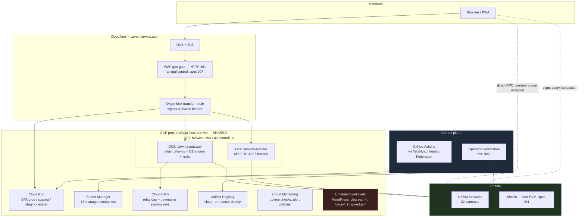
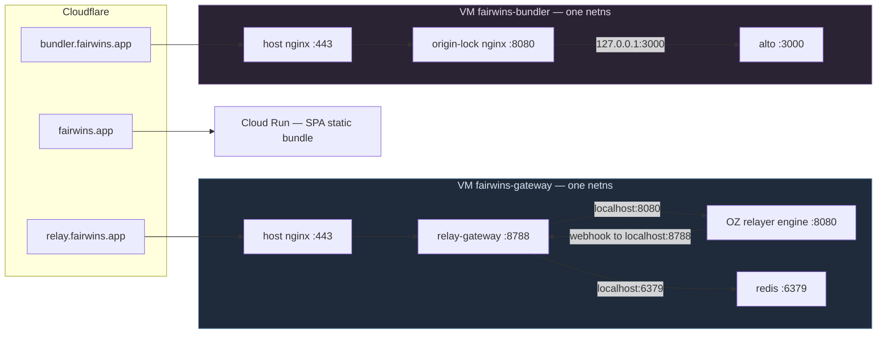
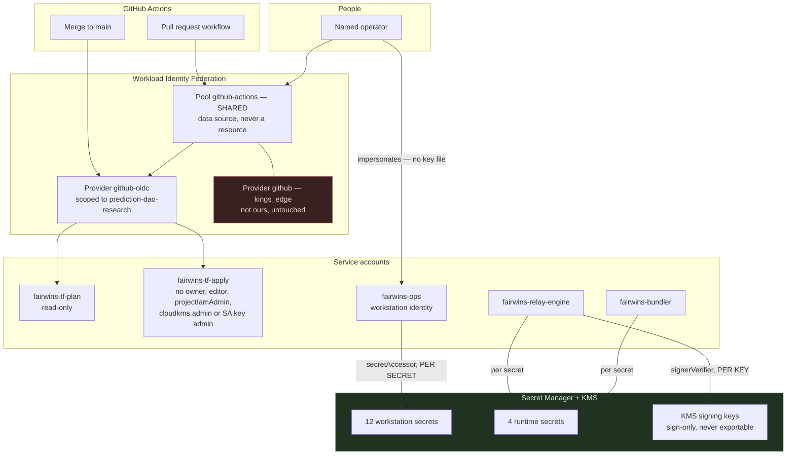
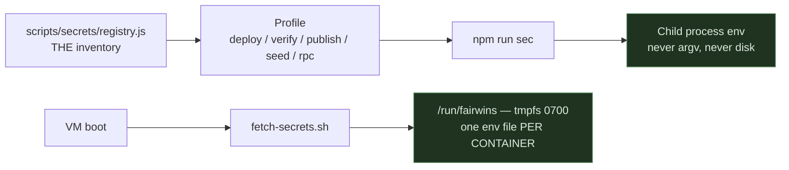
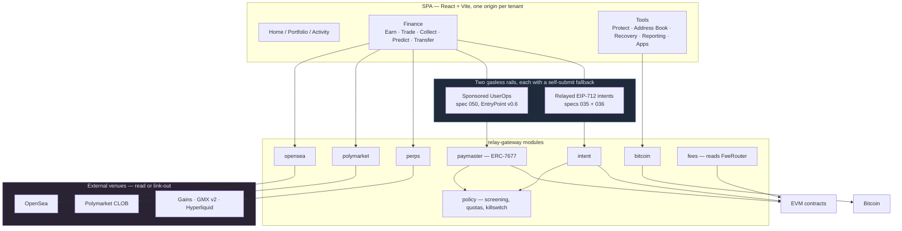
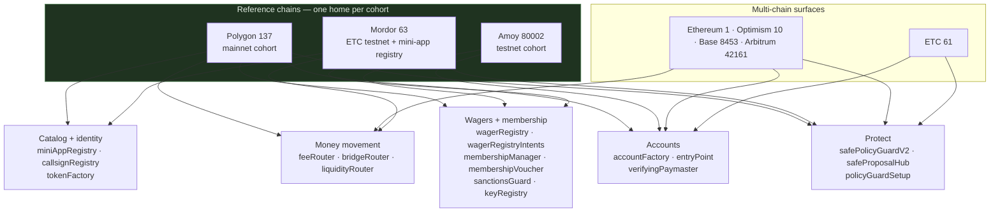
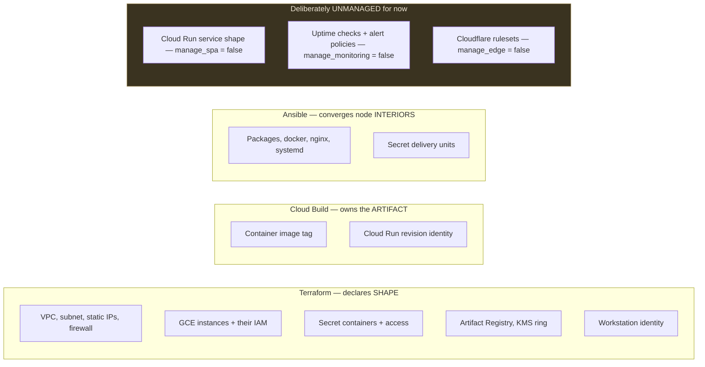

# The FairWins estate

Architecture diagrams for the whole running system: cloud infrastructure, request paths, identity
and secrets, the application, and the on-chain contract estate.

!!! info "Measured, not asserted — 2026-08-15"
    Every element below was read from the live estate or from the repository's own records on
    2026-08-15: `gcloud` for GCP resources, `deployments/*.json` for contract addresses,
    `terraform state` for what is under management. Where the running system disagrees with a
    written claim elsewhere in the repo, this page follows the running system and says so.

    **Regenerate the inventory** with the commands in [Keeping this current](#keeping-this-current)
    before trusting it after a large change.

---

## 1. Whole estate

Three planes that fail independently: the **edge and origin** serving members, the **chains**
holding value, and the **control plane** that deploys and administers everything.



!!! danger "The project is shared, and that shapes every IAM decision"
    `chippr-bots-site-wp` hosts workloads this repository does not own. Every IAM grant in the
    Terraform is additive (`*_iam_member`); the `_binding` and `_policy` forms are authoritative and
    would strip access from principals nobody here has heard of. `npm run check:iac` rejects both,
    and the CI identity separately lacks `projectIamAdmin` so the same mistake also fails at the API.

    The Workload Identity **pool** is itself shared: `github-actions` carries a provider scoped to
    `chippr-robotics/kings_edge`. It is referenced as a Terraform `data` source, never a `resource`,
    so deleting a block here can never take out another team's CI.

---

## 2. Request paths

All containers on a VM share **one network namespace**, reproducing the Cloud Run sidecar model.
This is what makes every `localhost` coupling below correct verbatim.



!!! warning "A plain HTTP 200 proves nothing here"
    The origin-lock nginx serves its **own** static `200` on its health path without ever touching
    alto — that is the check which stayed green throughout the 2026-07-12 stall while gasless
    transactions silently were not landing. The uptime check therefore matches the EntryPoint
    address in an `eth_supportedEntryPoints` response.

    `infra/vm/nginx/fairwins-bundler.conf` turns the prober's plain **GET** on `/__probe/health`
    into that JSON-RPC POST server-side, so the check itself is a GET. `request_method` is
    force-new on a `google_monitoring_uptime_check_config`, so declaring POST in Terraform would
    replace the live check and discard its history.

    The gateway has the same trap in a different shape: `/status` returns `"status":"ok"`
    unconditionally, even with every chain down. Match on the per-chain `rpc` state instead.

!!! note "Why the engine's webhook URL must stay `localhost`"
    A bridge network instead of a shared namespace would break it **silently**: the engine POSTs
    confirmations into the void, the gateway never learns a transaction landed, and intents report
    `submitted` forever with no chain fallback.

---

## 3. Identity and secrets

No long-lived credential exists anywhere in this design. Every actor obtains short-lived tokens.



**How a secret reaches the code that needs it**



!!! danger "Rules that are enforced, not documented"
    - **No service-account key file exists.** A downloaded key outlives employment, survives a
      stolen disk, and is copied by every backup. Impersonation yields short-lived tokens and is
      revoked by deleting one list entry.
    - **`serviceAccountTokenCreator` is granted on the ACCOUNT, never the project.** The project
      form would let every operator impersonate every service account here — including the one
      holding `signerVerifier` on the hot gas keys.
    - **Terraform never declares a secret *version*** (guardrail G-04): a version resource writes
      the payload into state in plaintext. It owns containers and access bindings only.
    - **Per-container scoping on the VMs.** The internet-facing container never receives the other
      container's credential; `preflight.sh` asserts this at every start.
    - **`VITE_` variables are not secrets and cannot be made into them** — they compile into the
      client bundle and are public once shipped.

---

## 4. Application

The SPA is the only signer of member transactions. The gateway is a **policy and proxy** layer that
never takes custody.



!!! note "Non-custodial by construction"
    The member's wallet signs every order and every transfer. The gateway holds venue API
    credentials and screening policy; it cannot move member funds. Perps is **read-only** market
    data — no in-app execution ships (spec 082 FR-018). Every gasless path keeps a self-submit
    fallback, so losing the relayer degrades cost, never access.

---

## 5. On-chain estate

32 distinct contracts across 8 networks. Deployment is deliberately uneven: membership and wagers
live on one reference chain per cohort, while custody and liquidity span the mainnets.



| Surface | Networks |
|---|---|
| `accountFactory`, `entryPoint` | all 8 |
| `wagerRegistry`, `membershipManager`, `sanctionsGuard` | polygon, amoy, mordor |
| `wagerRegistryIntents`, `wagerPoolFactory`, `tokenFactory` | polygon, mordor |
| `safePolicyGuardV2`, `safeProposalHub`, `policyGuardSetup` | polygon, mordor, etc, optimism, base, arbitrum |
| `feeRouter` | polygon, mordor, mainnet, optimism, base, arbitrum |
| `bridgeRouter`, `liquidityRouter` | polygon, mainnet, optimism, base, arbitrum |
| `miniAppRegistry` | polygon, mordor |
| `callsignRegistry`, `safePolicyGuard` (v1) | polygon |
| `polymarketAdapter`, `umaAdapter`, `chainlink*Adapter`, `verifyingPaymaster` | polygon, amoy |
| `externalDAORegistry`, `semaphoreVerifier`, `zkWagerPool*` | mordor |

!!! warning "This table corrects two stale claims elsewhere in the repo"
    `CLAUDE.md` states that `bridgeRouter` and `liquidityRouter` are *"not deployed on any network
    yet (issue #966)"*, and the fee-router notes say the `FeeRouter` is *"not deployed anywhere
    yet"*. Both are contradicted by `deployments/*.json`: the routers are recorded on five
    mainnets and the FeeRouter on six networks. Trust `deployments/` — it is the source of truth
    for addresses — and treat the prose as out of date.

---

## 6. Who owns what

The single most common way infrastructure-as-code fails is two systems believing they own the same
attribute. The split is explicit.



!!! info "Adoption status — 2026-08-15"
    `infra/terraform/environments/prod` holds **57 resources** and plans clean
    (`terraform plan -detailed-exitcode` → `0`, *No changes*).

    Three surfaces are switched off on purpose, because adopting them would have changed live
    behaviour rather than merely describing it:

    - **`manage_spa`** — the declaration would clear the running service's env vars, drop
      `startup_cpu_boost`, move off GEN1 and raise max instances 20 → 100.
    - **`manage_monitoring`** — every declared alert threshold differs from the live one. CPU
      0.70 → 0.90 and memory 85 → 90 are *looser*, and the uptime comparison inverts to `> 1` on
      `check_passed`, which may never fire. Import blocks are staged and mapped by **condition
      metric type**, not display name.
    - **`manage_edge`** — both Cloudflare rulesets are authoritative for their phase, so a first
      apply deletes any rule added through the dashboard.

    A surface is adopted only when its plan is clean. If a plan is not clean, the **configuration**
    is wrong — fix the repository, never apply to force live infrastructure to match.

---

## Keeping this current

These diagrams are hand-maintained. Re-derive the facts before editing:

```bash
# Contract matrix (section 5)
node -e 'const fs=require("fs");const r={};for(const f of fs.readdirSync("deployments").filter(f=>/-chain\d+-v2\.json$/.test(f)&&!/hardhat|localhost/.test(f))){const n=/^(.+)-chain/.exec(f)[1];for(const[k,v]of Object.entries(JSON.parse(fs.readFileSync("deployments/"+f)).contracts||{}))if(/^0x[0-9a-fA-F]{40}$/.test(v)&&!/Impl$/.test(k))(r[k]??=new Set()).add(n)}for(const k of Object.keys(r).sort())console.log(k.padEnd(26),[...r[k]].sort().join(","))'

# Cloud footprint (sections 1 and 2)
gcloud run services list  --project=chippr-bots-site-wp
gcloud compute instances list --project=chippr-bots-site-wp --filter="labels.app=fairwins"
gcloud secrets list --project=chippr-bots-site-wp

# What is actually under management (section 6)
terraform -chdir=infra/terraform/environments/prod state list | wc -l
terraform -chdir=infra/terraform/environments/prod plan -detailed-exitcode   # 0 == no changes
```

**Related:** [Infrastructure as code](../developer-guide/infrastructure-as-code.md) ·
[Workstation secrets](../developer-guide/workstation-secrets.md) ·
[Gasless intents](../developer-guide/gasless-intents.md) ·
[`infra/vm/README.md`](https://github.com/chippr-robotics/prediction-dao-research/blob/main/infra/vm/README.md) ·
[`infra/observability/README.md`](https://github.com/chippr-robotics/prediction-dao-research/blob/main/infra/observability/README.md)
