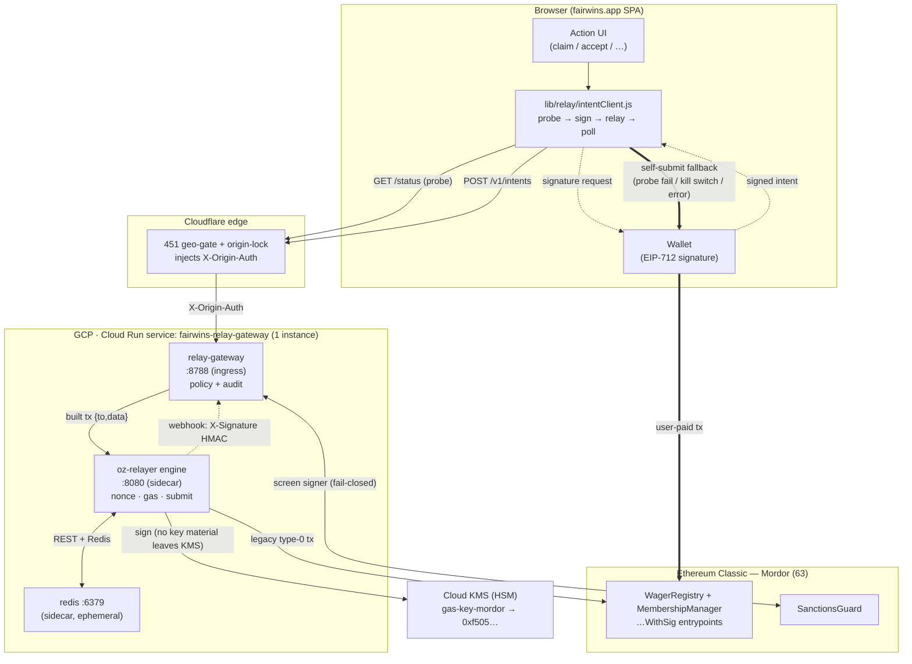
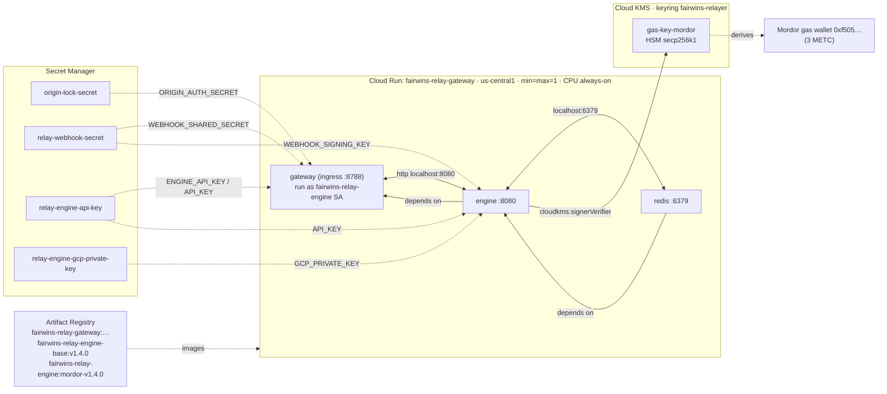
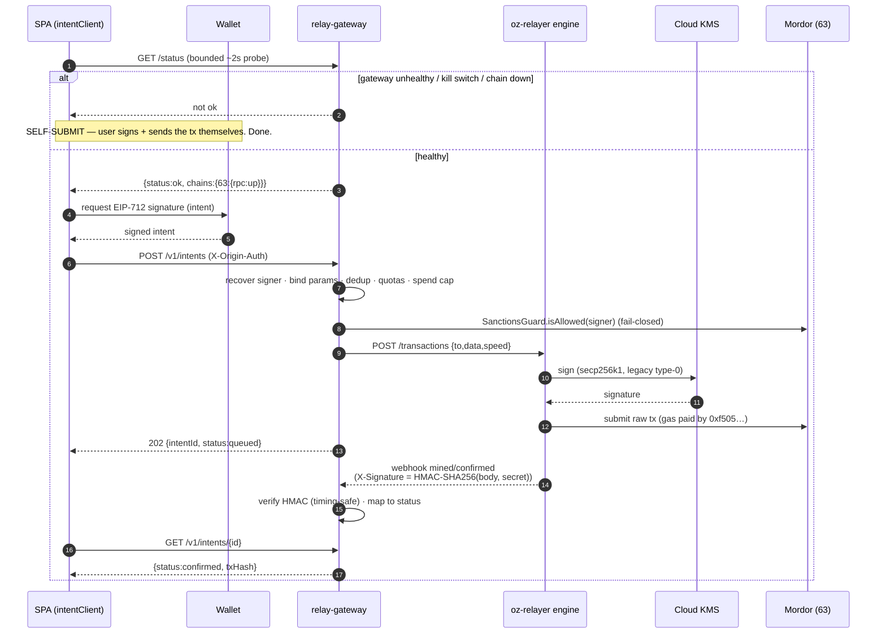

# Gasless Intent Relayer — Infrastructure Architecture (spec 036)

The relayer is **optional gas infrastructure**. It lets a user sign a spec-035 intent off-chain and
have a hosted service pay the gas to submit it — but it can only ever **censor, never steal**, and
every covered action keeps a **self-submit fallback**. So the worst failure of everything below is
"the user pays their own gas," never a stuck or stolen wager.

> **Deployed footprint (Mordor / ETC testnet, chain 63):** one Cloud Run service,
> `fairwins-relay-gateway`, running **three sidecar containers** (policy gateway + OZ Relayer engine
> + ephemeral Redis). This is the sanctioned exception to the platform's no-backend rule — see
> [../developer-guide/gasless-intents.md](../developer-guide/gasless-intents.md) and the runbook
> [../runbooks/relayer-mordor-deploy.md](../runbooks/relayer-mordor-deploy.md).

---

## 1. System context — where the relayer sits

**Read it as two paths.** The **relayed path** (solid): the SPA probes `/status`, has the wallet sign
the intent, POSTs it through Cloudflare to the gateway; the gateway recovers + screens the signer,
builds the exact call, and hands it to the engine, which signs with the KMS key and submits. The
**self-submit path** (thick dashed): on any probe failure, kill switch, or relay error the SPA
silently has the user submit the same action themselves — identical on-chain result (FR-016 / SC-004).

---

## 2. Deployment topology — one Cloud Run service, three containers

Redis is **ephemeral by design** (nonce/queue state is reconstructed from chain), and Phase 1 is
**single-instance** (one nonce-lane owner, in-process dedup/quota). That makes co-locating all three
containers in one Cloud Run instance — talking over `localhost` — the simplest correct topology: no
VPC connector, no Memorystore, no cross-service auth.

The whole service runs as the least-privilege **`fairwins-relay-engine`** service account, which holds
only `cloudkms.signerVerifier` on the one gas key plus `secretAccessor` on the four secrets. The gas
key never leaves KMS; its **public** key derives the funded address `0xf505…`.

> **Known limitation — exported SA key for the KMS signer.** OZ Relayer **v1.4.0**'s Cloud-KMS signer
> authenticates with an explicit service-account key (`service_account.private_key` etc., stored as the
> `relay-engine-gcp-private-key` secret) — it does **not** support keyless ADC / Workload Identity, even
> though the pod already runs *as* that same SA. So we mint one exported key for the least-privilege
> engine SA (it can only `signerVerifier` + `secretAccessor` — no data access), keep it only in Secret
> Manager, and never bake it into the image. **Follow-up:** drop the key and switch to ADC once the
> engine supports it (evaluate on the next engine bump); rotate the key on any SA change.

---

## 3. Intent lifecycle — request → confirmed

Status is **honest**: the gateway only reports `confirmed` after the engine's webhook says mined
(FR-006). Money-in intents are **rejected on ETC** (`503 payment_unsupported_on_chain`) because live
USDC there has no EIP-3009 — those flows self-submit; only no-stake (signer-attributed) actions relay.

---

## 4. Trust & security boundaries

| Component | Holds | Can do | **Cannot** do |
|---|---|---|---|
| `relay-gateway` | two shared secrets (origin, webhook) | refuse/accept intents, screen, rate-limit | sign, move funds, forge a signer (it is *recovered*) |
| `oz-relayer` engine | KMS **handle** (not the key) | sign gas txs to allow-listed receivers, submit | exceed `gas_price_cap`, pay non-whitelisted receivers, spend user funds |
| Cloud KMS (HSM) | the secp256k1 gas key | produce signatures | export the private key |
| gas wallet `0xf505…` | ~3 METC | pay gas | anything else (no contract authority) |
| Cloudflare | origin-lock secret | gate + inject `X-Origin-Auth` | read intents' meaning |

Compromise bound of the **entire hosted stack** = the testnet gas balance + the ability to *censor*
(refuse to relay). No user funds, no contract admin, no floppy-keystore key is reachable from here.
On-chain entrypoints re-verify every signature and re-screen every actor regardless.

---

## 5. GCP resource inventory (Mordor)

| Kind | Name | Notes |
|---|---|---|
| Cloud Run service | `fairwins-relay-gateway` | 3 containers, `us-central1`, min=max=1, CPU always-on, public ingress |
| Service account | `fairwins-relay-engine@…` | runs the service; `signerVerifier` + `secretAccessor` only |
| KMS keyring / key | `fairwins-relayer` / `gas-key-mordor` | **HSM** secp256k1 (software rejects the curve) |
| Gas wallet | `0xf505d95F62bEE94437C112d3D64ee7Df0Fa973aC` | derived from the KMS public key; funded 3 METC |
| Secrets | `origin-lock-secret`, `relay-webhook-secret`, `relay-engine-api-key`, `relay-engine-gcp-private-key` | injected as env at runtime |
| Artifact Registry | `fairwins-relay-gateway`, `fairwins-relay-engine-base:v1.4.0`, `fairwins-relay-engine:mordor-v1.4.0` | engine base is **built from source** (see below) |

---

## 6. Build-from-source & integration truths

The OZ Relayer publishes **no pre-built image** — it is built from `Dockerfile.production` at a pinned
tag (`v1.4.0`) and hosted in our Artifact Registry; we layer only our config (AGPL-safe: unmodified
upstream, never forked into the repo). Things the spec assumed that turned out otherwise, all now
reflected in the config/code:

- **KMS signer needs an explicit service-account key** (no ADC/attached-SA path in v1.4.0).
- The engine **does not expand `${VAR}`** in `config.json` → RPC + webhook URLs are literal.
- Webhook auth is **`X-Signature: base64(HMAC-SHA256(body, signing_key))`**, verified by the gateway
  over the raw body (`services/relay-gateway/src/server.js`).
- `/healthz` is **intercepted by Google's GFE on every `*.run.app`** → external probes use **`/status`**.

## 7. Operate it

- Deploy / redeploy: [../runbooks/relayer-mordor-deploy.md](../runbooks/relayer-mordor-deploy.md)
- Incidents, kill switch, key rotation, funding: [../runbooks/relayer-operations.md](../runbooks/relayer-operations.md)
- Protocol / intent semantics: [../developer-guide/gasless-intents.md](../developer-guide/gasless-intents.md)
