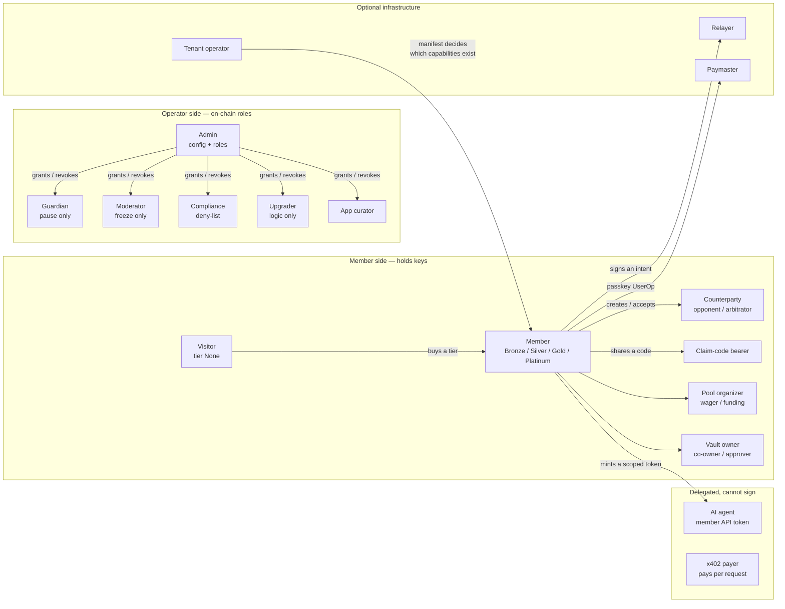

# 01 — Logical View

> **Altitude:** technology-independent. This page says *what* the platform does,
> *for whom*, and *under what rules*. It names no port, no host and no library —
> those live in [02](02-architecture-view.md), [03](03-systems-view.md) and the
> annexes. Wager-lifecycle flow diagrams already exist at
> [`SYSTEM_FLOW_DIAGRAMS_V2.md`](../SYSTEM_FLOW_DIAGRAMS_V2.md) and are not repeated here.
>
> Diagram source: [`diagrams/logical-view.drawio`](diagrams/logical-view.drawio).

## The one-paragraph version

FairWins is a **self-custody digital-asset platform** whose value paths all
resolve on-chain. A member holds their own keys — by injected wallet, passkey
smart account, hardware device, or an imported legacy key — and the platform
never takes custody of their funds. Around that core sit five families of
capability: **peer-to-peer wagering** (escrowed stakes, oracle or party
resolution), **pooled value** (wager pools and funding pools), **finance
surfaces** (earn, trade, transfer, bridge, collect, predict), **custody
controls** (Safe multisig vaults with an on-chain policy guard, hardware cold
storage, message verification), and **identity and access** (tiered soulbound
membership, callsigns, address book, screening). A curated mini-app catalogue
lets third-party code run inside a narrow host object, and a member-signed
capability token lets the member's own agents read and build — but never sign.
The whole platform is white-labellable: one origin, one tenant manifest.

## Actor model at a glance



Three things this diagram is asserting, each of which is load-bearing:

- **No operator edge reaches escrowed value.** A Guardian pauses, a Moderator
  freezes, an Upgrader ships logic; none of them can move a stake. Resolution
  authority is fixed at wager creation.
- **Delegated actors cannot sign.** The agent and payer rails read and *build*
  typed data; the signature is always the member's.
- **Infrastructure is optional.** Relayer and paymaster edges are conveniences;
  every gasless flow keeps a self-submit path.

## 1. Actors / roles

### 1.1 Member-side actors

| Actor | What they can do | How they authenticate | Where authority comes from |
|---|---|---|---|
| **Non-member visitor** | Read public surfaces: market/news/perps data, a challenge or pool page reached by a share phrase, the catalog of launchable mini-apps, legal documents. Cannot create or accept a wager. Can *take* nothing that requires a tier. | Nothing, or a connected wallet with no membership (tier `None`) | Absence of `WAGER_PARTICIPANT_ROLE`; tier `None` is the default state (`docs/system-overview/roles-and-tiers.md`) |
| **Member — Bronze** ($2/30d) | Everything a member does, throttled: 15 wager creations/month, 5 concurrent open wagers. Accept wagers, take open challenges, use every non-wager surface. | Wallet signature (injected wallet, passkey smart account, hardware device, or recovered legacy key) | `MembershipManager` soulbound time-bound membership; `checkCanCreate` enforces the two counters |
| **Member — Silver** ($8/30d) | Bronze + **creating an open challenge** (`createOpenWager` needs Silver+). 30 creations/month, 10 concurrent. | as above | as above |
| **Member — Gold** ($25/30d) | Silver + **registering a `%callsign`** (`minTier` hard-floored at Gold). 100 creations/month, 30 concurrent. | as above | `CallsignRegistry` reads `getActiveTier(user, WAGER_PARTICIPANT_ROLE) >= Gold` |
| **Member — Platinum** ($100/30d) | Unlimited creations and concurrency. No extra feature gates. | as above | as above |
| **Voucher holder / gifter** | Buys a `MembershipVoucher` ERC-721 at a tier price, holds or resells or gifts it; it confers **no** membership while held. Redeeming burns it and writes the soulbound membership to the redeemer. | Wallet that owns the token | ERC-721 ownership + `redeemVoucher` on `MembershipManager` (spec 026) |
| **External counterparty** (opponent) | Accept a named wager, decline it, declare a winner when the resolution type names them, consent to a draw, claim a payout, trigger a refund after the resolve deadline. Needs *any* active tier to accept. | Wallet signature; arrives via QR / deep link / four-word claim code | Address recorded on the wager at creation, or possession of the claim code for an open challenge |
| **Arbitrator** (named third party) | `declareWinner` or a single `declareDraw` on wagers whose resolution type is `ThirdParty`. Cannot touch the stakes otherwise. | Wallet signature | Address recorded as arbitrator at creation; resolution authority is **fixed at creation** |
| **Claim-code bearer** | Look up, decrypt and take an open challenge, or find a pool/funding pool by its four-word phrase. | Possession of the code (generated client-side, never sent to a server); a one-time signature derived from the code and bound to the taker's address | The code derives the on-chain claim authority recorded with the wager. Unrecoverable if lost. |
| **Pool organizer (wager pool)** | Create a pool, close joining, propose the payout matrix, cancel while joining is open. Cannot force a payout. | Wallet signature (public address; no anonymity layer) | `creator` field on the `WagerPool` clone |
| **Pool member (wager pool)** | Join with USDC, approve a proposed outcome, claim a share if named as a winner, refund when cancelled/expired. | Public wallet address — the winner's address *is* the claim code | Membership recorded on join; `POOL_PARTICIPANT_ROLE` via the shared `IMembershipManager` |
| **Funding-pool organizer** | Create a pool with a public purpose + goal; `close` at any time (goal met or not) — the pot pays the organizer's **own** address; flip to `Refunding`. | Wallet signature | `organizer` field on the `FundingPool` clone. There is deliberately no `recipient` argument and no admin sweep. |
| **Funding-pool contributor** | Contribute any amount; vote for refund (a strict majority ⌊N/2⌋+1 by count flips the pool); pull exactly `contributed[addr]` back when refunding. | Wallet signature | Contribution recorded on-chain |
| **Vault owner / co-owner / approver** | Propose, approve, execute or cancel a vault transaction; change owners and threshold; adopt or replace the policy rule array; consent to a guard migration. An approver only counts **while still an owner**. | A signer on the chain in question — injected wallet, hardware device, unlocked recovered key, or the passkey UserOp rail where a bundler exists. The rail is a property of the **signer**, never the login method. | Safe v1.4.1 owner set + threshold; approvals verified against the vault's own on-chain `approvedHashes` at `nonce()-1` |
| **Vault operator ("operate as vault")** | Act with the vault as the acting account: submit produces a **proposal**, never a direct send. Message signing is **refused** in vault mode (a Safe has no key). | Same signer rails; identity resolved first | CustodyContext acting-account selection; spec 043/088 |
| **Mini-app vendor** | Submit a package (CID + manifest hash + version) and updates. An update writes `proposed` and resets `status` to `Pending` — it never touches `approved`, so the live version keeps running. | Wallet that owns the registry record | `MiniAppRegistry` record ownership |
| **AI agent via MCP** | Consume the member API with the member's own capability token: reads, typed-data *builds*, the opt-in assistant. Cannot sign, cannot relay, cannot pay. Surfaces a 402 whole and forwards `X-PAYMENT` byte-for-byte. | The member's `fw1` bearer token (an off-chain EIP-712 `ApiKeyGrant` the member signed in-app) | Token scopes; the actor field of every built intent is **forced** to the token account |
| **Payer (x402 agent)** | Unauthenticated caller of a priced member-API operation: receives a 402 offer, signs `TransferWithAuthorization`, gets served **as the payer**. EOA only. | A signed token authorization, verified before settlement | Payment; never a member. A valid `fw1` token short-circuits the paywall entirely. |

### 1.2 Operator-side actors (on-chain roles)

Authority is always read from the contract that will enforce it; UI gating in
`adminApps.js` is presentation only.

| Role | Contract | Can | Cannot |
|---|---|---|---|
| `DEFAULT_ADMIN_ROLE` | MembershipManager, WagerRegistry, routers, registries | Configure tiers, treasury and payment token; rewire oracle adapters, sanctions guards, stake-token allowlist; withdraw fees; grant/revoke every other role; own fund-path addresses on the bridge/liquidity routers | Create, resolve, or move escrowed wagers |
| `GUARDIAN_ROLE` | WagerRegistry (and **per-router**, not inherited) | `pause`/`unpause`; pause new bridges / new Uniswap supplies | Freeze an account; configure tiers; withdraw fees; trap value |
| `ACCOUNT_MODERATOR_ROLE` | WagerRegistry | `freezeAccount` / `unfreezeAccount` | Pause; configure tiers; seize funds |
| `ROLE_MANAGER_ROLE` | MembershipManager | `grantMembership` / `revokeMembership` out of band (gifts, support, disputes) | Grant/revoke admin roles; pause; freeze |
| `SANCTIONS_ADMIN_ROLE` (surfaced as **Compliance Officer**) | SanctionsGuard | Maintain the discretionary deny-list with an on-chain reason | Pause; freeze; disable oracle screening |
| `UPGRADER_ROLE` | every UUPS proxy | Swap implementation logic behind a stable address | Grant roles; pause; freeze; move stakes |
| `FEE_ADMIN_ROLE` | FeeRouter | Edit service rates within per-service hard caps | Exceed a cap; invent a second fee store |
| `STAKING_ADMIN_ROLE` | staking contracts | Curate validators/limits; emergency pause | — |
| `LIQUIDITY_ADMIN_ROLE` | BridgeRouter / LiquidityRouter | Curate routes and pools, set limits, `setPoolEnabled(false)` | Repoint fund-path addresses (admin-only); remove a pool |
| `APP_CURATOR_ROLE` | MiniAppRegistry | `approveApp(id, expectedManifestHash)` (content-committed), suspend, deprecate | Approve by id alone; edit a vendor's bytes |
| `TOKEN_ISSUER_ROLE` | TokenFactory | Gate the token `create*` entrypoints | — |
| `REGISTRY_CURATOR_ROLE` / `MODERATOR_ROLE` / `VERIFIER_ROLE` | CallsignRegistry | Reserve, suspend, verify `%callsigns` | Take ownership |
| **Anyone (permissionless upkeep)** | WagerRegistry | `batchExpireOpen`, `autoResolveFromPolymarket`, `autoResolveFromOracle`, `claimRefund`, `pokeDeadline` on pools | Anything that names a party |

### 1.3 Infrastructure and platform actors

| Actor | What they can do | Authority |
|---|---|---|
| **Relayer** | Submit a member's signed intent or EIP-3009 authorization on their behalf and pay the gas; enforce policy (screening, quotas, killswitch) before submitting. Never holds member funds. | Possession of a valid member signature. Optional infrastructure — **every gasless flow keeps a self-submit fallback.** |
| **Paymaster / sponsor** | Authorize sponsorship of a passkey UserOp per-op; reimburse the bundler from a FairWins-funded deposit. | Platform-held signing authority, disclosed honestly in the confirm UI (sponsored vs. user-pays) |
| **Tenant operator (white-label)** | Owns a manifest: identity, brand, enabled feature set, chain cohort, tier prices, fee config, gateway URLs, native app ids, optionally its own contract set (`contractSet.mode`). One origin = one tenant, selected at build time. | `tenants/<id>/manifest.json` — the single source of truth. An unknown tenant id fails loudly, never falls back. |
| **Platform operator (workstation)** | Deploys, upgrades, and administers; reads secrets by impersonation, never a key file. | Secret Manager profiles + floppy keystore for admin keys |

---

## 2. Capability map

### 2.1 Member-facing tree, as shipped

Nav structure from `appNav.js` (`HOME_ITEM`, `PORTFOLIO_ITEM`, `NAV_GROUPS`), sub-views from
`navSearchIndex.js` / the panels, tab ids from `WalletPage.jsx` `WALLET_TABS`.
Legend: **[$]** moves value · **[R]** read-only · **[flag]** tenant feature id that can switch it off.

```
Quick access
├── Payments            (id 'home', route /app)                                 [$]
│   ├── Pay             — send to an address, a contact, a callsign or ENS
│   ├── Request         — a one-time request, or a Pool (/app?kind=pool)          [flag: pools]
│   └── Wager           — create a challenge from the home screen                 [flag: wagers]
└── Accounts            (id 'portfolio' → /wallet?tab=account&view=portfolio)
    ├── Portfolio       — holdings per account card, across cohort chains         [R]
    ├── Activity        — unified multi-chain activity ledger                     [R]
    └── Stats           — win rate, volume, record                               [R]

Finance
├── Earn                (tab 'earn')                                             [flag: earn]
│   ├── Lend            — ERC-4626 / Morpho vault deposit + withdraw              [$]
│   ├── Rewards         — claim distributed bonus tokens                          [$]
│   ├── Stake           — liquid + delegated staking                              [$] [flag: staking]
│   └── Supply          — Uniswap V3 positions, Across bridge-LP (L1 only)        [$] [flag: bridge]
├── Trade               (tab 'trade', alias 'swap')                               [flag: swap]
│   ├── Swap            — DEX exchange                                            [$]
│   ├── Wrap            — wrap/unwrap the base coin of any configured chain       [$]
│   └── Perps           — cross-venue perpetual market data, "manage on venue ↗"  [R]
├── Collect             (tab 'collectibles')     hides on chains without it       [flag: collect]
│   ├── Portfolio       — NFT display                                             [R]
│   └── Sell-side       — list / accept offers                                    [$]
├── Predict             (tab 'predict')          Polygon only                     [flag: predict]
│   └── Markets + order entry — Polymarket CLOB, member's wallet signs orders     [$]
└── Transfer            (tab 'paytransfer')
    ├── Send            — same-chain transfer (incl. Bitcoin send/receive)        [$] [flag: bitcoin]
    ├── Bridge          — cross-chain via Across                                  [$] [flag: bridge]
    └── Wagers          — create / accept / resolve / claim (the wager surface)    [$] [flag: wagers]

Tools
├── Protect             (tab 'custody')                                           [flag: protect]
│   ├── On chain        — Safe vaults (one card per ADDRESS, all its networks):
│   │                     create everywhere from one flow, load, queue
│   │                     (approve/execute/cancel per chain), policy rules,
│   │                     owners + threshold, details                             [$]
│   ├── Verify          — sign a message; verify anyone's (valid/invalid/
│   │                     unverifiable). Refused while operating as a vault.       [R]
│   └── Off chain       — hardware-wallet cold storage (Ledger/Trezor)            [$]
├── Address Book        (tab 'addressbook')  contacts, per-contact addresses,
│                         screening pill per entry, import/merge                  [R]
├── Recovery            (tab 'security', alias 'backup')                          [flag: recovery]
│   ├── Data backup     — encrypted backup/restore of device data
│   ├── Account controllers — add a passkey / link a recovery wallet
│   ├── Recover access  — regain access with a linked wallet
│   ├── Legacy recovery — import an old private key or BIP-39 list, optional sweep [$]
│   ├── Encryption key  — the wager-encryption key + its on-chain registration
│   └── Recovery codes  — one-time restore codes
├── Reporting           (tab 'reports')  tax + activity report generation, history [R]
├── Apps                (tab 'apps' → /apps/<slug>)                               [flag: miniapps]
│   └── Catalog of launchable third-party packages + pinned Quick Access strip;
│       first-party: Token Mint [flag: token-mint], ClearPath [flag: clearpath]
└── Assistant           (tab 'assistant')                                         [flag: assistant]
    ├── Assistant       — opt-in; choose the rail: FairWins (membership-funded)
    │                     or GutterToken (member's own credits)   [flag: assistant-byok]
    ├── GutterToken key — paste/validate/clear the member's own key (device-only)
    └── API access      — mint / list / revoke capability tokens for own tools

Account button (deliberately NOT in the menu)
├── My Account          (tab 'account')   account cards, cosmetics, views above
├── Membership          (tab 'membership') buy / upgrade / extend a tier, vouchers [$]
├── Network             (tab 'network')   member-owned RPC endpoints, credentials
└── Settings            (tab 'settings')  home screen, menu & density, wallet
                         display, portfolio display, privacy, notifications,
                         app lock, markets, install app, app update, legal

Cross-cutting surfaces reached by link, not by nav
├── /fund/<four-words> | /fund/0x…   funding pool page; "My Pools" sheet          [$] [flag: pools]
├── Open-challenge / pool phrase lookup (unified, wager first)                     [R]
├── Callsign registration + resolution (Gold+), never gates value                 [flag: callsigns]
└── Token news cards on asset detail + trade pair, advisory only    [R] [flag: news]
```

Tenant-optional capabilities (the whole list `tenants/features.json` admits):
`wagers`, `pools`, `predict`, `collect`, `earn`, `staking`, `swap`, `bridge`, `protect`,
`callsigns`, `miniapps`, `clearpath`, `token-mint`, `bitcoin`, `recovery`, `assistant`,
`assistant-byok`, `news`. Core and never flagged: Payments/Transfer send, Accounts, Address
Book, Reporting, Membership, Network, Settings.

Three distinct reasons a surface can be absent, and they are not interchangeable:
a **tenant** has not enabled the feature (absent from nav and from `?tab=`), the **chain** lacks
the capability (Collect, Predict hide entirely), or the **module/gateway** is unconfigured
(honest unavailable state, never a fabricated zero).

### 2.2 Operator capability tree — nine admin mini-apps

`/admin` is the Control Room launcher; each app is `/admin/<appId>?view=<viewId>`.
`adminApps.js` is the **only** app→view→gate matrix.

| App | View | Gate (role flags) |
|---|---|---|
| **Incident Response** | Emergency — pause/unpause a WagerRegistry | `isGuardian` |
| | Account Moderation — freeze/unfreeze accounts | `isAccountModerator` |
| **Compliance** | Deny-list — discretionary sanctions entries with reason | `isSanctionsAdmin \|\| isAdmin` |
| | Mini-App Review — content-committed approve / suspend / deprecate | `isAppCurator \|\| isAdmin` (curator authority read from the registry itself, never the app-wide flags) |
| **Membership & Revenue** | Tiers — prices, durations, limits | `isAdmin` |
| | Members — grant/revoke membership out of band | `isRoleManager` |
| | Treasury — received vs. accrued, per unit, never summed across units | `isAdmin` |
| | Fees — FeeRouter service rates within caps | `isAdmin \|\| isFeeAdmin` |
| | Perps Fees — Hyperliquid builder fee + venue rails | `isAdmin \|\| isFeeAdmin` |
| **Liquidity** | Bridge — routes, limits, killswitch | `isAdmin \|\| isLiquidityAdmin \|\| isGuardian` |
| | Supply — pools, enable/disable, killswitch | same |
| **Protocol Config** | Staking — validators, limits, pause | `isAdmin \|\| isStakingAdmin \|\| isGuardian` |
| | Wiring & Tokens — registry wiring, stake-token allowlist | `isAdmin` |
| | Oracle Adapters — adapter registration and config | `isAdmin` |
| **Maintenance** | Maintenance — expire opens, run auto-resolution | **permissionless** (`() => true`), deliberately its own app with no elevated styling |
| **Identity** | Callsigns — registry moderation and policy | `isAdmin` |
| **Access Control** | Admin Roles — grant/revoke, per contract, per network | `isAdmin` |
| **Infrastructure** | Services — relay gateway health, paymaster operations | `isAdmin \|\| isGuardian` |

Entry has **three** outcomes, never two: granted / denied / "Could Not Verify Access". Reads span
the build's cohort; **writes never do** — one transaction, one named chain, authority read from the
contract that will enforce it. Operator tools also appear in the Apps store under "Operator tools",
role-derived client-side, never as a registry record and never under the verified badge.

---

## 3. Domain entities & lifecycles

### 3.1 Wager — `contracts/interfaces/IWagerRegistryTypes.sol`

`enum Status { None, Open, Active, Resolved, Cancelled, Refunded, Draw }`
`enum ResolutionType { Either, Creator, Opponent, ThirdParty, Polymarket, ChainlinkDataFeed, ChainlinkFunctions, UMA }`

Fields that matter: creator, opponent, arbitrator, stake token, creator stake, opponent stake,
`creatorIsYes`, resolution type + oracle condition id, **acceptDeadline**, **resolveDeadline**,
metadata hash/URI (terms, optionally encrypted to IPFS), status.

| Transition | Who | Guard |
|---|---|---|
| → `Open` | creator (`createWager` / `createWagerWithTerms` / `createOpenWager`) | active membership + `checkCanCreate` limits + `SanctionsGuard.checkBlocked`; creator stake escrowed immediately. `createOpenWager` needs **Silver+**. |
| `Open` → `Active` | opponent (`acceptWager`) or any code bearer (`acceptOpenWager`) | both parties screened; opponent stake escrowed. Open challenges have equal stakes by construction. |
| `Open` → `Cancelled`/`Refunded` | creator (`cancelOpen`), opponent (`declineWager`), **anyone** after `acceptDeadline` (`claimRefund` / `batchExpireOpen`) | creator's stake returned |
| `Active` → `Resolved` | the settler fixed at creation (`declareWinner`) or **anyone** triggering `autoResolveFrom*` | `Either` restricted to equal stakes (`EitherRequiresEqualStakes`) |
| `Active` → `Draw` | both parties consenting in turn (`declareDraw` ×2, revocable via `revokeDraw`) or the arbitrator once | each side gets its own stake back |
| `Active` → `Refunded` | **anyone** after `resolveDeadline` (`claimRefund`) | the never-stranded safety net |
| `Resolved` → terminal | winner (`claimPayout`) | pull-based, once only (`PayoutClaimed`) |

Terminal: `Resolved` (after claim), `Draw`, `Refunded`, `Cancelled`. Resolution authority is fixed
at creation and cannot be changed. No operator role can move an escrowed stake.

### 3.2 Wager Pool — `PoolState { JoiningOpen, JoiningClosed, Resolved, Cancelled }`

Public-address membership only — **no anonymity layer**; the winner's address *is* the claim code.
Fields: creator, token (USDC), memberCount/maxMembers, `frozenDenominator`, `thresholdBips`,
`acceptDeadline`, `resolveDeadline`, payout matrix (`PayoutEntry{winner, amount}`).

- `JoiningOpen` → `JoiningClosed`: creator `closeJoining`, automatic when full, or **anyone**
  `pokeDeadline` after `acceptDeadline`.
- `JoiningOpen` → `Cancelled`: creator `cancel`.
- `JoiningClosed` → `Resolved`: creator `proposeOutcome(entries)`, then members `approveOutcome`
  to a fraction-of-joined threshold. **The creator cannot force a payout.**
- `Resolved`: winners `claim(entries, index, recipient)`. `Cancelled` / expired: members `refund`.
- Escrow exits **only** through `claim` (Resolved) or `refund`/`cancel`.

### 3.3 Funding Pool — `FundingState { Open, Closed, Refunding }`

Fields: organizer, `purpose` (1–200 chars, public on-chain), `goal`, `contributeDeadline` (≤30d),
`settleDeadline` (≤180d), `totalRaised`, `contributorCount`, `refundVotes`, `refundReason`,
`contributed[addr]`, `createdBlock`, four-word share phrase (own namespace, separate from wager pools).

- `Open` → `Closed`: organizer `close` at any time, goal met or not; the pot pays the organizer's
  **own** address. There is deliberately no `recipient` parameter and no admin sweep.
- `Open` → `Refunding`: organizer, a **strict majority of contributors** (⌊N/2⌋+1 by count,
  evaluated at each vote) via `voteRefund`, or **anyone** via `pokeDeadline` after `settleDeadline`.
- `Refunding`: `claimRefund` pulls exactly `contributed[addr]`.
- **Both `Closed` and `Refunding` are terminal.**

### 3.4 Membership / tier / voucher

`Tier { None, Bronze, Silver, Gold, Platinum }`. A membership is **soulbound** (non-transferable)
and **time-bound** (30 days). Fields: role (`WAGER_PARTICIPANT_ROLE` etc.), tier, expiry,
monthly creation counter, concurrent-open counter.

- `None` → paid tier: `purchaseTier` / `purchaseTierWithTerms` in USDC, or `redeemVoucher`,
  or `grantMembership` by `ROLE_MANAGER_ROLE`.
- Paid → paid: `upgradeTier`, `extendMembership`.
- Paid → `None`: expiry (30 days) or `revokeMembership`.
- Counters: the monthly counter resets on the first creation after 30 days from the last reset;
  `recordCreate`/`recordClose` hooks mean a closed wager frees a concurrent slot.
- Membership lives on **exactly one chain per cohort** (Polygon on a mainnet build, Amoy on a
  testnet build) — read and written in one place.

**Voucher** (`VoucherInfo{role, tier, durationDays}`): minted at a tier price as a transferable
ERC-721 bearer claim; confers nothing while held (so it is giftable/resellable); `redeemVoucher`
burns it, screens the redeemer, and writes the soulbound membership. Terminal: burned.

### 3.5 Vault + Proposal + Policy Rule

**Vault** — an ADDRESS; a network is a property of a *transaction*. Fields: address, owner set,
threshold, per-chain deployment status, optional guard, cosmetic profile (one, address-keyed).
Per-chain deployment status is re-derived from the chain on reopen:
`read` / `unreadable` / `already-live` (an occupied predicted address is success) / not-deployed.

**Proposal** — derived status, never stored (`lib/custody/proposalStatus.js`):
`pending` → `ready` (approvals ≥ threshold **and** proposalNonce === currentNonce) → `executed`;
`failed`; `superseded` (a different tx took the nonce, or the proposer cancelled). `pending` and
`ready` are the live queue; the rest is history. Transitioned by owners (approve/execute/cancel);
the write rail is a property of the signer, and an unavailable rail is stated **before** the tap.

**Policy Rule (V2)** — an **ordered array** replaced atomically by `setRules`, so add/edit/remove/
**reorder** is one proposal. Evaluated **first-match-governs**, with exactly one fall-through: an
unmet approver requirement continues to the next rule of *strictly identical scope*. **No matching
rule ⇒ denial** — once a vault has rules, silence is denial. Bounds: 16 rules, 8 approvers,
16 targets, 365-day cooldown. Guard engine states: `unsupported` / `none` / `managed` (v1) /
`managed-v2`. Migration is **vault-consented** via a threshold-approved `setGuard`, never a
release-time migration. Approver sets verify against the vault's own `approvedHashes` at
`nonce()-1`, and an approver counts only while still an owner.

**Creation record** (spec 105) — IMMUTABLE once written; the replay input for "add a network":
`{address, owners at creation, threshold, saltNonce (decimal string), presetType ∈
joint|controlled|complex, rules config}`. Absence is a first-class state answered honestly, never
a guessed initializer. Owner drift is disclosed as the *original arrangement*.

### 3.6 Callsign — `CallsignStatus { NONE, ACTIVE, REPOINTING, QUARANTINED, SUSPENDED, LAPSED_RECLAIMABLE }`

Optional, Gold-tier-and-above, `%handle`, ENS-style commit→reveal (`makeCommitment` → `commit` →
`register`). Fields: owner, canonical callsign, status (computed, never stale), `verified`,
`pendingOwner` + `repointEffectiveAt` (only while `REPOINTING`), `quarantinedUntil`.
**Only `ACTIVE` resolves for value.** Repointing has a security delay; release/change/reclaim enter
quarantine; a moderator can `SUSPEND` without touching ownership; lapsed Gold coverage past the
grace window becomes reclaimable by anyone. `NONE` is both "never existed" and "released and
quarantine expired". Resolution priority for display: **address book > callsign > ENS > generated**.
Nothing on the value path requires a callsign.

### 3.7 Mini-App record — `Status { Pending, Approved, Suspended, Deprecated }`

Two package tuples per record: `approved` (what hosts serve) and `proposed` (a vendor submission
awaiting review). `PackageRef{cid, manifestHash (keccak of manifest bytes), version (monotonic)}`.
Category is an append-only enum (TradeSettlement, Reconciliation, TreasuryLiquidity,
IdentityCompliance, AssetServicing, ReportingAudit).

- Vendor submit/update → writes `proposed`, resets `status` to `Pending`, **never touches
  `approved`** — the version members are running keeps running.
- Curator `approveApp(id, expectedManifestHash)` → `Approved`; reverts `StaleProposal` if the
  vendor swapped the package after review. There is deliberately no id-only overload.
- Curator suspend → `Suspended` (reversible via `approveApp`).
- Curator deprecate → `Deprecated`, **terminal**: every mutating call reverts.
- **`launchable` is the serving decision, never `status`** — a Pending record with a prior approval
  is a live app whose update is in review. Registry has one home per cohort (Polygon 137 / Mordor 63).

### 3.8 Fee service — `ServiceKind { Unregistered, Wrapped, ConfigOnly }`

One `bytes32 serviceId` (keccak of e.g. `earn.lend`, `polymarket.taker`, `bridge.transfer`,
`liquidity.deposit`, `perps.hyperliquid.builder`) → `Service{capBps, feeBps, kind}`.
`capBps == 0` means unregistered. `Wrapped` = the router charges it atomically; `ConfigOnly` = an
off-chain consumer reads the rate. Lifecycle: `ServiceRegistered` (cap + kind, immutable cap) →
`FeeBpsChanged` (by `FEE_ADMIN_ROLE`, `0..capBps`) → history is the event log. A new integration
**registers a service** rather than building its own fee path. Zero fee ⇒ no fee line and
byte-identical pre-fee behavior. `FeeAboveQuoted` enforces the member's `maxFeeBps` ceiling.

### 3.9 Intent — `packages/intent-types` `INTENT_ACTIONS`

An intent is a member-signed EIP-712 authorization for one platform action, relayable or
self-submitted. Each action declares `primaryType`, `verifier` (the contract key that resolves the
target), optional `domainVerifier`/`verifyingContractParam` (the domain/target split for pool
clones), `intentClass ∈ payment | signer-attributed`, and `actorField`. Covered: the wager
lifecycle, membership purchase/upgrade/extend/redeem, `invalidateNonce`, the seven wager-pool actor
twins + `poolJoin` (an EIP-3009 authorization *is* the intent), callsigns, and — outside
`INTENT_ACTIONS` on purpose — `FUNDING_POOL_TYPES`. Lifecycle: signed → (optionally relayed with
policy checks) → verified on-chain against nonce/validity window → executed, or expired, or
cancelled by `invalidateNonce`. Off-chain-only structs (`ApiKeyGrant`, `ApiKeyRevocation`) are
deliberately outside the contract-verified set.

### 3.10 API key grant — `ApiKeyGrant{account, keyId (bytes32, client-chosen), scopes (one canonical string), issuedAt, expiresAt}`

Scopes v1: `read:profile`, `read:wagers`, `read:membership`, `read:fees`, `build:intents`,
`assistant:chat`. **There is deliberately no `write:` scope of any kind** — the only rail offered
for an action is "here is the typed data, YOU sign it". Token prefix `fw1`; TTL capped at
`MEMBER_API_MAX_TTL_DAYS`. Lifecycle: member signs in-app (nothing is stored to issue it) → the
token is presented as a bearer credential → expiry (the binding limit) or `ApiKeyRevocation`
(self-authorizing: a valid signature is the whole authorization, because the situation you revoke in
is "the token got out"). Revocation is **in-process** and every surface says `durable: false`.
Three verdicts, and two of them are retryable 503s that must never read as denials:
`auth_unverifiable`, `membership_unreadable`.

### 3.11 Address-book contact

Per-wallet, `{contact → label, notes, addresses[]}`, CRUD + search + import/merge with explicit
conflict resolution. Feeds address entry across the platform and is **first** in the identity
resolution order. Recovered legacy accounts save into it. Each entry renders a screening pill from
the shared estate sweep (`useEstateScreeningMany`), never the per-chain hook.

### 3.12 Screening verdict — `flagged | screened | partial | unscreened`

Derived, **never stored** (`lib/screening/verdict.js`). Inputs are per-source-per-chain readings:
`{status: 'read', flagged}` or `{status: 'unreadable', reason}`.

- `flagged` — ANY source answered "listed". One is enough.
- `screened` — EVERY configured source answered and every answer was clear (`unreadable === 0`).
  **The only state that renders green.**
- `partial` — nothing flagged, at least one answer, at least one source unanswered.
- `unscreened` — no source answered at all.
- `no-source` — a third answer from `getVerdictOn`, distinct from a verdict and from a
  still-running null. Chains with no source are **uncovered, never clear**.

The asymmetry is the feature: a flag is a positive fact from a named list; "clear" is the absence of
a flag from *every* list, so one missing list means the absence was never established. Roster is the
cohort minus local-only chains. Two hooks with different jobs: the per-chain live read gates a
submission on the chain the value moves on; the estate sweep feeds advisory pills. Nothing here
enforces — the guard and the issuing token do.

---

## 4. Cross-cutting policy

| # | Invariant | Stated / enforced where |
|---|---|---|
| **P1** | **Never stranded.** Every deadline has a refund path; escrow always has an exit; `batchExpireOpen` clears stale offers; pools have `pokeDeadline`; a pause stops *new* activity and never traps value; retiring a pool is `setPoolEnabled(false)`, never `removePool`. | `docs/system-overview/how-it-works.md` § "What keeps it honest"; `IWagerPool`/`IFundingPool` dev notes; spec 067 rule (3) |
| **P2** | **Self-submit fallback.** Relayer and paymaster are *optional* infrastructure; every gasless flow keeps a self-submit path, and the passkey path falls back to self-funded UserOps. | specs 035/036/050; CLAUDE.md "never-stranded rule" |
| **P3** | **Three-state reads; a zero is never an absence.** Every estate/vendor/chain read resolves `read \| not-configured \| unreadable`, and a value exists **only** in `read` — enforced by type in `reading.js` (three constructors, one takes a number). A total missing a source is labelled *partial* and **names** it. Balances are never summed across units; accrued is never added to received. `var(--undefined-token, #hex)` and `?? 0` have no home. | spec 089 rule (1); spec 071 (three states); spec 082 per-venue isolation; spec 109 `FeeReading`/`FeedReading`; `lib/format/amount.js#formatUnitsForDisplay` |
| **P4** | **Honest degradation.** An unconfigured module hides or degrades with its own reason in place (`NativeCapabilityNotice`, 503 `*_unconfigured`); a degraded venue is named and its data omitted, never rendered as zeros or stale-as-live; a skipped CI tier is named in the run summary because "passed" and "never ran" must not look alike. | specs 082, 095/096, 102, 094 |
| **P5** | **Three verdicts, not two, wherever a negative could be a network failure.** Message verification returns `valid / invalid / unverifiable`; member-API auth returns `auth_unverifiable` and `membership_unreadable` as retryable 503s, never denials; passkey account lookup separates `unverified` from `none-found`; admin entry is granted / denied / "could not verify". | spec 084; spec 095; spec 104 passkey-account-recovery; `useAdminAccess` |
| **P6** | **Fee disclosure before signature, and `maxFeeBps` is a consent ceiling.** Every member surface discloses the live rate before signature and passes the quoted bps; members can never be charged above what they saw (`FeeAboveQuoted`). Additive costs (the Polymarket builder fee, a Hyperliquid builder fee, a BTC network fee) get their **own line**, never "free". Zero fee ⇒ no fee line. Caps bind the fee *amount*, not just the rate. | spec 060; spec 057; spec 082; spec 061; spec 067 rule (4) |
| **P7** | **One fee source of truth.** The `FeeRouter` is the only fee-config store; never hardcode a bps value in client or gateway code; the gateway stays stateless and only *reads* the router. | spec 060; CLAUDE.md |
| **P8** | **Sanctions screening placement.** Screening happens where the value moves and **inside** the privileged wrapper, not beside it: `SanctionsGuard.checkBlocked` on create and accept; voucher redemption screens the redeemer; mini-app `wallet.submit` screens **before** any rail is touched (strictly stronger than an app-side pre-check a package could skip); the x402 payer is screened fail-closed. Advisory pills never enforce. | how-it-works.md; spec 026; spec 073 host rule (3); spec 096; spec 021 amendment |
| **P9** | **Cohort isolation — testnet never reads mainnet.** "All chains" always means `cohortChainIds()`, never every supported chain. Membership, the mini-app registry, and every estate read are cohort-bounded. Crossing the boundary would run mainnet-curated code against testnet wallets. | Constitution III; spec 071; spec 073 rule (2) |
| **P10** | **No custody.** The member is the depositor (`depositV3(msg.sender)`) so an unfilled bridge refunds to *them* — which is why `IBridgeRouter` has no rescue or claim-refund function, the absence *being* the design. Uniswap position NFTs mint to the member; Across bridge-LP never touches a FairWins contract. Polymarket orders are signed only by the member's wallet. The relay gateway and MCP server hold no key. The member API has no `write:` scope. Bitcoin key material never leaves the client. | spec 067 rules (1)(2); spec 057; spec 095; spec 061 |
| **P11** | **The policy guard is deliberately NOT upgradeable.** An upgrade key over a policy guard is a backdoor across every vault; new rule types ship as a new guard *version*, adopted per vault by threshold-approved `setGuard`. | specs 043/049/068 |
| **P12** | **Member-owned credentials, device-scoped and never backed up.** RPC endpoint keys, the GutterToken assistant key, and nav/density preferences are device-scoped and **deliberately absent** from `lib/backup/syncedObjects.js` (tests assert it). Credentials ride in a request header, never in a URL, redacted at every display/log/audit boundary. Legacy recovered secrets are encrypted at rest and never persisted in the clear, transmitted, or logged. `VITE_` variables cannot be secured by moving them — they are public once shipped. | specs 069, 104, 062, 032, 097 rule (5) |
| **P13** | **Resolution authority is fixed at creation and no operator can move escrowed value.** A Guardian can pause but not freeze; a Moderator can freeze but not pause or seize; an Upgrader ships logic but holds nothing else. | roles-and-tiers.md § "What each role can not do"; governance.md |
| **P14** | **Reads may span chains; writes never do.** One transaction, one named chain, wallet required there, authority read from the contract that will enforce it. An *unconfirmed* authority read leaves the control offered rather than hiding a killswitch on an RPC timeout. There is deliberately no control that acts on several chains at once. | spec 071; spec 102 (switch-at-tap-time, never a stale signer) |
| **P15** | **Identity first, then rail.** A custody write's rail is a property of the **signer**, not the login method; `loginMethod` is informational only and no feature may branch on it. An unavailable rail is stated before the tap, with the way out named — and "no rail" is not "view-only". | `lib/custody/writeRail.js`; spec 073 `wallet.submit`; spec 108 |
| **P16** | **Third-party code is untrusted; the host object is the entire privileged surface.** Wrappers, never handles — no signer, no context, no storage handle. Nothing unverified ever runs (keccak of manifest bytes against the chain, sha256 of every byte executed or injected). Packages take configuration from the host at runtime. | spec 073 rules (3)(4)(5) |
| **P17** | **Advisory data never gates value.** Token news, screening pills, perps market data and the assistant's `find_in_app` are descriptive; no value path reads them. Tool results carry counterparty-authored text, so a result never makes the app *do* anything (no `build_intent`, no `navigate` in the in-app assistant). | spec 109; spec 082 FR-018; spec 104 |
| **P18** | **Tenant identity is manifest-resolved, build-time, and fails loudly.** Never hardcode a tenant identity value; an unknown tenant id never falls back to another tenant; a tenant with a dedicated contract set resolves only its own — absence stays absence. Manifests never contain secrets. | spec 072 |
| **P19** | **State lives where GitHub/the chain already holds it — no mirrors.** Issue state is assignee + linked PRs + open/closed, never a `status:*` label; a screening verdict and a proposal status are derived, never stored; `launchable` is read from the chain, never re-derived. | CLAUDE.md multi-agent gates; `proposalStatus.js`; `verdict.js` |
| **P20** | **Every surface that can be off must say which reason applies.** Tenant-disabled, chain-unsupported, and module-unconfigured are three different facts and are never collapsed into one blank. | `appNav.js` `NAV_FEATURE_IDS` + `visibleNavGroups`; `WalletPage.jsx` tab gating |

---


---

The spec-by-spec capability index is [Annex 08](08-spec-index.md).
