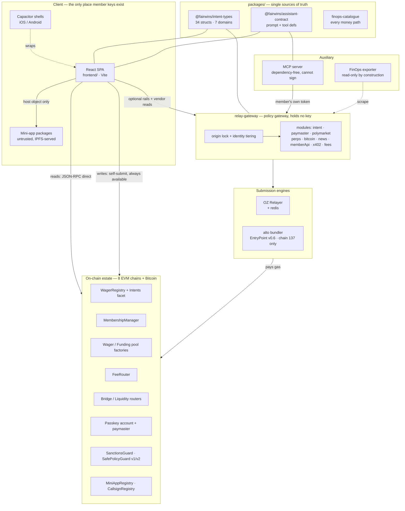

# 02 — Architectural View

> **Altitude:** components and the seams between them. This page says what the
> runnable and deployable parts *are*, which module is the single sanctioned
> path for each job, where state lives, and where the trust boundaries fall.
> Physical placement is [03](03-systems-view.md); the wire-level connector and
> port tables are [04](04-connectors-and-ports.md).
>
> Diagram source: [`diagrams/architecture-view.drawio`](diagrams/architecture-view.drawio).

## Component decomposition

The platform is **five deployable units and one on-chain estate**, plus a
shared-package layer that exists specifically to stop duplication of things that
must not drift.

Read the diagram for what it *omits*: there is no arrow from the gateway to a
member's key, no arrow from the gateway into escrow, and no arrow from a
mini-app to anything but the host object. Those absences are the architecture.

### Unit responsibilities

| Unit | Language / runtime | Holds a key? | Optional? | Responsibility |
|---|---|---|---|---|
| **SPA** (`frontend/`) | React + Vite | Member keys, client-side only | No — it *is* the product | Every member surface; all signing; all direct chain reads |
| **Mini-app packages** (`frontend/miniapps/`) | Built separately, frozen at an immutable CID | No | Yes | Third-party/first-party apps executing inside the host object |
| **Capacitor shells** | iOS / Android native wrappers | Bridges to the platform authenticator | Yes | Native passkey ceremony, Ledger BLE, app lock, deep links |
| **relay-gateway** (`services/relay-gateway/`) | Node ESM | **No member key**; KMS-signs paymaster ops | Yes — every flow self-submits | Policy gateway: origin lock, identity tiering, screening, quotas, killswitch; read-proxy for vendors with no CORS; member API; x402 paywall |
| **OZ Relayer + redis** | Container | Platform gas key (KMS) | Yes | Submits relayed intents and pays their gas |
| **alto bundler** | Container, v1.2.7 | Per-chain executor EOA | Yes | ERC-4337 bundling, EntryPoint v0.6, **chain 137 only** |
| **MCP server** (`services/mcp-server/`) | Node, **dependency-free by policy** | No — cannot sign, cannot pay | Yes | Exposes the member API to the member's own agents |
| **FinOps exporter** (`services/finops-exporter/`) | Node | No — no signer, no write route | Yes | Prometheus metrics for every catalogued money path |
| **On-chain estate** | Solidity | Escrow itself | No | All value custody and settlement |

Two structural constraints explain more of the codebase than any design
document: the **24 KB contract code limit**, which is why `WagerRegistry` is two
facets behind one proxy sharing a single storage definition; and the fact that
`frontend/src` has ~2,966 extensionless imports while the gateway is Node ESM,
which is why shared code had to be extracted into `packages/` with explicit
`exports` before the EIP-712 tables could stop being duplicated.

## 0. Findings that matter before the tables

| # | Finding |
|---|---|
| F1 | 🔶 `resolveCredentialManager` (FE/lib/passkey/credentials.js:171) is **not exported** — it is module-private and reached only as the default of the `deps.credentials` parameter of `createCredential`/`getAssertion` (:334, :409). CLAUDE.md names it as the seam; the *enforced* seam is actually the two ceremony functions. Stronger than documented. |
| F2 | 🔶 Two whole subsystems have shipped seams that `CLAUDE.md` does not mention: **spec 106 gateway caller auth** (`GW/identity/`, `ROUTE_TABLE`) and **spec 107 keyed RPC access** (`GW/access/`, `FE/lib/network/issuedAccess.js`). Both are first-class trust/seam boundaries. |
| F3 | 🔶 `CLAUDE.md` states perps ships **no in-app execution (FR-018)**. Code contains a full **spec 083 position-management** path: `config/perps.js#perpsManageEnabled`/`perpsManageFeatureEnabled` (default OFF via `VITE_PERPS_MANAGE_ENABLED`), `hooks/usePerpsOrders.js`, `hooks/usePerpsTrade.js`, `lib/perps/venues/{gains,gmx}.js`, `lib/perps/attestation.js`. Read-only is now the *flag-off* state, not the only state. |
| F4 | 🔶 `CLAUDE.md` cites `specs/103-capacitor-channels/`; the directory on disk is **`specs/102-capacitor-channels/`** (colliding with `102-multisig-chain-abstraction`). `103-funding-pools` is correct. |
| F5 | 🔶 `scripts/secrets/registry.js:4` self-identifies as **spec 088**; `CLAUDE.md` attributes workstation secrets to spec 097. `specs/088-instant-acting-accounts` is a different feature. One of the two is a mis-citation. |
| F6 | `screeningChainIds()` lives in **`FE/lib/screening/sources.js:185`**, not in `config/networks.js` (where CLAUDE.md's list of chain-roster helpers otherwise sits). `isLocalOnlyChain` lives in **`config/contracts.js:560`**, also not `networks.js`. |
| F7 | Specs with no seam entry in CLAUDE.md at all: 086 account-cards, 088 instant-acting-accounts, 092 multi-chain-activity, 098 acting-account-purchase, 099 network-status-miniapp, 100 passkey-solana, 101 passkey-zcash, 106, 107. Code exists for 100 (`FE/lib/solana/`). |

---

## 1. SEAM REGISTER

### 1.1 Native shell (spec 102-capacitor)

| Seam | Single source of truth for | Callers | Forbidden to bypass | Gate / test | Evidence |
|---|---|---|---|---|---|
| `FE/lib/native/runtime.js#getRuntime` / `isNativeRuntime` / `nativeCapability` | The **one** runtime + capability read; three-state, `available` only when the bridging plugin confirmed itself | every native-adjacent seam (`lifecycle`, `deepLinks`, `credentials`, `ledgerAdapter`), `NativeCapabilityNotice` | reading `window.Capacitor` / plugin globals directly; fabricating `available` | `FE/test/native/runtime.test.js`, `supportFloor.test.js` | runtime.js:32,44,83 |
| `FE/lib/native/lifecycle.js#subscribeAppHidden` | App-hidden ⇒ engage app-lock, in native shell | `lib/applock/` consumers | own `appStateChange` listener; INERT on web by construction (`{native = isNativeRuntime()}`) | `FE/test/native/lifecycle.test.js` | lifecycle.js:23 |
| `FE/lib/native/deepLinks.js#pathForIncomingUrl` / `subscribeDeepLinks` | Tenant-origin URL → in-app path | app bootstrap | accepting a non-tenant origin; hand-parsing `appUrlOpen` | `FE/test/native/deepLinks.test.js` | deepLinks.js:33,56 |
| `FE/lib/native/ledgerBleTransport.js#openNativeBleTransport` (+ `buildFrames`, `createFrameAssembler`, `LedgerNativeBleTransport`) | Ledger APDU framing over BLE in the native shell — one `hw-transport` rung | `lib/hardware/ledgerAdapter.js` only | importing `@capacitor-community/bluetooth-le` from UI code | `FE/test/native/ledgerBleRung.test.js` | ledgerBleTransport.js:34-36,49,73,113,195 |
| `FE/lib/native/nativeCredentials.js#nativeCredentialManager` | The credentials-shaped adapter over `@capgo/capacitor-passkey`, incl. PRF salt pre-encode / result decode | `credentials.js#resolveCredentialManager` only | passing a `Uint8Array` extension through the plugin (JSON-cloned ⇒ mangled) | `FE/test/native/passkeyBridge.test.js` | nativeCredentials.js:47,60,97,118 |
| `scripts/native/sync-native-config.js` | Version/identity fields in both shells (written from tenant manifest + `scripts/release/version.js`) | release pipeline | hand-editing shell config | `npm run check:native-versions` (`scripts/native/check-native-versions.js`) | package.json script |
| `scripts/native/nativeCsp.js` | Native meta CSP, **derived** from `infra/.../nginx.conf` | native prepare | widening `script-src`; editing the native CSP by hand | `FE/test/native/nativeCspParity.test.js` | test file present |

### 1.2 Passkey / account identity

| Seam | Single source of truth for | Callers | Forbidden to bypass | Gate / test | Evidence |
|---|---|---|---|---|---|
| `FE/lib/passkey/credentials.js#createCredential` / `getAssertion` (internal `resolveCredentialManager`) | WebAuthn ceremony execution + which credential manager (web vs native) runs it; ceremony timeouts (`CEREMONY_TIMEOUT_MS` 120s, `PINNED_…` 30s); the `fairwins.passkey.credentials.v1` record set | every passkey flow (sign-up, sign-in, PRF key unwrap, cross-device) | calling `navigator.credentials` directly; branching on native-ness at the call site | `FE/test/passkey/*`, `FE/test/native/passkeyBridge.test.js` | credentials.js:171,298,333,408 |
| `FE/lib/passkey/accountLookup.js#resolveAccounts` / `verifyAccountForKey` | **Which account a passkey controls** — `Resolution` has 4 shapes, only `resolved` carries an address (`resolved`/`noneFound`/`unverified`/`notController`) | sign-in flow; recovery surfaces | deriving the address and returning it anyway; treating `unverified` as `none-found`; `ownerIndex = 0` by assumption; unbounded waits (`RESOLUTION_DEADLINE_MS` 20s) | ⚠️ **UNVERIFIED** — no `FE/test/passkey/accountLookup*.test.js` found; tests exist for `bundlerTransport`, `deviceLossWarning`, `sendBatchSponsorship` only | accountLookup.js:24,40,51,56,65,74,127,188 |
| `FE/lib/passkey/prfKeys.js` | The PRF-derived master-seed blobs (`fairwins.passkey.wrappedSeeds.v1`) | Bitcoin/Solana derivation, legacy vault passkey unlock | deriving key material anywhere else | ⚠️ UNVERIFIED gate | prfKeys.js:24 |
| `FE/lib/bitcoin/derivation.js#deriveBtcSeed` / `addressAt` | BTC key derivation constants (`BTC_HKDF_INFO = 'fairwins-btc-seed-v1'`, BIP84/86 paths) — **wallet-breaking if changed** | `lib/bitcoin/wallet.js`, `send.js`, `psbt.js` | a second HKDF info / path table | `FE/lib/bitcoin/__tests__/derivation.test.js` | derivation.js:42,84,99,144 |
| `FE/lib/solana/derivation.js#deriveSolanaKeypair` | Solana key derivation from the same master seed (`SOLANA_COIN_TYPE 501`, 3 schemes) | `lib/solana/send.js` | — | `FE/lib/solana/__tests__/` | derivation.js:29,82 |

### 1.3 Custody (Protect)

| Seam | Single source of truth for | Callers | Forbidden to bypass | Gate / test | Evidence |
|---|---|---|---|---|---|
| `FE/lib/custody/writeRail.js#resolveWriteRail` / `requireWriteRail` | "Can this session sign a vault action on this chain?" — **signer checked first**, passkey rail only where `isPasskeySupported(chainId)`, `NONE` otherwise with an actionable reason | `hooks/useVaultProposals.js`, Queue UI, vault action callbacks | branching on `loginMethod === 'passkey'`; offering a button that will throw inside `sendPasskeyBatch`; conflating unavailable-rail with "view-only" | `FE/test/custody/writeRail.test.js` | writeRail.js:25,42,72 (signer-first at :45-47) |
| `FE/lib/custody/policyV2.js#matchPreview` (+ `classifyPayload`, `scopeEquals`, `analyzeShadowing`, `previewPolicyV2`, `encodeSetRules`) | Client-side twin of on-chain first-match-governs policy matching; rule encoding; V2 limits (`MAX_RULES 16`, `MAX_APPROVERS 8`, `MAX_TARGETS 16`) | `PolicyPanelV2`, `RuleComposer`, `RuleList` | a second matcher; changing preview without the Solidity | `FE/test/custody/policyV2.test.js` + shared scenarios with the Solidity suite | policyV2.js:22-25,191,208,234,280,308,368 |
| `FE/lib/custody/vaultRulesConfig.js#realizeRules` | The ONE semantic rules config → realized on-chain rule array, per chain | `createflow/RulesSheet.jsx`, `CreateVaultFlow` | putting policy into a multichain deployment initializer (byte-different ⇒ different CREATE2 address) | `FE/test/custody/vaultRulesConfig.test.js` | vaultRulesConfig.js:18-21,29,61,151 |
| `FE/components/custody/createflow/` (`CreateVaultFlow.jsx` + `TypeSheet`/`NetworksSheet`/`RulesSheet`/`DoneSheet` + `createFlowModel.js`) | Vault creation: chain-independent spec-043 initializer + per-vault saltNonce; creation record | Protect ▸ On chain | creating per-network from a different flow; a "pick a network" prompt | `FE/test/custody/CreateVaultFlow.test.jsx` | dir listing |
| `FE/lib/custody/vaultCreationRecords.js` | The **immutable** creation record (replay input for "Add a network"), userStorage key `vault_creation_records`, synced | createflow, `deriveNetworkStatus` | mutating a record | `FE/test/custody/vaultCreationRecords.test.js` | :16 |
| `FE/lib/custody/vaultReferences.js` | The **only** client-side custody data store: `(chainId,address)` vault references + labels, key `custody_vault_references`, synced | `useCustodyVaults` | keying the store by address (view-only is `vaultGroups`) | `FE/test/custody/vaultGroups.test.js`, `useCustodyVaults.multichain.test.jsx` | vaultReferences.js:1,9 |
| `FE/lib/custody/describeProposal.js` | Decoded proposal chips/rows — `null` over a guess | Queue | inventing a decode | `FE/test/custody/describeProposal.test.js` | dir |
| `FE/hooks/useVaultQueueAcrossChains.js` | Per-chain four-state queue read (`read`/`unreadable`/`not-configured`/`not-supported`), partial totals named | `VaultQueueView` | summing across chains without naming the missing one | `FE/test/custody/useVaultQueueAcrossChains.test.jsx` | hooks listing |
| `FE/lib/custody/submitAsActiveAccount.js` | Identity-first submit (member vs vault ⇒ proposal) | vault actions, mini-app host `wallet.submit` | submitting as the member while "operating as" a vault | `FE/test/custody/submitAsActiveAccount.test.js` | dir |

### 1.4 Hardware wallets (spec 085)

| Seam | Single source of truth for | Callers | Forbidden to bypass | Gate / test | Evidence |
|---|---|---|---|---|---|
| `FE/lib/hardware/adapters.js#connectHardware` (+ `detectTransports`, `ledgerTransportKind`, `vendorAvailability`) | The ONE vendor seam — Ledger/Trezor SDKs lazy-loaded behind it; transport selection incl. the BLE rung | `connectAccount.js`, `HardwareSigner`, `AddHardwareWalletSheet` | importing a vendor SDK from UI code; surfacing a raw SDK message (must go through `HW_ERROR_CODES`/`describeHardwareError` in `hardware/errors.js`) | `FE/test/hardware/transports.test.js`, `stagingRegressions.test.js` | adapters.js:27,30,41,59,76,97 |
| `FE/lib/hardware/connectAccount.js#connectHardwareAccount` | Reconnect = **re-derive the saved path and match the saved address, else refuse** | Protect ▸ Off chain | trusting the saved address without re-derivation | `FE/test/hardware/connectAccount.test.js` | connectAccount.js:17 |
| `FE/lib/hardware/hardwareAccountsStore.js` | Public device metadata only (`{address,vendor,path,label,addedAt}`), key `hardware_accounts`, **synced** | `hardwareAccounts.js` facade | storing key material / xpub / device id | `FE/test/hardware/hardwareAccountsStore.test.js` | :11 + syncedObjects.js:205 |
| `FE/lib/hardware/hardwareSigner.js` | Physical-confirmation signing + recover-and-verify before broadcast | vault/transfer write paths | broadcasting an unverified device signature | `FE/test/hardware/hardwareSigner.test.js` | dir |

### 1.5 Network / RPC (specs 069, 107)

| Seam | Single source of truth for | Callers | Forbidden to bypass | Gate / test | Evidence |
|---|---|---|---|---|---|
| `FE/lib/network/rpcEndpoints.js#resolveRpcEndpoints` (+ `getRpcUrlForChain`, `authHeadersFor`, `describeRpcRoute`, `probeRpcEndpoint`) | Endpoint precedence **member override → build default**; credential goes in a **header**, primary endpoint only | `utils/rpcProvider.js#makeReadProvider`, `wagmi.js` transports | hand-building a provider from `NETWORKS[chainId].rpcUrl`; writing a key into a URL | `FE/test/network/rpcEndpoints.test.js`, `rpcFailover.test.js`, `rpcProvider.endpoints.test.js` | rpcEndpoints.js:28,37,42,63,116,121,144 |
| `FE/utils/rpcProvider.js#makeReadProvider` / `getReadProvider` | Every ethers read provider (quorum-1 `FallbackProvider`; `useEndpointsRevision` in memo deps) | all read hooks, screening, estate reads, `readProviderFor` | `new JsonRpcProvider(NETWORKS[..].rpcUrl)` | same as above | rpcProvider.js:110,199 |
| `FE/lib/network/endpointStore.js` (`ENDPOINTS_PREF_KEY = 'network_endpoints'`, `CSP_RPC_GRANTS`) | Member endpoint overrides; the `connect-src` grant list | NetworkPanel | syncing endpoints to backup; drifting from both nginx configs | `FE/test/network/endpointStore.test.js`, `FE/test/nginxCspConnectSrc.test.js` | endpointStore.js:21,36 |
| `FE/lib/network/issuedAccess.js#ensureIssuedAccess` / `issuedFetchFor` / `issuedAccessState` (**spec 107, undocumented in CLAUDE.md**) | Short-lived keyed-read credential lifecycle; state subscription | read providers that can use keyed capacity | reading keyed endpoints without the issued token; treating a refusal as an error surface (it means "fall back to public") | `FE/test/network/issuedAccess.test.js`, `issuedClient.test.jsx` | issuedAccess.js:55,71,93,176,194 |

### 1.6 Address screening (spec 021 amendment)

| Seam | Single source of truth for | Callers | Forbidden to bypass | Gate / test | Evidence |
|---|---|---|---|---|---|
| `FE/lib/screening/sources.js#screeningSourcesFor` / `screeningChainIds` (+ `CHAINALYSIS_ORACLES`, `ISSUER_FREEZE_LISTS`, `SOURCE_KINDS`) | The **source registry** — FairWins `SanctionsGuard`, Chainalysis oracle (Base at a different address), Circle `isBlacklisted` / Tether `isBlackListed`; roster = cohort **minus** `isLocalOnlyChain` | `screenEstate.js` | adding an unverified row; including a local-only chain | `FE/test/screening/sources.test.js`, `screeningRoster.test.js` | sources.js:57,64,79,185,197 |
| `FE/lib/screening/verdict.js#deriveVerdict` (+ `countReadings`, `describeVerdict`, `worstVerdict`, `verdictOnChain`) | ONE word from readings: `flagged` on any hit, `screened` only when `unreadable === 0`, else `partial`, `unscreened` when nothing answered. Never stored. | `screenEstate`, `ScreeningPill`, `ScreeningStatusBar` | green on a list that did not answer; treating no-source as clear | `FE/test/screening/verdict.test.js` | verdict.js:25,36,53,76,158 |
| `FE/lib/screening/screenEstate.js#screenAddressAcrossEstate` | The cohort sweep: per-source failure isolation, `DEFAULT_DEADLINE_MS 8_000`, never rejects, providers from `readProviderFor` | `useEstateScreening`, `useEstateScreeningMany` | a background poll; a provider built by hand | `FE/test/screening/screenEstate.test.js` | screenEstate.js:31,110,180 |
| `FE/hooks/useAddressScreening` | **Per-chain live read** that gates a submission on the chain value moves on (the contract repeats this read) | submit paths (FR-013/032) | using it to render the advisory pill for a book of contacts (it can only answer for the wallet's chain) | `FE/test/screening/*` | useAddressScreening.js:34 |
| `FE/hooks/useEstateScreening` / `useEstateScreeningMany` (+ `NO_SOURCE`) | The **advisory** estate verdict under every address field / the book & contact picker; `getVerdictOn` third answer `no-source` | `AddressScreenNotice`, `ScreeningPill`, address book | using the per-chain hook for book rows | `FE/test/screening/ScreeningPill.test.jsx`, `ScreeningStatusBar.test.jsx`; e2e `MS-06` (no-chain tier must be amber) | useEstateScreening.js:36,87,89 |

### 1.7 Message signing / verify (spec 084)

| Seam | Single source of truth for | Callers | Forbidden to bypass | Gate / test | Evidence |
|---|---|---|---|---|---|
| `FE/lib/verify/verifyMessage.js#verifyMessage` | Offline, **synchronous** signature check; three verdicts `valid`/`invalid`/`unverifiable` (`VERIFY_STATUS`); `canCheckOnChain` marks the one escalable outcome | `VerifySection.jsx`, `verifySignedMessage` | giving it a chain/provider; making it `async`; promoting an ECDSA mismatch to a negative when the on-chain leg could not run | `FE/test/verify/verifyMessage.test.js`; fixtures once in `FE/test/fixtures/signedMessages.js` | verifyMessage.js:48,168 (plain `function`, no `await`) |
| `FE/lib/verify/verifyMessage.js#verifyOnChain` / `checkErc1271` | The network escalation (ERC-1271, `ERC1271_MAGIC`) — a timeout is **not** a forgery | explicit member escalation only | rendering an RPC timeout as invalid | same | verifyMessage.js:42,90,246 |
| `FE/lib/verify/signMessage.js` | Signing; **refused while operating as a vault** | VerifySection | signing under a "vault" label with the member's own key | `FE/test/verify/signMessage.test.js` | dir |

### 1.8 Legacy recovery (spec 062)

| Seam | Single source of truth for | Callers | Forbidden to bypass | Gate / test | Evidence |
|---|---|---|---|---|---|
| `FE/lib/recovery/legacyKeys.js#legacyKeyVault(account)` | Per-account CRUD facade over the store; encrypt/decrypt (`PBKDF2_ITERATIONS 650000`, AES-GCM), passkey-PRF variant | Recovery section | persisting/transmitting/logging a cleartext secret | `FE/test/recovery/legacyKeys.test.js`, `legacyKeysPasskey.test.js` | legacyKeys.js:32,152,180,229,269,298 |
| `FE/lib/recovery/legacyRecoveredKeysStore.js` | The store itself — key `legacy_recovered_keys`, **synced** (ciphertext only), single source of truth | `legacyKeyVault` only | a second store; a parallel merge | `FE/test/recovery/legacyRecoveredKeysStore.test.js` | store.js:6,11; syncedObjects.js:167 |
| `FE/lib/recovery/legacyKeys.js#sweepAllAssets` (+ `quoteAllAssets`, `supportedAssetsForChain`, `pinnedFeeFields`) | Optional fund movement: all supported fungibles, ERC-20s first / native last with gas reserve, **per-asset outcomes**, NFTs excluded | Recovery UI | aborting the rest on one failure | `FE/test/recovery/legacyKeysMultiAsset.test.js` | legacyKeys.js:486,505,571 |

### 1.9 Backup registry (spec 032) and the deliberate exclusions

| Seam | Single source of truth for | Gate | Evidence |
|---|---|---|---|
| `FE/lib/backup/syncedObjects.js#syncedObjects` | **Exactly what rides the encrypted backup**, each with `networkScoped` stated truthfully | `FE/test/backup/syncedObjects.test.js` | syncedObjects.js:47 |

Included (9): `addressBook` (net-scoped), `preferences`, `vaultReferences` (net-scoped),
`vaultCreationRecords`, `activityLedger` (net-scoped), `openChallengeCodes`,
`legacyRecoveredKeys`, `miniAppState`, `hardwareAccounts`.
(evidence: syncedObjects.js:49,66,87,108,120,146,167,193,205)

**Deliberately EXCLUDED — each with a test that reads `syncedObjects.js` as text and asserts absence:**

| Excluded store | Key | Why | Asserting test |
|---|---|---|---|
| RPC endpoint overrides + credentials | `network_endpoints` (in `fw_global_prefs`) | device-scoped credential | `FE/test/applock/appLock.test.js:6` (comment), `FE/test/network/endpointStore.test.js` |
| Nav sections / density | `nav_sections`, `nav_density` (`fw_global_prefs`) | device preference | `FE/test/navPreferences.test.js:171` (reads the registry file) |
| GutterToken assistant key | `assistant_guttertoken_key_v1` | device-only secret | `FE/test/assistant/guttertokenKeyStore.test.js:242` |
| Member API key grants | `api_access_keys` | device-only capability material | `FE/test/apiKeys.test.js:220` |
| Assistant memory | `assistant_memory_v1` | device-local, member-clearable | `FE/test/assistantMemory.test.js:149` |
| App-lock state | `fairwins.applock.state.v1` | device session state | `FE/test/applock/appLock.test.js` |

### 1.10 Configuration seams

| Seam | Single source of truth for | Callers | Forbidden to bypass | Gate / test | Evidence |
|---|---|---|---|---|---|
| `FE/config/contracts.js#getContractAddressForChain` (+ `getContractAddress`, `getDeploymentBlockForChain`, `DEPLOYED_CONTRACTS`, `DEPLOYMENT_BLOCKS`) | Contract address resolution per chain, sourced from `deployments/` | every contract read/write, mini-app host `contracts()` | hardcoding an address; passing a Bitcoin string id | `FE/test/config/*`, `scripts/e2e/check-local-addresses.js` (`check:e2e-addresses`) | contracts.js:389,473,483,493,535 |
| `FE/config/contracts.js#isLocalOnlyChain` | Which chains a shipped build can never reach (1337) | `screeningChainIds()`, roster filters | treating a local chain as a degraded source | `FE/test/screening/screeningRoster.test.js` | contracts.js:560 |
| `FE/config/networks.js#membershipChainId` | Membership's ONE home per cohort — **derived** from `MAINNET_CHAIN_ID`/`TESTNET_CHAIN_ID` | `hasRoleOnChain`, `getUserTierOnChain`, purchases | a second literal `137` | `FE/test/config/*`, `assertReferenceChainInCohort()` (:1185) | networks.js:1097 |
| `FE/config/networks.js#miniAppChainId` | Mini-app registry home: **Polygon 137 / Mordor 63**; the one reference chain NOT derived from `TESTNET_CHAIN_ID` (no Amoy registry) | `registryClient` | hardcoding 137; deriving from TESTNET_CHAIN_ID | `FE/test/miniapps/registryClient.test.js` | networks.js:1156 |
| `FE/config/networks.js#cohortChainIds` / `isInCohort` | "All chains" = the build's cohort; constitution III boundary | estate reads, `screeningChainIds`, `listWrappableCoins` | `listSupportedChainIds()` for an estate read | `FE/test/chain/*` | networks.js:1165,1175 |
| `FE/config/bitcoinNetworks.js#isBitcoinNetworkId` | The EVM/non-EVM boundary guard for Bitcoin **string** ids | every seam that takes a chain id | passing a Bitcoin id into `getContractAddressForChain`/wagmi/subgraph | `FE/test/*` bitcoin suites | bitcoinNetworks.js:41,74 |
| `FE/config/passkeySupport.js#isPasskeySupported` | Where the passkey UserOp rail can submit (bundler present) | `resolveWriteRail`, wrap, custody | offering the passkey rail on ETC 61 / Mordor 63 | `FE/test/custody/writeRail.test.js` | passkeySupport.js:120 |
| `FE/config/perps.js#isEvmPerpVenue` | EVM-vs-non-EVM perp venue guard (Hyperliquid: string id, `chainId: null`) | perps seams | passing Hyperliquid into an EVM seam | `FE/test/perps/*` | perps.js:25,55 |
| `FE/config/tenant.js` (`tenantBrand`, `isFeatureEnabled`, `tenantThemeClass`, `tenantContractsForChain`, `tenantAssistantSettings`, `tenantChainIds`) | Tenant identity/settings/contract set, from `tenants/<id>/manifest.json`; selection is **build-time** `VITE_TENANT_ID` | all shipped paths | hardcoding a tenant identity value; runtime switching; falling back to another tenant on unknown id | `npm run tenants:validate` (CI), `FE/test/tenantBranding.test.js` | tenant.js:25,43,68,112,132,142,156,181 |
| `frontend/vite-plugins/tenant-branding.js` → **`virtual:tenant`** | The build-time injection of the manifest into the bundle | `config/tenant.js`, `lib/miniapps/manifest.js` | a mini-app package resolving it (hard build failure — that is the intended guard) | `FE/test/miniapps/buildPreset.test.js`, `packageBoundary.test.js` | plugin file; consumers grep |
| `FE/config/appNav.js` (`NAV_GROUPS`, `WAGERS_VIEW`/`WAGERS_PATH`, `TAB_ALIASES`, `visibleNavGroups`, `pathForNavItem`, `isNavItemEnabledForTenant`) | Nav structure + tab ids + tenant visibility | drawer, sibling icon nav, search index, routes | putting `network` back in `NAV_GROUPS`; a second nav structure | `FE/test/nav/navSearchIndex.test.jsx`, `AppNavDrawer.*.test.jsx` | appNav.js:24,80,94,97,143,224,248 |
| `FE/config/navSearchIndex.js` (`NAV_ITEM_TERMS`, `NAV_DESTINATIONS`, `accordionSectionForHash`) | Search synonyms + in-item destinations; **descriptive, never authoritative** | `AppNavDrawer` search, assistant `find_in_app` | letting an index entry resurrect a hidden surface; a second hash→section map | `FE/test/nav/navSearchIndex.test.jsx` (asserts every `navId` is real) | navSearchIndex.js:44,95,108,476,502 |
| `FE/lib/nav/navSearch.js#matchesQuery` / `rankEntries` | Matching: AND the terms, each a **token prefix** | drawer search | hand-written stems | `FE/test/AppNavDrawer.search.test.jsx` | navSearch.js:30,63,75,84 |
| `FE/lib/nav/attention.js` (`ATTENTION_PARAM='focus'`) | Deep-link flash markers; absence degrades to plain navigation | `AttentionFocus` (mounted once in App.jsx) | a broken link on a missing marker | `FE/test/nav/attentionFocus.test.jsx` | attention.js:20-28,44,57 |
| `FE/components/admin/adminApps.js` (`ADMIN_APPS`, `buildAdminApps`, `adminAppForView`, `adminViewPath`) | The ONLY admin app→view→role matrix (9 apps: incident-response, compliance, membership-revenue, liquidity, protocol-config, maintenance, identity, access-control, infrastructure) | Control Room tiles, per-app rails, `AdminAppRoute` guard, least-privilege tests | a second app/view/gate mapping | `FE/test/admin/*` | adminApps.js:24,28,127,130,142,155,163 |
| `FE/config/wrappedNative.js#listWrappableCoins` / `getWrappedNative` / `hasWrappedNative` | Offered-beside-resolvable wrap candidates (`cohortChainIds().filter(hasWrappedNative)`) | `useWrapCoinOptions`, `useWrapNative` | a disabled row for an unconfigured chain; a guessed wrapper | `FE/test/*` wrap suites | wrappedNative.js:34,54,74 |
| `FE/hooks/useWrapNative` (+ `useWrapCoinOptions`) | Target-chain-bound wrap reads and per-rail retarget (classic switch-then-settle, passkey `sendCalls {chainId}`) | Trade ▸ Wrap | a MAX quoted on one chain riding to another (coin change clears the amount) | `FE/test/*` wrap suites | hooks listing |
| `FE/config/newsAssets.js#newsSlugFor` | `(chainId,address)`→Alphaday tag slug; resolves **client-side with no network call**; `null` IS "not covered" | `lib/news/newsClient.js` | a ticker heuristic; a fallback slug | `FE/test/news/*` | newsAssets.js:1,35,44,62 |
| `FE/config/blockExplorer.js` | Explorer URL construction (defers to `networks.js` as source of truth) | link-outs | a second explorer table | ⚠️ UNVERIFIED gate | blockExplorer.js:11 |
| `FE/config/serviceCatalog.js` | Spec-060 `serviceId` catalog (fee services) | fee disclosure surfaces | hardcoding a bps value | `FE/test/custody/serviceCatalog.test.js` | file present |
| `FE/lib/assets/assetActivity.js` | WHICH activity capabilities an asset has (spec 064) | activity surfaces | per-surface capability guesses | ⚠️ UNVERIFIED | header comment |

### 1.11 Honest-reading seams (three-state / null discipline)

| Seam | Single source of truth for | Forbidden | Gate | Evidence |
|---|---|---|---|---|
| `FE/lib/format/amount.js#formatUnitsForDisplay` (+ `formatDecimalForDisplay`) | Base-unit → display string; **`null` stays `null`**, unparsable is `null`, never throws | `raw \|\| 0`; rounding what is SENT | `FE/test/format/*` | amount.js:38,74 (`if (raw == null) return null`) |
| `services/finops-exporter/src/reading.js` (`read` / `notConfigured` / `unreadable`, `redact`, `attempt`) | The three-state reading type — **only one constructor takes a number** | a zero standing in for a failed read; collapsing `not-configured` into `$0` | `npm run check:finops`, `npm run test:finops-gate` (must-fail fixtures), `services/finops-exporter/test/*` | reading.js:14,25,49,59,70,85 |
| `FE/hooks/usePerpsOrders.js` | Orders on the exit path; absent gateway key ≠ "member has none"; `unreadableVenues` named | consulting screening/attestation/killswitch here | `FE/test/perps/safetyInvariants.test.js` (asserted over this file's source) | usePerpsOrders.js:1-30 |
| `FE/lib/perps/orderState.js` | What a perps order state MEANS (the state machine) | re-deriving state in a hook | `FE/test/perps/*` | orderState.js:294 |
| `FE/hooks/usePerpsOrders`/`usePerpsTrade` + `lib/perps/venues/*` | THE ONE place a descriptor becomes venue calldata; `PERPS_UI_FEE_RECEIVER` the only FairWins address in it | reaching for venue builders directly | `FE/test/perps/*` | usePerpsTrade header; perps.js:241; venues/gmx.js:291 |

### 1.12 Mini-app platform (spec 073)

| Seam | Single source of truth for | Callers | Forbidden | Gate | Evidence |
|---|---|---|---|---|---|
| `FE/lib/miniapps/hostContext.jsx#MiniAppHostProvider` / `useMiniAppHost` | **The entire privileged surface** given to untrusted packages (hostApi 2): `appId`, `wallet{address,chainId,isConnected,requestConnect,switchChain,submit}`, `readProvider`, `contracts`, `network`, `networks`, `store`, `audit`, `toast`, `navigate` — wrappers, never handles | mini-app iframe-less Blob-imported modules | adding a key (grants it permanently to every package); handing out a signer/context/storage handle; reporting success from `submit` without `SubmitResult.wait()` | `FE/test/miniapps/hostContext.test.jsx`; contract doc `specs/073-miniapp-platform/contracts/host-context.md` | hostContext.jsx:13,172,408,416,585,772,938,980,1027 |
| `FE/lib/miniapps/hostScope.js#installHostScope` (`HOST_SCOPE_SYMBOL`, `HOST_API_VERSION`, `isHostApiSupported`) | How a package reaches the host object; hostApi compatibility | loader | a package importing host modules | `FE/test/miniapps/hostScope.test.js` | hostScope.js:57,67,126,155 |
| `FE/lib/miniapps/integrity.js` (`verifyManifestBytes`, `verifyFileBytes`, `keccak256Hex`, `sha256Hex`) | keccak(manifest bytes) vs chain + sha256 of **every byte executed or injected** | `loader.js` | trusting the SW cache (not a trust boundary) | `FE/test/miniapps/integrity.test.js`, `packageCache.test.js` | integrity.js:41,168,201 |
| `FE/lib/miniapps/loader.js#loadMiniApp` / `verifyMiniAppPackage` | Retrieval + verification + Blob-URL import; gateway list (`resolveMiniAppGateways`), size caps (`MAX_MANIFEST_BYTES 64KB`, `MAX_FILE_BYTES 8MB`) | Apps section | executing an unverified byte; `verifyAllDeclaredFiles` on a launch | `FE/test/miniapps/loader.test.js` | loader.js:80,87,94,240,547,684 |
| `FE/lib/miniapps/registryClient.js#normalizeApp` | Reads the chain's **`launchable`** — the serving decision — never `status` | catalog, workspace | re-deriving launchable; gating on `status === Approved` | `FE/test/miniapps/registryClient.test.js`, `registryAuthority.test.js` | dir |
| `FE/test/miniapps/packageBoundary.test.js` | **The import boundary in BOTH directions**: nothing in `frontend/miniapps/**` may import `frontend/src/**`, and nothing in `frontend/src/**` may import a converted package tree | — | either direction | itself (a scoped vitest run cannot catch it — needs full suite or build) | packageBoundary.test.js:1-40 |
| `FE/lib/miniapps/store.js` (`miniAppState`, synced) + `favorites.js` (`miniapp_favorites`) | Per-app namespaced store (root = `appId`); pinned apps (reserved `admin-tool:<appId>` namespace) | host `store`, drawer pins | cross-app store reads | `FE/test/miniapps/store.test.js`, `storeIsolation.test.jsx`, `favorites.test.js` | files |
| `FE/lib/miniapps/hostRefusal.js` (`HOST_REFUSAL`, `MiniAppHostError`) | Normalized host refusal codes + member-facing messages | host wrappers | a raw throw reaching a package | `FE/test/miniapps/hostContext.test.jsx` | hostRefusal.js:13,57 |

### 1.13 Shared packages (spec 075 workspace)

Workspaces: `frontend`, `frontend/miniapps/*`, `services/relay-gateway`,
`services/finops-exporter`, `subgraph`, `tools/miniapp-build`, `packages/*`.
`services/mcp-server` is deliberately **NOT** a member (lockfile hazard) and has **no dependencies**.
`contracts/` is deliberately not a member.

| Package | Single source of truth for | Consumers (verified) | Gate |
|---|---|---|---|
| `@fairwins/intent-types` (`packages/intent-types`, exports `.` + `./offchain`) | EIP-712 intent structs + action metadata (`INTENT_TYPES`, `INTENT_ACTIONS`, `CONTRACT_VERIFIED_TYPES`, `FUNDING_POOL_TYPES`); off-chain `ApiKeyGrant` in `./offchain` (deliberately outside `CONTRACT_VERIFIED_TYPES`) | `FE/lib/relay/intentTypes.js` (re-export), `FE/lib/apiAccess/apiKeys.js`, `FE/lib/transfer/eip3009Transfer.js`, `FE/lib/pools/gasless.js`, `FE/utils/claimCode/deriveFromCode.js`, `GW/intent/intentTypes.js` (re-export), `GW/x402/verify.js`, `GW/memberApi/{auth,intents,openapi}.js` | `test/intent/TypehashParity.test.js` (both directions, against **contract** typehashes), `services/relay-gateway/test/actionCoverage.test.js`, `.../memberApiAuth.test.js` (off-chain structs) |
| `@fairwins/assistant-contract` (exports `.`, `./prompt`, `./tools`, `./results`) | System prompt + tool definitions + honest result wording — ONE table | `FE/lib/assistant/{conversation,messageShape,providers/guttertoken,tools/executor,tools/toolLoop}.js`; `GW/memberApi/{assistant,openapi,routes}.js`; vendored as `services/mcp-server/src/toolDefs.snapshot.json` | `services/relay-gateway/test/mcpToolParity.test.js` (both directions), `assistantContract.test.js`, `assistantTools.test.js` |
| `@fairwins/finops-catalogue` (exports `.`, `./sources`, `./schema`) | Every revenue + cost source declared once; label enumerations | `services/finops-exporter/src/server.js`, `scripts/finops/generate-dashboards.js` | `npm run check:finops` (C1–C5, incl. C2b payee discovery), `npm run test:finops-gate` |
| `@fairwins/abi` (exports `.`, `./json/*`) | Generated contract ABIs | `scripts/codegen/emit-abis.js` (⚠️ **no frontend/service import found** — consumers may still read `contracts/` artifacts) | `npm run check:abis` |

### 1.14 Relay-gateway internal module boundaries (`GW/*`)

| Module | Boundary it owns | Forbidden | Gate |
|---|---|---|---|
| `GW/identity/` (`middleware.js`, `routeTable.js`, `resolve.js`, `tiers.js`, `quotaKey.js`, `upstreamCeiling.js`, `verifiers/{attestation,challenge,grant}.js`) **spec 106 — undocumented in CLAUDE.md** | `ROUTE_TABLE` is **THE ONE TABLE** of protected routes; **silence is a configuration error, not permission**; a challenge is a *metering upgrade*, never an access gate (every READ is `ANONYMOUS`); writes need `ADDRESS` (an answerable party), never `member` | a route absent from the table; putting a `human` minimum on a read; a second revocation store / membership reader | `services/relay-gateway/test/identity/` (asserts mounted set == declared set, **both directions**) |
| `GW/access/` (`routes.js`, `jwt.js`, `enforcement.js`) **spec 107 — undocumented** | Issuance of short-lived keyed-read credentials — **issues, never carries traffic**; every non-200 means "fall back to public capacity" | making the gateway an RPC passthrough; gating issuance above ANONYMOUS | `services/relay-gateway/test/access.test.js` |
| `GW/intent/` (`intentTypes.js` re-export, `verify.js`, `store.js`) | Signature recovery from the intent payload (self-authenticating); intent status store | a local type table; trusting a caller-supplied signer | `actionCoverage.test.js`, `gateway.test.js`, `test/intent/TypehashParity.test.js` |
| `GW/paymaster/` (`build.js`, `policy.js`, `sign.js`) | ERC-7677 sponsorship decision order: **killswitch → per-op ceilings → sanctions → deposit gate → quotas → KMS sign**; stub path never signs | signing before screening; refusing on an *unreadable* deposit (RPC blip ≠ empty pool) | `paymaster.test.js` |
| `GW/polymarket/` (`client.js`, `builderCode.js`, `normalize.js`, `routes.js`) | Builder-code attachment + fee caps (boot-fails above cap); read vs **write** quota split (write keyed by trader address) | hiding the additive taker fee; pooling write budget into reads | `polymarket.test.js` |
| `GW/perps/` (`client.js`, `normalize.js`, `routes.js`) | Per-venue failure isolation (`read`/`degraded`), `null` → "—", documented normalizer scale provenance; **no write routes** | rendering a degraded venue as zeros; adding execution here | `perps.test.js` |
| `GW/bitcoin/` (`client.js`, `cache.js`, `normalize.js`, `routes.js`) | Esplora reads + raw-tx broadcast + Stamps recognition; fail-safe stamp handling; 256kb body exception for the tx route | spending an unverified-stamp-free UTXO; seeing key material (gateway sees addresses + signed raw tx only) | `bitcoin.test.js` |
| `GW/news/` (`client.js`, `normalize.js`, `routes.js`) | TTL clamp **≥ 300 s**, single-flight per slug, serve-stale ≤ 10×TTL then `unreadable`; honest-empty `read` with `items: []`; vendor `image`/`icon`/HTML never forwarded | stale-as-live; forwarding vendor markup | `news.test.js` |
| `GW/memberApi/` (`contract.js` **= ROUTES/SCOPES/ERROR_CODES**, `auth.js`, `routes.js`, `openapi.js`, `membership.js`, `wagers.js`, `intents.js`, `assistant.js`, `revocation.js`) | `contract.js` is the ONE route/scope/error table — `routes.js` mounts **by contract id** and **boot-fails** on a declared-but-unmounted route (routes.js:579-588); `auth_unverifiable`/`membership_unreadable` are retryable 503s, never denials; no `write:` scope exists | typing a path in `routes.js`; a scope that authorises a write; an actor other than the token account | `memberApi.test.js` (probes every ROUTES entry over HTTP), `memberApiAuth.test.js`, `memberApiQuotaIsolation.test.js`, `memberApiSpend.test.js` |
| `GW/x402/` (`paywall.js`, `requirements.js`, `verify.js`, `settle.js`) | Pay-per-request rail: **bearer token checked first** so a member never reaches the paywall; `TransferWithAuthorization` (not `Receive…`); token's own EIP-712 domain from `chains.js#tokenDomain`; verify-everything-before-settle; engine outage ⇒ `503 settlement_unavailable` | a free serve on engine outage; a new key/facilitator; a 1271 check for a contract payer (EOA-only, reason says so) | `x402.test.js` |
| `GW/fees/onchain.js` | The gateway's **read-only** FeeRouter view; env bps are fallback only | a second fee-config store; a hardcoded bps | `fees.test.js` |
| `GW/policy/` (`killswitch.js`, `quotas.js`, `sanctions.js`, `dedup.js`, `backpressure.js`, `reload.js`) | Global + per-module killswitch; quota windows (per-signer + global); **fail-closed** sanctions screen; SIGHUP live config reload (read via live getters, not captured booleans) | screening after signing; a captured boolean that survives a reload | `rateLimit.test.js`, `gateway.test.js` |
| `GW/engine/client.js` | The **one** adapter to the OZ relayer engine (`POST /api/v1/relayers/{id}/transactions`); swappable | a second submission rail; policy in the engine | `gateway.test.js` |
| `GW/audit/log.js`, `GW/metrics/counters.js` | Audit fields (never message content, never key material) and bounded metric labels | unbounded labels (address/tx hash) | `memberApiSpend.test.js` (counts only) |
| `GW/config/index.js`, `GW/config/chains.js`, `GW/config/providers.js` | All env parsing + upstream base URLs + per-chain provider construction + `tokenDomain`; **boot fails loudly** on an out-of-cap fee or bad URL | reading `process.env` in a module | `tenant.test.js`, `rpcEndpoints.test.js` |

---

## 3. DATA STORES & STATE

### 3.1 Browser — `localStorage`/`sessionStorage` via `FE/utils/userStorage.js`

Two namespaces: **wallet-scoped** `fw_user_<lowercased address>_<key>`
(`getUserStorageKey`, userStorage.js:15-23) and **device-global** `fw_global_prefs`
(userStorage.js:8).

| Key | Namespace | Synced? | Secret? | Evidence |
|---|---|---|---|---|
| `addressBook` | wallet | **synced** (net-scoped) | no | addressBook/constants.js:10 |
| `preferences` | wallet | **synced** | no | syncedObjects.js:66 |
| `custody_vault_references` | wallet | **synced** (net-scoped) | no | vaultReferences.js:9 |
| `vault_creation_records` | wallet | **synced** | no | vaultCreationRecords.js:16 |
| `activityLedger` | wallet | **synced** (net-scoped) | no | syncedObjects.js:120 |
| `openChallengeCodes` | wallet | **synced** | **opaque ciphertext** | syncedObjects.js:146 |
| `legacy_recovered_keys` | wallet | **synced** | **ciphertext of private keys / BIP-39** (AES-GCM, PBKDF2-650k) — never cleartext | legacyRecoveredKeysStore.js:11 |
| `miniAppState` | wallet | **synced** | no | miniapps/store.js |
| `hardware_accounts` | wallet | **synced** | no — public metadata only | hardwareAccountsStore.js:11 |
| `network_endpoints` | `fw_global_prefs` | **deliberately UNSYNCED** | **yes** — RPC credentials | endpointStore.js:21,36 |
| `assistant_guttertoken_key_v1` | wallet | **deliberately UNSYNCED** | **yes** — `sk-…` key; redacted to `sk-…`+4 at every boundary | guttertokenKeyStore.js:36 |
| `api_access_keys` | wallet | **deliberately UNSYNCED** | **yes** — member-signed grants | apiKeys.js:40 |
| `assistant_memory_v1` | wallet | **deliberately UNSYNCED** | text only, device-local | memoryStore.js:22 |
| `assistant_prefs` | wallet | not synced | no | assistantPrefs.js:34 |
| `nav_sections`, `nav_density` | `fw_global_prefs` | **deliberately UNSYNCED** | no | navPreferences.js:24,26 |
| `miniapp_favorites` (incl. reserved `admin-tool:<appId>`) | `fw_global_prefs` | not synced | no | favorites.js:29 |
| `app_lock` (pref) / `fairwins.applock.state.v1` | pref / raw | unsynced | no | appLock.js:27,30 |
| `fairwins.passkey.credentials.v1` | raw localStorage | unsynced | credential **ids/metadata**, not key material | credentials.js:26 |
| `fairwins.passkey.wrappedSeeds.v1` | raw localStorage | unsynced | **yes** — PRF-wrapped master seed blobs | prfKeys.js:24 |
| `fairwins.passkey.profile.v1`, `.explainer.v1` | raw | unsynced | no | accountProfile.js:6, explainer.js:10 |
| `fairwins.bitcoin.ledger.v1` | raw | unsynced | no (address/cursor ledger) | bitcoin/wallet.js:21 |
| `fw_account_profiles_v1` | raw | unsynced | no | accountProfilesStore.js:13 |
| `fairwins.transfers.v1` | raw | unsynced | no | transferStore.js:15 |
| `fairwins_notif_profiles_v1`, `fairwins_notif_delivery_v1` | raw | unsynced | no | notificationProfiles.js:25, deliveryPreferences.js:25 |
| `fairwins.perps.attestation`, `perps_pending_actions_v1` | raw / feature | unsynced | no | attestation.js:36, perpsActivityBuffer.js:45 |
| `fw_user_roles`, `fw_role_purchases` | raw | unsynced | no (cache of on-chain facts) | roleStorage.js:14,15 |
| `tracked` (ClearPath DAOs) | wallet | net-scoped | no | trackedDaos.js:24 |
| `friendMarkets`, `marketViewPreference`, `fairwins_home_v1`, `fairwins_landing_view_v1`, `fairwins.landing.stay.v1`, `fairwins.entryGate.ack.v1`, `pwaInstallPromptHidden`, `fw_pwa_install_snoozed` (session), `fairwins_wordlist_lang_v1`, `fairwins_qrcolor_v1`, `nullification_cache`, `wagmi.recentConnectorId` | mixed | unsynced | no | see §grep in file list |

### 3.2 Other client-side state

| Store | Name | Contents | Secret? |
|---|---|---|---|
| Service-worker cache | `fairwins-shell-v1` (`CACHE_VERSION`) | app shell + `OFFLINE_URLS` | no |
| Service-worker cache | `fairwins-miniapp-packages-v1` (`MINIAPP_CACHE`, LRU `MINIAPP_CACHE_MAX_ENTRIES = 60`) | immutable CID-addressed package bytes; cache-first; **not a trust boundary** | no |
| IndexedDB | ⚠️ **none found** — no `indexedDB`/`openDB` use in `frontend/src` or `public/` | — | — |
| In-memory (module scope) | assistant session token (`assistantClient.js`), screening caches (`useAddressScreening` map + `screenEstate` cache), `readProvider` per-provider cache, favorites revision, issued-access state | ephemeral | session token is sensitive, memory-only |

### 3.3 Server-side / infra state

| Store | Contents | Secret? |
|---|---|---|
| Gateway in-process | intent store (`GW/intent/store.js`), revocation store (`createRevocationStore`, `durable: false`, `maxEntries`), quota windows (4 member-API instances + per-module), token budget (`createTokenBudget`), TTL caches per module, x402 replay protection (in-process — the token's own `authorizationState` is the durable guarantee), upstream ceilings, killswitch | no secrets; **all volatile** |
| Gateway env | vendor keys (OpenSea, Polymarket L2, Anthropic, engine API key), `ORIGIN_AUTH_SECRET`, `WEBHOOK_SHARED_SECRET`, KMS refs | **yes** — delivered by `infra/vm/common/fetch-secrets.sh` |
| finops-exporter | scheduler's last readings only | **no** — refuses to boot if key material is in env |
| GCP Secret Manager | `scripts/secrets/registry.js` declares every container + least-privilege **profile**: `fairwins-deployer-key`, `fairwins-creator-key`, `fairwins-seed-player-keys`, `fairwins-floppy-{keystore,mordor,nazgul-prime}-password`, `fairwins-etherscan-api-key`, `fairwins-pinata-jwt`, `fairwins-graph-{deploy,api}-key`, `fairwins-quicknode-polygon-{token,url}`, … Profiles: `deploy`, `seed`, `verify`, `publish`, `rpc` | **yes, all** |
| Terraform state | secret **containers + access bindings** only; never a `google_secret_manager_secret_version` (payload would land in state in plaintext). One exception: origin-lock header read via a *data source* — also lands in state, so the gate **warns** on each use to keep it countable | contains no payloads by rule |
| `deployments/*.json` | **source of truth** for on-chain addresses; 13 files (mainnet 1, optimism 10, etc 61, mordor 63, polygon 137, amoy 80002, base 8453, arbitrum 42161, hardhat/localhost 1337, `admin-safe.json`). Polygon keys include: `wagerRegistry`+`Impl`+`wagerRegistryIntents`, `membershipManager`+`Impl`, `membershipVoucher`, `voucherBatchMinter`, `wagerPoolFactory`+`Impl`+`poolImpl`, `feeRouter`+`Impl`, `callsignRegistry`+`Impl`, `miniAppRegistry`+`Impl`, `bridgeRouter`+`Impl`, `liquidityRouter`+`Impl`, `safePolicyGuard`, `safePolicyGuardV2`, `policyGuardSetup`, `safeProposalHub`, `sanctionsGuard`, `accountFactory`/`accountImpl`/`keyRegistry`/`p256Verifier`/`entryPoint`, `verifyingPaymaster`(+`Signer`), `tokenFactory`+`Impl`, `open/restricted ERC20/721 Impl`, `backupPointerRegistry`, `chainlinkDataFeedAdapter`, `chainlinkFunctionsAdapter`, `umaAdapter`, `polymarketAdapter`. ⚠️ `fundingPoolFactory` **not present on Polygon** | public |
| Subgraph | `subgraph/schema.graphql` entities indexed from chain (Graph-hosted Postgres) | public |
| On-chain | UUPS proxy storage (`WagerRegistryCore` is the single layout for both registry facets), membership tiers, pools, policy guard rules, vault `approvedHashes`, mini-app registry records, FeeRouter service rates, sanctions lists, EIP-3009 `authorizationState` | public |
| `tenants/<id>/manifest.json` | tenant identity/settings/contract set — **never secrets** (`npm run tenants:validate`) | no |
| `native-digests/`, `version.json` | build/release provenance | no |

---

## 4. TRUST BOUNDARIES

| # | Boundary | What crosses | Control that enforces it |
|---|---|---|---|
| B1 | **Browser → gateway (edge)** | every `/v1/*` call | Cloudflare Transform Rule injects `X-Origin-Auth`; gateway timing-safe compares and answers `403 origin_denied`; exempt only `/healthz`, `/status`, `/v1/engine/webhook` (server.js:248-261). CORS allow-list incl. native shell origins `capacitor://localhost` + `https://localhost` (config/index.js:442) |
| B2 | **Browser → gateway (caller identity)** | tier claim | spec 106 `GW/identity/middleware.js` + `ROUTE_TABLE`: **absence from the table is a configuration error, not permission**; reads are `ANONYMOUS` (tier buys throughput), writes/signing need `ADDRESS`. Test asserts mounted==declared both directions |
| B3 | **Member → gateway (capability)** | member-signed `fw1` grant | `GW/memberApi/auth.js` verifies the off-chain EIP-712 `ApiKeyGrant` (one source: `@fairwins/intent-types/offchain`); scopes from `contract.js`; TTL-capped; revocation in-process and **disclosed as non-durable**; three verdicts — `auth_unverifiable`/`membership_unreadable` are **retryable 503s, never denials** |
| B4 | **Unauthenticated agent → gateway (payment)** | `X-PAYMENT` EIP-3009 authorization | `GW/x402/`: bearer token checked **first** (a member never reaches the paywall); verify-everything-before-settle; sanctions fail-closed on the payer; served **as the payer**; EOA-only with a reason; `0` price = not offered, never free |
| B5 | **Gateway → vendor** | platform credentials, builder code, referral ids | Credentials are gateway-only env from Secret Manager; per-module quotas + `withUpstreamCeiling`; killswitch; `GW/config/index.js` **boot-fails** on an out-of-cap fee; Hyperliquid builder hard-capped at 10 bps |
| B6 | **Gateway → engine (submission)** | tx calldata | `GW/engine/client.js` is the only adapter; per-chain relayer id; **one executor key per chain, never shared**; all policy stays in the gateway |
| B7 | **Engine → gateway (callback)** | status webhook | HMAC-SHA256 `X-Signature` over the **exact raw bytes** (`req.rawBody`), timing-safe, **fail closed** (no secret / no header / mismatch ⇒ nothing accepted) |
| B8 | **Host → mini-app package (untrusted third-party code)** | the `host` object only | (a) on-chain curation + **`launchable`** (never `status`) + content-committed `approveApp(id, expectedManifestHash)` reverting `StaleProposal`; (b) integrity: keccak(manifest bytes) vs chain + sha256 of **every executed/injected byte**, re-checked after cache *and* network; (c) `blob:` in `script-src` only, never `https:`; (d) the host object is wrappers-only — sanctions screening happens **inside `wallet.submit`** before any rail; `contracts(name)` **throws** for an undeclared name; `readProvider` cached for stable identity; (e) `FE/test/miniapps/packageBoundary.test.js` enforces the import boundary both ways; (f) `virtual:tenant` + the preset's `envPrefix` make a bundled host config a hard build failure |
| B9 | **Member → vault (Safe multisig)** | proposals, approvals, executions | `SafePolicyGuard` / `SafePolicyGuardV2` are **deliberately not upgradeable**; migration is vault-consented `setGuard`; **no matching rule ⇒ denial**; approvers verified against the vault's own `approvedHashes` at `nonce()-1` and only while still owners; client-side `matchPreview` is a twin that must move in lockstep; `resolveWriteRail` states an unavailable rail before the tap; signing a message is **refused** while operating as a vault |
| B10 | **Member's device → key material** | private keys, seeds, RPC/API credentials | Legacy secrets AES-GCM under PBKDF2-650k, **only ciphertext persisted**; passkey seeds PRF-wrapped; hardware store holds public metadata only; every credential store is **deliberately absent from `syncedObjects.js`** with a test asserting it; redaction at every display/log boundary (`redactRpcUrl`, `sk-…`+4) |
| B11 | **CI → cloud** | Terraform plan/apply, image push | IAM **additive only** (`_iam_member`; `_binding`/`_policy` rejected by `npm run check:iac` **and** the CI identity lacks `projectIamAdmin` — two layers); never a `secret_version` in state; adoption by `import` with `prevent_destroy` on unrecoverable resources; Terraform owns Cloud Run **shape** with a gate-enforced `ignore_changes`, Cloud Build owns the **image**; apply executes the *reviewed* plan, gated on the infra-tree digest; modules SHA-pinned from the private `chippr-tf-modules` |
| B12 | **Workstation → production** | funded deploy keys with live admin authority | `scripts/secrets/registry.js` is the only inventory; `npm run sec -- --profile 
` delivers a least-privilege bundle and nothing else; **KEY/PASSWORD material never falls back to `process.env` on a public network**; never written to disk/argv/log; operators **impersonate** a Terraform-declared SA (no key file), `serviceAccountTokenCreator` granted on the **account**, never the project; `check:env-hygiene` + `npm run test:secrets` gate drift; `VITE_*` reported as a NOTE (public by construction) |
| B13 | **Public internet → node interiors** | SSH | **no public `:22`** — open to the IAP range only; Ansible tunnels through IAP; widening the firewall is forbidden |
| B14 | **Cohort boundary (testnet ↔ mainnet)** | chain ids | `cohortChainIds()` / `isInCohort` / `assertReferenceChainInCohort()`; constitution III forbids reads crossing it; `miniAppChainId()` deliberately does not derive from `TESTNET_CHAIN_ID` |
| B15 | **EVM ↔ non-EVM** | chain identifiers | `isBitcoinNetworkId` (string ids), `isEvmPerpVenue` (Hyperliquid `chainId: null`), Solana derivation kept out of EVM seams |
| B16 | **Member ↔ GutterToken (BYOK)** | the member's own API key and messages | Architectural: the **browser** calls `api.guttertokens.com` directly — FairWins never holds/forwards/sees the key or a message, charges nothing, and **may not render a rate or credit figure**. Legal amended in place (privacy §2/§5: GutterToken is not our processor) |
| B17 | **Assistant tool results ↔ app actions** | counterparty-authored text (prompt injection) | No `build_intent` and no `navigate` in the in-app assistant; a tool result never makes the app DO anything; `replyLinks.js` is the only path from model text to a click; `find_in_app` is descriptive over the nav index; gateway **refuses client-supplied `tools`** |

---

---

The on-chain half of this view — every contract, proxy, facet, role and chain —
is [Annex 07](07-onchain-estate.md). Wire-level connectors are [Annex 04](04-connectors-and-ports.md).
