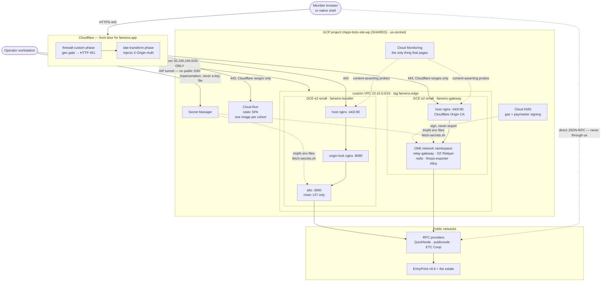

# 03 — Systems View

> **Altitude:** where it physically runs. Nodes, containers, network namespaces,
> the edge, the request paths, and the pipelines that put code there. Logical
> capability is [01](01-logical-view.md); component boundaries are
> [02](02-architecture-view.md); the port table is [04](04-connectors-and-ports.md).
>
> Diagram source: [`diagrams/systems-view.drawio`](diagrams/systems-view.drawio).

## Deployment topology

FairWins runs in **one shared GCP project** (`chippr-bots-site-wp`, us-central1)
that it co-tenants with unrelated Chippr workloads — a public WordPress VM plus
the `clearpath-*`, `fukuii-*` and `kings-edge-*` estates. That sharing is the
single most consequential infrastructure fact in this workbook: it is why every
IAM grant must be **additive** (`google_project_iam_member`, never `_iam_binding`
or `_iam_policy`, which are authoritative for a role *project-wide* and would
strip it from every other principal), and why that constraint is enforced twice —
once by `npm run check:iac` and once by denying the CI identity `projectIamAdmin`.

### Three facts the diagram encodes

**The SPA is built per cohort, not configured per environment.** Vite bakes
`VITE_NETWORK_ID` at build time, so a mainnet build and a testnet build are
different images — which is the mechanism behind the cohort-isolation invariant
(P9): a testnet build physically cannot hold a mainnet chain id.

**Every container on a node joins the owner's network namespace.** One
`fairwins-stack@<role>` systemd unit per node drives a docker-compose project in
which only the owner publishes ports, and only to loopback. This reproduces Cloud
Run's sidecar model verbatim, which is why four `localhost` couplings inside the
stack are correct as written and why a handler restarts the *whole unit*, never a
single container.

**Health probes assert on content, never on status.** Both services have a 200
that proves nothing: the bundler's origin-lock nginx serves its own 200 that never
reaches alto (the check that stayed green through the 2026-07-12 stall), and the
gateway returns `"status":"ok"` unconditionally. So probes assert `0x5FF137D4`
from a real JSON-RPC call and `"rpc":"up"` — a fact about the dependency, not the
listener.

## 1. Cloud estate

### 1.0 The project is SHARED

| Fact | Evidence |
|---|---|
| GCP project `chippr-bots-site-wp`, region `us-central1`, zone `us-central1-a` | `infra/terraform/environments/prod/terraform.tfvars:5-7` |
| Named neighbours in the same project: a public **WordPress VM** on the default network, plus `clearpath-*`, `fukuii-*`, `kings-edge-*` | `infra/terraform/environments/prod/main.tf:4-6`; `infra/terraform/README.md:53-54`; also `main.tf:137` (why BigQuery data access is dataset-scoped) |
| Deliberately NOT managed: WordPress VM, default VPC, `default-allow-*`, the three neighbour workloads, the decommissioned Cloud Run alto bundler, secret payloads/versions, KMS key **versions**, Cloud Run image tags/revisions, on-chain deployments | `infra/terraform/README.md:49-59` |
| IAM is additive-only (`*_iam_member`); `_binding`/`_policy` rejected by `check:iac` **and** the CI identity lacks project IAM admin | `infra/terraform/environments/prod/main.tf:7-8`; `infra/terraform/README.md:63-66`; `specs/087-infrastructure-as-code/contracts/guardrails.md:16-17` |

### 1.1 Modules consumed from `chippr-tf-modules`, and the pin

All six module blocks in prod, and all three in staging, pin the **same commit SHA**
`838c250b6dc8542fd0730b12ec7050462387bc53`:

| Module | Prod call site | Staging call site |
|---|---|---|
| `modules/network` | `prod/main.tf:38` | — |
| `modules/edge-node` ×2 (bundler, gateway) | `prod/main.tf:75`, `prod/main.tf:118` | — |
| `modules/cloud-run-service` | `prod/main.tf:235` (SPA), `:322` (MCP) | `staging/main.tf:25`, `:56`, `:107` |
| `modules/cloudflare-zone` | `prod/main.tf:405` | — |
| `modules/monitoring` | `prod/main.tf:438` | — |
| `modules/ops-workstation` | `prod/main.tf:527` | — |

- Pinning rule: commit SHA, never a branch or tag — `infra/terraform/modules/README.md:22-25`; enforced as **G-16** (`scripts/infra/check-iac-guardrails.js:450,469,480`; `guardrails.md:31`).
- Private repo ⇒ `terraform init` needs `TF_MODULES_TOKEN`; `GITHUB_TOKEN` 404s — `infra/terraform/modules/README.md:27-33`; `.github/workflows/infra-apply.yml:147-177`.
- `infra/terraform/modules/` is now a **pointer only** — `infra/terraform/modules/README.md:1-7`; `infra/terraform/README.md:13`.
- Provider constraints: `hashicorp/google ~> 7.44`, `google-beta ~> 7.44`, `cloudflare/cloudflare ~> 5.23`, `required_version ~> 1.15.0` — `prod/versions.tf:5-23`; CI pins Terraform `1.15.8` (`infra-apply.yml:29`).
- Cloudflare token comes from env, zone-scoped, the one long-lived credential (no OIDC at Cloudflare) — `prod/versions.tf:36-39`.

### 1.2 Resource types actually declared

Networking (module `network`, tf-modules:`modules/network/main.tf`):

| Resource | Detail | Evidence |
|---|---|---|
| `google_compute_network` `fairwins-infra` | custom subnets, `description` deliberately unset (FORCE-NEW) | tf-modules:`modules/network/main.tf:28-33`; `prod/main.tf:42,46-50` |
| `google_compute_subnetwork` `fairwins-infra-usc1` | `10.10.0.0/24`, `private_ip_google_access = true` | tf-modules:`modules/network/main.tf:35-44`; `prod/main.tf:43-44` |
| `google_compute_address` ×2 | `fairwins-bundler-ip`, `fairwins-gateway-ip`, `prevent_destroy` | tf-modules:`modules/network/main.tf:55-65`; `prod/main.tf:57` |
| `google_compute_firewall` `fairwins-allow-cloudflare` | tcp 80/443 from `data.cloudflare_ip_ranges` v4, target tag `fairwins-edge` | tf-modules:`…:69-83`; `prod/main.tf:22,59` |
| `…-allow-cloudflare-v6` | same, IPv6 ranges | tf-modules:`…:85-98`; `prod/main.tf:60` |
| `…-allow-uptime-probers` | tcp 443 from Google prober CIDRs (committed `prober-cidrs.json`), precondition fails on an empty list | tf-modules:`…:108-132`; `prod/main.tf:30-33,61` |
| `…-allow-iap-ssh` | tcp 22 from `35.235.240.0/20` **only** — also Ansible's sole route in | tf-modules:`…:134-156`, default `iap_forwarding_cidrs` at `modules/network/variables.tf:59-62` |

VMs (module `edge-node`, tf-modules:`modules/edge-node/main.tf`):

| VM | Role / interior | Machine | SA | Project roles | Per-secret access |
|---|---|---|---|---|---|
| `fairwins-bundler` | `role=bundler` (alto + origin-lock nginx) | `e2-small` default (`modules/edge-node/variables.tf:36-39`), Debian 12, 20 GB pd-standard, shielded VM on, tag `fairwins-edge` | created here: `fairwins-bundler@` | `run.viewer`, `logging.logWriter`, `monitoring.metricWriter` | `alto-executor-key-137`, `origin-lock-secret`, `QUICKNODE_POLYGON_API` |
| `fairwins-gateway` | `role=gateway` (gateway + engine + redis + finops + alloy) | same defaults | reuses `fairwins-relay-engine@…` (zero project roles beyond telemetry) | `logging.logWriter`, `monitoring.metricWriter`, `bigquery.jobUser` | `var.gateway_secret_ids` (13 entries) |

Evidence: `prod/main.tf:74-108` (bundler), `:117-146` (gateway); machine/boot/tag/shielded defaults `tf-modules:modules/edge-node/variables.tf:36-87`; instance body `tf-modules:modules/edge-node/main.tf:30-108` (startup script delivered via `metadata["startup-script"]`, with `ignore_changes` on it and on `ssh-keys`); IAM shapes `…:120-160`. `run.viewer` must be project-level for the single-alto gate — `prod/main.tf:96-100`.
`provision.sh` (the pre-Terraform creator, now reference) confirms the same shape: `FW_MACHINE=e2-small`, `--boot-disk-size=20GB --boot-disk-type=pd-standard`, `--tags=fairwins-edge` — `infra/vm/provision.sh:27,187-194`.

Cloud Run (module `cloud-run-service`; **shape only**, Cloud Build owns the image):

| Service | Env | Shape | Flag | Evidence |
|---|---|---|---|---|
| `prediction-dao-research` (SPA, prod) | prod | min 0 / max 20, 1 CPU, 512Mi, `cpu_idle`, **GEN1**, startup CPU boost on, public | `manage_spa = false` — adoption BLOCKED (live service defines `VITE_NETWORK_ID` twice, map cannot hold a duplicate key) | `prod/main.tf:232-266`; `prod/terraform.tfvars:261-266`; `prod/imports.tf:287` |
| `fairwins-mcp-server` | prod | min 0 / max 4, 1 CPU, 256Mi, public, `FAIRWINS_API_URL=https://relay.fairwins.app`, no secrets, no runtime SA | `manage_mcp_server = false` — **no pipeline publishes the image** | `prod/main.tf:268-350`; `prod/terraform.tfvars:11-17` |
| `prediction-dao-research-staging` | staging | min 0 / max `staging_max_instances` (3), 1 CPU, 512Mi, boost on, public | mainnet cohort (137) | `staging/main.tf:22-51`; `staging/terraform.tfvars:12,25` |
| `prediction-dao-research-staging-testnet` | staging | same | testnet cohort (Amoy 80002) | `staging/main.tf:53-78` |
| `fairwins-mcp-server-staging` | staging | min 0 / max 4, 256Mi, `FAIRWINS_API_URL=https://relay-staging.fairwins.app` | gated off | `staging/main.tf:104-129` |
| `fairwins-alto-bundler` | — | **must not exist** (G-11) | re-arming = two executors on one EOA | `prod/main.tf:226-230`; `guardrails.md:26` |

Module internals: `ignore_changes` covers `template[0].containers[0].image`, `template[0].revision`, `client`, `client_version`, `labels`, `template[0].labels` — tf-modules:`modules/cloud-run-service/main.tf:1-16,100-108`; public access is a separate `google_cloud_run_v2_service_iam_member` for `allUsers` (`…:118-126`); `google_cloud_run_domain_mapping` exists as a capability (`…:128-140`) but **no environment passes `domain_mappings`** (UNDETERMINED where the apex/`staging.*` hostnames map — see §3).

Other GCP resources:

| Resource | Detail | Evidence |
|---|---|---|
| `google_artifact_registry_repository` `cloud-run-source-deploy` | DOCKER, us-central1, `prevent_destroy` | `prod/main.tf:179-189`; `prod/terraform.tfvars:9` |
| `google_secret_manager_secret` ×~45 (containers only) | `for_each var.managed_secret_ids`, `prevent_destroy`, auto replication | `prod/main.tf:140-154`; list at `prod/terraform.tfvars:65-194` |
| `google_secret_manager_secret_iam_member` (Android upload key) | the 2 upload-key secrets → `fairwins-android-signing@` | `prod/main.tf:165-175` |
| `google_bigquery_dataset_iam_member` | dataset `billing_export` → gateway SA, `roles/bigquery.dataViewer`, optional via `count` | `prod/main.tf:125-132`; `prod/terraform.tfvars:198` |
| `google_kms_key_ring` + `google_kms_crypto_key` | ASYMMETRIC_SIGN, `prevent_destroy`; **key versions never managed** | `prod/main.tf:196-222` — but `kms_key_ring` is commented out (`prod/terraform.tfvars:281-282`) ⇒ **declared, not yet adopted** |
| Monitoring: `google_monitoring_notification_channel` (email), `google_monitoring_uptime_check_config` ×2, `google_monitoring_alert_policy` (uptime per check; VM; probe), `google_logging_metric` `probe_failures` | module `monitoring` | tf-modules:`modules/monitoring/main.tf:25,55,90,126,157,171` |
| Cloudflare: `cloudflare_dns_record`, `cloudflare_ruleset` ×2 | see §3 | tf-modules:`modules/cloudflare-zone/main.tf:20,39,76` |
| Ops workstation identity | `fairwins-ops@` + impersonation + per-secret + per-KMS-key + read-only project roles | tf-modules:`modules/ops-workstation/main.tf:34,57,76,93,113`; `prod/main.tf:527-546` |

Buckets / state / identities (bootstrap root, **local state, committed**, excluded from the apply workflow — `infra/terraform/README.md:11-12`):

| Resource | Detail | Evidence |
|---|---|---|
| `google_storage_bucket` `fairwins-tfstate-chippr-bots-site-wp` | uniform bucket-level access, `prevent_destroy` | `bootstrap/main.tf:39-64`; `bootstrap/terraform.tfvars:9` |
| `google_iam_workload_identity_pool` + `_provider` (GitHub OIDC) | | `bootstrap/main.tf:74-85` |
| SA `fairwins-tf-plan` (read-only) | `roles/viewer` + `storage.objectUser` on state; WIF bound to the **repository** | `bootstrap/main.tf:109-113,163-172,138-141` |
| SA `fairwins-tf-apply` | `compute.networkAdmin`, `compute.instanceAdmin.v1`, `run.admin`, `monitoring.editor`, `logging.configWriter` + 4 custom roles (SA manager, secret-container manager, BQ dataset access, project-IAM **reader**) + `storage.objectUser`, `artifactregistry.admin`, per-secret `secretmanager.admin`, enumerated `serviceAccountUser` actAs; WIF bound to **refs/heads/main only** | `bootstrap/main.tf:116-119,201-349`; role list at `bootstrap/main.tf:226-231` |
| SA `fairwins-android-signing` | WIF bound to main only; reads the 2 keystore secrets | `bootstrap/main.tf:130-133,155-158`; grant in `prod/main.tf:165-175` |
| `node_service_account_emails` (actAs allow-list) | `fairwins-bundler@`, `fairwins-relay-engine@` | `bootstrap/terraform.tfvars:43-46` |

Backends: one prefix per environment on the one bucket — `prod/backend.tf:3-8`, `staging/backend.tf:3-8`.
Adoption is by declarative `import` blocks that **stay** after adoption (audit record) — `prod/imports.tf:4-6` and ~30 blocks (secrets `:122-207`, monitoring `:336-342`, VPC/VM/AR/SPA/Cloudflare commented pending record of live ids).

Cloud Build triggers themselves are **not** Terraform-managed (no `google_cloudbuild_trigger` anywhere) — UNDETERMINED/out-of-band; substitutions are documented as "set on the Cloud Build trigger" (`cloudbuild.yaml:159-171`).

---

## 2. VM interiors

Layout, boot and unit wiring:

| Element | Detail | Evidence |
|---|---|---|
| Repo on the node | `git clone --depth 1` → `/opt/fairwins/repo`, reset to `origin/main` on every boot; `rsync` of `infra/vm/common/` and `infra/vm/<role>/` into `/opt/fairwins/` | `infra/vm/startup.sh:11-12,56-63` |
| Role file | `/etc/fairwins/role.env` (`FW_ROLE`, `FW_PROJECT`, `FW_REPO`) | `infra/vm/startup.sh:65-66` |
| Host packages | ca-certificates curl gnupg git nginx jq python3 rsync + docker + **google-cloud-ops-agent** | `infra/vm/startup.sh:23,34,37-38` |
| Host nginx | `infra/vm/nginx/fairwins-<role>.conf` → `/etc/nginx/sites-available/fairwins.conf`; refuses to start without the Cloudflare **Origin CA** cert at `/etc/ssl/fairwins/origin.{pem,key}` (manual step) | `infra/vm/startup.sh:71-98` |
| Units enabled | `fairwins-secrets@<role>.service`, `fairwins-stack@<role>.service`, `fairwins-probe@<role>.timer` | `infra/vm/startup.sh:108-110` |
| `fairwins-stack@` | oneshot: `gate.sh` → `preflight.sh` → `docker compose up -d --remove-orphans` → `poststart.sh`; `Requires=fairwins-secrets@%i` | `infra/vm/systemd/fairwins-stack@.service:5-27` |
| `fairwins-secrets@` | oneshot `fetch-secrets.sh %i`; `ExecStop` wipes `/run/fairwins/*.env` | `infra/vm/systemd/fairwins-secrets@.service:12-20` |
| `fairwins-probe@` timer | boot+90s, then every 60s | `infra/vm/systemd/fairwins-probe@.timer:7-10` |

### 2.1 Bundler node — containers in `fairwins-stack@bundler`

| Container | Image | Namespace | Ports | Limits |
|---|---|---|---|---|
| `fairwins-bundler-alto` | `…/cloud-run-source-deploy/alto:v1.2.7` | **owner** | `127.0.0.1:8080:8080`, `127.0.0.1:3000:3000` (loopback only) | 0.85 cpu / 896m |
| `fairwins-bundler-nginx` | `…/alto-bundler-nginx:latest` | `network_mode: service:alto` | none (namespace joiner) | 0.15 cpu / 128m |

Evidence: `infra/vm/bundler/docker-compose.yml:20-32,112-140`. Shared-namespace rule and "only the owner may declare ports" — `…:3-12`. `nginx` renders `ORIGIN_LOCK_SECRET` into `/etc/nginx/conf.d` on **tmpfs** (`…:129-133`).

alto config: `ALTO_ENTRYPOINTS=0x5FF137D4…2789` (EntryPoint v0.6), `ALTO_PORT=3000`, `ALTO_NETWORK_NAME=polygon`, `ALTO_DEPLOY_SIMULATIONS_CONTRACT=true` (must stay true on Polygon), gas multipliers `400,500,600`, `ALTO_LOG_LEVEL=info` — `…:37,74-78,86-93`. `ALTO_RPC_URL` is **deliberately absent** from `environment:` (compose `environment` overrides `env_file`) and arrives from Secret Manager — `…:38-45`.

**`FW_CHAIN_ID: "137"`** — ours, not alto's; the attribution key for the single-alto gate — `infra/vm/bundler/docker-compose.yml:76-82`.

### 2.2 Gateway node — containers in `fairwins-stack@gateway`

| Container | Image | Namespace | Ports | Limits |
|---|---|---|---|---|
| `fairwins-gateway-gateway` | `…/fairwins-relay-gateway:spec109-7110b663` | **owner** | `127.0.0.1:8788:8788`; internal `METRICS_PORT=9091` never published | 0.5 / 320m |
| `fairwins-gateway-engine` (OZ Relayer) | `…/fairwins-relay-engine:multichain-v1.5.0` | joiner | none | 0.35 / 320m |
| `fairwins-gateway-finops` | `…/fairwins-finops-exporter:spec107-1ac148bf` | joiner | none; binds `127.0.0.1:9464` | 0.2 / 192m |
| `fairwins-gateway-alloy` | `grafana/alloy:v1.10.2` | joiner | none; own UI pinned to `127.0.0.1:12345` | 0.15 / 192m |
| `fairwins-gateway-redis` | `redis:7-alpine` | joiner | none; `--save "" --appendonly no` (ephemeral) | 0.15 / 128m |

Evidence: `infra/vm/gateway/docker-compose.yml:27-48,241-246,286-292,362-371,395-401`; volume `alloy-data` (persisted WAL) `…:416-422`.
The four verbatim localhost couplings that the shared namespace makes correct: `ENGINE_URL=http://localhost:8080`, `REDIS_URL=redis://localhost:6379`, engine webhook `http://localhost:8788/v1/engine/webhook`, bundler nginx `upstream 127.0.0.1:3000` — `…:3-13`; webhook in `services/oz-relayer/deploy/production/config.json` (`notifications[0].url`).

Gateway chain + money config: `ENABLED_CHAIN_IDS "63,137"`, `ALLOWED_ORIGINS https://fairwins.app`, relayer ids `mordor-63`/`polygon-137`, gas wallets `0xf505…73aC` (63) / `0x3BB2…82db` (137), public failover `RPC_URLS_137` (publicnode + drpc), `PAYMASTER_ADDRESS_137 0xe145…d105`, `PM_SIGNER_KMS_KEY projects/chippr-bots-site-wp/locations/us-central1/keyRings/fairwins-relayer/cryptoKeys/paymaster-signer-polygon/cryptoKeyVersions/1` — `…:57-76`. Feature flags: `MEMBER_API_ENABLED`, `X402_ENABLED` (+`X402_PAY_TO 0xcf76…0447`), `BTC_ENABLED`, `IDENTITY_ENABLED` (observe), `RPC_ACCESS_ENABLED` (5 chains, endpoint 657013), `PERPS_ENABLED`, `NEWS_ENABLED`; `ASSISTANT_ENABLED` commented off — `…:82-224`. SIGHUP reload source `RELOAD_ENV_FILE=/run/fairwins/gateway.env`, mounted `:ro` — `…:49-55,170-175`.

### 2.3 Secret delivery — `infra/vm/common/fetch-secrets.sh`

| Invariant | Evidence |
|---|---|
| Refuses `set -x` (would print secrets to the journal) | `:60` |
| `/run/fairwins` must be **tmpfs**, 0700, umask 077, env files 0600 | `:67-72,118` |
| One env file **per container**; values single-quoted verbatim; a payload containing `'` aborts | `:90-115` |
| REQUIRED vs OPTIONAL, with the degradation named in the journal line | `:33-52,99-110` |
| gateway.env: `ORIGIN_AUTH_SECRET`, `WEBHOOK_SHARED_SECRET`, `ENGINE_API_KEY` (required); OpenSea/Polymarket/Anthropic/`RPC_URL_PRIMARY_137`/`RPC_ACCESS_SIGNING_KEY`/`RPC_ACCESS_ADMIN_KEY` (optional) | `:121-163` |
| engine.env: `API_KEY`, `WEBHOOK_SIGNING_KEY`, `GCP_PRIVATE_KEY` (all required) | `:165-168` |
| Refuses to boot if `PM_SIGNER_PRIVATE_KEY` is in gateway.env (it silently overrides the KMS key) | `:172-175` |
| finops.env / alloy.env separate; refuses to boot if **any** key material lands in finops.env | `:188-212` |
| bundler: nginx.env = `ORIGIN_LOCK_SECRET` only (fail-open by design); alto.env = `ALTO_EXECUTOR_PRIVATE_KEYS` + `ALTO_UTILITY_PRIVATE_KEY` + `ALTO_RPC_URL` (all required) | `:215-235` |

`preflight.sh` re-asserts the separation at every start: no `docker-compose.override.yml`, tmpfs, `GCP_PRIVATE_KEY` must not be in gateway.env, executor key must not be in nginx.env — `infra/vm/common/preflight.sh:13-38`.

### 2.4 The single-alto gate

| Property | Evidence |
|---|---|
| Runs as `ExecStartPre` (via `gate.sh`) **and** every 60 s from `probe.sh` | `infra/vm/common/gate.sh:8-9`; `infra/vm/bundler/single-alto-gate.sh:38-39` |
| Invariant is **per (chain, executor key)**, not per host | `single-alto-gate.sh:11-23` |
| Step 1 — Cloud Run `fairwins-alto-bundler` must be NOT_FOUND, or `minScale=0` **and** `ingress=internal`; anything unreadable **fails closed** | `…:59-138` |
| Step 1b (advisory) — live `instance_count` via Cloud Monitoring; unreadable ⇒ warns that the check did **not** run (missing `monitoring.viewer` let two altos overlap ~4 min) | `…:120-137` |
| Step 2 (advisory) — the `fairwins-infra` skill's `--min-instances` lever must be neutered | `…:146-152` |
| Step 3 — at most one alto **per chain** on this host; matched on image **repository** (`…/alto`), never a pinned tag; chain read from `FW_CHAIN_ID` via `docker inspect`; an unattributable alto is **refused**; declared set `FW_BUNDLER_CHAIN_IDS` default `137` | `…:154-220` |
| Three re-arming paths it exists against: Cloud Run cold start on any request, the skill's scale-up, and the deleted `cloudbuild.yaml` `services replace` step | `…:25-36`; `cloudbuild.yaml:124-140` |

Executor EOA per chain: chain 137 executor `0x7C6da19ae005D4F13BB8660Ac989c48aCcFE84F6` (`BUNDLER_EXECUTOR_137`, `infra/vm/gateway/docker-compose.yml:321`), key secret `alto-executor-key-137`. **Only chain 137 has an alto today** — there is no second bundler node or `FW_CHAIN_ID` anywhere else.

### 2.5 Ansible convergence

| Element | Evidence |
|---|---|
| Dynamic inventory `google.cloud.gcp_compute`, project `chippr-bots-site-wp`, zone `us-central1-a`, filter `labels.app = fairwins`, `keyed_groups` on `labels.role` | `infra/ansible/inventory/gcp.yml:11-30` |
| **No public SSH** — connection is `ProxyCommand="gcloud compute start-iap-tunnel %h 22 …"`; no `ansible_user` (connects as the operator gcloud injected a key for) | `infra/ansible/inventory/gcp.yml:7-10,34-60`; `ansible.cfg:23-26` |
| `site.yml`: hosts `bundler:gateway`, `serial: 1`, roles `common, docker, nginx, fairwins_secrets, fairwins_stack` | `infra/ansible/site.yml:9-19` |
| Per-role playbooks + separate `harden.yml` (sshd/kernel/patching, `serial: 1`) | `infra/ansible/playbooks/{bundler,gateway,harden}.yml` |
| Handlers restart the **whole** `fairwins-stack@<role>` unit, never a container | `roles/common/handlers/main.yml:2-10`; `roles/fairwins_stack/handlers/main.yml:9-19` |
| nginx handler validates with `nginx -t` before reload | `roles/nginx/handlers/main.yml:2-17` |
| Docker engine pinned `5:29.7.1-1~debian.12~bookworm`; never `--allow-downgrades` | `group_vars/all.yml:25-35` |
| Namespace owner declared per role (`alto` / `gateway`); secret env-file inventory per role | `group_vars/bundler.yml:3-13`; `group_vars/gateway.yml:3-18` |
| Prober allowlist rendered from one source into nginx, matching the firewall rule | `roles/nginx/templates/google-probers.conf.j2` |

---

## 3. Edge (Cloudflare)

| Item | Owner | Evidence |
|---|---|---|
| Zone `fairwins.app` (proxied/orange-cloud) | zone id passed as `var.cloudflare_zone_id`; **commented out in prod tfvars** | `prod/terraform.tfvars:274-275`; `infra/cloudflare/waf-geo.md:3`; the FinOps exporter separately carries `CLOUDFLARE_ZONE_ID=a548702815279eab4646275cde3be103` (`infra/vm/gateway/docker-compose.yml:344`) |
| DNS `bundler` A → `fairwins-bundler-ip`, proxied; `relay` A → `fairwins-gateway-ip`, proxied — wired from the `network` module's outputs so DNS cannot desync from the origin | module `cloudflare-zone` via `prod/main.tf:410-425`; proxied ⇒ forced TTL 1 (tf-modules:`modules/cloudflare-zone/main.tf:27`) |
| WAF geo gate — `cloudflare_ruleset`, kind `zone`, phase **`http_request_firewall_custom`**, allowlist expression `not (ip.src.country in {…})`, action `block` with custom response **451** + HTML body | tf-modules:`modules/cloudflare-zone/main.tf:39-64`; `geo_gate_response_code = 451` at `prod/main.tf:427-428`; rationale `infra/cloudflare/waf-geo.md:6-45` (deny set always includes CU/IR/KP/SY and currently US; occupied-region handling; fail-closed) |
| Origin lock — `cloudflare_ruleset`, phase **`http_request_late_transform`**, `rewrite` setting header `X-Origin-Auth` to the Secret Manager value | tf-modules:`modules/cloudflare-zone/main.tf:76-101`; header name + secret at `prod/main.tf:430-431`; secret read via the one accepted `data "google_secret_manager_secret_version"` exception (`prod/main.tf:354-401`) |
| Both rulesets are **authoritative for their phase** — an apply deletes any dashboard rule; geo gate is a legal control under CODEOWNERS | tf-modules:`modules/cloudflare-zone/main.tf:5-14`; `infra/cloudflare/README.md:3-12` |
| TLS: Cloudflare **Full (strict)** to origin; origin serves a **Cloudflare Origin CA** cert (not publicly trusted ⇒ uptime checks set `validate_ssl = false`) | `infra/vm/nginx/fairwins-gateway.conf:3,13-15`; `prod/main.tf:461-462,477` |
| Origin-lock enforcement points | bundler: inside the nginx sidecar (host nginx passes `X-Origin-Auth` through untouched) — `infra/vm/nginx/fairwins-bundler.conf:52-54`; SPA on Cloud Run: `frontend/nginx.conf.template:8-11,94-145` (403 on mismatch, `/healthz` exempt); gateway app: fail-open when the secret is absent (`fetch-secrets.sh:220-223`) |
| WAF rate limiting | **NOT declared anywhere** — no rate-limit ruleset in the module or either environment. UNDETERMINED / not managed. |
| `manage_edge = false` in prod | the edge is therefore still hand-managed at the dashboard today | `prod/terraform.tfvars:255-261` |
| Apex `fairwins.app` / `staging*.fairwins.app` → Cloud Run mapping | **UNDETERMINED**: no `cloudflare_dns_record` for the apex, and no environment passes `domain_mappings` to the Cloud Run module |

---

## 4. Network paths — hop by hop

### (a) A member loads the SPA

1. Browser → DNS for `fairwins.app` → Cloudflare edge (zone proxied) — `infra/cloudflare/waf-geo.md:3`.
2. Cloudflare `http_request_firewall_custom` phase: geo gate. Outside the allowed set ⇒ **451** with the custom HTML body, request never leaves the edge — tf-modules:`modules/cloudflare-zone/main.tf:39-63`; `frontend/public/451.html` per `infra/cloudflare/README.md:24-25`.
3. Cloudflare `http_request_late_transform`: injects `X-Origin-Auth: <origin-lock-secret>` — tf-modules:`modules/cloudflare-zone/main.tf:76-101`.
4. Cloudflare → origin over TLS (Full strict) → the Cloud Run service `prediction-dao-research` (`--allow-unauthenticated`, us-central1) — `cloudbuild.yaml:109-121`.
5. In-container nginx on `:8080`: `$origin_denied` map ⇒ **403** unless the header matches; `/healthz` exempt — `frontend/nginx.conf.template:8-11,41,50,94`.
6. nginx serves the static Vite bundle with the CSP header (`connect-src` includes `https://relay.fairwins.app`, `https://bundler.fairwins.app`, scheme-wide `https:` for member RPC; `script-src` has `blob:` for mini-apps and **no** `https:`) — `frontend/nginx.conf.template:153-206`.
7. Browser then talks to chains/subgraph/relay directly (baked `VITE_*`: `VITE_NETWORK_ID=137`, `VITE_RELAYER_URL=https://relay.fairwins.app`, `VITE_SUBGRAPH_URL=…/fairwins-polygon/v0.3.0`, `VITE_BUNDLER_URLS_POLYGON=https://bundler.fairwins.app`) — `cloudbuild.yaml:20-80`.

### (b) A member calls the relay-gateway

1. Browser → `https://relay.fairwins.app` → Cloudflare (proxied A record → `fairwins-gateway-ip`) — `prod/main.tf:418-423`.
2. Geo gate (451) then origin-lock header injection, same two phases as (a).
3. Cloudflare egress IP → GCP firewall `fairwins-allow-cloudflare(-v6)`, tcp 443, target tag `fairwins-edge` — tf-modules:`modules/network/main.tf:69-98`.
4. Host nginx on the gateway VM: `listen 443 ssl http2`, `server_name relay.fairwins.app`, Origin CA cert, `location /` → `proxy_pass http://127.0.0.1:8788` (300 s read timeout; sets `X-Real-IP`/`X-Forwarded-*`) — `infra/vm/nginx/fairwins-gateway.conf:10-14,35-44`. Port 80 exists only to 301 (`:47-51`).
5. → the `fairwins-gateway-gateway` container (namespace owner, loopback-published `8788`) — `infra/vm/gateway/docker-compose.yml:47-48`. The gateway itself verifies `ORIGIN_AUTH_SECRET` (fail-open if unset) and `ALLOWED_ORIGINS=https://fairwins.app`.
6. For a relayed intent: gateway → `ENGINE_URL=http://localhost:8080` (same namespace) → OZ Relayer engine, which signs with a **Google Cloud KMS** signer (`gas-key-mordor` / `gas-key-polygon`, key ring `fairwins-relayer`, credentials from `GCP_PRIVATE_KEY` in engine.env only) and broadcasts over its **own** public `rpc_urls` from `config.json` — `services/oz-relayer/deploy/production/config.json` (relayers/signers/networks); `infra/vm/gateway/docker-compose.yml:250-271`.
7. Confirmation returns engine → `http://localhost:8788/v1/engine/webhook` (HMAC by `WEBHOOK_SIGNING_KEY`) → gateway marks the intent landed — `config.json` notifications; `…docker-compose.yml:10-13`.
8. Gateway's own chain reads use `RPC_URL_PRIMARY_137` (keyed QuickNode, prepended) then the public `RPC_URLS_137` — `…docker-compose.yml:66-75`; `fetch-secrets.sh:147-152`. Redis at `redis://localhost:6379` is ephemeral (`…:395-408`).

### (c) A sponsored UserOp reaches the bundler and the chain

1. SPA builds the UserOp; asks for sponsorship at `https://relay.fairwins.app/v1/paymaster` (`VITE_SPONSOR_PAYMASTER_POLYGON`, `cloudbuild.yaml:80`) — hops 1-5 of (b).
2. Gateway paymaster module signs the ERC-7677 authorization with **Cloud KMS asymmetric sign** using `PM_SIGNER_KMS_KEY` (`…/keyRings/fairwins-relayer/cryptoKeys/paymaster-signer-polygon/cryptoKeyVersions/1`) — `services/relay-gateway/src/paymaster/sign.js:36-47`; `infra/vm/gateway/docker-compose.yml:77`. A raw `PM_SIGNER_PRIVATE_KEY` would silently override it, so boot refuses one (`fetch-secrets.sh:172-175`; `preflight.sh:27`). *KMS credential path for this container is ADC (the VM's attached SA) — the per-key IAM binding is NOT declared in Terraform (`kms_key_ring` is null): UNDETERMINED.*
3. SPA submits the signed UserOp to `https://bundler.fairwins.app` → Cloudflare (proxied A → `fairwins-bundler-ip`) → geo gate → `X-Origin-Auth` injection.
4. GCP firewall `fairwins-allow-cloudflare(-v6)` tcp 443 → host nginx on the bundler VM (`server_name bundler.fairwins.app`) → `location /` → `proxy_pass http://127.0.0.1:8080`, header passed through untouched — `infra/vm/nginx/fairwins-bundler.conf:10-11,46-56`.
5. `:8080` is the **origin-lock nginx sidecar** inside alto's namespace; it validates the header and proxies to `upstream 127.0.0.1:3000` in the same namespace — `infra/vm/bundler/docker-compose.yml:3-9,112-117`.
6. alto v1.2.7 simulates/bundles and sends to EntryPoint v0.6 `0x5FF137D4b0FDCD49DcA30c7CF57E578a026d2789` on Polygon 137, signing with the executor EOA `0x7C6d…84F6` from `alto-executor-key-137`, over its single `ALTO_RPC_URL` (keyed QuickNode Polygon; **no failover**) — `…docker-compose.yml:37,54-56,82`; `fetch-secrets.sh:228-235`.
7. The paymaster contract `0xe14554D14eB5DeC47f7824ebeeDa6C9f3A50d105` reimburses the bundler from the FairWins deposit — `…docker-compose.yml:76`.
8. Before any of this can run, `fairwins-stack@bundler` had to clear the single-alto gate (§2.4).

### (d) An admin SSHes to a node

1. Operator authenticates to Google as themselves (no SA key file) — `tf-modules:modules/ops-workstation/main.tf:34-40`; `prod/main.tf:530-534`; `prod/terraform.tfvars:288`.
2. `gcloud compute start-iap-tunnel <instance> 22` — the IAP TCP forwarding service terminates at Google and emerges from `35.235.240.0/20`.
3. GCP firewall `fairwins-allow-iap-ssh`: tcp 22 from that range only, target tag `fairwins-edge`. No other source range exists — tf-modules:`modules/network/main.tf:134-156`.
4. sshd on the node; the authorised key is the short-lived one gcloud injects into instance `ssh-keys` metadata for the calling operator's local username (Terraform ignores that key to avoid false drift) — tf-modules:`modules/edge-node/main.tf:96-108`; `infra/ansible/inventory/gcp.yml:37-50`.
5. Ansible uses the identical path as its `ProxyCommand`, so a playbook that cannot connect is a tunnel problem, never a firewall one — `infra/ansible/inventory/gcp.yml:55-60`; `ansible.cfg:23-26`.

### (e) The FinOps exporter being scraped

1. `fairwins-gateway-finops` binds `127.0.0.1:9464` (`FINOPS_BIND_HOST`, `PORT`) and declares **no** `ports:` — unreachable from off-VM; host nginx does not proxy it — `infra/vm/gateway/docker-compose.yml:278-297`.
2. `fairwins-gateway-alloy`, in the **same network namespace**, scrapes `localhost:9464` (job `finops-exporter`, 60 s) — `infra/grafana/alloy/config.alloy:24-32`.
3. Alloy relabels and `prometheus.remote_write`s to Grafana Cloud `https://prometheus-prod-66-prod-us-east-3.grafana.net/api/prom/push`, basic auth user `3500268`, token `GRAFANA_CLOUD_PROM_TOKEN` from `alloy.env` — `config.alloy:45-66`; `infra/vm/gateway/docker-compose.yml:371-386`; `fetch-secrets.sh:197-198`.
4. Its WAL persists in the named volume `alloy-data`, so samples survive a Grafana Cloud outage — `infra/vm/gateway/docker-compose.yml:416-422`.
5. The exporter's own inputs: `http://gateway:9091/counters` (compose-internal), chain reads (`RPC_URL_PRIMARY_137` + public failover), and BigQuery `billing_export` table prefix `gcp_billing_export_resource_v1_` via the gateway SA's `bigquery.jobUser` + the dataset-scoped `dataViewer` — `…docker-compose.yml:294-341`; `prod/main.tf:106-132`.
6. It is read-only by construction: no signer, no write route, and `fetch-secrets.sh` refuses to boot if key material reaches `finops.env` — `fetch-secrets.sh:205-212`.

---

## 5. CI/CD + release

### 5.1 Workflows (`.github/workflows/`)

| Workflow | Trigger | Gates / does |
|---|---|---|
| `ci-manager.yml` — CI Manager | every `pull_request` (+`ready_for_review`), push to `main`/`staging`, dispatch; concurrency supersedes | `dorny/paths-filter` computes `contracts/frontend/docs/security/core/services/packages/tenants/tooling/subgraph/specs/app/ops`, then `workflow_call`s `test.yml` and `security-testing.yml` — `:15-25,70-165` |
| `test.yml` — Test Pipeline | `workflow_call` only (+dispatch), input `run_e2e` | Jobs: Tenant Manifest Validation, Release Tooling Tests, Dependency Hygiene (`check:deps`, `check:native-versions`), **Spec Registry** (`check:specs`, `check:ci-gating`), FinOps Dashboard Coverage (`check:finops`), Smart Contract Tests (incl. `check:storage-layout` and the **bytecode byte gate** `bytecode-digest.js --compare`), **Mini-app Output Bytes** (`record-build-digests.js`), Frontend Lint, Relay Gateway / FinOps Exporter / MCP Server tests, Frontend Unit Tests, Frontend Build, **Cypress Fast E2E** (matrix `viewport:[desktop,phone] × shard:[0..5]` = 12 legs), **Cypress Full E2E** (`shard:[0..3]`, a private chain each), **Cypress Passkey Full Stack** (bundler+paymaster) — `:28-1210`, matrices `:733-735,965-966`, gates `:110,118,155,167,224,260,279,405` |
| `security-testing.yml` | `workflow_call` + weekly Mon 00:00 + dispatch (no push/PR, to avoid double runs) | Slither/Medusa-class analysis |
| `frontend-testing.yml` | PR touching `frontend/**`, push to `main`/`staging` | full frontend suite + a11y audits |
| `subgraph-build.yml` | PR/push on `subgraph/**`, `packages/abi/**` | subgraph build+tests |
| `container-build.yml` | PR/push on Dockerfiles, lockfile, `services/mcp-server/**`, `packages/**` | builds images incl. a local-only `fairwins-mcp-server:ci` boot smoke (never pushed) |
| `codeql.yml` | push `main`/`staging`, **all** PRs, weekly | code scanning |
| `e2e-matrix-trackers.yml` | PR/push on `matrix.json` + weekly Mon 06:00 | orphaned/absent tracker hygiene |
| `version-gate.yml` | PR opened/sync/reopened/**edited** | `classify.js` on the PR title; rejects hand-edited version numbers (with a backfill exemption); mini-app version/bytes pairing |
| `branch-policy.yml` | PRs + daily 06:00 + dispatch | PRs into `main` must come from `staging` or `hotfix/*` (or a `release/*-changelog` branch); promotions must **not** be squashed; `staging` must mirror production with differences enumerated and `networks.js` untouched; hotfix back-merge drift checked on a timer — `:41-140` |
| `staging-deploy.yml` — Staging Candidate | push to `staging` | tags `vX.Y.Z-rc.N` via `scripts/release/version.js --rc`; **does not deploy** (a Cloud Build trigger on the branch does) — `:1-95` |
| `release.yml` — Release | push to `main` (+dispatch) | `native-gate` → `android-artifact` (.aab) + `ios-artifact` (unsigned archive) + `native-smoke-android` (emulator) + `native-smoke-ios` (simulator) → **`Publish release`** (`needs` all four): computes the version, refuses to move/reuse a tag, pushes the tag, publishes the release with an artifact+native-digest table, opens the release-record PR — `:51-572`. `[skip release]` in the merge commit short-circuits (`:54,336`) |
| `native-build.yml` — Native Build | path-filtered PR + push to `staging` | Android and iOS shells must compile **before** main; both use the one composite `.github/actions/native-prepare` — `:23,55-97` |
| `infra-plan.yml` — Infra Plan | PR touching `infra/**`, `scripts/infra/**`, `.github/workflows/infra-*` | `check:iac` + guardrail self-test, `terraform fmt -check`, `validate` (bootstrap + each env; skipped with an explicit "no claim is made" note when the module repo is unreachable), `tflint`, ansible-lint + playbook syntax, then **plan per environment** as `fairwins-tf-plan@` → writes `plan-provenance.txt` with `infra_tree_digest` → uploads `tfplan-<env>` artifact → posts a **redacted** summary to the PR — `:32-456` |
| `infra-apply.yml` — Infra Apply | push to `main` touching `infra/terraform/**` | Finds the merged PR, finds its successful **Infra Plan** run, downloads `tfplan-<env>`, and **verifies `infra_tree_digest` == `git rev-parse HEAD:infra/terraform`** — mismatch fails rather than replanning; authenticates as `fairwins-tf-apply@` via WIF; rewrites git config with `TF_MODULES_TOKEN`; `terraform apply tfplan`. Matrix `[prod, staging]`, `max-parallel: 1`, `fail-fast: true`, `concurrency: infra-apply` (queue, never cancel), GitHub environment `production` — `:17-228` |
| `infra-drift.yml` — Infra Drift | daily 07:00 + dispatch | prober-allowlist freshness (`generate-prober-cidrs.js --check`), then `terraform plan -detailed-exitcode` per env; **reports, never corrects**; opens/updates a labelled `infrastructure,drift` issue with a redacted report — `:35-233` |
| `close-linked-issues.yml` | `pull_request: closed` | closes `Closes #N` on the **staging** merge (GitHub only honours keywords on `main`) |
| `deploy-docs.yml` | push `main` | MkDocs → GitHub Pages |
| `dependency-alerts.yml` | push `staging`/`main` + daily 07:00 | dependency advisories |
| `labels-sync.yml` | push on `.github/labels.json` | label sync |
| `release-drafter.yml` | push `main`, PRs | draft notes |
| `oracle-fork-tests.yml` | weekly Mon 04:00 + PR on oracle adapters | Amoy fork tests |
| `torture-test.yml` | weekly Mon 00:00 | long-running suite |
| `deploy-contracts.yml` | `workflow_dispatch` only | contract deploys |

**The E2E bypass**: `app` is a **negative** filter (`'**'` minus known-inert paths) — an unrecognised path matches `**` and *runs* the suite; inverting it to an allowlist would let changes merge green having tested nothing, which `npm run check:ci-gating` fails on — `ci-manager.yml:144-159`; `test.yml:705,937,1204`.

### 5.2 Cloud Build

| File | Builds | Deploys |
|---|---|---|
| `cloudbuild.yaml` | one image `…/prediction-dao-research/prediction-dao-research:$COMMIT_SHA` + `:latest`, with `VITE_TENANT_ID=fairwins`, `VITE_NETWORK_ID=137`, `VITE_APP_URL=https://fairwins.app`, `VITE_RELAYER_URL=https://relay.fairwins.app`, `VITE_BUNDLER_URLS_POLYGON=https://bundler.fairwins.app`, `VITE_SPONSOR_PAYMASTER_POLYGON=…/v1/paymaster`, subgraph `v0.3.0` — `:5-93` | `gcloud run deploy prediction-dao-research --region us-central1 --allow-unauthenticated` — `:109-121`. The alto-bundler `services replace` step is **deleted and must stay deleted** (`:124-140`); the 3-container relayer is managed out of band (`:142-147`). `timeout: 1200s`, substitutions `_APP_VERSION` + 4 `_RPC_URL_*` default empty (`:153-176`) |
| `cloudbuild.staging.yaml` | **two** images from one commit — `staging` (`VITE_NETWORK_ID=137`) and `staging-testnet` (`VITE_NETWORK_ID=80002`), hosts `staging.fairwins.app` / `staging-testnet.fairwins.app`, both `VITE_RELAYER_URL=https://relay-staging.fairwins.app` — `:27-133` | two separate `gcloud run deploy`s — `:145-170` |

Triggers themselves are not in the repo (UNDETERMINED, console-configured); `staging-deploy.yml:83-92` documents that a Cloud Build trigger on `staging` is what deploys.

### 5.3 Promotion flow

`feature branch → PR into staging` (spec-number reservation PRs included) → every merge into `staging` tags an **rc** (`staging-deploy.yml`) and a Cloud Build trigger deploys both staging services → **promotion PR `staging → main`, merged as a merge commit, never squashed** (`branch-policy.yml:76-82`) → push to `main` runs `release.yml` (native artifacts+smokes gate `Publish release`), `infra-apply.yml` (if `infra/terraform/**` moved), `cloudbuild.yaml`, `deploy-docs.yml` → release-record PR back into `main`, merged with GitHub's **default** message → mandatory back-merge `main → staging`. Hotfixes go `hotfix/* → main` and must be back-merged (`branch-policy.yml:83-92`).

---

## 6. Environments & cohorts

| Axis | Mainnet build | Testnet build | Local / e2e |
|---|---|---|---|
| Selector | `VITE_NETWORK_ID=137` | `VITE_NETWORK_ID=80002` | Hardhat `1337` |
| Cohort membership | `cohortChainIds()` = supported chains whose `isTestnet === false` | `isTestnet === true` | `1337` is `isTestnet: true` |
| Evidence | `frontend/src/config/networks.js:59-60` (`MAINNET_CHAIN_ID=137`, `TESTNET_CHAIN_ID=80002`), `:1174-1187`, `:1209-1213`; `cloudbuild.yaml:25`; `cloudbuild.staging.yaml:53,121` | | `networks.js:1035-1038` |

Chains in `NETWORKS` (`frontend/src/config/networks.js`):

| Chain | id | Cohort | Line |
|---|---|---|---|
| Ethereum | 1 | mainnet | `:824` |
| Optimism | 10 | mainnet | `:776` |
| Ethereum Classic | 61 | mainnet | `:468` |
| Polygon | 137 | mainnet | `:566` |
| Base | 8453 | mainnet | `:719` |
| Arbitrum One | 42161 | mainnet | `:669` |
| Polygon Amoy | 80002 | testnet | `:253` |
| ETC Mordor | 63 | testnet | `:374` |
| Sepolia | 11155111 | testnet | `:906` |
| Hoodi | 560048 | testnet | `:983` |
| Hardhat | 1337 | testnet (local-only) | `:1035` |

Reference chains derived, never re-literalled: `membershipChainId()` `:1107`; `miniAppChainId()` with `MINIAPP_TESTNET_CHAIN_ID = 63` `:1127,1166`; `assertReferenceChainInCohort()` runs at module load and throws `:1192-1207`.
The staging **two-service** split exists because Vite folds the cohort in at build time — `staging/main.tf:3-19`; `cloudbuild.staging.yaml:5-16`.
Gateway/exporter cohort on the VM: `ENABLED_CHAIN_IDS "63,137"`, `FINOPS_COHORT_CHAIN_IDS "63,137"`, `FINOPS_COHORT=mainnet` — `infra/vm/gateway/docker-compose.yml:58,300,378`.

Tenants: `tenants/{fairwins,example}` + `features.json` + `manifest.schema.json`; selection is build-time `VITE_TENANT_ID` (`cloudbuild.yaml:16`, `cloudbuild.staging.yaml:37,111` — both `fairwins`); manifest keys `schemaVersion,id,lifecycle,identity,brand,settings,contractSet,native`; `contractSet` is empty for the default tenant. Only one tenant is built by any committed pipeline — **no second tenant origin/service exists today**.

Native channels: `tenants/fairwins/manifest.json` `native` block = iOS appId `app.fairwins.member`, Android appId `app.fairwins.member`, displayName `FairWins`, `iconSource icons/native/`. Shells compile on PR/`staging` (`native-build.yml`) and produce artifacts only in `release.yml` (Android `.aab`, signed only when `vars.ANDROID_SIGNING_SERVICE_ACCOUNT` is set via the `fairwins-android-signing@` SA reading the two keystore secrets; iOS **unsigned archive**) — `release.yml:80-205`; `prod/main.tf:156-175`; `prod/terraform.tfvars:146-156`.

---

## 7. Observability & ops

### 7.1 What actually pages — Cloud Monitoring

| Object | Detail | Evidence |
|---|---|---|
| Notification channel | email `cody.w.burns@gmail.com` (imported, id `2280034247916649810`) | `prod/terraform.tfvars:200`; `prod/imports.tf:336-338` |
| Uptime check `fairwins-bundler-origin` | GET the **origin IP** at `/__probe/health`, `content_match "0x5FF137D4"`, 30 s timeout, `validate_ssl=false` | `prod/main.tf:444-467` |
| Uptime check `fairwins-gateway-origin` | same shape, `content_match "\"rpc\":\"up\""` — must **not** match `"status":"ok"` | `prod/main.tf:468-479` |
| Per-check uptime alert policies | `REDUCE_COUNT_FALSE` over the check_passed metric | tf-modules:`modules/monitoring/main.tf:90-119` |
| VM policies (CPU/memory/disk/instance-down/agent-absent) + the probe policy | **NOT adopted** — the module emits `conditionThreshold` where the live ones use `conditionAbsent`, and thresholds differ; `vm_alert_policies = {}` and `probe_metric_enabled = false`, so they stay live and unmanaged | `prod/main.tf:481-505`; `prod/terraform.tfvars:202-253` |
| Log-based metric `fairwins_probe_failures` + its alert | declared in the module but disabled in prod today | tf-modules:`modules/monitoring/main.tf:157-190`; `prod/main.tf:504-505` |

### 7.2 The content-assertion probe rule

A status code that can be right while the service is broken is not a probe:

- The origin-lock nginx's own `/healthz` is a static `return 200` that never touches alto — the check that stayed green through the 2026-07-12 outage — so `/__probe/health` on the bundler **rewrites the prober's GET into a JSON-RPC POST** (`eth_supportedEntryPoints`) straight at alto on `127.0.0.1:3000`, bypassing the sidecar, and the uptime check matches `0x5FF137D4` in the body — `infra/vm/nginx/fairwins-bundler.conf:18-44`; `prod/main.tf:452-462`.
- The gateway returns `{"status":"ok"}` unconditionally, so its probe proxies `/status` and the check matches the per-chain `"rpc":"up"` — `infra/vm/nginx/fairwins-gateway.conf:20-33`; `prod/main.tf:473-476`.
- Both `/__probe/health` locations are allowlisted to the Google prober CIDRs in **nginx and the firewall**, from one generated file — `infra/vm/nginx/*.conf:24,28`; `infra/ansible/roles/nginx/templates/google-probers.conf.j2`; tf-modules:`modules/network/main.tf:100-132`.
- Container healthchecks assert content too (alto's JSON-RPC grep, finops' `"status":"ok"` on `:9464/healthz`) — `infra/vm/bundler/docker-compose.yml:97-105`; `infra/vm/gateway/docker-compose.yml:348-356`.
- `probe.sh` covers what a string matcher cannot: numeric gas-wallet runway, a crash-looping engine, and a re-armed Cloud Run bundler; it emits `fairwins-probe FAIL` lines to journald → Ops Agent → Cloud Logging → the log metric; the origin-lock header is passed via a **curl config file on stdin**, never argv — `infra/vm/common/probe.sh:3-15,23-78`.

### 7.3 Local viewing surface — **MISSING ON DISK**

`CLAUDE.md:1172-1178`, `docs/runbooks/workstation-operations.md:73-74` and `docs/developer-guide/workstation-secrets.md:165` all reference **`infra/observability/`** (a loopback-bound local Prometheus/Grafana, read-only, explicitly *not* the paging system, spec 097 FR-018…FR-023). **The directory does not exist in this checkout** (`ls infra/` returns only `ansible cloudflare grafana terraform vm`). Spec 097's US3 requirements are present (`specs/097-workstation-secrets-observability/spec.md:77-85`) and the workstation identity's read-only `monitoring.viewer`/`logging.viewer` grant that it would use *is* declared (`prod/main.tf:536-543`). **FLAG: specified and referenced, not implemented here.** Likewise spec 097 FR-017 names an Ansible role converging a workstation — `infra/ansible/roles/` has only `common, docker, nginx, fairwins_secrets, fairwins_stack, hardening`.

What does exist locally under observability-adjacent paths: `infra/grafana/` — `alloy/config.alloy` (scrape + remote_write), four generated dashboards (`finops-{overview,revenue,cost,usage}.json`) and `alerts/finops-alerts.json`. These are **generated and committed** (regenerate-and-diff gated) and must never be hand-edited.

### 7.4 Runbooks (`docs/runbooks/`, 33 files)

`README.md`, `admin-role-handoff.md`, `batch-operations.md`, `bitcoin-operations.md`, `bridge-liquidity-operations.md`, `callsigns-operations.md`, `contract-upgrades.md`, `credential-rotation.md`, `fee-operations.md`, `finops-operations.md`, `hardware-wallet-staging-validation.md`, **`infrastructure-operations.md`**, `key-compromise-recovery.md`, `keyed-rpc-access.md`, `member-api-operations.md`, `miniapp-registry-operations.md`, `multichain-vault-staging-validation.md`, `native-release-operations.md`, `operations-control-plane.md`, `operator-onboarding.md`, `passkey-account-recovery.md`, `paymaster-operations.md`, `perps-operations.md`, `protect-policy-operations.md`, `relayer-mordor-deploy.md`, `relayer-operations.md`, `release-and-promotion.md`, `safe-proposal-hub-deploy.md`, `staking-operations.md`, `tenant-operations.md`, **`vm-migration.md`**, **`workstation-operations.md`**, `zk-wager-pools-deploy.md`.

---

---

Items the sweep could not settle, and drift between docs and deployed reality,
are collected in [Annex 09](09-findings-and-drift.md).
