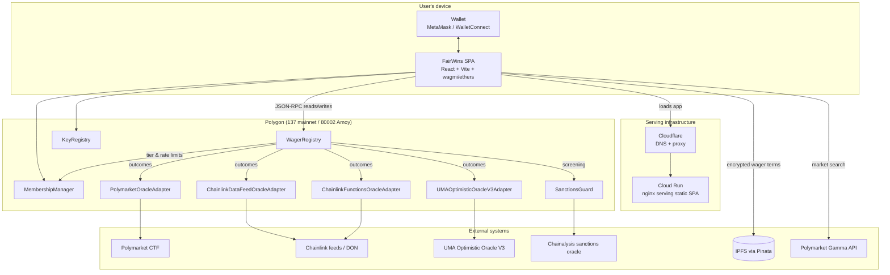
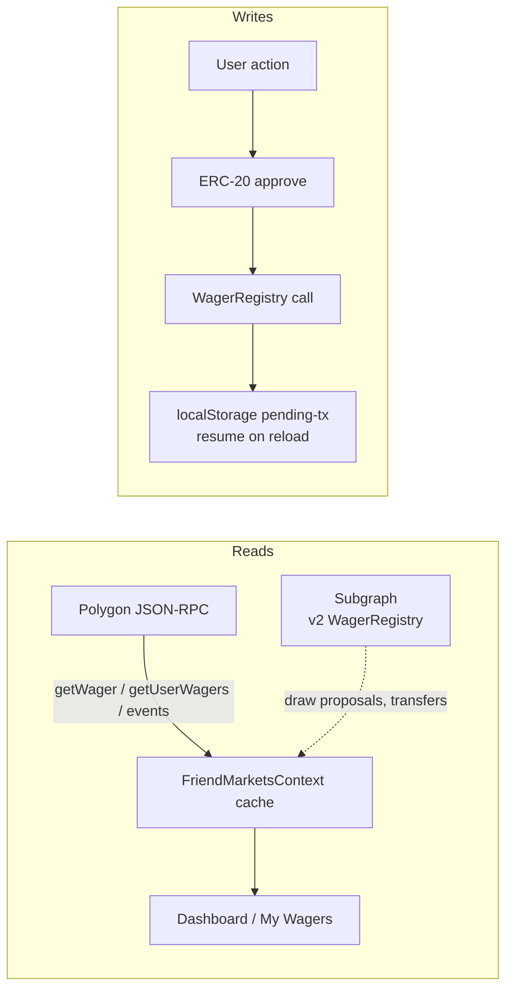
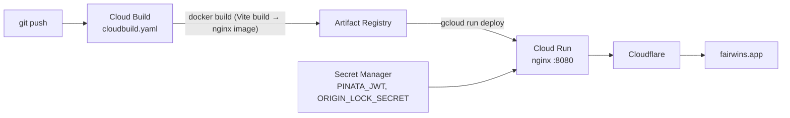

# Architecture Overview

FairWins is three deployable pieces — Solidity contracts, a React SPA, and
static-serving infrastructure — with **no application backend**. Everything
"server-side" happens on-chain, on IPFS, or at the CDN edge.

## System context



## Contract layer

The active contracts live under `contracts/` (everything in
`contracts-archive/` is reference-only — never import or deploy it).

| Contract | Directory | Responsibility |
|----------|-----------|----------------|
| `WagerRegistry` | `contracts/wagers/` | Wager lifecycle + stake escrow: create, accept, resolve, draw, claim, refund — including **open challenges** (code-gated, no named opponent). **UUPS proxy** (spec 025) |
| `MembershipManager` | `contracts/access/` | Tiered, time-bound memberships (USDC); monthly & concurrent creation limits; **voucher redemption**. **UUPS proxy** (spec 027) |
| `MembershipVoucher` | `contracts/access/` | Transferable ERC-721 bearer claim on a membership — bought with USDC, redeemed (burned) for a soulbound membership (spec 026). **Immutable** by design |
| `SanctionsGuard` | `contracts/access/` | Non-bypassable screening against the Chainalysis oracle + operator deny list |
| `KeyRegistry` | `contracts/privacy/` | Public encryption keys for end-to-end encrypted wager terms |
| `PolymarketOracleAdapter` | `contracts/oracles/` | Reads outcomes from Polymarket's Conditional Token Framework |
| `ChainlinkDataFeedOracleAdapter` | `contracts/oracles/` | Resolves price-threshold conditions against Chainlink feeds |
| `ChainlinkFunctionsOracleAdapter` | `contracts/oracles/` | Resolves custom off-chain computations via Chainlink Functions |
| `UMAOptimisticOracleV3Adapter` | `contracts/oracles/` | Resolves assertions via UMA Optimistic Oracle V3 |

All four oracle adapters implement the same `IOracleAdapter` interface
(`isConditionResolved`, `getOutcome`, condition metadata), so `WagerRegistry`
resolves any oracle-typed wager through a uniform `autoResolveFromOracle` /
`autoResolveFromPolymarket` path. See [Smart Contracts](smart-contracts.md)
for per-contract detail and the lifecycle state machine.

The two value-bearing core contracts are **UUPS upgradeable proxies**: their
logic is swapped in place (state and addresses preserved) so features ship
without stranding wagers or memberships. New upgradeable contracts inherit
`contracts/upgradeable/UUPSManaged.sol`; storage stays append-only behind a
`__gap` and `npm run check:storage-layout` gates every upgrade. See
[Upgradeable Contracts](upgradeable-contracts.md) and
[ADR-004](../adr/004-upgradeable-registry-uups.md). `MembershipVoucher` is the
deliberate exception — a tradable bearer asset is kept immutable.

## Frontend layer

`frontend/` is a Vite-built React SPA. Key structural pieces:

| Piece | Path | Role |
|-------|------|------|
| Routing | `src/App.jsx` | `/` landing, `/app` dashboard, `/wallet` account center, `/friend-market/accept` QR/deep-link acceptance, `/admin` role-gated panel, `/terms` `/risk` `/privacy` legal pages |
| Wallet state | `src/hooks/useWalletManagement.js`, wagmi config | Connection, roles, network switching (137 ↔ 80002) |
| Wager creation | `src/hooks/useFriendMarketCreation.js`, `components/fairwins/FriendMarketsModal.jsx` | Membership check → USDC approval → `createWager` → encrypted IPFS upload |
| Wager data | `src/contexts/FriendMarketsContext.jsx`, `src/data/wagers/` | Per-chain cache; reads via direct RPC (`EventsSource`) with optional subgraph source |
| Encryption | `src/hooks/useEncryption.js` | Wallet-signature-derived keys; envelope encryption of terms; `KeyRegistry` lookups |
| Constants | `src/constants/wagerDefaults.js` | Canonical resolution-type enum, status names, stake/deadline defaults |
| Addresses | `src/config/contracts.js` | Per-chain contract addresses — **generated**, do not hand-edit |

### Data flow



- **Reads** go straight to the chain with ethers.js (`getWager`,
  `getUserWagers`, event scans) for the wager lists. The Graph subgraph under
  `subgraph/` now indexes the **v2 `WagerRegistry`** (spec 017, including a
  per-transfer record) and sources specific features such as draw proposals;
  the wager grid still reads direct-from-chain, so a subgraph outage degrades
  gracefully. The legacy v1 `FriendGroupMarketFactory` is no longer indexed.
- **Writes** are wallet transactions. In-flight transactions are tracked in
  localStorage so a page reload can resume a half-finished creation flow.
- **Encrypted terms** never touch a server: the SPA encrypts client-side,
  pins to IPFS via Pinata, and stores the CID in the wager's `metadataUri`.

### Contract address sync

Deployment records in `deployments/<network>-chain<id>-v2.json` are the source
of truth. After a deploy, regenerate the frontend config:

```bash
npm run sync:frontend-contracts -- --network polygon --chainId 137
```

This rewrites the per-chain blocks in `frontend/src/config/contracts.js`.

## Serving infrastructure



- **Build**: multi-stage Dockerfile — Node builds the Vite bundle, nginx
  serves it. Public configuration (`VITE_NETWORK_ID`, `VITE_RPC_URL`,
  `VITE_IPFS_GATEWAY`, WalletConnect project ID) is baked in as build args;
  secrets are injected at runtime from Secret Manager, never into the bundle.
- **nginx** (`frontend/nginx.conf`): SPA fallback routing, immutable caching
  for hashed assets, no-cache HTML, and security headers — CSP allowing only
  the required origins (WalletConnect relay, IPFS gateways, Polymarket Gamma
  API, Cloudflare Insights), HSTS, and a Permissions-Policy that scopes the
  camera to `self` for the in-app QR scanner.
- **Cloudflare** fronts Cloud Run; an origin-lock secret ensures traffic
  reaches Cloud Run only via Cloudflare.

This footprint is intentionally fixed: SPA + nginx on Cloud Run, contracts,
IPFS, Cloudflare, and Cloud Logging. New features must not introduce an
application backend.

## Networks and deployments

| Network | Chain ID | Purpose | Contract set | Record |
|---------|----------|---------|--------------|--------|
| Polygon mainnet | 137 | Production | **Pre-UUPS** (plain contracts, no voucher; migration pending) | `deployments/polygon-chain137-v2.json` |
| Polygon Amoy | 80002 | Testnet | Feature-complete (UUPS + voucher + open challenges) | `deployments/amoy-chain80002-v2.json` |
| Hardhat | 1337 | Local development | Feature-complete | generated locally |
| Mordor (ETC) | 63 | Testnet (Ethereum Classic, core-only) | Feature-complete, no oracle adapters | `deployments/mordor-chain63-v2.json` |

The original v2 set deployed deterministically via the Safe Singleton Factory
with a versioned salt prefix (`FairWins-P2P-v2.0-`) — see
[Singleton Deployment Patterns](singleton-deployment-patterns.md). The
upgradeable contracts now live behind proxies; logic changes ship as in-place
upgrades. The testnets (Amoy, Mordor) are feature-complete; Polygon mainnet
still runs the pre-UUPS set pending the upgradeable migration.

### Mordor (Ethereum Classic testnet)

Mordor runs a **core-only** v2 deployment (Spec 015): `WagerRegistry`,
`MembershipManager`, `KeyRegistry`, and an enforced `SanctionsGuard`. Ethereum
Classic has no Polymarket, Chainlink, or UMA infrastructure, so the oracle
adapters are **not** deployed and `WagerRegistry` runs with a zero Polymarket
adapter — only peer/designated-resolver wagers (Either/Creator/Opponent/
ThirdParty) are offered. Stakes use **Classic USD (USC)**, the network's real
fiat-backed stablecoin (no mock); swaps go through **ETCswap** when configured.
Native gas is test ETC (faucet); the explorer is
[Blockscout](https://etc-mordor.blockscout.com). The legacy v1 Mordor deployment
is **retired** — its addresses live only in version-control history. The Network
tab (My Account → Network) surfaces Mordor with capability tags derived from the
deployment record and operational links (explorer, faucet, Classic USD, ETCswap).

## Security architecture

- **Checks-effects-interactions** throughout; payouts are pull-based.
- **Role separation**: `DEFAULT_ADMIN_ROLE` (config), `GUARDIAN_ROLE`
  (pause), `ACCOUNT_MODERATOR_ROLE` (freeze accounts), `ROLE_MANAGER_ROLE`
  (memberships), `UPGRADER_ROLE` (authorizes UUPS upgrades). No role can move
  escrowed stakes.
- **Sanctions screening** on every create/accept via `SanctionsGuard`.
- **CI security gates**: Slither, Medusa fuzzing, and the full Hardhat suite
  must pass — see [Security Testing](../security/index.md).

## Historical note

Earlier iterations of this repository (futarchy governance, conditional-token
markets, friend-group market factories, perpetual futures) are preserved under
`contracts-archive/` and `docs/archived/` for reference. They are not deployed,
not maintained, and must never be imported by active code.
