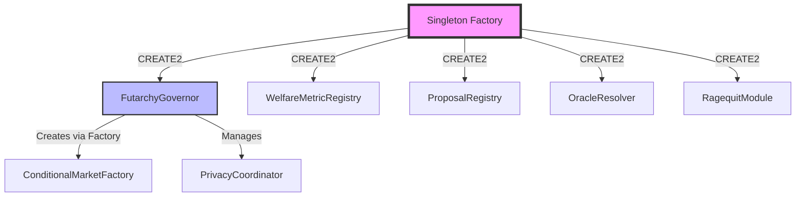

# Singleton Contract Deployment Patterns for Deterministic Cross-Chain Deployments

## Overview

This document provides research findings and recommendations for deploying singleton smart contracts with deterministic addresses across multiple blockchains. Deterministic deployment ensures that critical infrastructure contracts have the same address on different chains, simplifying integration and improving user experience.

## Why Deterministic Addresses Matter

### Benefits

1. **Simplified Integration**: dApps and protocols can hardcode contract addresses that work across all supported chains
2. **User Trust**: Users can verify they're interacting with the same contract system on any chain
3. **Reduced Complexity**: No need to maintain chain-specific configuration mappings
4. **Cross-Chain Composability**: Enables seamless multi-chain protocols and messaging
5. **Reduced Deployment Errors**: Automated deployment with deterministic addresses reduces human error

### Use Cases for Prediction DAO

- **Core Governance Contracts**: FutarchyGovernor, WelfareMetricRegistry deployed at same address
- **Registry Contracts**: ProposalRegistry, OracleResolver consistency across chains
- **Factory Contracts**: ConditionalMarketFactory, PrivacyCoordinator with uniform addresses
- **Shared Infrastructure**: Cross-chain oracles, bridges, and registries

## Methods for Deterministic Deployment

### 1. CREATE2 Opcode

#### Overview

CREATE2 (EIP-1014) allows contracts to be deployed at deterministic addresses computed from:
- Deployer address
- Salt (arbitrary 32-byte value)
- Contract bytecode (initialization code)

**Address Formula:**
```solidity
address = keccak256(0xff ++ deployerAddress ++ salt ++ keccak256(bytecode))[12:]
```

#### Implementation

```solidity
// Simple CREATE2 deployer
contract Create2Deployer {
    event Deployed(address addr, bytes32 salt);

    function deploy(bytes memory bytecode, bytes32 salt) public returns (address) {
        address addr;
        assembly {
            addr := create2(0, add(bytecode, 0x20), mload(bytecode), salt)
            if iszero(extcodesize(addr)) {
                revert(0, 0)
            }
        }
        emit Deployed(addr, salt);
        return addr;
    }

    function computeAddress(bytes memory bytecode, bytes32 salt) public view returns (address) {
        bytes32 hash = keccak256(
            abi.encodePacked(
                bytes1(0xff),
                address(this),
                salt,
                keccak256(bytecode)
            )
        );
        return address(uint160(uint256(hash)));
    }
}
```

#### Pros

✅ Native EVM support (available on all EVM-compatible chains post-Constantinople)  
✅ Relatively simple to implement  
✅ Gas efficient  
✅ No external dependencies  
✅ Can include constructor arguments in bytecode  

#### Cons

❌ Deployer address must be the same across chains  
❌ Bytecode must be identical (including metadata hash)  
❌ Constructor arguments affect bytecode, complicating determinism  
❌ Requires careful management of salts  
❌ Chain-specific EVM differences can cause issues  

### 2. Nick's Method / Single-Use Factory

#### Overview

Nick's Method (also known as the "Keyless Deployment" method) uses a one-time-use deployer contract deployed at a deterministic address via a signed transaction with specific parameters.

**Key Components:**
- Pre-funded deployer address (keyless, derived from specific signature)
- Deployment transaction with fixed gas price and nonce
- Same deployer address on all chains

#### Implementation Steps

1. **Create raw transaction with specific parameters:**
   - Nonce: 0
   - Gas Price: Fixed (e.g., 100 Gwei)
   - Gas Limit: Sufficient for deployment
   - To: null (contract creation)
   - Value: 0
   - Data: Deployer contract bytecode
   - v, r, s: Specific signature values

2. **Fund the deployer address** (same on all chains)

3. **Broadcast the signed transaction** on each chain

4. **Use the deployed factory** for subsequent deployments

#### Notable Example: Singleton Factory

```solidity
// Address: 0xce0042B868300000d44A59004Da54A005ffdcf9f (on many chains)
interface ISingletonFactory {
    function deploy(bytes memory initCode, bytes32 salt) external returns (address payable);
}

// Usage
bytes memory bytecode = abi.encodePacked(
    type(MyContract).creationCode,
    abi.encode(constructorArg1, constructorArg2)
);
bytes32 salt = keccak256("MyContract.v1");
address deployed = singletonFactory.deploy(bytecode, salt);
```

**Deployed at:** 0xce0042B868300000d44A59004Da54A005ffdcf9f on multiple chains

#### Pros

✅ Factory has same address across all chains  
✅ Widely adopted standard (Gnosis Safe, ERC-4337)  
✅ Simple to use once factory is deployed  
✅ No need to manage deployer keys  
✅ Community-maintained and audited  

#### Cons

❌ Initial setup requires funding deployer on new chains  
❌ Factory must be deployed on new chains manually  
❌ Dependent on community maintaining the standard  
❌ Fixed gas price can be problematic on high-cost chains  

### 3. Proxy + CREATE2 Pattern

#### Overview

Combine CREATE2 with proxy patterns (UUPS, Transparent, Beacon) to achieve both deterministic addresses and upgradability.

#### Implementation

```solidity
// Factory deploys minimal proxies with CREATE2
contract ProxyFactory {
    address public immutable implementation;
    
    event ProxyDeployed(address proxy, bytes32 salt);

    constructor(address _implementation) {
        implementation = _implementation;
    }

    function deployProxy(bytes32 salt, bytes memory data) 
        external 
        returns (address proxy) 
    {
        // EIP-1167 minimal proxy bytecode
        bytes memory bytecode = abi.encodePacked(
            hex"3d602d80600a3d3981f3363d3d373d3d3d363d73",
            implementation,
            hex"5af43d82803e903d91602b57fd5bf3"
        );

        assembly {
            proxy := create2(0, add(bytecode, 0x20), mload(bytecode), salt)
            if iszero(extcodesize(proxy)) {
                revert(0, 0)
            }
        }

        if (data.length > 0) {
            (bool success,) = proxy.call(data);
            require(success, "Initialization failed");
        }

        emit ProxyDeployed(proxy, salt);
    }

    function computeAddress(bytes32 salt) public view returns (address) {
        bytes memory bytecode = abi.encodePacked(
            hex"3d602d80600a3d3981f3363d3d373d3d3d363d73",
            implementation,
            hex"5af43d82803e903d91602b57fd5bf3"
        );
        
        bytes32 hash = keccak256(
            abi.encodePacked(
                bytes1(0xff),
                address(this),
                salt,
                keccak256(bytecode)
            )
        );
        return address(uint160(uint256(hash)));
    }
}
```

#### Pros

✅ Combines deterministic deployment with upgradability  
✅ Gas efficient for multiple deployments (minimal proxy)  
✅ Single implementation can serve many proxies  
✅ Well-established patterns (EIP-1167, EIP-1822, EIP-1967)  

#### Cons

❌ More complex than direct deployment  
❌ Additional gas cost for proxy delegation  
❌ Upgradability introduces security considerations  
❌ Implementation address must also be deterministic  

### 4. Immutable Create2 Factory

#### Overview

A specialized factory contract that uses CREATE2 but prevents redeployment at the same address, ensuring immutability.

#### Implementation

```solidity
contract ImmutableCreate2Factory {
    mapping(address => bool) public deployed;

    event Deployed(address indexed addr, bytes32 indexed salt);

    function safeCreate2(bytes memory initCode, bytes32 salt) 
        public 
        payable 
        returns (address deployedAddress) 
    {
        // Compute target address
        deployedAddress = computeAddress(initCode, salt);
        
        // Prevent redeployment
        require(!deployed[deployedAddress], "Already deployed");
        
        // Deploy with CREATE2
        assembly {
            deployedAddress := create2(
                callvalue(),
                add(initCode, 0x20),
                mload(initCode),
                salt
            )
        }
        
        require(deployedAddress != address(0), "Deployment failed");
        deployed[deployedAddress] = true;
        
        emit Deployed(deployedAddress, salt);
    }

    function computeAddress(bytes memory initCode, bytes32 salt) 
        public 
        view 
        returns (address) 
    {
        bytes32 hash = keccak256(
            abi.encodePacked(
                bytes1(0xff),
                address(this),
                salt,
                keccak256(initCode)
            )
        );
        return address(uint160(uint256(hash)));
    }

    function hasBeenDeployed(address addr) external view returns (bool) {
        return deployed[addr];
    }
}
```

#### Pros

✅ Prevents accidental redeployment  
✅ Clean audit trail of deployments  
✅ Can include payment forwarding for deployment costs  
✅ Explicit immutability guarantees  

#### Cons

❌ Requires deploying and maintaining factory  
❌ Factory state differs across chains  
❌ Additional complexity vs. simple CREATE2  

## Real-World Examples

### 1. Gnosis Safe

**Deployment Strategy**: Proxy + CREATE2 via Singleton Factory

**Implementation:**
- Master copy (implementation) deployed via CREATE2
- Each Safe is a proxy deployed with CREATE2
- Deterministic addresses across 15+ chains
- Factory address: 0xa6B71E26C5e0845f74c812102Ca7114b6a896AB2

**Key Features:**
- Same Safe address on all chains for users
- Simplified cross-chain operations
- Reduced user confusion

**Code Reference:**
```solidity
// GnosisSafeProxyFactory.sol
function createProxyWithNonce(
    address _singleton,
    bytes memory initializer,
    uint256 saltNonce
) public returns (GnosisSafeProxy proxy) {
    bytes32 salt = keccak256(abi.encodePacked(
        keccak256(initializer),
        saltNonce
    ));
    bytes memory deploymentData = abi.encodePacked(
        type(GnosisSafeProxy).creationCode,
        uint256(uint160(_singleton))
    );
    assembly {
        proxy := create2(0x0, add(0x20, deploymentData), 
                        mload(deploymentData), salt)
    }
    require(address(proxy) != address(0), "Create2 call failed");
}
```

### 2. Uniswap V3

**Deployment Strategy**: Direct CREATE2 with deterministic deployer

**Implementation:**
- Core factory deployed via CREATE2
- Pools deployed deterministically via factory
- NonfungiblePositionManager at same address across chains
- Consistent addresses on Ethereum, Polygon, Arbitrum, Optimism, etc.

**Key Contracts:**
- UniswapV3Factory: 0x1F98431c8aD98523631AE4a59f267346ea31F984
- NonfungiblePositionManager: 0xC36442b4a4522E871399CD717aBDD847Ab11FE88
- SwapRouter: 0xE592427A0AEce92De3Edee1F18E0157C05861564

**Deployment Process:**
```javascript
// Uniswap V3 deployment
const FACTORY_INIT_CODE_HASH = keccak256(UniswapV3Factory.bytecode);
const POOL_INIT_CODE_HASH = keccak256(UniswapV3Pool.bytecode);

// Deterministic factory deployment
const factoryAddress = getCreate2Address(
    deployerAddress,
    salt,
    FACTORY_INIT_CODE_HASH
);

// Pools deployed with deterministic addresses
const poolAddress = getCreate2Address(
    factoryAddress,
    keccak256(abi.encodePacked(token0, token1, fee)),
    POOL_INIT_CODE_HASH
);
```

### 3. ERC-4337 Account Abstraction

**Deployment Strategy**: Singleton Factory + Entry Point

**Implementation:**
- EntryPoint contract at 0x5FF137D4b0FDCD49DcA30c7CF57E578a026d2789
- Same entry point on all chains
- Account contracts deployed via CREATE2 factories
- Bundlers can predict account addresses before deployment

**Security Benefit:**
- Unified security audits across all chains
- No chain-specific vulnerabilities
- Simplified bundler infrastructure

### 4. Chainlink

**Deployment Strategy**: Manual deployment with address registry

**Implementation:**
- Registry contract maintains canonical addresses
- Not fully deterministic, but centrally coordinated
- Price feeds at consistent addresses within each network

**Note:** Moving towards more deterministic patterns in newer deployments

### 5. Aave V3

**Deployment Strategy**: Deterministic deployment via custom deployer

**Key Features:**
- Pool contracts at predictable addresses
- Consistent across multiple chains
- Uses CREATE2 extensively

**Deployed on:** Ethereum, Polygon, Avalanche, Arbitrum, Optimism, Fantom, Harmony

## Security Considerations

### 1. Bytecode Verification

**Risk:** Malicious contract deployed at expected address

**Mitigation:**
```solidity
function verifyDeployment(
    address deployed,
    bytes memory expectedBytecode
) public view returns (bool) {
    bytes memory actualBytecode;
    assembly {
        let size := extcodesize(deployed)
        actualBytecode := mload(0x40)
        mstore(0x40, add(actualBytecode, and(add(size, 0x3f), not(0x1f))))
        mstore(actualBytecode, size)
        extcodecopy(deployed, add(actualBytecode, 0x20), 0, size)
    }
    return keccak256(actualBytecode) == keccak256(expectedBytecode);
}
```

**Best Practices:**
- Always verify deployed bytecode matches expected
- Use block explorers to verify source code
- Maintain checksum database of correct deployments
- Implement on-chain verification in critical paths

### 2. Front-Running Attacks

**Risk:** Attacker deploys malicious contract at target address first

**Scenario:**
1. Attacker monitors mempool for deployment transaction
2. Attacker front-runs with higher gas price
3. Attacker's malicious contract deployed at expected address

**Mitigation Strategies:**

```solidity
// Option 1: Two-step deployment
contract SafeDeployer {
    mapping(bytes32 => address) public commitments;
    
    function commit(bytes32 commitmentHash) external {
        require(commitments[commitmentHash] == address(0), "Already committed");
        commitments[commitmentHash] = msg.sender;
    }
    
    function deploy(
        bytes memory bytecode,
        bytes32 salt,
        bytes32 secret
    ) external returns (address) {
        bytes32 commitment = keccak256(abi.encodePacked(bytecode, salt, secret));
        require(commitments[commitment] == msg.sender, "Invalid commitment");
        
        // Deploy contract
        address addr;
        assembly {
            addr := create2(0, add(bytecode, 0x20), mload(bytecode), salt)
        }
        
        delete commitments[commitment];
        return addr;
    }
}

// Option 2: Ownership verification
contract OwnedCreate2 {
    function deploy(bytes memory bytecode, bytes32 salt) external returns (address) {
        address deployed;
        assembly {
            deployed := create2(0, add(bytecode, 0x20), mload(bytecode), salt)
        }
        
        // Verify deployer is owner
        (bool success, bytes memory result) = deployed.call(
            abi.encodeWithSignature("owner()")
        );
        require(success && abi.decode(result, (address)) == msg.sender, 
                "Ownership verification failed");
        
        return deployed;
    }
}

// Option 3: Pre-check with try/catch
function safeDeploy(bytes memory bytecode, bytes32 salt) 
    external 
    returns (address deployed) 
{
    bytes32 hash = keccak256(
        abi.encodePacked(bytes1(0xff), address(this), salt, keccak256(bytecode))
    );
    deployed = address(uint160(uint256(hash)));
    
    // Check if already deployed
    uint256 codeSize;
    assembly {
        codeSize := extcodesize(deployed)
    }
    
    if (codeSize > 0) {
        revert("Address already occupied");
    }
    
    assembly {
        deployed := create2(0, add(bytecode, 0x20), mload(bytecode), salt)
    }
    
    require(deployed != address(0), "Deployment failed");
}
```

### 3. Chain-Specific Risks

**EVM Differences:**
- Opcodes availability varies by chain
- Gas costs differ across chains
- Block gas limits vary
- Some chains have modified EVM (Avalanche C-Chain, Fantom)

**Mitigation:**
```solidity
// Abstract chain-specific operations
interface IChainAdapter {
    function getChainId() external view returns (uint256);
    function getBlockGasLimit() external view returns (uint256);
    function isOpcodeSupported(bytes1 opcode) external view returns (bool);
}

// Test on target chains before production
function validateChainCompatibility() external view returns (bool) {
    uint256 chainId;
    assembly {
        chainId := chainid()
    }
    
    // Verify expected EVM version
    require(chainId != 0, "ChainID opcode not supported");
    
    // Test CREATE2 availability
    bytes memory testCode = hex"00";
    address test;
    assembly {
        test := create2(0, add(testCode, 0x20), mload(testCode), 0)
    }
    require(test != address(0) || test == address(0), "CREATE2 test");
    
    return true;
}
```

### 4. Initialization Attacks

**Risk:** Uninitialized proxy can be hijacked

**Vulnerable Pattern:**
```solidity
// BAD: Proxy deployed without immediate initialization
address proxy = factory.deployProxy(salt);
// Window for attack here!
IProxy(proxy).initialize(owner, config);
```

**Secure Pattern:**
```solidity
// GOOD: Atomic deployment and initialization
function deployAndInitialize(
    bytes32 salt,
    bytes memory initData
) external returns (address proxy) {
    // Deploy proxy
    bytes memory bytecode = abi.encodePacked(
        type(Proxy).creationCode,
        abi.encode(implementation)
    );
    
    assembly {
        proxy := create2(0, add(bytecode, 0x20), mload(bytecode), salt)
    }
    
    // Immediately initialize
    (bool success,) = proxy.call(initData);
    require(success, "Initialization failed");
    
    // Verify ownership
    require(Ownable(proxy).owner() == msg.sender, "Owner mismatch");
}
```

### 5. Selfdestruct Risks

**Risk:** Contract can be self-destructed and redeployed with different code

**Important Note:** 
- EIP-6049 deprecates SELFDESTRUCT
- Future EVM versions will remove this opcode
- Still a concern on current chains

**Mitigation:**
```solidity
// Prevent selfdestruct in critical contracts
contract NoSelfDestruct {
    // Simply don't include selfdestruct
    // Use upgradeable proxies for updates instead
}

// Verify contract still exists before interaction
function safeCall(address target, bytes memory data) 
    external 
    returns (bool, bytes memory) 
{
    uint256 size;
    assembly {
        size := extcodesize(target)
    }
    require(size > 0, "Contract does not exist");
    
    return target.call(data);
}
```

## Upgradability Strategies

### 1. Immutable Singletons

**Approach:** Deploy once, never upgrade

**Pros:**
- Simplest and most secure
- No governance risk
- No upgrade attack vectors
- Gas efficient

**Cons:**
- Cannot fix bugs
- Cannot add features
- Requires perfect initial implementation

**Best For:**
- Core infrastructure (factories, registries)
- Well-audited, stable contracts
- Minimal logic contracts

**Example:**
```solidity
contract ImmutableFactory {
    // No upgrade mechanism
    // Immutable state
    address public immutable template;
    
    constructor(address _template) {
        template = _template;
    }
    
    function deploy(bytes32 salt) external returns (address) {
        return Clones.cloneDeterministic(template, salt);
    }
}
```

### 2. UUPS (Universal Upgradeable Proxy Standard)

**Approach:** Upgrade logic in implementation contract

**Implementation:**
```solidity
// Implementation contract
import "@openzeppelin/contracts-upgradeable/proxy/utils/UUPSUpgradeable.sol";

contract FutarchyGovernorV1 is UUPSUpgradeable, OwnableUpgradeable {
    function initialize() public initializer {
        __Ownable_init();
        __UUPSUpgradeable_init();
    }
    
    function _authorizeUpgrade(address newImplementation) 
        internal 
        override 
        onlyOwner 
    {}
    
    // Business logic...
}

// Proxy deployment with CREATE2
contract GovernorFactory {
    function deployGovernor(bytes32 salt) external returns (address) {
        ERC1967Proxy proxy = new ERC1967Proxy{salt: salt}(
            implementation,
            abi.encodeCall(FutarchyGovernorV1.initialize, ())
        );
        return address(proxy);
    }
}
```

**Pros:**
- Upgrade logic in implementation (more secure)
- Gas efficient
- Simpler proxy contract
- Less storage collisions

**Cons:**
- Implementation must include upgrade logic
- Vulnerable if upgrade function has bug
- All implementations must support upgrades

### 3. Transparent Proxy Pattern

**Approach:** Admin controls upgrades through proxy

**Implementation:**
```solidity
contract TransparentUpgradeableProxy {
    address private immutable _admin;
    address private _implementation;
    
    constructor(address implementation_, address admin_) {
        _implementation = implementation_;
        _admin = admin_;
    }
    
    modifier ifAdmin() {
        if (msg.sender == _admin) {
            _;
        } else {
            _fallback();
        }
    }
    
    function upgradeTo(address newImplementation) external ifAdmin {
        _implementation = newImplementation;
    }
    
    function _fallback() internal {
        address impl = _implementation;
        assembly {
            calldatacopy(0, 0, calldatasize())
            let result := delegatecall(gas(), impl, 0, calldatasize(), 0, 0)
            returndatacopy(0, 0, returndatasize())
            switch result
            case 0 { revert(0, returndatasize()) }
            default { return(0, returndatasize()) }
        }
    }
    
    fallback() external payable {
        _fallback();
    }
}
```

**Pros:**
- Clean separation of concerns
- Admin cannot call implementation functions
- Simpler implementation contracts

**Cons:**
- More expensive (admin check on every call)
- Proxy more complex
- Potential for selector clashes

### 4. Beacon Proxy Pattern

**Approach:** Multiple proxies point to same beacon for implementation address

**Implementation:**
```solidity
// Beacon contract
contract UpgradeableBeacon {
    address private _implementation;
    address public owner;
    
    event Upgraded(address indexed implementation);
    
    constructor(address implementation_) {
        _implementation = implementation_;
        owner = msg.sender;
    }
    
    function implementation() public view returns (address) {
        return _implementation;
    }
    
    function upgradeTo(address newImplementation) public {
        require(msg.sender == owner, "Not owner");
        _implementation = newImplementation;
        emit Upgraded(newImplementation);
    }
}

// Beacon Proxy
contract BeaconProxy {
    address private immutable _beacon;
    
    constructor(address beacon) {
        _beacon = beacon;
    }
    
    function _implementation() internal view returns (address) {
        return UpgradeableBeacon(_beacon).implementation();
    }
    
    fallback() external payable {
        address impl = _implementation();
        assembly {
            calldatacopy(0, 0, calldatasize())
            let result := delegatecall(gas(), impl, 0, calldatasize(), 0, 0)
            returndatacopy(0, 0, returndatasize())
            switch result
            case 0 { revert(0, returndatasize()) }
            default { return(0, returndatasize()) }
        }
    }
}

// Factory for beacon proxies
contract BeaconProxyFactory {
    address public immutable beacon;
    
    constructor(address _beacon) {
        beacon = _beacon;
    }
    
    function deployProxy(bytes32 salt) external returns (address) {
        return address(new BeaconProxy{salt: salt}(beacon));
    }
}
```

**Pros:**
- Upgrade many proxies at once
- Gas efficient for multiple upgrades
- Useful for token standards (NFTs, tokens)

**Cons:**
- All proxies must upgrade together
- No per-proxy upgrade control
- Additional indirection cost

### 5. Modular System with Immutable Core

**Approach:** Immutable core with upgradeable modules

**Implementation:**
```solidity
// Immutable core
contract ImmutableGovernorCore {
    address public immutable registry;
    
    constructor(address _registry) {
        registry = _registry;
    }
    
    function executeProposal(uint256 proposalId) external {
        address executor = IRegistry(registry).getModule("executor");
        IExecutor(executor).execute(proposalId);
    }
}

// Upgradeable registry
contract ModuleRegistry is Ownable {
    mapping(string => address) public modules;
    
    function updateModule(string memory name, address newModule) 
        external 
        onlyOwner 
    {
        modules[name] = newModule;
    }
    
    function getModule(string memory name) external view returns (address) {
        return modules[name];
    }
}
```

**Pros:**
- Flexible upgrade strategy
- Core logic immutable
- Modular improvements
- Reduced risk

**Cons:**
- More complex architecture
- Gas overhead for module lookups
- Requires careful interface design

## Chain-Specific Considerations

### 1. EVM Compatibility Spectrum

**Fully Compatible:**
- Ethereum Mainnet
- Polygon PoS
- Binance Smart Chain
- Avalanche C-Chain
- Optimism (with minor differences)
- Arbitrum (with minor differences)

**Partial Compatibility:**
- zkSync Era (custom VM)
- Starknet (Cairo VM)
- Fuel (FuelVM)
- Solana (not EVM)

### 2. Gas Price Variations

| Chain | Typical Gas Price | Impact on Deployment |
|-------|------------------|---------------------|
| Ethereum Mainnet | 20-50 Gwei | High cost, careful optimization needed |
| Polygon PoS | 30-100 Gwei | Low cost in USD, deploy freely |
| Arbitrum | 0.1-1 Gwei | Very low, but calldata expensive |
| Optimism | 0.001-0.01 Gwei | Very low, minimal concern |
| BSC | 3-5 Gwei | Low cost, similar to Polygon |
| Avalanche C-Chain | 25 nAVAX | Variable, monitor prices |

**Recommendation:** Test deployment costs on testnets before mainnet deployment.

### 3. Block Gas Limits

| Chain | Block Gas Limit | Notes |
|-------|----------------|-------|
| Ethereum | 30M gas | May increase with EIP-4844+ |
| Polygon | 30M gas | Similar to Ethereum |
| Arbitrum | 32M gas | Plus separate calldata limit |
| Optimism | 30M gas | Sequencer can adjust |
| BSC | 140M gas | Much higher than Ethereum |
| Avalanche | 15M gas | Lower than Ethereum |

**Impact:** Large contracts may deploy on some chains but not others.

### 4. Opcode Differences

**PUSH0 (EIP-3855):**
- Added in Shanghai upgrade
- Not available on older chains
- Solidity 0.8.20+ uses PUSH0 by default
- Solution: Use `--evm-version paris` or earlier

```json
// hardhat.config.js
module.exports = {
  solidity: {
    version: "0.8.20",
    settings: {
      evmVersion: "paris" // Don't use PUSH0
    }
  }
};
```

**BASEFEE Opcode:**
- Added in London upgrade (EIP-1559)
- Not available on chains without EIP-1559
- Solution: Abstract into interface

```solidity
interface IFeeProvider {
    function getBaseFee() external view returns (uint256);
}

// Ethereum implementation
contract EthereumFeeProvider is IFeeProvider {
    function getBaseFee() external view returns (uint256) {
        return block.basefee;
    }
}

// Legacy chain implementation
contract LegacyFeeProvider is IFeeProvider {
    function getBaseFee() external view returns (uint256) {
        return 0; // Or fetch from oracle
    }
}
```

### 5. Precompiled Contracts

Different chains have different precompiled contracts:

| Address | Ethereum | Polygon | Arbitrum | Optimism |
|---------|----------|---------|----------|----------|
| 0x01 | ecRecover | ecRecover | ecRecover | ecRecover |
| 0x02 | SHA2-256 | SHA2-256 | SHA2-256 | SHA2-256 |
| 0x03 | RIPEMD-160 | RIPEMD-160 | RIPEMD-160 | RIPEMD-160 |
| 0x04 | Identity | Identity | Identity | Identity |
| 0x05 | ModExp | ModExp | ModExp | ModExp |
| 0x06 | ecAdd | ecAdd | ecAdd | ecAdd |
| 0x07 | ecMul | ecMul | ecMul | ecMul |
| 0x08 | ecPairing | ecPairing | ecPairing | ecPairing |
| 0x09 | Blake2f | Blake2f | Blake2f | Blake2f |
| 0x0a+ | - | Bor-specific | Arb-specific | Opt-specific |

**Recommendation:** Stick to addresses 0x01-0x09 for cross-chain compatibility.

### 6. Chain-Specific Features

**Polygon:**
- Bor consensus integration
- Checkpoint validation
- State sync mechanisms

**Arbitrum:**
- Separate L1/L2 gas costs
- Retryable tickets
- Custom precompiles for L1 interaction

**Optimism:**
- Cross-domain messaging
- Different L1/L2 gas calculation
- Sequencer fees

**Impact on Determinism:**
- Avoid chain-specific features in core contracts
- Use adapters for chain-specific functionality
- Test thoroughly on all target chains

## Recommendations for Prediction DAO

### Architecture Overview



### Recommended Approach

**For Core Infrastructure (Immutable):**

1. **Use CREATE2 with Singleton Factory** (0xce0042B868300000d44A59004Da54A005ffdcf9f)
2. **Deploy deterministically across chains**
3. **No upgradability** for maximum security

**Contracts:**
- WelfareMetricRegistry
- ProposalRegistry  
- OracleResolver

**Example Deployment:**

```solidity
// scripts/deploy-core.js
const SINGLETON_FACTORY = "0xce0042B868300000d44A59004Da54A005ffdcf9f";
const SALT = ethers.id("PredictionDAO.Core.v1");

async function deployCore() {
    const factory = await ethers.getContractAt("ISingletonFactory", SINGLETON_FACTORY);
    
    // Deploy WelfareMetricRegistry
    const registryBytecode = ethers.concat([
        WelfareMetricRegistry.bytecode,
        ethers.AbiCoder.defaultAbiCoder().encode(
            ["address"],
            [governorAddress]
        )
    ]);
    
    const registrySalt = ethers.keccak256(ethers.concat([SALT, ethers.toBeHex(1, 32)]));
    const registry = await factory.deploy(registryBytecode, registrySalt);
    
    console.log("WelfareMetricRegistry:", await computeAddress(registryBytecode, registrySalt));
    
    // Repeat for other immutable contracts...
}

function computeAddress(bytecode, salt) {
    return ethers.getCreate2Address(
        SINGLETON_FACTORY,
        salt,
        ethers.keccak256(bytecode)
    );
}
```

**For Governance and Complex Logic (Upgradeable):**

1. **Use UUPS Proxy Pattern** with CREATE2
2. **Deploy via custom factory** for full control
3. **Timelock upgrades** for security

**Contracts:**
- FutarchyGovernor (needs governance evolution)
- ConditionalMarketFactory (market improvements)
- PrivacyCoordinator (cryptographic updates)
- RagequitModule (parameter adjustments)

**Example Deployment:**

```solidity
// Factory for upgradeable contracts
contract PredictionDAOFactory {
    address public immutable singletonFactory;
    
    event GovernorDeployed(address indexed proxy, address indexed implementation);
    
    constructor(address _singletonFactory) {
        singletonFactory = _singletonFactory;
    }
    
    function deployGovernor(
        bytes32 salt,
        address implementation,
        bytes memory initData
    ) external returns (address proxy) {
        // Deploy proxy via CREATE2
        bytes memory bytecode = abi.encodePacked(
            type(ERC1967Proxy).creationCode,
            abi.encode(implementation, initData)
        );
        
        ISingletonFactory(singletonFactory).deploy(bytecode, salt);
        
        proxy = computeProxyAddress(bytecode, salt);
        emit GovernorDeployed(proxy, implementation);
        
        return proxy;
    }
    
    function computeProxyAddress(bytes memory bytecode, bytes32 salt) 
        public 
        view 
        returns (address) 
    {
        return address(uint160(uint256(keccak256(abi.encodePacked(
            bytes1(0xff),
            singletonFactory,
            salt,
            keccak256(bytecode)
        )))));
    }
}
```

### Implementation Checklist

#### Phase 1: Planning

- [ ] Identify which contracts need deterministic deployment
- [ ] Decide immutable vs upgradeable for each contract
- [ ] Design salt generation strategy
- [ ] Document target chains and their compatibility
- [ ] Create deployment cost estimates per chain
- [ ] Set up multi-sig for upgrade governance

#### Phase 2: Development

- [ ] Implement factory contracts with CREATE2
- [ ] Add bytecode verification utilities
- [ ] Create deterministic deployment scripts
- [ ] Implement upgrade mechanisms (UUPS) for relevant contracts
- [ ] Add chain compatibility checks
- [ ] Write comprehensive tests for deployments

#### Phase 3: Testing

- [ ] Test deployments on local hardhat network
- [ ] Deploy to testnets (Sepolia, Mumbai, etc.)
- [ ] Verify addresses match across testnets
- [ ] Test upgrade mechanisms
- [ ] Perform security audit of deployment system
- [ ] Test front-running protection

#### Phase 4: Production

- [ ] Deploy Singleton Factory if not present on target chain
- [ ] Deploy immutable contracts first
- [ ] Deploy upgradeable implementations
- [ ] Deploy upgradeable proxies
- [ ] Verify all deployments on block explorers
- [ ] Update documentation with addresses
- [ ] Set up monitoring for deployed contracts

### Deployment Script Template

```javascript
// scripts/deterministic-deploy.js
const hre = require("hardhat");
const { ethers } = require("hardhat");

const SINGLETON_FACTORY = "0xce0042B868300000d44A59004Da54A005ffdcf9f";
const SALT_PREFIX = "PredictionDAO.v1";

// Deterministic addresses across all chains
const ADDRESSES = {
    WelfareMetricRegistry: "0x...", // Pre-computed
    ProposalRegistry: "0x...",
    OracleResolver: "0x...",
    // ...
};

async function main() {
    const [deployer] = await ethers.getSigners();
    console.log("Deploying with:", deployer.address);
    
    // Check if Singleton Factory is available
    const factoryCode = await ethers.provider.getCode(SINGLETON_FACTORY);
    if (factoryCode === "0x") {
        throw new Error("Singleton Factory not deployed on this chain");
    }
    
    const factory = await ethers.getContractAt("ISingletonFactory", SINGLETON_FACTORY);
    
    // Deploy immutable contracts
    await deployImmutable(factory, "WelfareMetricRegistry", []);
    await deployImmutable(factory, "ProposalRegistry", []);
    await deployImmutable(factory, "OracleResolver", []);
    
    // Deploy upgradeable contracts
    await deployUpgradeable(factory, "FutarchyGovernor", [
        ADDRESSES.WelfareMetricRegistry,
        ADDRESSES.ProposalRegistry,
        // ... other dependencies
    ]);
    
    // Verify all deployments
    await verifyDeployments();
}

async function deployImmutable(factory, contractName, constructorArgs) {
    console.log(`\nDeploying ${contractName}...`);
    
    const Contract = await ethers.getContractFactory(contractName);
    const bytecode = ethers.concat([
        Contract.bytecode,
        Contract.interface.encodeDeploy(constructorArgs)
    ]);
    
    const salt = ethers.id(`${SALT_PREFIX}.${contractName}`);
    const expectedAddress = computeCreate2Address(SINGLETON_FACTORY, salt, bytecode);
    
    console.log(`Expected address: ${expectedAddress}`);
    
    // Check if already deployed
    const existingCode = await ethers.provider.getCode(expectedAddress);
    if (existingCode !== "0x") {
        console.log(`✓ Already deployed at ${expectedAddress}`);
        return expectedAddress;
    }
    
    // Deploy
    const tx = await factory.deploy(bytecode, salt);
    await tx.wait();
    
    console.log(`✓ Deployed at ${expectedAddress}`);
    return expectedAddress;
}

async function deployUpgradeable(factory, contractName, constructorArgs) {
    console.log(`\nDeploying ${contractName} (upgradeable)...`);
    
    // Deploy implementation
    const Implementation = await ethers.getContractFactory(contractName);
    const implementation = await Implementation.deploy();
    await implementation.waitForDeployment();
    
    console.log(`Implementation: ${await implementation.getAddress()}`);
    
    // Deploy proxy
    const initData = Implementation.interface.encodeFunctionData("initialize", constructorArgs);
    const proxyBytecode = ethers.concat([
        (await ethers.getContractFactory("ERC1967Proxy")).bytecode,
        ethers.AbiCoder.defaultAbiCoder().encode(
            ["address", "bytes"],
            [await implementation.getAddress(), initData]
        )
    ]);
    
    const salt = ethers.id(`${SALT_PREFIX}.${contractName}.Proxy`);
    const expectedAddress = computeCreate2Address(SINGLETON_FACTORY, salt, proxyBytecode);
    
    console.log(`Expected proxy address: ${expectedAddress}`);
    
    // Check if already deployed
    const existingCode = await ethers.provider.getCode(expectedAddress);
    if (existingCode !== "0x") {
        console.log(`✓ Proxy already deployed at ${expectedAddress}`);
        return expectedAddress;
    }
    
    // Deploy proxy
    const tx = await factory.deploy(proxyBytecode, salt);
    await tx.wait();
    
    console.log(`✓ Proxy deployed at ${expectedAddress}`);
    return expectedAddress;
}

function computeCreate2Address(deployer, salt, bytecode) {
    return ethers.getCreate2Address(
        deployer,
        salt,
        ethers.keccak256(bytecode)
    );
}

async function verifyDeployments() {
    console.log("\n=== Verifying Deployments ===");
    
    for (const [name, expectedAddress] of Object.entries(ADDRESSES)) {
        const code = await ethers.provider.getCode(expectedAddress);
        if (code === "0x") {
            console.log(`✗ ${name} NOT deployed at ${expectedAddress}`);
        } else {
            console.log(`✓ ${name} deployed at ${expectedAddress}`);
        }
    }
}

main()
    .then(() => process.exit(0))
    .catch((error) => {
        console.error(error);
        process.exit(1);
    });
```

### Multi-Chain Deployment Strategy

```javascript
// scripts/multi-chain-deploy.js
const chains = [
    {
        name: "Ethereum",
        rpc: process.env.ETHEREUM_RPC,
        chainId: 1,
        explorer: "https://etherscan.io"
    },
    {
        name: "Polygon",
        rpc: process.env.POLYGON_RPC,
        chainId: 137,
        explorer: "https://polygonscan.com"
    },
    {
        name: "Arbitrum",
        rpc: process.env.ARBITRUM_RPC,
        chainId: 42161,
        explorer: "https://arbiscan.io"
    },
    // Add more chains...
];

async function deployToAllChains() {
    const results = {};
    
    for (const chain of chains) {
        console.log(`\n${"=".repeat(50)}`);
        console.log(`Deploying to ${chain.name} (Chain ID: ${chain.chainId})`);
        console.log("=".repeat(50));
        
        try {
            const provider = new ethers.JsonRpcProvider(chain.rpc);
            const deployer = new ethers.Wallet(process.env.DEPLOYER_PRIVATE_KEY, provider);
            
            // Deploy contracts
            const addresses = await deployContracts(deployer, chain);
            
            results[chain.name] = {
                success: true,
                addresses,
                explorer: chain.explorer
            };
            
            console.log(`✓ ${chain.name} deployment successful`);
        } catch (error) {
            console.error(`✗ ${chain.name} deployment failed:`, error.message);
            results[chain.name] = {
                success: false,
                error: error.message
            };
        }
    }
    
    // Generate deployment report
    generateReport(results);
}

function generateReport(results) {
    console.log("\n" + "=".repeat(70));
    console.log("MULTI-CHAIN DEPLOYMENT REPORT");
    console.log("=".repeat(70));
    
    for (const [chain, result] of Object.entries(results)) {
        console.log(`\n${chain}:`);
        if (result.success) {
            console.log("  Status: ✓ SUCCESS");
            console.log("  Addresses:");
            for (const [contract, address] of Object.entries(result.addresses)) {
                console.log(`    ${contract}: ${address}`);
                console.log(`    ${result.explorer}/address/${address}`);
            }
        } else {
            console.log("  Status: ✗ FAILED");
            console.log(`  Error: ${result.error}`);
        }
    }
    
    // Verify address consistency
    console.log("\n" + "=".repeat(70));
    console.log("ADDRESS CONSISTENCY CHECK");
    console.log("=".repeat(70));
    
    const contractNames = Object.keys(
        Object.values(results).find(r => r.success)?.addresses || {}
    );
    
    for (const contractName of contractNames) {
        const addresses = new Set();
        for (const result of Object.values(results)) {
            if (result.success && result.addresses[contractName]) {
                addresses.add(result.addresses[contractName]);
            }
        }
        
        if (addresses.size === 1) {
            console.log(`✓ ${contractName}: ${[...addresses][0]} (consistent across all chains)`);
        } else {
            console.log(`✗ ${contractName}: INCONSISTENT ADDRESSES`);
            for (const [chain, result] of Object.entries(results)) {
                if (result.success) {
                    console.log(`  ${chain}: ${result.addresses[contractName]}`);
                }
            }
        }
    }
}

deployToAllChains()
    .then(() => process.exit(0))
    .catch((error) => {
        console.error(error);
        process.exit(1);
    });
```

### Testing Strategy

```javascript
// test/deterministic-deployment.test.js
const { expect } = require("chai");
const { ethers } = require("hardhat");

describe("Deterministic Deployment", function () {
    let factory;
    let deployer;
    
    before(async function () {
        [deployer] = await ethers.getSigners();
        
        // Deploy test factory
        const Factory = await ethers.getContractFactory("Create2Deployer");
        factory = await Factory.deploy();
    });
    
    it("should deploy to same address with same parameters", async function () {
        const TestContract = await ethers.getContractFactory("WelfareMetricRegistry");
        const bytecode = TestContract.bytecode;
        const salt = ethers.id("test.salt.1");
        
        // Compute expected address
        const expectedAddress = ethers.getCreate2Address(
            await factory.getAddress(),
            salt,
            ethers.keccak256(bytecode)
        );
        
        // Deploy
        await factory.deploy(bytecode, salt);
        
        // Verify
        const code = await ethers.provider.getCode(expectedAddress);
        expect(code).to.not.equal("0x");
    });
    
    it("should fail to deploy twice with same salt", async function () {
        const TestContract = await ethers.getContractFactory("WelfareMetricRegistry");
        const bytecode = TestContract.bytecode;
        const salt = ethers.id("test.salt.2");
        
        // First deployment
        await factory.deploy(bytecode, salt);
        
        // Second deployment should fail
        await expect(
            factory.deploy(bytecode, salt)
        ).to.be.revertedWith("Address already occupied");
    });
    
    it("should deploy to different addresses with different salts", async function () {
        const TestContract = await ethers.getContractFactory("WelfareMetricRegistry");
        const bytecode = TestContract.bytecode;
        
        const salt1 = ethers.id("test.salt.3");
        const salt2 = ethers.id("test.salt.4");
        
        const address1 = ethers.getCreate2Address(
            await factory.getAddress(),
            salt1,
            ethers.keccak256(bytecode)
        );
        
        const address2 = ethers.getCreate2Address(
            await factory.getAddress(),
            salt2,
            ethers.keccak256(bytecode)
        );
        
        expect(address1).to.not.equal(address2);
        
        await factory.deploy(bytecode, salt1);
        await factory.deploy(bytecode, salt2);
        
        const code1 = await ethers.provider.getCode(address1);
        const code2 = await ethers.provider.getCode(address2);
        
        expect(code1).to.not.equal("0x");
        expect(code2).to.not.equal("0x");
    });
    
    it("should compute correct address before deployment", async function () {
        const TestContract = await ethers.getContractFactory("ProposalRegistry");
        const bytecode = TestContract.bytecode;
        const salt = ethers.id("test.salt.5");
        
        const computedAddress = await factory.computeAddress(bytecode, salt);
        await factory.deploy(bytecode, salt);
        
        const code = await ethers.provider.getCode(computedAddress);
        expect(code).to.not.equal("0x");
    });
});
```

## Conclusion

Deterministic contract deployment via CREATE2 and singleton factories enables Prediction DAO to deploy consistent infrastructure across multiple chains. The recommended approach combines:

1. **Immutable core contracts** deployed via Singleton Factory for maximum security
2. **Upgradeable governance contracts** using UUPS pattern for flexibility
3. **Comprehensive testing** across target chains before production
4. **Automated deployment scripts** ensuring consistency
5. **Security best practices** including bytecode verification and front-running protection

This strategy provides the benefits of cross-chain consistency while maintaining the flexibility to evolve the protocol safely over time.

## References

### Standards and EIPs

- [EIP-1014: CREATE2](https://eips.ethereum.org/EIPS/eip-1014) - Skinny CREATE2 opcode
- [EIP-1167: Minimal Proxy](https://eips.ethereum.org/EIPS/eip-1167) - Minimal bytecode implementation
- [EIP-1822: UUPS](https://eips.ethereum.org/EIPS/eip-1822) - Universal Upgradeable Proxy Standard
- [EIP-1967: Proxy Storage Slots](https://eips.ethereum.org/EIPS/eip-1967) - Standard proxy storage slots
- [EIP-2470: Singleton Factory](https://eips.ethereum.org/EIPS/eip-2470) - Singleton Factory specification
- [EIP-4337: Account Abstraction](https://eips.ethereum.org/EIPS/eip-4337) - EntryPoint deterministic deployment

### Tools and Libraries

- [Singleton Factory](https://github.com/Arachnid/deterministic-deployment-proxy) - Nick's Method implementation
- [OpenZeppelin Contracts](https://docs.openzeppelin.com/contracts/) - Proxy patterns and utilities
- [Hardhat Deploy](https://github.com/wighawag/hardhat-deploy) - Deployment management with deterministic support
- [Foundry](https://book.getfoundry.sh/tutorials/create2-tutorial) - CREATE2 deployment tutorial

### Real-World Implementations

- [Gnosis Safe](https://github.com/safe-global/safe-contracts) - Multi-sig wallet with deterministic deployment
- [Uniswap V3](https://github.com/Uniswap/v3-core) - DEX with CREATE2 pools
- [ERC-4337 Reference Implementation](https://github.com/eth-infinitism/account-abstraction) - EntryPoint singleton
- [Aave V3](https://github.com/aave/aave-v3-core) - Lending protocol with multi-chain deployment
- [Chainlink](https://docs.chain.link/architecture-overview/architecture-decentralized-model) - Oracle infrastructure

### Articles and Documentation

- [OpenZeppelin Proxy Patterns](https://docs.openzeppelin.com/contracts/4.x/api/proxy) - Comprehensive proxy documentation
- [Gnosis Safe Deployment](https://help.safe.global/en/articles/40795-what-is-a-safe-address-and-how-is-it-generated) - Safe address generation
- [Uniswap V3 Book](https://uniswapv3book.com/docs/milestone_1/deploy/) - Deployment deep dive
- [ERC-4337 Resources](https://www.erc4337.io/docs) - Account abstraction deployment guides
- [Solidity Documentation](https://docs.soliditylang.org/en/latest/control-structures.html#salted-contract-creations-create2) - CREATE2 reference

### Security Resources

- [Smart Contract Security Best Practices](https://consensys.github.io/smart-contract-best-practices/) - Consensys guide
- [Trail of Bits: CREATE2 Usage](https://blog.trailofbits.com/2020/12/16/breaking-aave-upgradeability/) - Security considerations
- [Immunefi: Proxy Vulnerabilities](https://medium.com/immunefi/the-top-10-most-common-vulnerabilities-in-web3-bf7a921d489f) - Common issues
- [OpenZeppelin Security Advisories](https://github.com/OpenZeppelin/openzeppelin-contracts/security/advisories) - Proxy security updates

### Multi-Chain Resources

- [EVM Diff](https://www.evmdiff.com/) - Compare EVM implementations across chains
- [ChainList](https://chainlist.org/) - Chain RPC and explorer info
- [L2Beat](https://l2beat.com/) - L2 comparison and compatibility

## Next Steps

For implementing deterministic deployment in Prediction DAO:

1. Review [Smart Contracts documentation](smart-contracts.md) for contract architecture
2. Check [Testing guide](testing.md) for deployment testing strategies  
3. See [Setup instructions](setup.md) for development environment configuration
4. Refer to [Architecture documentation](architecture.md) for system design context
