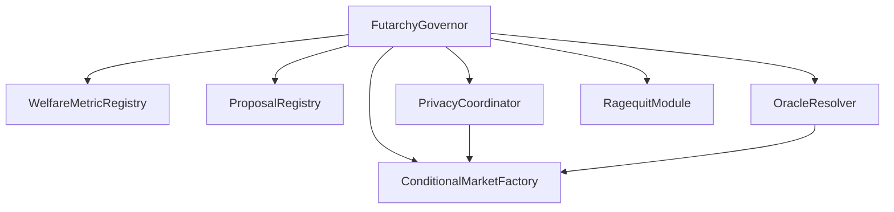

# Smart Contracts

Overview of the smart contracts in the Prediction DAO system.

## Contract Architecture

The system consists of seven main contracts that work together to implement futarchy governance:



## Core Contracts

### FutarchyGovernor.sol

**Purpose**: Main governance coordinator and entry point

**Key Responsibilities**:

- Manages proposal lifecycle
- Coordinates all other contracts
- Implements timelock mechanism
- Controls treasury access
- Emergency pause functionality

**Key Functions**:

```solidity
function activateProposal(uint256 proposalId) external
function finalizeProposal(uint256 proposalId) external
function executeProposal(uint256 proposalId) external
function pause() external onlyGuardian
```

**Events**:

```solidity
event ProposalActivated(uint256 indexed proposalId, uint256 marketId);
event ProposalFinalized(uint256 indexed proposalId, bool approved);
event ProposalExecuted(uint256 indexed proposalId);
```

### WelfareMetricRegistry.sol

**Purpose**: Manages welfare metrics and their weights

**Key Features**:

- Stores welfare metric definitions
- Manages metric weights
- Versioning support
- Democratic updates

**Welfare Metrics**:

1. **Primary**: Treasury Value (TWAP)
2. **Secondary**: Network Activity
3. **Tertiary**: Hash Rate Security  
4. **Quaternary**: Developer Activity

**Key Functions**:

```solidity
function registerMetric(string memory name, string memory description) external
function updateMetricWeight(uint256 metricId, uint256 weight) external
function getMetricValue(uint256 metricId) external view returns (uint256)
```

### ProposalRegistry.sol

**Purpose**: Handles proposal submission and storage

**Key Features**:

- Permissionless submission with bond
- Standardized metadata schemas
- Milestone tracking
- Status management

**Proposal Structure**:

```solidity
struct Proposal {
    uint256 id;
    address proposer;
    string title;
    string description;
    uint256 fundingAmount;
    address recipient;
    uint256 welfareMetricId;
    uint256 bond;
    ProposalStatus status;
    uint256 submissionTime;
    Milestone[] milestones;
}
```

**Key Functions**:

```solidity
function submitProposal(
    string memory title,
    string memory description,
    uint256 fundingAmount,
    address recipient,
    uint256 welfareMetricId
) external payable returns (uint256)

function getProposal(uint256 proposalId) external view returns (Proposal memory)
```

### ConditionalMarketFactory.sol

**Purpose**: Creates and manages prediction markets with flexible binary outcome types

**Key Features**:

- Deploys outcome token pairs with configurable bet types
- Support for multiple binary bet formats (Yes/No, Above/Below, Pass/Fail, etc.)
- LMSR automated market making
- Gnosis CTF compatibility
- Token redemption logic

**Supported Bet Types**:

The contract supports the following binary bet types through the `BetType` enum:

- `YesNo` - Standard Yes / No outcomes
- `PassFail` - Pass / Fail outcomes (default for governance)
- `AboveBelow` - Above / Below a threshold
- `HigherLower` - Higher / Lower than reference
- `InOut` - In / Out of range
- `OverUnder` - Over / Under a value
- `ForAgainst` - For / Against a proposal
- `TrueFalse` - True / False statement
- `WinLose` - Win / Lose outcome
- `UpDown` - Up / Down movement

**Market Structure**:

```solidity
struct Market {
    uint256 proposalId;
    address passToken;
    address failToken;
    uint256 liquidityParameter; // b in LMSR
    uint256 startTime;
    uint256 endTime;
    bool resolved;
    bool outcome; // true = positive outcome wins
    BetType betType; // Type of binary bet
}
```

**Key Functions**:

```solidity
function getOutcomeLabels(BetType betType) 
    public pure returns (string memory positiveOutcome, string memory negativeOutcome)

function deployMarketPair(
    uint256 proposalId,
    address collateralToken,
    uint256 liquidityAmount,
    uint256 liquidityParameter,
    uint256 tradingPeriod,
    BetType betType
) external returns (uint256 marketId)
```

**LMSR Pricing**:

```solidity
function calculateCost(
    uint256 passShares,
    uint256 failShares,
    int256 sharesDelta,
    bool buyingPass
) public view returns (uint256)

function getPrice(uint256 marketId, bool isPass) public view returns (uint256)
```

### PrivacyCoordinator.sol

**Purpose**: Manages privacy and anti-collusion features

**Key Features**:

- Nightmarket-style position encryption
- MACI-style key-change messages  
- Poseidon hash commitments
- Groth16 zkSNARK verification
- Batch processing

**Privacy Flow**:

```solidity
// 1. Register public key
function registerKey(uint256 publicKeyX, uint256 publicKeyY) external

// 2. Submit encrypted position
function submitEncryptedPosition(
    uint256 marketId,
    bytes32 commitment,
    bytes memory zkProof
) external

// 3. Optional: Change key to prevent collusion
function submitKeyChange(
    bytes memory encryptedMessage,
    bytes memory newPublicKey
) external
```

### OracleResolver.sol

**Purpose**: Multi-stage oracle resolution with dispute mechanism

**Key Features**:

- Designated reporter system
- Bond-based incentives
- Challenge mechanism
- UMA escalation
- Evidence requirements

**Resolution Flow**:

```solidity
// 1. Submit report
function submitReport(
    uint256 proposalId,
    uint256 passValue,
    uint256 failValue,
    string memory evidenceURI
) external payable

// 2. Challenge (if needed)
function challengeReport(
    uint256 proposalId,
    string memory challengeReason,
    string memory counterEvidenceURI
) external payable

// 3. Escalate to UMA (if challenged)
function escalateToUMA(uint256 proposalId) external
```

### RagequitModule.sol

**Purpose**: Minority protection mechanism

**Key Features**:

- Moloch-style ragequit
- Proportional treasury share
- Time-windowed execution
- Prevents forced participation

**Key Functions**:

```solidity
function ragequit(
    uint256 proposalId,
    uint256 tokenAmount
) external

function calculateRagequitValue(
    uint256 tokenAmount
) public view returns (uint256)
```

## Contract Interactions

### Proposal Submission Flow

```solidity
// 1. User submits proposal
ProposalRegistry.submitProposal{value: 50 ether}(...)
  -> Emits ProposalSubmitted event
  -> FutarchyGovernor notified

// 2. After review period
FutarchyGovernor.activateProposal(proposalId)
  -> ConditionalMarketFactory.createMarket(proposalId)
  -> Markets created with PASS/FAIL tokens
```

### Trading Flow

```solidity
// 1. User registers with privacy coordinator
PrivacyCoordinator.registerKey(pubKeyX, pubKeyY)

// 2. User submits encrypted trade
PrivacyCoordinator.submitEncryptedPosition(marketId, commitment, proof)
  -> Validates zkProof
  -> Adds to batch
  
// 3. Batch processing
PrivacyCoordinator.processBatch()
  -> ConditionalMarketFactory.executeTrades(...)
  -> Prices updated via LMSR
```

### Resolution Flow

```solidity
// 1. Oracle reports
OracleResolver.submitReport{value: 100 ether}(proposalId, passValue, failValue, evidence)

// 2. Challenge period (2 days)
OracleResolver.challengeReport{value: 150 ether}(proposalId, reason, counterEvidence)

// 3. Finalization
FutarchyGovernor.finalizeProposal(proposalId)
  -> ConditionalMarketFactory.resolveMarket(marketId, outcome)
  -> Users can redeem tokens
```

## Security Features

### Access Control

```solidity
// Role-based access control
modifier onlyGovernor()
modifier onlyGuardian()
modifier onlyProposer(uint256 proposalId)

// Multi-sig guardian
address[] public guardians;
uint256 public guardianThreshold;
```

### Bond System

```solidity
// Proposal bond: 50 ETC
uint256 public constant PROPOSAL_BOND = 50 ether;

// Oracle bond: 100 ETC
uint256 public constant ORACLE_BOND = 100 ether;

// Challenge bond: 150 ETC
uint256 public constant CHALLENGE_BOND = 150 ether;
```

### Spending Limits

```solidity
// Per-proposal limit
uint256 public constant MAX_PROPOSAL_AMOUNT = 50_000 ether;

// Daily aggregate limit  
uint256 public constant DAILY_SPENDING_LIMIT = 100_000 ether;
```

### Timelock

```solidity
// Minimum timelock before execution
uint256 public constant TIMELOCK_PERIOD = 2 days;

// Challenge period
uint256 public constant CHALLENGE_PERIOD = 2 days;
```

## Gas Optimization

### Storage Optimization

```solidity
// Pack struct fields efficiently
struct Proposal {
    address proposer;           // 20 bytes
    uint96 fundingAmount;       // 12 bytes (fits in same slot)
    uint256 id;                 // new slot
    // ...
}
```

### Batch Operations

```solidity
// Process multiple trades in single transaction
function processBatch(Trade[] calldata trades) external {
    for (uint256 i = 0; i < trades.length; i++) {
        _processTrade(trades[i]);
    }
}
```

### View Functions

```solidity
// Use view for read-only operations
function getProposalStatus(uint256 proposalId) 
    external 
    view 
    returns (ProposalStatus)
{
    return proposals[proposalId].status;
}
```

## Testing Contracts

### Unit Tests

```javascript
describe("ProposalRegistry", function () {
  it("should submit proposal with correct bond", async function () {
    const tx = await proposalRegistry.submitProposal(
      "Title",
      "Description",
      ethers.parseEther("1000"),
      recipient.address,
      1,
      { value: ethers.parseEther("50") }
    );
    
    await expect(tx)
      .to.emit(proposalRegistry, "ProposalSubmitted");
  });
});
```

### Integration Tests

```javascript
describe("End-to-End Proposal Flow", function () {
  it("should execute approved proposal", async function () {
    // Submit proposal
    await proposalRegistry.submitProposal(...);
    
    // Activate proposal
    await futarchyGovernor.activateProposal(0);
    
    // Trade on market
    await privacyCoordinator.submitEncryptedPosition(...);
    
    // Resolve
    await oracleResolver.submitReport(...);
    
    // Execute
    await futarchyGovernor.executeProposal(0);
  });
});
```

## Deployment

See [deployment scripts](https://github.com/chippr-robotics/prediction-dao-research/tree/main/scripts) for details.

```javascript
// scripts/deploy.js
async function main() {
  // Deploy in correct order
  const WelfareMetricRegistry = await ethers.deployContract("WelfareMetricRegistry");
  await WelfareMetricRegistry.waitForDeployment();
  
  const ProposalRegistry = await ethers.deployContract("ProposalRegistry");
  await ProposalRegistry.waitForDeployment();
  
  // ... deploy other contracts
  
  const FutarchyGovernor = await ethers.deployContract(
    "FutarchyGovernor",
    [welfareRegistry.target, proposalRegistry.target, /* ... */]
  );
  
  console.log("FutarchyGovernor deployed to:", FutarchyGovernor.target);
}
```

## Upgradeability

Using UUPS proxy pattern:

```solidity
import "@openzeppelin/contracts-upgradeable/proxy/utils/UUPSUpgradeable.sol";

contract FutarchyGovernor is UUPSUpgradeable {
    function _authorizeUpgrade(address newImplementation) 
        internal 
        override 
        onlyGovernor 
    {}
}
```

## Next Steps

- [Learn about testing practices](testing.md)
- [Explore the architecture](architecture.md)
- [Review the frontend integration](frontend.md)
- [Read contributing guidelines](contributing.md)
