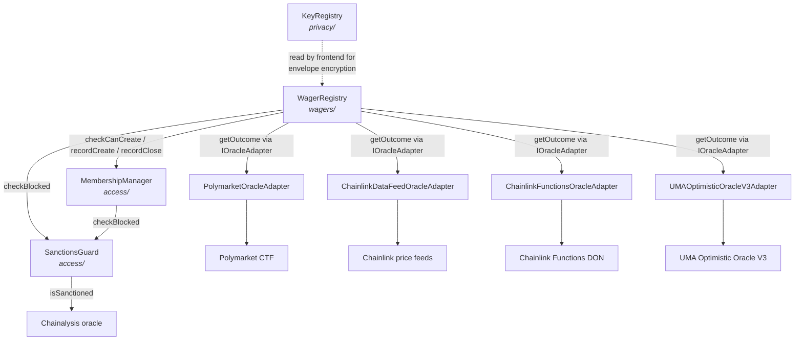
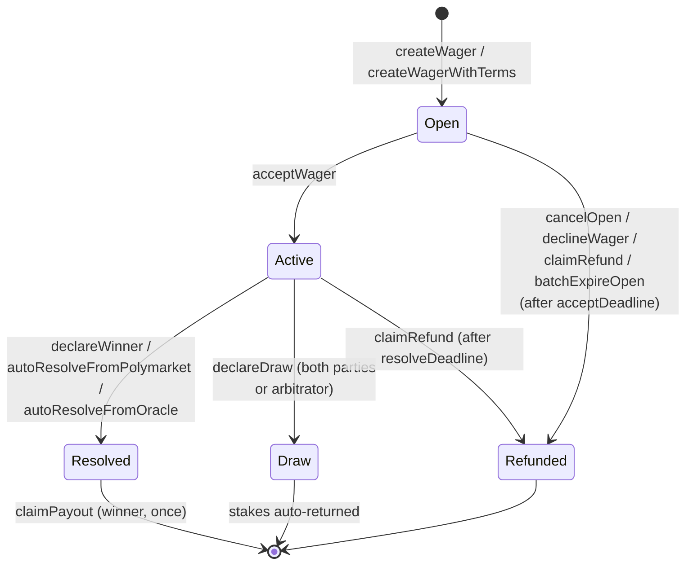
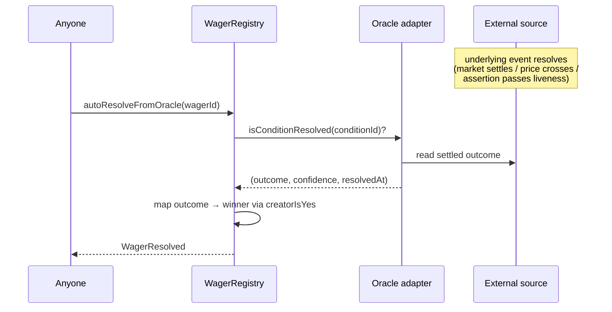

# Smart Contracts

Reference for the active FairWins contract suite under `contracts/`.
(`contracts-archive/` holds superseded research — governance, conditional-token
markets, friend-group factories — and is reference-only.)

## Contract relationships


```mermaid
graph TD
    WR[WagerRegistry<br/><i>wagers/</i>]
    MM[MembershipManager<br/><i>access/</i>]
    SG[SanctionsGuard<br/><i>access/</i>]
    KR[KeyRegistry<br/><i>privacy/</i>]
    PA[PolymarketOracleAdapter]
    CDF[ChainlinkDataFeedOracleAdapter]
    CFN[ChainlinkFunctionsOracleAdapter]
    UMAA[UMAOptimisticOracleV3Adapter]

    WR -->|checkCanCreate / recordCreate / recordClose| MM
    WR -->|checkBlocked| SG
    WR -->|getOutcome via IOracleAdapter| PA & CDF & CFN & UMAA
    MM -->|checkBlocked| SG
    SG -->|isSanctioned| CHA[Chainalysis oracle]
    PA --> PM[Polymarket CTF]
    CDF --> FEED[Chainlink price feeds]
    CFN --> DON[Chainlink Functions DON]
    UMAA --> OO[UMA Optimistic Oracle V3]
    KR -.read by frontend for<br/>envelope encryption.-> WR
```

Four admin roles (OpenZeppelin `AccessControl`) span the suite:
`DEFAULT_ADMIN_ROLE` (configuration), `GUARDIAN_ROLE` (pause),
`ACCOUNT_MODERATOR_ROLE` (per-account freeze), `ROLE_MANAGER_ROLE`
(membership grants); plus the paid user role `WAGER_PARTICIPANT_ROLE`.
See [Roles and Tiers](../system-overview/roles-and-tiers.md) and the
[Account Moderation Policy](../system-overview/account-moderation.md).

## WagerRegistry (`contracts/wagers/WagerRegistry.sol`)

The core contract: escrow plus a state machine over every wager.

### Wager state machine


```mermaid
stateDiagram-v2
    [*] --> Open: createWager / createWagerWithTerms
    Open --> Active: acceptWager
    Open --> Refunded: cancelOpen / declineWager /<br/>claimRefund / batchExpireOpen<br/>(after acceptDeadline)
    Active --> Resolved: declareWinner /<br/>autoResolveFromPolymarket /<br/>autoResolveFromOracle
    Active --> Draw: declareDraw (both parties<br/>or arbitrator)
    Active --> Refunded: claimRefund (after resolveDeadline)
    Resolved --> [*]: claimPayout (winner, once)
    Draw --> [*]: stakes auto-returned
    Refunded --> [*]
```

### Key functions

| Function | Caller | Effect |
|----------|--------|--------|
| `createWager(opponent, arbitrator, token, creatorStake, opponentStake, acceptDeadline, resolveDeadline, resolutionType, conditionId, creatorIsYes, metadataHash, metadataUri)` | Creator | Escrows creator stake, emits `WagerCreated` |
| `createWagerWithTerms(...)` | Creator | Same, additionally binds the current terms-version hash |
| `acceptWager(wagerId)` | Named opponent | Escrows opponent stake, activates wager, emits `WagerAccepted` |
| `declineWager(wagerId)` / `cancelOpen(wagerId)` | Opponent / creator | Refunds creator, closes the offer |
| `declareWinner(wagerId, winner)` | Authorized declarer (per resolution type) | Resolves the wager, emits `WagerResolved` |
| `declareDraw(wagerId)` / `revokeDraw(wagerId)` | Participants or arbitrator | Two-party consent (bitmask) settles a draw, emits `DrawProposed` → `WagerDrawn` |
| `autoResolveFromPolymarket(wagerId)` / `autoResolveFromOracle(wagerId)` | Anyone | Pulls the outcome from the wager's oracle adapter and resolves |
| `claimPayout(wagerId)` | Winner | Transfers the full pot once (`PayoutClaimed`) |
| `claimRefund(wagerId)` | Anyone (funds go to owners) | Refunds expired-Open or deadline-passed-Active wagers (`WagerRefunded`) |
| `batchExpireOpen(wagerIds[])` | Anyone | Bulk-expires stale open offers |

### Resolution types

The on-chain enum (mirrored canonically in
`frontend/src/constants/wagerDefaults.js`):

| # | Type | Settled by |
|---|------|-----------|
| 0 | `Either` | Either participant |
| 1 | `Creator` | Creator only |
| 2 | `Opponent` | Opponent only |
| 3 | `ThirdParty` | Arbitrator named at creation |
| 4 | `Polymarket` | Linked Polymarket CTF condition |
| 5 | `ChainlinkDataFeed` | Price feed vs. registered threshold |
| 6 | `ChainlinkFunctions` | Fulfilled Chainlink Functions request |
| 7 | `UMA` | Settled UMA OO-V3 assertion |

For oracle types the creator records which side they take (`creatorIsYes`);
the registry maps the reported boolean outcome to a winner. Tied/invalid
oracle outcomes settle as a draw.

### Guards on every state change

- `SanctionsGuard.checkBlocked()` on the creator at create, and on both
  parties at accept.
- `MembershipManager.checkCanCreate()` before create; `recordCreate` /
  `recordClose` hooks keep concurrent-wager counts accurate.
- Guardian pause halts new activity; account freezes (`AccountFrozen`) block a
  specific address. Neither affects escrowed funds or refund paths.

## MembershipManager (`contracts/access/MembershipManager.sol`)

Time-bound, USDC-priced membership tiers that gate wager participation.

- **Tiers**: `None`, `Bronze`, `Silver`, `Gold`, `Platinum` — each with a
  monthly creation allowance and a max-concurrent-wagers cap.
- `purchaseTier()` / `purchaseTierWithTerms()` (records the accepted-terms
  hash on-chain), `upgradeTier()`, `extendMembership()`.
- `checkCanCreate(user, role)` view + `recordCreate` / `recordClose` hooks
  called by `WagerRegistry`.
- `grantMembership()` / `revokeMembership()` for `ROLE_MANAGER_ROLE`.
- Fees flow to the treasury address fixed at deployment.

## SanctionsGuard (`contracts/access/SanctionsGuard.sol`)

Non-bypassable compliance screening.

- `checkBlocked(account)` — reverts with `SanctionedAddress` if the account is
  on the operator deny list **or** flagged by the wired sanctions oracle.
- On Polygon mainnet the oracle is Chainalysis's on-chain sanctions list
  (`0x40C57923924B5c5c5455c48D93317139ADDaC8fb`); testnets use a mock.
- `setDenied()` (`SANCTIONS_ADMIN_ROLE`) and `setSanctionsOracle()`
  (`DEFAULT_ADMIN_ROLE`) are the only mutators.

## KeyRegistry (`contracts/privacy/KeyRegistry.sol`)

On-chain directory of encryption public keys powering private wager terms.

- `registerKey(bytes publicKey)` — 32–2048 bytes; supports X25519 and X-Wing
  post-quantum hybrid keys ([ADR-003](../adr/003-xwing-post-quantum-encryption.md)).
- `registerKeyWithEligibility(publicKey, termsRef)` — also emits a dated
  eligibility attestation.
- `getPublicKey(user)` / `hasKey(user)` — used by the frontend to encrypt
  wager envelopes for counterparties and arbitrators. See
  [Encryption Architecture](encryption-architecture.md).

## Oracle adapters (`contracts/oracles/`)

All adapters implement `IOracleAdapter`:

```solidity
function isConditionResolved(bytes32 conditionId) external view returns (bool);
function getOutcome(bytes32 conditionId)
    external view returns (bool outcome, uint256 confidence, uint256 resolvedAt);
```

| Adapter | Source | Condition registration |
|---------|--------|------------------------|
| `PolymarketOracleAdapter` | Polymarket CTF payouts | Links an existing Polymarket condition ID; caches resolutions |
| `ChainlinkDataFeedOracleAdapter` | Chainlink price feed | `registerCondition(feed, threshold, op, deadline)` with GT/GTE/LT/LTE/EQ comparisons |
| `ChainlinkFunctionsOracleAdapter` | Chainlink Functions DON | `registerCondition(encodedRequest, sourceHash, subscriptionId, gasLimit, donId)`; fulfills via `FunctionsClient` callback |
| `UMAOptimisticOracleV3Adapter` | UMA Optimistic Oracle V3 | `registerCondition(claim, bondCurrency, bondAmount, liveness)`; settles via `assertionResolvedCallback` |


```mermaid
sequenceDiagram
    participant Any as Anyone
    participant WR as WagerRegistry
    participant AD as Oracle adapter
    participant SRC as External source

    Note over SRC: underlying event resolves<br/>(market settles / price crosses /<br/>assertion passes liveness)
    Any->>WR: autoResolveFromOracle(wagerId)
    WR->>AD: isConditionResolved(conditionId)?
    AD->>SRC: read settled outcome
    AD-->>WR: (outcome, confidence, resolvedAt)
    WR->>WR: map outcome → winner via creatorIsYes
    WR-->>Any: WagerResolved
```

## Deployed addresses

`deployments/` is the source of truth. Current v2 deployments:

=== "Polygon Mainnet (137)"

    | Contract | Address |
    |----------|---------|
    | WagerRegistry | `0x5023765809fDA93ab9F11B684fdb76521eD31774` |
    | MembershipManager | `0x00c3ef4e02Ef00Ad6eE955dF5022A22F6ea73dae` |
    | SanctionsGuard | `0x2Dc53d91A189be71DfE96Ea9BCFCF6aDDA77BC76` |
    | KeyRegistry | `0xcEFdeBba8E040c035c690ca9057cF22E73247c24` |
    | PolymarketOracleAdapter | `0x83688e9b8D4f085E3eF4619D91e0e6303cFcf0A4` |
    | ChainlinkDataFeedOracleAdapter | `0x7ae8220Dc02D0504EDCBa2C1B1AbA579AA3F0f23` |
    | ChainlinkFunctionsOracleAdapter | `0x148C2E347a601AC1a680b17321529b0Ffc31AeFc` |
    | UMAOptimisticOracleV3Adapter | `0x8224433d099Af6cd30540A78421aBFd6e044E949` |
    | Stake token (USDC) | `0x3c499c542cEF5E3811e1192ce70d8cC03d5c3359` |

=== "Polygon Amoy (80002)"

    | Contract | Address |
    |----------|---------|
    | WagerRegistry | `0x66c7fa8cB1642Fc5e94Fa92928f1d6333c8d657f` |
    | MembershipManager | `0xFaEbF662aa591fF95e97306b413522efC958540f` |
    | KeyRegistry | `0xb314c4Ee52D9D89bf7FEE66a43aBeAc7D047a5Cb` |
    | PolymarketOracleAdapter | `0x423d2Ca885d67E46062CFF732Eff952f4F736136` |
    | ChainlinkDataFeedOracleAdapter | `0x7ae8220Dc02D0504EDCBa2C1B1AbA579AA3F0f23` |
    | ChainlinkFunctionsOracleAdapter | `0x074fC18C1E322a7537b53B8B2Bf0762629E3b532` |
    | UMAOptimisticOracleV3Adapter | `0xcEa9b4A01CcD3aA6545ea834a268C69e7eEfee88` |
    | Stake token (test USDC) | `0x41E94Eb019C0762f9Bfcf9Fb1E58725BfB0e7582` |

Deployment uses the Safe Singleton Factory with salt prefix
`FairWins-P2P-v2.0-` for deterministic cross-chain addresses — see
[Singleton Deployment Patterns](singleton-deployment-patterns.md). After any
deploy, run `npm run sync:frontend-contracts` to regenerate
`frontend/src/config/contracts.js`.

## Development workflow

```bash
npm run compile        # compile the suite
npm test               # unit + integration tests
npm run test:fork      # fork tests against live networks
npm run test:coverage  # coverage report
```

Contract changes must follow checks-effects-interactions, pass Slither and
Medusa, and receive a security review — see
[Security Testing](../security/index.md) and the binding standards in
`.specify/memory/constitution.md`.
