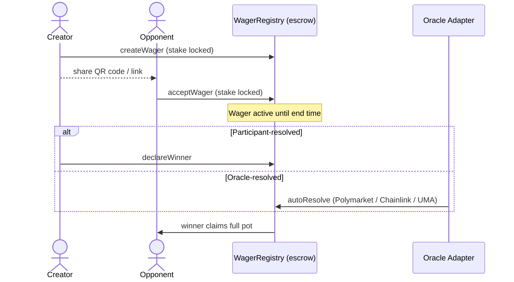

# Welcome to FairWins

**Peer-to-peer wagers with friends, settled by smart-contract escrow and trustless oracles.**

FairWins is a wager *management* layer — not a prediction market. Two people agree
on a bet, both stakes are locked in an audited escrow contract on Polygon, and the
wager is resolved either by the participants themselves, a neutral arbitrator, or
an external oracle (Polymarket, Chainlink, UMA). There is no order book, no market
making, and no house.

> **Important**: Before purchasing a tier or interacting with the protocol,
> please read the [Roles and Tiers](system-overview/roles-and-tiers.md)
> overview and the [Account Moderation Policy](system-overview/account-moderation.md).
> The protocol can be paused by a Guardian role holder, and individual
> accounts can be frozen for cause by an Account Moderator role holder.

## How it works

1. **Create** — pick the terms, the stake (USDC), and how the wager resolves
2. **Share** — send your friend a QR code or deep link
3. **Lock** — both stakes are held in smart-contract escrow
4. **Resolve** — a participant, arbitrator, or oracle declares the outcome
5. **Settle** — the winner claims the combined pot; expired or unresolved wagers are refundable

## Where it runs

| Network | Chain ID | Status |
|---------|----------|--------|
| Polygon Mainnet | 137 | **Live** — production at [fairwins.app](https://fairwins.app) |
| Polygon Amoy | 80002 | Testnet (toggle in the wallet menu) |

Recorded contract addresses live in [`deployments/`](https://github.com/chippr-robotics/prediction-dao-research/tree/main/deployments)
— see the [Architecture guide](developer-guide/architecture.md) for the full map.

## Who settles a wager

| Settler | Who settles it |
|------|----------------|
| Me (Creator) | The creator declares the winner |
| Them (Opponent) | The opponent declares the winner |
| A Friend (Third Party) | A neutral arbitrator chosen at creation |
| An Oracle — Polymarket | Auto-settles from a linked Polymarket market |
| An Oracle — Chainlink Data Feed | Auto-settles from a price-feed threshold |
| An Oracle — Chainlink Functions | Auto-settles from a custom off-chain computation |
| An Oracle — UMA | Auto-settles via UMA's Optimistic Oracle V3 |

In the create UI these settlers appear as **Me**, **Them**, **A Friend**, and
**An Oracle** (the oracle tab covers Polymarket / Chainlink / UMA). The retired
**Either Party** option is no longer offered for new wagers.

## Privacy & security

- **End-to-end encrypted terms** — wager descriptions are envelope-encrypted
  client-side (X-Wing post-quantum hybrid KEM, [ADR-003](adr/003-xwing-post-quantum-encryption.md))
  and stored on IPFS; only the participants (and arbitrator, if any) can read them
- **On-chain key registry** — participants publish encryption public keys via `KeyRegistry`
- **Escrow** — stakes are held by `WagerRegistry` until resolution; refund paths
  exist for expired offers and unresolved wagers
- **Sanctions screening** — `SanctionsGuard` checks the Chainalysis sanctions
  oracle before any wager is created or accepted
- **No backend** — the app is a static SPA; all state lives on-chain or on IPFS

## Quick Navigation

-   :fontawesome-solid-users:{ .lg .middle } __User Guide__

    ---

    Learn how to create wagers, accept challenges, and claim winnings.

    [:octicons-arrow-right-24: Getting Started](user-guide/getting-started.md)

-   :fontawesome-solid-code:{ .lg .middle } __Developer Guide__

    ---

    Set up your development environment and learn the system architecture.

    [:octicons-arrow-right-24: Setup Instructions](developer-guide/setup.md)

-   :fontawesome-solid-diagram-project:{ .lg .middle } __Architecture__

    ---

    Understand the contracts, frontend, oracle integration, and infrastructure.

    [:octicons-arrow-right-24: Architecture](developer-guide/architecture.md)

-   :fontawesome-solid-book:{ .lg .middle } __API Reference__

    ---

    Detailed reference documentation for smart contracts and APIs.

    [:octicons-arrow-right-24: API Docs](reference/api.md)

## System components

| Contract | Role |
|----------|------|
| `WagerRegistry` | Wager lifecycle and stake escrow (create, accept, resolve, claim, refund) |
| `MembershipManager` | Tiered memberships (Bronze → Platinum) with creation rate limits |
| `SanctionsGuard` | Non-bypassable sanctions screening (Chainalysis oracle + deny list) |
| `KeyRegistry` | Public encryption keys for private wager terms |
| Oracle adapters | `PolymarketOracleAdapter`, `ChainlinkDataFeedOracleAdapter`, `ChainlinkFunctionsOracleAdapter`, `UMAOptimisticOracleV3Adapter` |

The earlier futarchy/DAO-governance research (ClearPath, friend-group market
factories, conditional-token markets) has been superseded by this P2P design;
its documentation is preserved under
[`docs/archived/`](https://github.com/chippr-robotics/prediction-dao-research/tree/main/docs/archived)
and the contracts under `contracts-archive/`.

## License

This project is licensed under the Apache License 2.0. See [LICENSE](https://github.com/chippr-robotics/prediction-dao-research/blob/main/LICENSE) for details.

## Contributing

Contributions are welcome! Please read our [contributing guidelines](developer-guide/contributing.md) to get started.
