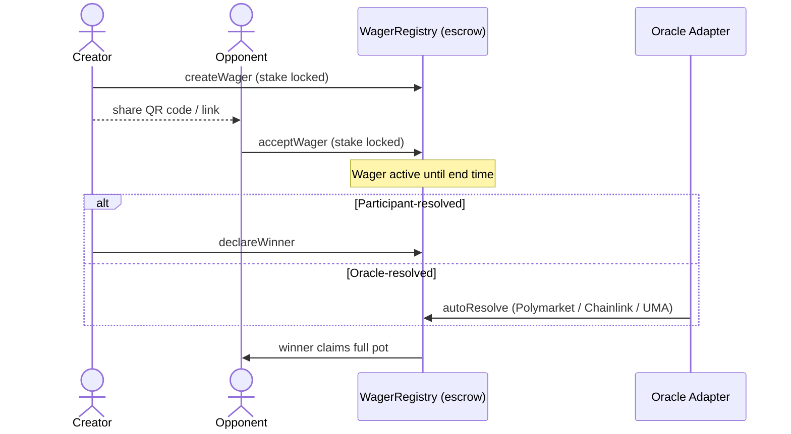

# Welcome to FairWins

**A self-custody, multi-chain financial platform — one control plane for your
money, and you hold the keys.**

FairWins began as a peer-to-peer wager management layer and has grown into a
multi-chain financial control plane. One app now spans payments and requests
(gasless USDC transfers), peer-to-peer wagers and group pools, Polymarket
prediction-market trading, an NFT portfolio with OpenSea selling, lending and
staking, DEX swaps, cross-chain bridging via Across, a native Bitcoin wallet,
and Safe multisig custody vaults with an on-chain policy engine. The platform
never takes custody: every value-bearing action is signed by the member's own
wallet — passkey smart account, browser/mobile wallet, or multisig vault.

The wager layer that started it all is unchanged in spirit: two people agree on
a bet, both stakes are locked in an audited escrow contract, and the wager is
resolved by the participants, a neutral arbitrator, or an external oracle
(Polymarket, Chainlink, UMA). There is no order book, no market making, and no
house.

FairWins is also **white-label multi-tenant** (spec 072): the product you see
at fairwins.app is the default tenant of a platform other operators can run
under their own brand, domain, configuration, and — for full asset isolation —
their own dedicated contract deployments. See the
[White-Label Tenants guide](developer-guide/white-label-tenants.md).

> **Important**: Before purchasing a tier or interacting with the protocol,
> please read the [Roles and Tiers](system-overview/roles-and-tiers.md)
> overview and the [Account Moderation Policy](system-overview/account-moderation.md).
> The protocol can be paused by a Guardian role holder, and individual
> accounts can be frozen for cause by an Account Moderator role holder.

## How it works

```mermaid
sequenceDiagram
    actor C as Creator
    actor O as Opponent
    participant W as WagerRegistry (escrow)
    participant A as Oracle Adapter

    C->>W: createWager (stake locked)
    C-->>O: share QR code / link
    O->>W: acceptWager (stake locked)
    Note over W: Wager active until end time
    alt Participant-resolved
        C->>W: declareWinner
    else Oracle-resolved
        A->>W: autoResolve (Polymarket / Chainlink / UMA)
    end
    W->>O: winner claims full pot
```

1. **Create** — pick the terms, the stake (USDC), and how the wager resolves
2. **Share** — send your friend a QR code or deep link
3. **Lock** — both stakes are held in smart-contract escrow
4. **Resolve** — a participant, arbitrator, or oracle declares the outcome
5. **Settle** — the winner claims the combined pot; expired or unresolved wagers are refundable

## Where it runs

| Network | Chain ID | Role |
|---------|----------|------|
| Polygon Mainnet | 137 | **Live** — primary network + membership reference chain at [fairwins.app](https://fairwins.app) |
| Ethereum Mainnet | 1 | Portfolio, custody, routers, bridge-LP |
| Optimism / Base / Arbitrum | 10 / 8453 / 42161 | Portfolio, custody, routers |
| Ethereum Classic | 61 | Custody + ETCswap trading |
| Bitcoin | — | Native BTC wallet (portfolio/send/receive, spec 061) |
| Polygon Amoy / Mordor | 80002 / 63 | Testnets (toggle in the wallet menu) |

Recorded contract addresses live in [`deployments/`](https://github.com/chippr-robotics/prediction-dao-research/tree/main/deployments)
— see the [Architecture guide](developer-guide/architecture.md) for the full map.

## Who settles a wager

| Settler | Who settles it |
|------|----------------|
| Me (Creator) | The creator declares the winner |
| Them (Opponent) | The opponent declares the winner |
| A Friend (Third Party) | A neutral arbitrator chosen at creation |
| An Oracle — Polymarket | Auto-settles from a linked Polymarket market |
| An Oracle — Chainlink Data Feed | Auto-settles from a price-feed threshold |
| An Oracle — Chainlink Functions | Auto-settles from a custom off-chain computation |
| An Oracle — UMA | Auto-settles via UMA's Optimistic Oracle V3 |

In the create UI these settlers appear as **Me**, **Them**, **A Friend**, and
**An Oracle** (the oracle tab covers Polymarket / Chainlink / UMA). The retired
**Either Party** option is no longer offered for new wagers.

## Privacy & security

- **End-to-end encrypted terms** — wager descriptions are envelope-encrypted
  client-side (X-Wing post-quantum hybrid KEM, [ADR-003](adr/003-xwing-post-quantum-encryption.md))
  and stored on IPFS; only the participants (and arbitrator, if any) can read them
- **On-chain key registry** — participants publish encryption public keys via `KeyRegistry`
- **Escrow** — stakes are held by `WagerRegistry` until resolution; refund paths
  exist for expired offers and unresolved wagers
- **Sanctions screening** — `SanctionsGuard` checks the Chainalysis sanctions
  oracle before any wager is created or accepted
- **No backend** — the app is a static SPA; all state lives on-chain or on IPFS

## Quick Navigation

-   :fontawesome-solid-users:{ .lg .middle } __User Guide__

    ---

    Learn how to create wagers, accept challenges, and claim winnings.

    [:octicons-arrow-right-24: Getting Started](user-guide/getting-started.md)

-   :fontawesome-solid-code:{ .lg .middle } __Developer Guide__

    ---

    Set up your development environment and learn the system architecture.

    [:octicons-arrow-right-24: Setup Instructions](developer-guide/setup.md)

-   :fontawesome-solid-diagram-project:{ .lg .middle } __Architecture__

    ---

    Understand the contracts, frontend, oracle integration, and infrastructure.

    [:octicons-arrow-right-24: Architecture](developer-guide/architecture.md)

-   :fontawesome-solid-book:{ .lg .middle } __API Reference__

    ---

    Detailed reference documentation for smart contracts and APIs.

    [:octicons-arrow-right-24: API Docs](reference/api.md)

## System components

| Contract | Role |
|----------|------|
| `WagerRegistry` | Wager lifecycle and stake escrow (create, accept, resolve, claim, refund), including open challenges. **UUPS proxy** — upgradeable at a stable address (spec 025) |
| `MembershipManager` | Tiered memberships (Bronze → Platinum) with creation rate limits and voucher redemption. **UUPS proxy** (spec 027) |
| `MembershipVoucher` | Transferable ERC-721 bearer claim on a membership; bought with USDC, redeemed (burned) for a soulbound membership (spec 026). **Immutable** by design |
| `TokenFactory` | Role-gated, sanctions-screened issuance of open ERC-20/721 and restricted ERC-1404 tokens as immutable clones (spec 028). **UUPS proxy**. See the [Token Mint guide](developer-guide/token-mint.md) |
| `SanctionsGuard` | Non-bypassable sanctions screening (Chainalysis oracle + deny list) |
| `KeyRegistry` | Public encryption keys for private wager terms |
| Oracle adapters | `PolymarketOracleAdapter`, `ChainlinkDataFeedOracleAdapter`, `ChainlinkFunctionsOracleAdapter`, `UMAOptimisticOracleV3Adapter` |

The two value-bearing core contracts (`WagerRegistry`, `MembershipManager`)
are **UUPS upgradeable proxies** — logic is swapped in place while state and
addresses are preserved — so features ship without stranding wagers or
memberships (see [ADR-004](adr/004-upgradeable-registry-uups.md)).

The earlier futarchy/DAO-governance research (ClearPath, friend-group market
factories, conditional-token markets) has been superseded by this P2P design;
its documentation is preserved under
[`docs/archived/`](https://github.com/chippr-robotics/prediction-dao-research/tree/main/docs/archived)
and the contracts under `contracts-archive/`.

## License

This project is licensed under the Apache License 2.0. See [LICENSE](https://github.com/chippr-robotics/prediction-dao-research/blob/main/LICENSE) for details.

## Contributing

Contributions are welcome! Please read our [contributing guidelines](developer-guide/contributing.md) to get started.
