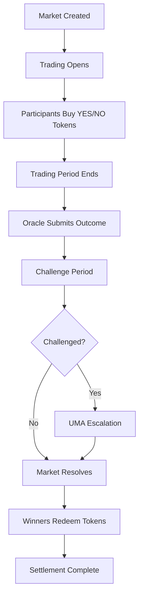
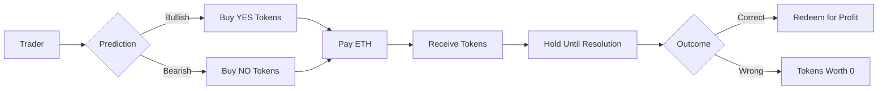
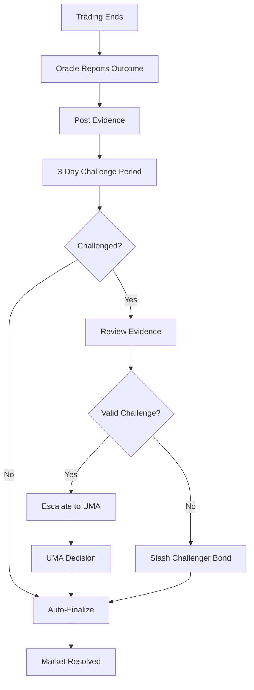

# FairWins Prediction Markets

## Overview

**FairWins** is an open prediction market platform built on the same infrastructure as ClearPath, but designed for general-purpose event predictions rather than DAO governance. While ClearPath uses futarchy for institutional decision-making, FairWins enables anyone to create and trade on prediction markets for any topic.

### Key Characteristics

| Aspect | FairWins | ClearPath |
|--------|----------|-----------|
| **Purpose** | General predictions | DAO governance |
| **Market Creation** | Permissionless (anyone) | Automated (per proposal) |
| **Resolution** | Creator/Oracle defined | Welfare metrics |
| **Participants** | Open to everyone | DAO members |
| **Use Cases** | Events, sports, finance | Treasury, protocol changes |

## How FairWins Works

FairWins follows a simple four-phase lifecycle:

### Phase 1: Market Creation

**Anyone can create a prediction market** by:

1. **Define the Question**: Clear, objective question with binary outcome
   - Example: "Will ETH price reach $5000 by end of Q1 2025?"
   - Must be verifiable and have clear resolution criteria

2. **Set Parameters**:
   - **Trading Period**: How long trading is open (7-21 days)
   - **Resolution Date**: When the outcome is determined
   - **Initial Liquidity**: Seed liquidity for LMSR market maker
   - **Collateral Token**: ETH or ERC20 token

3. **Stake Creator Bond**: Security deposit returned after proper resolution

4. **Provide Initial Liquidity**: Minimum amount to bootstrap market

**Example Market Creation**:
```javascript
// Market creator stakes 50 ETH as initial liquidity
await marketFactory.createMarket(
  0,                           // proposalId = 0 (standalone market)
  ethers.ZeroAddress,          // collateral = ETH
  tradingEndTime,              // when trading closes
  1000,                        // liquidity parameter
  { value: ethers.parseEther("50") }
);
```

### Phase 2: Trading

Once created, **anyone can trade** on the market:

1. **Buy YES Tokens**: If you believe the event will occur
   - Price reflects market's probability estimate
   - Higher demand → higher price

2. **Buy NO Tokens**: If you believe the event won't occur
   - Inverse of YES token price
   - Price adjusts automatically via LMSR

3. **Trade Freely**: Buy/sell at any time during trading period
   - No counterparty needed (LMSR provides liquidity)
   - Prices update instantly based on demand

**Market Mechanics**:
```
YES Price + NO Price = 1 ETH (always)

If YES = 0.65 ETH, then NO = 0.35 ETH
→ Market implies 65% probability of YES outcome
```

**Example Trading**:
```javascript
// Trader buys YES tokens with 20 ETH
await marketFactory.buyTokens(
  marketId,
  true,                        // true = YES, false = NO
  ethers.parseEther("20"),     // amount
  { value: ethers.parseEther("20") }
);
```

### Phase 3: Resolution

When the resolution date arrives:

1. **Trading Closes**: No more trades allowed after trading end time

2. **Outcome Determined**: 
   - **Creator Resolution**: Market creator submits outcome
   - **Oracle Resolution**: Designated oracle reports result
   - **Evidence Required**: IPFS hash or data proving outcome

3. **Challenge Period**: 3-day window for disputes
   - Anyone can challenge with higher bond
   - Escalates to UMA if disputed

4. **Finalization**: After challenge period, outcome is final

**Resolution Flow**:
```
Trading Ends → Report Submitted → Challenge Period → Finalized → Market Resolved
     ↓              ↓                    ↓               ↓             ↓
  Day 14         Day 14              Day 14-17        Day 17       Day 17
```

### Phase 4: Settlement

After resolution, winners redeem tokens:

1. **Winners Redeem**: 
   - YES holders redeem if outcome = YES
   - NO holders redeem if outcome = NO
   - Tokens redeemed for collateral (ETH)

2. **Payout Calculation**:
   ```
   If YES wins:
     YES token value = 1 ETH per token
     NO token value = 0 ETH per token
   
   Trader Profit = (redemption_value - purchase_price) × tokens_held
   ```

3. **Losers**: 
   - Losing side tokens worth 0
   - No redemption value
   - Loss = amount paid for tokens

**Example Settlement**:
```javascript
// Winner redeems YES tokens
await marketFactory.redeemTokens(marketId, true);
// Receives: token_amount × 1 ETH
```

## Major Flows

### Complete Market Lifecycle



### Trading Flow



### Resolution Flow



## Use Cases

### Financial Markets

**Stock Price Predictions**:
- "Will AAPL close above $200 by end of Q2?"
- "Will S&P 500 reach new all-time high in 2025?"

**Crypto Price Predictions**:
- "Will BTC reach $100k by December 31?"
- "Will ETH flip BTC in market cap this year?"

### Sports & Entertainment

**Sports Outcomes**:
- "Will Team A win the championship?"
- "Will Player X score more than 25 points?"

**Entertainment Events**:
- "Will Movie Y gross over $1B worldwide?"
- "Will Album Z go platinum in first month?"

### Political & Social

**Election Results**:
- "Will Candidate A win the election?"
- "Will voter turnout exceed 70%?"

**Policy Outcomes**:
- "Will legislation pass by end of year?"
- "Will approval rating exceed 50%?"

### Technology & Science

**Product Launches**:
- "Will Product X ship by Q3?"
- "Will feature Y be announced at conference?"

**Scientific Milestones**:
- "Will mission launch on schedule?"
- "Will breakthrough be published this year?"

## Privacy Features

Even though FairWins is open to everyone, **privacy is still important**:

### Position Privacy

- **Encrypted Positions**: Via PrivacyCoordinator
- **Zero-Knowledge Proofs**: Positions validated without revealing details
- **Aggregate Data Only**: Individual trades remain private

### Anti-Manipulation

- **TWAP Pricing**: Time-weighted prices prevent manipulation
- **Batch Processing**: Trades processed in epochs
- **Privacy Prevents Front-Running**: Can't see individual positions

### Optional Privacy

Users can choose privacy level:
- **Public Trading**: Faster, simpler (default for small amounts)
- **Private Trading**: Enhanced privacy (recommended for large positions)

## Market Discovery

FairWins includes features for finding markets:

### Browse Markets

**By Category**:
- Finance
- Sports
- Politics
- Technology
- Entertainment

**By Status**:
- Active (trading open)
- Closing Soon (< 24 hours)
- Pending Resolution
- Resolved

**By Popularity**:
- Most Volume
- Most Traders
- Highest Liquidity

### Search Markets

**Search Criteria**:
- Keyword search in questions
- Date range (resolution date)
- Liquidity range
- Creator address

### Market Details

For each market, view:
- Question and description
- Current YES/NO prices
- Total liquidity
- Number of traders
- Trading volume
- Time remaining
- Resolution criteria
- Creator information

## Economic Model

### For Traders

**Profit Opportunity**:
- Buy low when market undervalues outcome
- Sell high or hold to redemption
- Profit = knowledge advantage

**Risk**:
- Lose amount paid for tokens if wrong
- No leverage (can't lose more than paid)
- Gas costs for transactions

### For Market Creators

**Revenue**:
- Keep portion of trading fees (optional)
- Reputation building
- Community engagement

**Costs**:
- Initial liquidity provision
- Creator bond (returned)
- Gas costs

**Creator Bond**:
- Posted when creating market
- Ensures proper resolution
- Returned after successful resolution
- Slashed if creator resolves incorrectly

### For the Protocol

**Revenue Sources**:
- Small trading fees (optional, default 0.1%)
- Failed bond slashing
- Protocol treasury growth

**Costs**:
- LMSR market maker bounded loss
- Infrastructure and hosting
- Oracle/dispute resolution

## Security & Safety

### Market Creator Accountability

- **Bond Requirements**: Ensures good faith
- **Reputation System**: Track creator accuracy
- **Community Review**: Markets can be flagged

### Oracle Accuracy

- **Bond Requirements**: 100 ETH for reporters
- **Evidence Requirements**: Must provide proof
- **Challenge Mechanism**: Community can dispute
- **UMA Escalation**: Final arbitration

### Smart Contract Security

- **Audited Contracts**: Professional security reviews
- **Bounded Loss**: LMSR limits protocol risk
- **Emergency Pause**: Guardian can halt if needed
- **Gradual Decentralization**: Progressive control transfer

### User Protection

- **Clear Resolution Criteria**: Avoid ambiguity
- **Challenge Period**: Time to dispute outcomes
- **Bond Slashing**: Penalizes dishonest actors
- **Refunds**: Markets can be cancelled if problematic

## Testing Coverage

The FairWins platform has comprehensive integration tests covering the entire lifecycle:

### Market Creation Tests

✅ **Create Market with Custom Parameters**
- Verify trading period configuration
- Validate liquidity parameter setup
- Check initial liquidity provision

✅ **Market Creation Requirements**
- Ensure minimum liquidity requirement
- Validate trading period constraints (7-21 days)
- Verify collateral token support

### Trading Phase Tests

✅ **Multiple Trader Participation**
- Multiple users can trade simultaneously
- Verify liquidity pool updates correctly
- Check price adjustments via LMSR

✅ **Trading Period Enforcement**
- Trading allowed during active period
- Trading blocked after period ends
- Verify time-based restrictions

✅ **Price Discovery**
- YES + NO prices always equal 1
- Prices reflect probability
- LMSR provides consistent liquidity

### Resolution Tests

✅ **Oracle Resolution Process**
- Oracle submits outcome report
- Evidence is recorded on-chain
- Challenge period is enforced

✅ **Resolution Timing**
- Cannot resolve before trading ends
- Cannot resolve during challenge period
- Must finalize after challenge period

✅ **Outcome Scenarios**
- YES outcome resolution
- NO outcome resolution
- Both outcomes tested

### Settlement Tests

✅ **Redemption Process**
- Winners can redeem tokens
- Losers receive no value
- Verify payout calculations

✅ **Redemption Restrictions**
- Cannot redeem before resolution
- Cannot redeem twice
- Must hold tokens to redeem

✅ **Payout Accuracy**
- Winners receive correct amounts
- Losers lose only their stake
- Gas costs accounted for

### End-to-End Tests

✅ **Complete Lifecycle**
- Full flow from creation to settlement
- All phases integrated correctly
- State transitions validated

✅ **Multiple Outcomes**
- YES outcome scenario
- NO outcome scenario  
- Both paths fully tested

## What We Test For

### Functional Correctness

1. **State Transitions**: Markets progress through lifecycle correctly
2. **Access Control**: Only authorized actions allowed at each phase
3. **Time Constraints**: Trading periods and deadlines enforced
4. **Economic Integrity**: Payouts calculated correctly

### Security Properties

1. **No Double Spending**: Tokens redeemed only once
2. **No Unauthorized Resolution**: Only oracle can resolve
3. **Bond Protection**: Bonds handled correctly
4. **Reentrancy Protection**: No reentrancy attacks

### Integration Points

1. **Oracle Integration**: Oracle resolver works correctly
2. **Market Factory**: Creates markets properly
3. **Privacy Coordinator**: Optional privacy features work
4. **Token Handling**: ERC20/ETH handled correctly

### Edge Cases

1. **No Trades**: Market with zero trades
2. **Single Trader**: Only one participant
3. **Equal Distribution**: 50/50 YES/NO split
4. **Maximum Liquidity**: Large liquidity scenarios

### Error Conditions

1. **Invalid Parameters**: Reject bad inputs
2. **Insufficient Funds**: Handle low balances
3. **Expired Markets**: Block trading after deadline
4. **Unresolved Markets**: Cannot redeem early

## Comparison with ClearPath

### Similarities

Both platforms share:
- Same smart contract infrastructure
- Conditional token framework (Gnosis CTF)
- LMSR market making
- Privacy mechanisms (optional)
- Oracle resolution system
- Challenge/dispute process

### Differences

| Feature | FairWins | ClearPath |
|---------|----------|-----------|
| **Market Creation** | User-initiated | Proposal-triggered |
| **Participation** | Open/permissionless | DAO members |
| **Resolution Criteria** | Custom per market | Welfare metrics |
| **Governance** | Individual markets | DAO-wide |
| **Treasury** | Market-specific | Shared DAO treasury |
| **Ragequit** | Not applicable | Available |
| **Voting** | Trade-based | Token-weighted |

### When to Use Each

**Use FairWins when**:
- Predicting external events
- Open participation needed
- Custom resolution criteria
- Individual market focus

**Use ClearPath when**:
- DAO governance decisions
- Treasury management
- Protocol changes
- Collective decision-making

## Future Enhancements

### Phase 1 (Current)
- ✅ Basic market creation
- ✅ Trading functionality
- ✅ Oracle resolution
- ✅ Settlement process

### Phase 2 (Planned)
- 📋 Market categories and tags
- 📋 Advanced search and filtering
- 📋 Reputation system for creators
- 📋 Trading history and analytics

### Phase 3 (Future)
- 🔮 Automated market makers (AMM)
- 🔮 Combinatorial markets (AND/OR)
- 🔮 Continuous markets (no end date)
- 🔮 Conditional markets (dependent outcomes)

### Phase 4 (Research)
- 🔬 Cross-chain markets
- 🔬 AI-assisted market creation
- 🔬 Social trading features
- 🔬 Mobile app integration

## Resources

### Documentation
- [System Introduction](introduction.md) - Overall system overview
- [How It Works](how-it-works.md) - Detailed mechanics
- [Privacy Mechanisms](privacy.md) - Privacy features
- [Integration Testing](../developer-guide/integration-testing.md) - Test documentation

### Technical References
- [ConditionalMarketFactory Contract](../reference/contracts.md#conditionalmarketfactory)
- [OracleResolver Contract](../reference/contracts.md#oracleresolver)
- [API Reference](../reference/api.md) - Frontend API

### External Resources
- [Gnosis Conditional Tokens](https://docs.gnosis.io/conditionaltokens/)
- [LMSR Explanation](https://www.cs.cmu.edu/~./hanson/lmsr.pdf)
- [Prediction Markets Overview](https://en.wikipedia.org/wiki/Prediction_market)

## Getting Started

Ready to use FairWins? Check out:

1. **[Setup Guide](../developer-guide/setup.md)** - Install and configure
2. **[User Guide](../user-guide/getting-started.md)** - Start trading
3. **[Trading Guide](../user-guide/trading-on-markets.md)** - Learn to trade
4. **[FAQ](../user-guide/faq.md)** - Common questions

## Community

- **Discord**: Join discussions
- **Forum**: Ask questions
- **GitHub**: Contribute code
- **Twitter**: Follow updates
