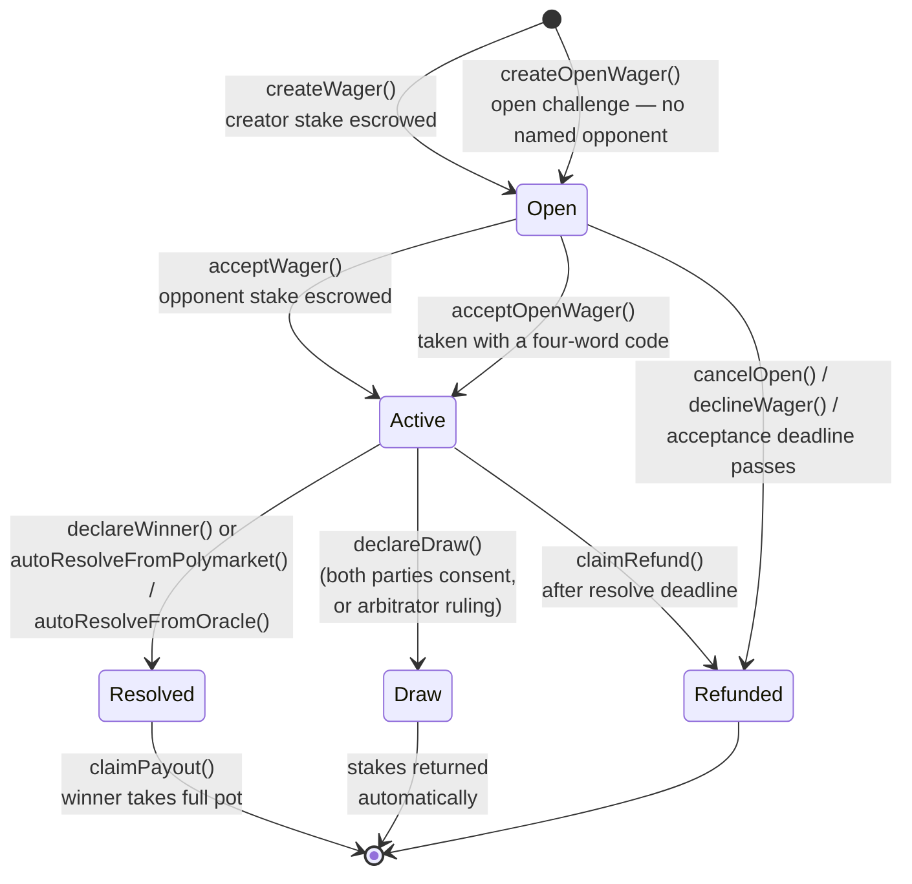
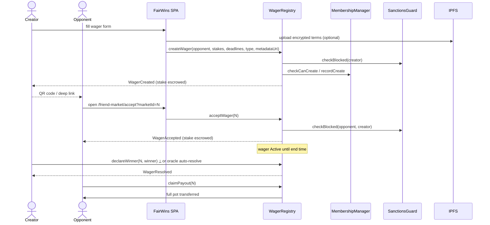

# How It Works

This page walks through the full on-chain lifecycle of a wager, from creation
to payout, including every exit path.

> See also: [Roles and Tiers](roles-and-tiers.md) for the membership /
> admin-role model, and the [Account Moderation Policy](account-moderation.md)
> for the per-account freeze power.

## Lifecycle state machine

## 1. Creation (`Open`)

The creator calls `WagerRegistry.createWager()` (or `createWagerWithTerms()`,
which additionally binds the current terms-of-service hash on-chain) with:

- the **opponent** address (and optionally an **arbitrator** for third-party
  resolution),
- the **stake token** (USDC by default) and both stake amounts — equal stakes
  for an even-money wager, asymmetric stakes for an **Offer** (odds) wager
  where the settler puts up the majority stake,
- an **acceptance deadline** and a **resolve deadline**,
- the **resolution type** (see below) plus an oracle condition ID if
  oracle-resolved,
- a **metadata hash/URI** pointing at the (optionally encrypted) terms on IPFS.

The creator's stake transfers into escrow immediately and `WagerCreated` is
emitted. Before any state changes, the registry checks:

- **Membership** — `MembershipManager.checkCanCreate()` enforces the caller's
  tier limits (monthly creations and concurrent open wagers).
- **Sanctions** — `SanctionsGuard.checkBlocked()` reverts if the creator is on
  the Chainalysis sanctions list or the operator deny list.

## 2. Acceptance (`Open → Active`)

The opponent — usually arriving via a QR code or deep link — calls
`acceptWager()`. Their stake transfers into escrow, both parties are screened
by `SanctionsGuard`, and `WagerAccepted` is emitted. The wager is now live
until its end time.

If the opponent never accepts:

- the creator can `cancelOpen()` at any time, or
- after the acceptance deadline anyone can call `claimRefund()` or
  `batchExpireOpen()` to return the creator's stake.

The opponent can also explicitly `declineWager()`, which refunds the creator
immediately.

### Open challenges (no named opponent)

A creator can instead post an **open challenge** with `createOpenWager()` —
a wager with no opponent named up front, gated by a **four-word claim code**.
The code is generated in the creator's browser and never leaves it; it both
encrypts the terms and derives the on-chain *claim authority* recorded with the
wager. The creator shares the code out-of-band (text, QR, or deep link), and
**anyone who has it** can look the challenge up, read its terms, and take the
other side by calling `acceptOpenWager()` with a one-time signature derived
from the code and bound to their address. Stakes are equal by construction.

Creating an open challenge requires a **Silver** membership or above; **any**
active tier can take one. Because the opponent is unknown at creation, an open
challenge must resolve via *Either side*, a named *third-party arbitrator*, or
an *oracle* — not single-party self-resolution. The code is the only way to
find, read, or take the challenge and **cannot be recovered if lost**.

## 3. Resolution (`Active → Resolved` / `Draw`)

How a wager resolves is fixed at creation time:

| Resolution type | Who can settle | How |
|----------------|----------------|-----|
| `Either` | Creator or opponent | `declareWinner(wagerId, winner)` — **equal-stakes wagers only** |
| `Creator` | Creator only | `declareWinner(...)` |
| `Opponent` | Opponent only | `declareWinner(...)` |
| `ThirdParty` | Named arbitrator | `declareWinner(...)` |
| `Polymarket` | Anyone (permissionless trigger) | `autoResolveFromPolymarket(wagerId)` reads the linked Polymarket CTF condition |
| `ChainlinkDataFeed` | Anyone | `autoResolveFromOracle(wagerId)` compares a Chainlink price feed against the registered threshold |
| `ChainlinkFunctions` | Anyone | `autoResolveFromOracle(wagerId)` reads the fulfilled Chainlink Functions request |
| `UMA` | Anyone | `autoResolveFromOracle(wagerId)` reads the settled UMA Optimistic Oracle V3 assertion |

The on-chain enum names are unchanged. In the create UI these are surfaced as
**Me** (`Creator`), **Them** (`Opponent`), **Either of Us** (`Either`),
**A Friend** (`ThirdParty`), and **An Oracle** (`Polymarket` / Chainlink / UMA).

`Either` lets either side submit the outcome — a mutual-trust path with no named
settler. It is only sound on a level peer-to-peer wager where both sides stake the
same amount, so the registry **restricts it to equal-stakes (non-leveraged) bets**
(`EitherRequiresEqualStakes`). An asymmetric **Offer** (where the settler puts up
the majority stake) must instead name a single settler, a third-party arbitrator,
or an oracle — otherwise the smaller-staked side could self-declare and seize the
pot. The create UI mirrors this: **Either of Us** is offered for even-money wagers
and withheld from Offers.

For oracle types, the creator declares at creation which side they take
(`creatorIsYes`); when the adapter reports the outcome, the registry maps it to
a winner and emits `WagerResolved`. All four adapters implement the same
`IOracleAdapter` interface (`isConditionResolved` / `getOutcome`), so the
registry treats them uniformly.

### Draws

Participant-resolved wagers can settle as a draw via `declareDraw()`: the first
call records one party's consent (`DrawProposed`), the second call from the
other party settles it (`WagerDrawn`) and returns each side's own stake. For
third-party wagers the arbitrator's single `declareDraw()` settles immediately.
A consenting party can back out with `revokeDraw()` before the other side
agrees.

## 4. Settlement

- **Win** — the winner calls `claimPayout(wagerId)` and receives the full pot
  (both stakes). Payouts are pull-based and can only be claimed once
  (`PayoutClaimed`).
- **Draw** — stakes are returned to each party during settlement; no claim
  step is needed.
- **Timeout** — if an `Active` wager passes its resolve deadline unresolved,
  anyone can call `claimRefund(wagerId)`; both stakes go back to their owners
  (`WagerRefunded`). This is the safety net for oracles that never report and
  counterparties that disappear.

## End-to-end sequence

## Memberships and limits

Wager participation requires an active membership. The default starting tier is
**None** (no participation); the paid tiers — Bronze, Silver, Gold, Platinum —
each set a monthly creation allowance and a cap on concurrently open wagers.
There are two ways to get one:

- **Buy a tier directly** through `MembershipManager` (`purchaseTier()` /
  `purchaseTierWithTerms()`), priced in USDC — the membership is **soulbound**
  (non-transferable) and time-bound.
- **Redeem a voucher.** A `MembershipVoucher` is a transferable ERC-721 bought
  with USDC at a tier's price. It confers no membership while held — so it can
  be **gifted or resold** — and is redeemed (`redeemVoucher`), which burns it
  and writes the soulbound membership to the redeemer.

The registry calls `recordCreate` / `recordClose` hooks so the limits track
actual usage. Admins can also grant or revoke memberships out of band. Full
details: [Roles and Tiers](roles-and-tiers.md).

## What keeps it honest

| Property | Mechanism |
|----------|-----------|
| Loser can't dodge payment | both stakes escrowed at acceptance |
| Funds can't get stuck | refund paths after every deadline; `batchExpireOpen` for stale offers |
| Outcome can't be forged | resolution authority fixed at creation; oracle adapters read external sources |
| Terms can't be rewritten | metadata hash recorded on-chain at creation |
| Sanctioned use blocked | `SanctionsGuard` screening on create and accept |
| Operator overreach bounded | Guardian can pause, Moderator can freeze accounts — neither can move escrowed funds |
