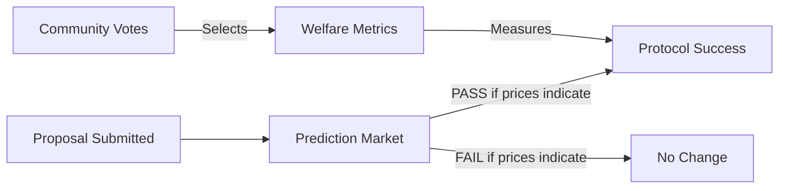

# Introduction to Prediction DAO

## What is Prediction DAO?

Prediction DAO is a futarchy-based governance system that uses prediction markets to make decisions about resource allocation and protocol changes.

## Core Concept: Futarchy

**"Vote on values, bet on beliefs"** - Robin Hanson

Traditional DAOs face a fundamental problem: voters may know what they want but not how to achieve it. Futarchy solves this by separating two types of decisions:

1. **Values** (What we care about): Decided by democratic voting
2. **Beliefs** (How to achieve values): Decided by prediction markets

### How It Works



1. **Democratic Phase**: Community votes on welfare metrics
   - What defines success for the protocol?
   - Examples: Treasury value, network activity, security

2. **Market Phase**: Traders bet on proposals
   - Will this proposal increase the welfare metric?
   - Market prices aggregate distributed knowledge

3. **Execution Phase**: Market determines outcome
   - If PASS price > FAIL price: Proposal executes
   - If FAIL price > PASS price: Proposal rejected

## Why Futarchy?

### Problems with Traditional Governance

❌ **Voter Ignorance**: Most voters lack expertise to evaluate technical proposals

❌ **Misaligned Incentives**: Voters don't have skin in the game

❌ **Poor Information Aggregation**: One-person-one-vote doesn't weight expertise

❌ **Collusion**: Vote buying and coordination attacks

### Futarchy Solutions

✅ **Aggregates Expertise**: Market prices reflect collective knowledge

✅ **Skin in the Game**: Traders profit only if they're correct

✅ **Information-Weighted**: Those with better information trade more

✅ **Privacy Protected**: Zero-knowledge proofs prevent vote buying

## System Architecture

### High-Level Overview

```
┌─────────────────────────────────────────┐
│         Futarchy Governor               │
│     (Main Coordination Layer)           │
└────────────┬────────────────────────────┘
             │
    ┌────────┼────────┬────────────┐
    ▼        ▼        ▼            ▼
┌───────┐ ┌──────┐ ┌──────┐ ┌──────────┐
│Welfare│ │Proposal│ │Markets│ │Privacy   │
│Metrics│ │Registry│ │       │ │Coordinator│
└───────┘ └────────┘ └──────┘ └──────────┘
```

### Components

1. **Welfare Metric Registry**: Tracks what we care about
2. **Proposal Registry**: Manages proposals and their lifecycle
3. **Conditional Market Factory**: Creates PASS/FAIL token markets
4. **Privacy Coordinator**: Encrypts positions and prevents collusion
5. **Oracle Resolver**: Determines actual welfare metric changes
6. **Ragequit Module**: Allows minority exit

## Key Innovations

### 1. Privacy Mechanisms

**Nightmarket Integration**: Zero-knowledge position encryption

- Positions encrypted with Poseidon hashes
- Groth16 zkSNARKs prove validity
- Individual positions remain private
- Only aggregate data is public

**MACI Integration**: Anti-collusion via key changes

- Encrypted key-change messages
- Invalidates previous commitments
- Prevents verifiable vote buying
- Makes collusion unenforceable

### 2. Conditional Tokens

Based on Gnosis Conditional Token Framework:

- **PASS tokens**: Redeemable if proposal passes and increases welfare
- **FAIL tokens**: Redeemable if proposal fails or decreases welfare
- **Market prices**: Reflect probability-weighted beliefs
- **LMSR**: Automated liquidity provision

### 3. Multi-Stage Oracle

**Designated Reporting**:

- Reporter posts bond (100 ETC)
- Submits welfare metric values
- Provides evidence (IPFS hash)

**Challenge Period**:

- 2-day community review
- Anyone can challenge with 150 ETC bond
- Escalate to UMA if disputed

**Finalization**:

- Accepts report or UMA decision
- Resolves markets
- Enables token redemption

### 4. Minority Protection

**Ragequit Mechanism** (from Moloch DAO):

- Exit with proportional treasury share
- Available during timelock period
- Prevents forced participation
- Protects dissenting minorities

## Workflow Example

### Complete Proposal Lifecycle

1. **Submission** (Day 0)
   - User submits proposal with 50 ETC bond
   - Enters 7-day review period
   - Community discusses proposal

2. **Market Creation** (Day 7)
   - Markets created with PASS/FAIL tokens
   - Initial price: 0.50 ETC each
   - Trading period begins (7-21 days)

3. **Trading** (Days 7-28)
   - Traders buy PASS if bullish on proposal
   - Traders buy FAIL if bearish on proposal
   - All positions encrypted with ZK proofs
   - Prices adjust via LMSR

4. **Resolution** (Day 28)
   - Oracle reports welfare metric values
   - Provides evidence for both scenarios
   - 3-day settlement window

5. **Challenge** (Days 28-30)
   - Community can challenge report
   - Challenger posts 150 ETC bond
   - Escalate to UMA if challenged

6. **Execution** (Day 32)
   - 2-day timelock period
   - Ragequit window opens
   - If PASS > FAIL: Execute proposal
   - If FAIL > PASS: Reject proposal

## Use Cases

### What Futarchy Works Well For

✅ **Treasury Management**: Investment decisions with clear ROI

✅ **Protocol Upgrades**: Technical changes with measurable impacts

✅ **Resource Allocation**: Grants and funding with defined outcomes

✅ **Feature Prioritization**: Development decisions affecting metrics

### What Futarchy Doesn't Work For

❌ **Purely Subjective Decisions**: Values, ethics, community standards

❌ **Unmeasurable Outcomes**: Changes without clear metrics

❌ **Time-Sensitive Decisions**: Emergencies requiring immediate action

❌ **Constitutional Changes**: Fundamental governance modifications

## Benefits

### For the Protocol

- **Better Decisions**: Leverages distributed knowledge
- **Aligned Incentives**: Traders profit from accuracy
- **Objective Outcomes**: Based on measurable metrics
- **Continuous Learning**: System improves over time

### For Participants

- **Meaningful Participation**: Contribute expertise via trading
- **Financial Upside**: Profit from correct predictions
- **Privacy Protection**: Anonymous participation
- **Minority Rights**: Exit option via ragequit

## Challenges and Mitigations

### Challenge: Market Manipulation

**Mitigations**:

- TWAP (Time-Weighted Average Price) oracles
- Privacy prevents front-running
- Multi-day trading periods
- Oracle verification process

### Challenge: Low Liquidity

**Mitigations**:

- LMSR automated market maker
- Bounded loss for protocol
- Treasury-backed liquidity
- No counterparty needed

### Challenge: Oracle Accuracy

**Mitigations**:

- Bond requirements (100 ETC)
- Evidence requirements
- Challenge mechanism (150 ETC)
- UMA escalation path

### Challenge: Privacy vs Transparency

**Mitigations**:

- Aggregate data public
- Individual positions private
- Verifiable via zkSNARKs
- Audit trail for disputes

## Future Development

### Phase 1 (Current)

- Core futarchy system
- Basic privacy features
- Single-metric evaluation

### Phase 2

- Multi-metric aggregation
- Advanced ZK circuits
- Layer 2 deployment
- Mobile application

### Phase 3

- Cross-chain governance
- Reputation systems
- Automated welfare tracking
- AI-assisted analysis

### Phase 4

- Full decentralization
- Meta-governance (futarchy governs itself)
- DAO-of-DAOs coordination
- Universal governance framework

## Learn More

- [How It Works](how-it-works.md) - Detailed technical explanation
- [Privacy Mechanisms](privacy.md) - ZK proofs and anti-collusion
- [Security Model](security.md) - Threat models and protections
- [Governance](governance.md) - Progressive decentralization

## References

- [Original Futarchy Specification](https://gist.github.com/realcodywburns/8c89419db5c7797b678afe5ee66cc02b)
- [Nightmarket Privacy](https://blog.zkga.me/nightmarket)
- [MACI Anti-Collusion](https://github.com/privacy-scaling-explorations/maci)
- [Gnosis Conditional Tokens](https://docs.gnosis.io/conditionaltokens/)
