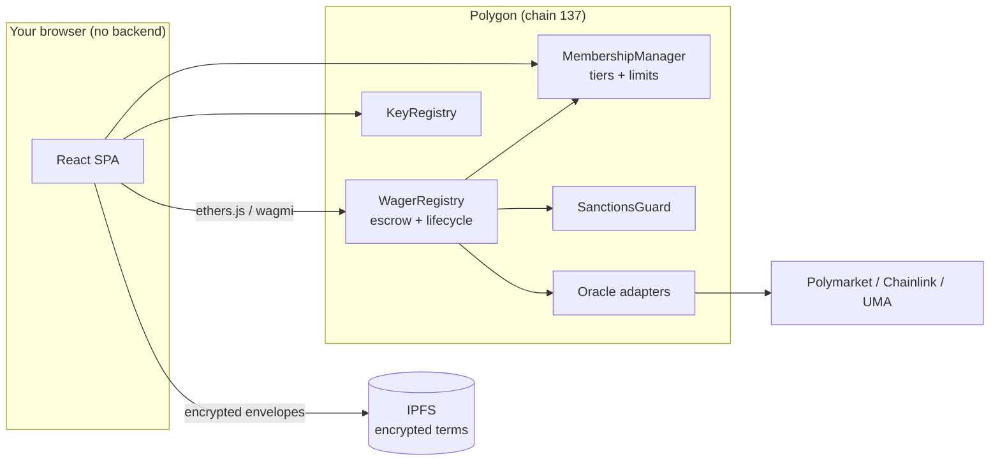

# Introduction

## What is FairWins?

FairWins is a **peer-to-peer wager management layer**: a set of smart contracts
on Polygon that escrow stakes for 1-v-1 wagers and settle them from a resolution
source the two parties agree on up front, plus a React single-page app that makes
the whole flow usable from a phone.

It is deliberately **not** a prediction market. There is no order book, no
liquidity pool, no market maker, and no token trading. Every wager is a private
agreement between exactly two people (optionally with a named arbitrator), and
the protocol's only job is to hold the stakes and pay the right person.

> Before purchasing a membership, please read
> [Roles and Tiers](roles-and-tiers.md) and the
> [Account Moderation Policy](account-moderation.md) — the protocol can be
> paused by a Guardian role holder and individual accounts can be frozen by
> an Account Moderator role holder.

## The problem it solves

Informal bets between friends have two failure modes:

1. **Settlement risk** — the loser doesn't pay up.
2. **Disagreement risk** — the parties can't agree on what actually happened.

FairWins removes the first with on-chain escrow: both stakes are locked in
`WagerRegistry` the moment a wager is accepted, and the contract — not the
counterparty — pays the winner. It mitigates the second by letting the parties
pick a resolution mechanism *before* the wager starts:

- trust each other (**Either** party can declare the winner),
- trust one party (**Creator** or **Opponent** declares),
- trust a neutral friend (**Third Party** arbitrator), or
- trust an external **oracle** (Polymarket, Chainlink Data Feed, Chainlink
  Functions, or UMA's Optimistic Oracle V3).

If resolution never happens, nobody loses their money: once the resolve
deadline passes, either party can trigger a refund and both stakes go back
where they came from. A draw path also exists — with both parties' consent (or
an arbitrator's ruling) the wager settles as a draw and each side gets its own
stake back.

## System at a glance

```mermaid
flowchart LR
    subgraph Client ["Your browser (no backend)"]
        SPA[React SPA]
    end
    subgraph Polygon ["Polygon (chain 137)"]
        WR[WagerRegistry<br/>escrow + lifecycle]
        MM[MembershipManager<br/>tiers + limits]
        SG[SanctionsGuard]
        KR[KeyRegistry]
        OA[Oracle adapters]
    end
    IPFS[(IPFS<br/>encrypted terms)]
    EXT[Polymarket / Chainlink / UMA]

    SPA -->|ethers.js / wagmi| WR
    SPA --> MM
    SPA --> KR
    SPA -->|encrypted envelopes| IPFS
    WR --> MM
    WR --> SG
    WR --> OA
    OA --> EXT
```

## Design principles

- **No backend.** The app is a static SPA served by nginx; every read and write
  goes straight from the user's wallet to the chain (or to IPFS for encrypted
  metadata). There is no application server that could censor, front-run, or
  lose your data.
- **Escrow first.** Funds only move through `WagerRegistry`. Payouts are
  pull-based (`claimPayout`) and refunds are always reachable.
- **Privacy by default.** Wager terms can be end-to-end encrypted client-side
  and stored on IPFS; the chain only sees a hash and a content URI. See
  [Privacy Mechanisms](privacy.md).
- **Compliance without custody.** `SanctionsGuard` screens addresses against the
  Chainalysis sanctions oracle at create/accept time, and an Account Moderator
  role can freeze accounts for cause — but no operator can take escrowed funds.
  See [Security Model](security.md) and [Account Moderation](account-moderation.md).
- **Membership-gated creation.** Creating and accepting wagers requires an
  active membership tier (Bronze → Platinum, priced in USDC), which also rate
  limits how many wagers an account can run concurrently. See
  [Roles and Tiers](roles-and-tiers.md).

## Where things live

| Layer | Technology | Location |
|-------|-----------|----------|
| Contracts | Solidity (Hardhat) | `contracts/` — deployed on Polygon 137 & Amoy 80002 |
| Frontend | React + Vite + wagmi/ethers | `frontend/` — served at [fairwins.app](https://fairwins.app) |
| Encrypted metadata | IPFS (Pinata) | referenced from each wager's `metadataUri` |
| Address book | JSON deployment records | `deployments/` (source of truth) |

## A note on the project's history

This repository began as *prediction-dao-research*: an exploration of
futarchy-based DAO governance (ClearPath), conditional-token markets, and
friend-group market factories. That research is preserved in `docs/archived/`
and `contracts-archive/`, but none of it is deployed or maintained. The live
product is the P2P wager system described in these docs.

Continue with [How It Works](how-it-works.md) for the full wager lifecycle.
