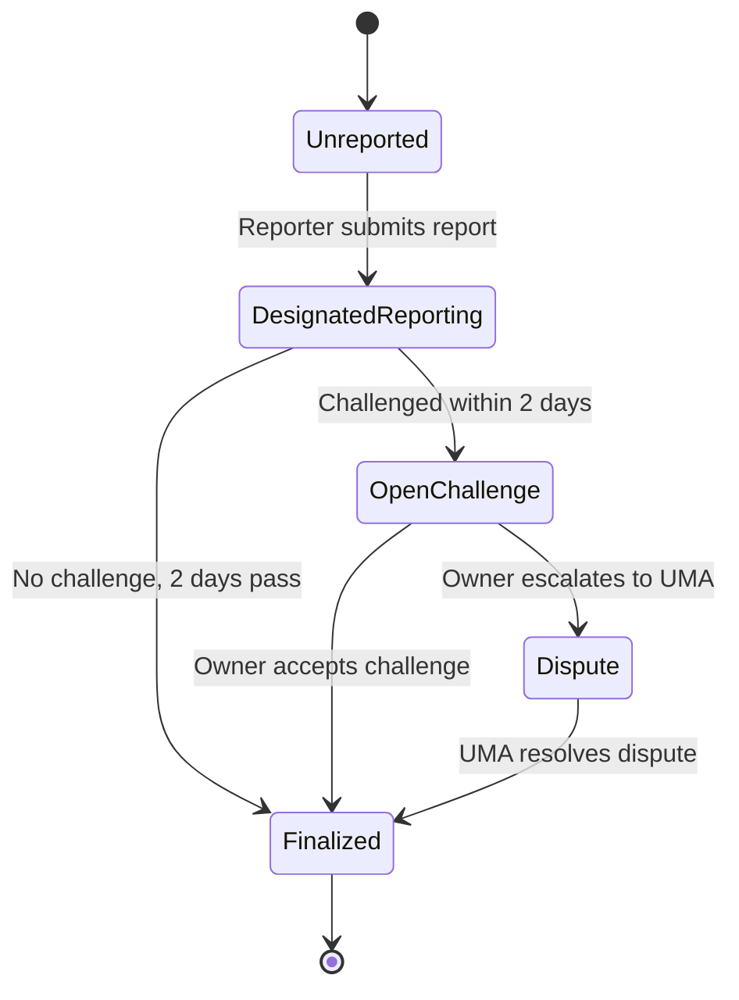

# Oracle Resolution

Multi-stage oracle resolution system for determining proposal outcomes with built-in dispute mechanisms.

## Overview

The Oracle Resolution module is a critical component of the Prediction DAO that determines the actual welfare metric values after a proposal's trading period ends. It implements a multi-stage resolution process with challenge and dispute mechanisms to ensure accuracy and fairness.

## Why Multi-Stage Oracle Resolution?

### Problems with Simple Oracles

❌ **Single Point of Failure**: One reporter determines the outcome

❌ **No Accountability**: Incorrect reports can't be contested

❌ **Easy to Manipulate**: Small incentive to report accurately

❌ **No Recourse**: Disagreements have no resolution mechanism

### Solutions Provided

✅ **Multi-Stage Process**: Report → Challenge → Dispute → Finalization

✅ **Economic Security**: Large bonds (100 ETH reporter, 150 ETH challenger) ensure honest reporting

✅ **Dispute Mechanism**: UMA-style escalation for contentious cases

✅ **Time-Based Windows**: 2-day challenge period allows community review

## Resolution Stages

The oracle resolution process moves through five distinct stages:



### Stage 0: Unreported

**Initial State**: No report has been submitted for this proposal.

**Who Can Act**: Designated reporters only

**Next Steps**: 
- Designated reporter submits initial report (moves to DesignatedReporting)

### Stage 1: Designated Reporting

**State**: Initial report submitted, within challenge period.

**Duration**: 2 days (CHALLENGE_PERIOD)

**Who Can Act**: 
- Anyone can challenge (moves to OpenChallenge)
- Owner can finalize after challenge period expires

**Bond Requirements**:
- Reporter: 100 ETH (REPORTER_BOND)
- Challenger: 150 ETH (CHALLENGER_BOND)

**Evidence Required**: IPFS hash or URL containing report justification

### Stage 2: Open Challenge

**State**: Report has been challenged by community member.

**Who Can Act**: Owner only

**Available Actions**:
- Accept challenge and finalize with challenger's values
- Escalate to UMA dispute resolution
- Review evidence from both reporter and challenger

**Next Steps**:
- Immediate finalization (challenger wins)
- Escalate to Dispute stage

### Stage 3: Dispute

**State**: Escalated to UMA Optimistic Oracle for resolution.

**Duration**: Depends on UMA dispute resolution (typically 2-7 days)

**Process**:
1. Owner escalates dispute to UMA
2. UMA token holders vote on correct values
3. UMA returns resolution decision
4. Owner finalizes with UMA's decision

**Note**: In current implementation, dispute resolution values are determined by governance. Full UMA integration is planned for future phases.

### Stage 4: Finalized

**State**: Resolution complete, values locked in.

**Immutable**: Cannot change once finalized

**Bond Distribution**: 
- Unchallenged: Reporter receives bond back
- Challenged (accepted): Challenger receives both bonds
- Disputed: Winner determined by UMA receives bonds

## Functional Flows

### Flow 1: Unchallenged Resolution (Happy Path)

**Scenario**: Reporter submits accurate report, no challenges.

**Timeline**: ~2 days

```
Day 0, Hour 0: Reporter submits report (100 ETH bond)
              ↓
Day 0-2:      Challenge period (community reviews)
              ↓
Day 2+:       Owner finalizes resolution
              ↓
              Reporter receives 100 ETH bond back
              ↓
              Proposal can be executed based on values
```

**Actors**:
1. **Designated Reporter**: Submits welfare metric values with evidence
2. **Community**: Reviews report during challenge period (no action)
3. **Owner/Governance**: Finalizes after challenge period expires

**Integration Test Coverage**:
- ✅ Report submission with correct bond
- ✅ Challenge period expiration
- ✅ Finalization after period ends
- ✅ Bond return to reporter
- ✅ Values correctly stored

### Flow 2: Challenged Resolution

**Scenario**: Reporter submits report, challenger contests with better data.

**Timeline**: ~Immediate to 1 day

```
Day 0, Hour 0:  Reporter submits report (100 ETH bond)
                ↓
Day 0, Hour 6:  Challenger contests (150 ETH bond)
                ↓ 
Day 0, Hour 12: Owner reviews both evidences
                ↓
                Owner accepts challenge
                ↓
                Challenger receives 250 ETH (both bonds)
                ↓
                Proposal uses challenger's values
```

**Actors**:
1. **Designated Reporter**: Submits initial report
2. **Challenger**: Contests with counter-evidence
3. **Owner/Governance**: Reviews and accepts challenge
4. **Community**: Monitors dispute outcome

**Integration Test Coverage**:
- ✅ Challenge submission with correct bond
- ✅ Challenge within 2-day window
- ✅ Late challenge rejection
- ✅ Owner accepting challenge
- ✅ Bond redistribution to challenger
- ✅ Values updated to challenger's submission

### Flow 3: Disputed Resolution (UMA Escalation)

**Scenario**: Both reporter and challenger have valid arguments, needs third-party resolution.

**Timeline**: 3-7 days (depends on UMA)

```
Day 0:     Reporter submits report (100 ETH bond)
           ↓
Day 1:     Challenger contests (150 ETH bond)
           ↓
Day 2:     Owner escalates to UMA dispute
           ↓
Day 2-7:   UMA token holders vote on correct values
           ↓
Day 7:     UMA resolves with final values
           ↓
           Owner finalizes with UMA decision
           ↓
           Winning party receives bonds
```

**Actors**:
1. **Designated Reporter**: Submits initial report
2. **Challenger**: Contests with counter-evidence
3. **Owner/Governance**: Escalates to UMA
4. **UMA Token Holders**: Vote on correct values (external system)
5. **UMA Oracle**: Returns final decision

**Integration Test Coverage**:
- ✅ Dispute escalation
- ✅ Stage transition to Dispute
- ✅ Finalization after dispute
- ✅ State verification at each stage
- ✅ Invalid escalation rejection

### Flow 4: Multiple Parallel Resolutions

**Scenario**: Multiple proposals being resolved simultaneously.

**Timeline**: Overlapping

```
Proposal A: Stage 1 (Reporting)
Proposal B: Stage 2 (Challenged)
Proposal C: Stage 3 (Disputed)
Proposal D: Stage 4 (Finalized)

Each maintains independent state
No interference between proposals
Bonds tracked separately per proposal
```

**Integration Test Coverage**:
- ✅ Multiple proposals at different stages
- ✅ Independent state management
- ✅ Correct finalization of each
- ✅ No state interference

## Bond Mechanics

### Bond Amounts

| Role | Bond Amount | Purpose |
|------|-------------|---------|
| Reporter | 100 ETH | Ensure accurate initial reporting |
| Challenger | 150 ETH | Prevent frivolous challenges |

**Why Challenger Bond is Higher**: 
- Discourages spam challenges
- Compensates reporter for work if challenge fails
- Ensures only serious disputes are raised

### Bond Distribution Scenarios

#### Scenario 1: No Challenge
```
Reporter bond: 100 ETH → Returned to reporter
Total: 100 ETH back to reporter
```

#### Scenario 2: Challenge Accepted
```
Reporter bond: 100 ETH ┐
Challenger bond: 150 ETH ┘→ 250 ETH to challenger
Total: 250 ETH to challenger
```

#### Scenario 3: Challenge Rejected (Future)
```
Reporter bond: 100 ETH ┐
Challenger bond: 150 ETH ┘→ 250 ETH to reporter
Total: 250 ETH to reporter
```

**Note**: Current implementation always accepts challenges when escalated. Future versions will implement full resolution logic.

## Time Windows

### Challenge Period: 2 Days

**Purpose**: Allow community to review and contest reports

**Starts**: When report is submitted

**Ends**: 2 days (172,800 seconds) after submission

**Actions During**:
- Anyone can submit challenge with 150 ETH bond
- Community reviews evidence
- Reporter cannot modify report

**After Expiration**:
- No new challenges accepted
- Report can be finalized
- Values become locked

### Settlement Window: 3 Days

**Purpose**: Maximum time for full resolution including disputes

**Starts**: When report is submitted

**Covers**: Report + Challenge + Dispute resolution

**Used For**: Proposal execution timing

## Access Control

### Designated Reporters

**Who**: Addresses approved by governance

**How to Become**: 
1. Demonstrate oracle expertise
2. Proposal to add reporter
3. Approved through futarchy process

**Responsibilities**:
- Submit accurate welfare metric values
- Provide evidence (IPFS/URL)
- Respond to challenges
- Build reputation

**Current Default**: Contract owner is default reporter

### Owner Powers

**Who**: Initially owner, then FutarchyGovernor contract

**Powers**:
1. Add/remove designated reporters
2. Finalize resolutions (after challenge period)
3. Escalate to UMA disputes
4. Accept/reject challenges

**Limitations**:
- Cannot modify bonds
- Cannot bypass challenge period
- Cannot change finalized resolutions

### Anyone Can

- Submit challenges (with 150 ETH bond)
- View resolution status
- Query report/challenge details
- Monitor evidence

## Evidence System

### Evidence Storage

**On-Chain**: Stored as `bytes` in contract

**Typical Format**:
- IPFS hash: `QmXxx...` 
- URL: `https://evidence.example.com/proposal/123`
- Encoded data: Any bytes format

**Off-Chain Validation**: Community reviews evidence quality

### Evidence Requirements

**For Reports**:
- Data sources used
- Calculation methodology
- Timestamps of data collection
- Raw data or aggregates

**For Challenges**:
- Counter-data sources
- Why original report is incorrect
- Alternative calculation
- Supporting documentation

**Validation**: Primarily off-chain through community/governance review

## Integration with System

### Integration Points

```
ProposalRegistry ←→ OracleResolver
        ↓                  ↓
FutarchyGovernor ←→ ConditionalMarket
```

#### 1. ProposalRegistry

**Links**:
- Each proposal has associated proposal ID
- Oracle resolution tracks by proposal ID

**Data Flow**:
- Proposal created → ID generated
- Trading ends → Oracle resolution begins
- Resolution finalized → Proposal can execute

#### 2. FutarchyGovernor

**Uses Oracle Data**:
- Determines if proposal should execute
- Compares PASS vs FAIL market values
- Executes if oracle shows improvement

**Control**:
- FutarchyGovernor owns OracleResolver
- Can add/remove reporters
- Finalizes resolutions

#### 3. ConditionalMarket

**Market Settlement**:
- Oracle values determine winning outcome
- PASS tokens redeemable if passValue used
- FAIL tokens redeemable if failValue used

## Integration Testing

### Test Coverage (14 Tests)

Our integration tests validate the complete resolution lifecycle:

#### 1. Happy Path Tests (2 tests)
- ✅ Unchallenged resolution with bond return
- ✅ Complete lifecycle from submission to finalization

#### 2. Challenge Tests (2 tests)
- ✅ Successful challenge with bond redistribution
- ✅ Late challenge rejection after period expires

#### 3. Dispute Tests (2 tests)
- ✅ UMA escalation workflow
- ✅ Invalid escalation rejection

#### 4. Access Control Tests (3 tests)
- ✅ Designated reporter enforcement
- ✅ Owner-only finalization
- ✅ Bond amount validation

#### 5. Parallel Tests (1 test)
- ✅ Multiple proposals at different stages

#### 6. Edge Cases (2 tests)
- ✅ Double reporting prevention
- ✅ Double finalization prevention

#### 7. Query Tests (2 tests)
- ✅ State verification at all stages
- ✅ Report/challenge data retrieval

### Test Execution

```bash
# Run oracle integration tests
npm run test:integration:oracle

# Run with gas reporting
REPORT_GAS=true npm run test:integration:oracle

# Run specific test file
npx hardhat test test/integration/oracle/multi-stage-resolution.test.js
```

### Test Results

```
Integration: Multi-Stage Oracle Resolution
  Happy Path: Unchallenged Resolution
    ✓ Should complete oracle resolution without challenge
  Challenge Workflow: Successful Challenge
    ✓ Should handle challenge and award bonds to challenger
    ✓ Should reject challenge after challenge period expires
  Dispute Escalation Workflow
    ✓ Should escalate to UMA dispute resolution
    ✓ Should reject escalation if not in challenge stage
  Bond Management and Access Control
    ✓ Should require correct bond amounts
    ✓ Should enforce designated reporter access
    ✓ Should enforce owner-only finalization
  Multiple Resolutions in Parallel
    ✓ Should handle multiple proposals at different stages
  Edge Cases and Error Conditions
    ✓ Should prevent double reporting
    ✓ Should prevent double finalization
    ✓ Should accept empty evidence (off-chain validation)
  Query Functions and State Verification
    ✓ Should return correct resolution details at each stage
    ✓ Should return detailed report and challenge information

14 passing (706ms)
```

## Security Considerations

### Economic Security

**Bond Sizing**:
- 100 ETH reporter bond = ~$250,000 @ $2,500/ETH
- 150 ETH challenger bond = ~$375,000 @ $2,500/ETH
- High enough to prevent spam/manipulation
- Low enough to allow legitimate participation

### Smart Contract Security

✅ **Reentrancy Protection**: `ReentrancyGuard` on all state-changing functions

✅ **Access Control**: Only designated reporters can submit reports

✅ **State Validation**: Each stage transition validated

✅ **Immutability**: Finalized resolutions cannot be changed

✅ **Time Locks**: Challenge period enforced by block timestamps

### Operational Security

**Designated Reporter Management**:
- Multiple reporters possible
- Add/remove through governance
- Reputation tracking (future)

**Evidence Verification**:
- Community reviews during challenge period
- Multiple data sources recommended
- Off-chain validation by governance

**Dispute Resolution**:
- UMA provides neutral third-party
- Token holder voting on disputes
- Economic incentives for correct resolution

## Future Enhancements

### Phase 1: UMA Integration

**Full UMA Optimistic Oracle V3**:
- Automated dispute resolution
- UMA token holder voting
- Programmatic bond resolution
- Cross-chain dispute coordination

### Phase 2: Reputation System

**Reporter Reputation Tracking**:
- Historical accuracy rate
- Challenge frequency
- Response time metrics
- Reputation-based bond discounts

### Phase 3: Automated Verification

**Automated Data Sources**:
- Chainlink price feeds integration
- The Graph for on-chain data
- API3 for off-chain data
- Multi-source aggregation

### Phase 4: Decentralized Reporters

**Open Reporter Network**:
- Anyone can become reporter
- Reputation-based selection
- Economic staking mechanism
- Slashing for bad reports

## Common Scenarios

### Scenario: Proposal Needs Oracle Resolution

1. Proposal trading period ends
2. FutarchyGovernor calls OracleResolver
3. Designated reporter has 24 hours to submit
4. Reporter submits with evidence (100 ETH bond)
5. Community has 2 days to review and challenge
6. If no challenge: Resolution finalized, reporter bond returned
7. If challenged: Owner/governance reviews and decides
8. Proposal execution proceeds based on final values

### Scenario: Disputed Welfare Metric Values

1. Reporter submits: Treasury increased 10%
2. Challenger contests: Treasury actually decreased 5%
3. Both provide evidence (data sources, calculations)
4. Owner/governance reviews both claims
5. If clear winner: Finalize with correct values
6. If unclear: Escalate to UMA for third-party resolution
7. UMA token holders vote on correct values
8. Winner receives both bonds, proposal executes with UMA values

### Scenario: Reporter Submits False Report

1. Reporter submits incorrect values (100 ETH bond)
2. Community member notices error
3. Challenger submits correct values (150 ETH bond)
4. Owner reviews evidence, confirms challenger is correct
5. Resolution finalized with challenger's values
6. Challenger receives 250 ETH (both bonds)
7. Reporter loses 100 ETH bond as penalty

## Monitoring and Analytics

### Key Metrics to Track

**Resolution Quality**:
- Challenge rate per proposal
- Dispute escalation rate
- Average resolution time
- Reporter accuracy over time

**Economic Metrics**:
- Total bonds in system
- Bond forfeitures per month
- Average bond return time
- UMA resolution costs

**Participation Metrics**:
- Number of designated reporters
- Active reporter count
- Challenge submission rate
- Community engagement in reviews

## For More Details

### Documentation
- [Introduction](introduction.md) - Overall system overview
- [How It Works](how-it-works.md) - Futarchy mechanism
- [Governance](governance.md) - Decision making process
- [Security Model](security.md) - Security architecture

### Implementation
- [Phase 3 Implementation](../../PHASE3_ORACLE_INTEGRATION_TESTS.md) - Technical details
- [OracleResolver Contract](../../contracts/OracleResolver.sol) - Source code
- [Integration Tests](../../test/integration/oracle/multi-stage-resolution.test.js) - Test suite
- [Architecture](../../ARCHITECTURE.md) - System architecture

### API Reference
- [OracleResolver API](../reference/oracle-resolver.md) - Contract interface
- [Helper Functions](../../test/integration/helpers/index.js) - Test helpers
