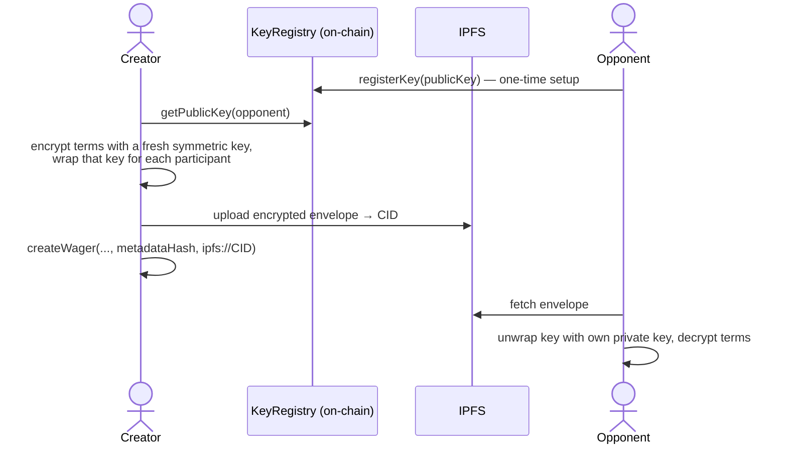

# Privacy Mechanisms

What's public, what's private, and how FairWins keeps wager terms readable
only by the people involved.

## The privacy model

A wager has two kinds of data:

| Data | Where it lives | Who can see it |
|------|----------------|----------------|
| Participants' addresses, stake amounts, token, deadlines, status, winner | On-chain (`WagerRegistry`) | Everyone — it's a public blockchain |
| The wager's **terms** (what the bet is actually about) | IPFS, optionally end-to-end encrypted | Only the creator, opponent, and arbitrator (if any) |

FairWins does not try to hide *that* two addresses wagered — that's inherent
to on-chain escrow. What it protects is the **content**: the description,
conditions, and any context the parties wrote down. The chain stores only a
hash of the terms (for tamper evidence) and a content URI.

## Envelope encryption

1. Each participant registers an encryption **public key** in the on-chain
   `KeyRegistry` (one transaction, done from the app's *Security* tab). The
   private key is derived deterministically from a wallet signature — nothing
   to back up separately.
2. When creating a private wager, the app encrypts the terms with a fresh
   symmetric key, then wraps that key separately for the creator, the
   opponent, and the arbitrator (if one is named) — a standard **envelope
   encryption** scheme.
3. The encrypted envelope is pinned to IPFS; only its hash and CID go
   on-chain. Anyone can fetch the ciphertext, but only key-holders can read it.
4. Decryption happens lazily, client-side, when a participant opens the wager.

### Post-quantum keys

Envelopes use the **X-Wing** hybrid KEM (X25519 + ML-KEM-768) with
ChaCha20-Poly1305, so recorded ciphertexts stay confidential even against a
future quantum adversary. The decision and full scheme are documented in
[ADR-003](../adr/003-xwing-post-quantum-encryption.md) and the
[Encryption Architecture](../developer-guide/encryption-architecture.md) /
[Envelope Encryption Spec](../developer-guide/envelope-encryption-spec.md).

## What this gives you

- **Confidential terms** — bystanders and indexers see that a wager exists,
  not what it's about.
- **Tamper evidence** — the on-chain `metadataHash` pins the exact terms both
  parties agreed to; neither can quietly rewrite them.
- **Arbitrator access** — third-party resolvers get their own wrapped key, so
  they can actually read what they're ruling on, without making the terms
  public.
- **No servers to trust** — encryption and decryption happen entirely in the
  browser; IPFS only ever stores ciphertext.

## Limitations to understand

- Addresses, amounts, and timing are public. Anyone who knows your address
  can see your wager activity and stake sizes.
- If you share the decrypted terms (or your derived key) with someone, the
  protocol can't revoke that.
- Unencrypted wagers are exactly that — the app supports plain-text terms for
  casual bets where privacy doesn't matter.

## Historical note

Earlier research phases of this repository explored zero-knowledge position
encryption (Poseidon commitments, Groth16 proofs) and MACI-style
anti-collusion for governance market trading. That work was specific to the
superseded futarchy/governance design and is preserved in `docs/archived/`;
none of it is part of the deployed wager system.
