# Understanding ConditionalMarketFactory: A "Will It Rain Tomorrow?" Story

This guide explains how the ConditionalMarketFactory contract works using a practical binary prediction market example: "Will it rain tomorrow in New York?"

## Overview

The ConditionalMarketFactory helps you set up prediction markets where people can bet on binary outcomes (yes/no questions) using tokens backed by real collateral.

## The Rain Prediction Market Example

Imagine you want to create a prediction market for **"Will it rain tomorrow in New York?"**


## Market Lifecycle

### 1️⃣ Creating the Market

**Function:** `deployMarketPair()`

The market creator deploys a new prediction market with the following parameters:

- `proposalId`: Unique ID for this prediction (e.g., "NY_RAIN_JAN6_2026")
- `collateralToken`: Currency for betting (e.g., USDC stablecoin address)
- `liquidityAmount`: Initial market liquidity (e.g., 10,000 USDC)
- `liquidityParameter`: LMSR beta parameter for price curves
- `tradingPeriod`: How long trading is allowed (7-21 days)
- `betType`: `BetType.YesNo` for "YES it will rain" vs "NO it won't"

**What happens behind the scenes:**


1. Contract creates a "condition" in CTF1155 (Conditional Token Framework)
2. Two outcome positions are generated:
   - **RAIN tokens** (representing "YES, it will rain")
   - **NO-RAIN tokens** (representing "NO, it won't rain")
3. These are stored as `positionIds` in the CTF1155 contract
4. A trading period is set (e.g., 7 days - market closes right before tomorrow arrives)

### 2️⃣ Buying Predictions

**Function:** `buyTokens(marketId, buyPass, amount)`

#### Alice Believes It Will Rain

Alice wants to buy RAIN tokens to bet on rain:

```solidity
// Alice calls:
buyTokens(marketId, buyPass=true, amount=100 USDC)
```

**The Process:**


**Result:**
- Alice's 100 USDC collateral is sent to the contract
- The contract "splits" her collateral into BOTH outcomes using CTF1155:
  - ✅ **100 RAIN tokens** (Alice receives these!)
  - 📦 **100 NO-RAIN tokens** (contract keeps these for later)

#### Bob Thinks It Won't Rain

Bob buys NO-RAIN tokens:

```solidity
// Bob calls:
buyTokens(marketId, buyPass=false, amount=50 USDC)
```

**Result:**
- Bob's 50 USDC is split into 50 RAIN + 50 NO-RAIN tokens
- ✅ Bob receives **50 NO-RAIN tokens** for his prediction
- 📦 Contract keeps **50 RAIN tokens**

> **Key Insight:** Every 1 USDC of collateral creates BOTH 1 RAIN and 1 NO-RAIN token. This maintains the guarantee that exactly one outcome will win!

### 3️⃣ Trading Positions (Selling)

**Function:** `sellTokens(marketId, sellPass, tokenAmount)`

Before the market closes, Charlie changes his mind about rain:

```solidity
// Charlie originally bought 75 RAIN tokens but now thinks it won't rain
sellTokens(marketId, sellPass=true, tokenAmount=75)
```

**The Merging Process:**


**Result:**
- Contract needs the OPPOSITE position to "merge" back to collateral
- Charlie's 75 RAIN + contract's 75 NO-RAIN = 75 USDC collateral
- Charlie receives his 75 USDC back

> **This is why the contract keeps the opposite positions when people buy!**

### 4️⃣ Market Resolution

**Function:** `resolveMarket(marketId, passValue, failValue)`

Tomorrow arrives and the oracle checks: **Did it rain?**

```mermaid
graph TD
    A[Tomorrow Arrives] --> B{Oracle Checks Weather}
    B -->|It Rained ☔| C[Scenario A]
    B -->|It Didn't Rain ☀️| D[Scenario B]
    
    C --> E[resolveMarket passValue=1, failValue=0]
    E --> F[RAIN tokens: payout = 1]
    E --> G[NO-RAIN tokens: payout = 0]
    
    D --> H[resolveMarket passValue=0, failValue=1]
    H --> I[RAIN tokens: payout = 0]
    H --> J[NO-RAIN tokens: payout = 1]
```



#### Scenario A - It Rained! ☔

```solidity
// Oracle calls:
resolveMarket(marketId, passValue=1, failValue=0)
```

- This tells CTF1155: **RAIN tokens win** (payout=1), **NO-RAIN tokens lose** (payout=0)
- The condition is marked as resolved
- RAIN token holders can now redeem their tokens 1:1 for USDC

#### Scenario B - It Didn't Rain! ☀️

```solidity
// Oracle calls:
resolveMarket(marketId, passValue=0, failValue=1)
```

- **NO-RAIN tokens win**, **RAIN tokens lose**
- NO-RAIN token holders can redeem their tokens for USDC

### 5️⃣ Claiming Winnings

**Function:** `CTF1155.redeemPositions()`

After resolution, winners redeem their tokens for collateral through the CTF1155 contract:

#### If It Rained ☔


- ✅ **Alice** has 100 RAIN tokens → Gets **100 USDC!** 🎉
- ❌ **Bob** has 50 NO-RAIN tokens → Gets **0 USDC** (he lost) 😢

#### If It Didn't Rain ☀️

- ❌ **Alice** gets **0 USDC** (her RAIN tokens are worthless)
- ✅ **Bob** gets **50 USDC** (his NO-RAIN tokens won!)

## Key Concepts Explained

### Binary Outcomes

Every market has exactly **2 possible outcomes** (rain/no-rain, yes/no, pass/fail, etc.). This is enforced by the contract architecture and the CTF1155 condition system.

### Conditional Tokens (CTF1155)

Think of these as **"maybe money"** - they're only worth something IF their condition is true:
- RAIN tokens are only valuable if it actually rains
- NO-RAIN tokens are only valuable if it doesn't rain
- Before resolution, both have speculative value based on probability

### Collateral

Real money (like USDC) that backs the prediction tokens:
- When you buy prediction tokens, your collateral is locked up until the outcome is known
- The total collateral in the market equals the sum of all winning tokens
- Collateral can be any ERC20 token, but stablecoins (USDC, DAI) are most common

### Position Splitting

**1 USDC always creates 1 RAIN + 1 NO-RAIN token.**

```
Input:  100 USDC collateral
        ↓
Split:  CTF1155.splitPosition()
        ↓
Output: 100 RAIN tokens + 100 NO-RAIN tokens
```

This ensures the math always works: since exactly one outcome will happen, the total value equals the collateral locked (1 USDC = 1 winning token).

### Position Merging

Having both RAIN and NO-RAIN tokens? You can merge them back to get your collateral:

```
Input:  75 RAIN tokens + 75 NO-RAIN tokens
        ↓
Merge:  CTF1155.mergePositions()
        ↓
Output: 75 USDC collateral
```

Since you're guaranteed to win either way (you have both sides!), you can always convert back to collateral.

### Market Resolution

An **oracle** (trusted data source) determines which outcome actually happened:
1. Oracle submits proof/evidence (weather data, API results, etc.)
2. Oracle calls `resolveMarket()` with payout values
3. This updates the CTF1155 contract with the final payouts
4. Winners can now claim their collateral

## Real-World Use Cases

The ConditionalMarketFactory supports various binary prediction markets:

### Weather Predictions
- Will it rain tomorrow?
- Will it snow this week?
- Will temperature be above/below 70°F?

### Sports Outcomes
- Will Team A win the game?
- Will total score be over/under 50 points?
- Will player score a goal?

### Governance Proposals
- Will the proposal pass?
- Will it be implemented on time?
- Will voter turnout exceed X%?

### Economic Indicators
- Will GDP be above/below forecast?
- Will inflation exceed target?
- Will stock price be higher/lower?

### Event Predictions
- Will product launch on time?
- Will event happen as scheduled?
- Will milestone be achieved?

## Trading Modes

The ConditionalMarketFactory supports two trading modes:

### ETCSwap Mode (Production)
When enabled, integrates with ETC Swap v3 for decentralized exchange trading:
- Creates liquidity pools for PASS/collateral and FAIL/collateral pairs
- Full DEX trading with slippage protection
- Market-driven pricing based on supply/demand

### Fallback Mode (Development/Testing)
Simplified LMSR-based automated market maker:
- Direct position splitting/merging via CTF1155
- Fixed 1:1 conversion rate
- Lower gas costs, simpler mechanics

## Contract References

- **ConditionalMarketFactory**: Main contract for creating and managing markets
- **CTF1155**: Gnosis Conditional Token Framework for position tokens
- **ETCSwapV3Integration**: DEX integration for advanced trading
- **TieredRoleManager**: Role-based access control for market creation

## See Also

- [Trading on Markets](trading-on-markets.md) - How to trade prediction tokens
- [Smart Contracts Guide](../developer-guide/smart-contracts.md) - Technical contract details
- [Practical Scenarios](practical-scenarios.md) - More market examples
