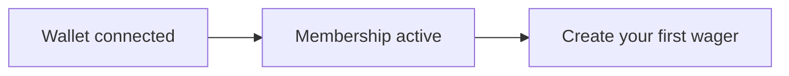

# Getting Started

This guide takes you from zero to ready-to-wager on
[fairwins.app](https://fairwins.app).

## What you'll need

- **A Web3 wallet** — MetaMask (browser extension) or any wallet that supports
  WalletConnect (mobile)
- **POL** — for gas fees on Polygon (a few dollars' worth lasts a long time)
- **USDC on Polygon** — for stakes and your membership fee
- **A modern browser** — Chrome, Firefox, Safari, or Brave

!!! danger "Security Warning"
    Never share your seed phrase with anyone. FairWins will never ask for it.

## 1. Install a wallet

If you don't already have one:

1. Visit [metamask.io](https://metamask.io) and install the extension, or use
   a WalletConnect-compatible mobile wallet
2. Create a new wallet or import an existing one
3. **Securely store** your seed phrase

## 2. Connect to the app

1. Open [fairwins.app](https://fairwins.app) and press **Launch App**
2. Read and acknowledge the eligibility notice (the [Terms](https://fairwins.app/terms),
   [Risk Disclosure](https://fairwins.app/risk), and [Privacy Policy](https://fairwins.app/privacy)
   are linked there and in the footer)
3. Click the wallet button in the header and choose **MetaMask** or
   **WalletConnect**
4. Approve the connection in your wallet

The app runs on **Polygon mainnet (chain 137)**. If your wallet is on another
network, a banner offers a one-click **Switch Network**. A testnet mode
(Polygon Amoy, chain 80002) can be toggled from the wallet dropdown if you want
to try things with test funds first.

=== "Polygon Mainnet (production)"

    - **Chain ID**: 137
    - **Currency**: POL
    - **Stake token**: USDC (`0x3c499c542cEF5E3811e1192ce70d8cC03d5c3359`)

=== "Polygon Amoy (testnet)"

    - **Chain ID**: 80002
    - **RPC URL**: https://rpc-amoy.polygon.technology
    - **Currency**: test POL (free from the [Polygon faucet](https://faucet.polygon.technology/))

## 3. Fund your wallet

You'll need POL for gas and USDC for stakes. Buy them on an exchange and
withdraw to Polygon, or bridge from another chain. The app's **Account Center →
Swap** tab can also swap tokens via Uniswap once you hold something on Polygon.

## 4. Get a membership

Creating and accepting wagers requires an active membership tier:

1. Open **My Account** (the Account Center) and select the **Membership** tab
2. Pick a tier — Bronze, Silver, Gold, or Platinum. Higher tiers allow more
   wagers per month and more running at the same time
3. Approve the USDC payment and confirm the purchase transaction

Memberships are time-bound and renewable. You can also receive one as a
[membership voucher](membership-vouchers.md) — a transferable token someone buys
and gifts you, which you redeem for the membership. Details and current pricing:
[Roles and Tiers](../system-overview/roles-and-tiers.md).

## 5. (Optional) Register an encryption key

If you want your wager terms end-to-end encrypted so only participants can read
them:

1. Go to **Account Center → Security**
2. Click **Register Key** and sign the message in your wallet

This publishes an encryption public key on-chain so friends can encrypt wager
terms for you. See [Private Wager Encryption](private-market-encryption.md).

## You're ready

Head to [Creating a Wager](create-wager.md) — or, if a friend sent you a QR
code or link, straight to [Accepting a Wager](accept-wager.md).

## Troubleshooting

| Problem | Fix |
|---------|-----|
| Wallet won't connect | Refresh the page; make sure only one wallet extension is active |
| "Wrong network" banner | Click **Switch Network**, or select Polygon manually in your wallet |
| Transaction fails on create/accept | Check you have an active membership tier and enough USDC + POL |
| Stake approval loops | Approve the exact USDC amount when prompted, then retry the action |
| QR scanner shows no camera | Allow camera access for fairwins.app in your browser settings |

More in the [FAQ](faq.md).
