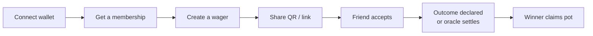

# User Guide Overview

FairWins lets you make a wager with a friend, lock both stakes in a smart
contract, and have the outcome settled by whoever — or whatever — you both
agreed to trust: each other, a neutral friend, or an external oracle like
Polymarket, Chainlink, or UMA.

This guide covers everything you do in the app at [fairwins.app](https://fairwins.app).

## The five-minute version

1. **Connect** a wallet (MetaMask or WalletConnect) on Polygon.
2. **Buy a membership** tier — this is what authorizes you to create and accept
   wagers, and sets how many you can run at once.
3. **Create a wager**: terms, stake (USDC), deadlines, and a resolution method.
4. **Share it** with your friend as a QR code or link — or post an
   [open challenge](open-challenges.md) that anyone with a four-word code can take.
5. They **accept**, their stake locks, and the bet is on.
6. When the event happens, the wager **resolves** — by one of you, an
   arbitrator, or an oracle — and the **winner claims** both stakes.

## Reading paths

- **New here?** Start with [Getting Started](getting-started.md), then skim
  [User Journeys](user-journeys.md) to see the full flows.
- **Making your first bet?** [Creating a Wager](create-wager.md), then
  [Accepting a Wager](accept-wager.md) for your friend's side.
- **No opponent in mind?** [Open Challenges](open-challenges.md) — post a wager
  anyone with the code can take.
- **Gifting access?** [Membership Vouchers](membership-vouchers.md).
- **Bet finished?** [Resolving a Wager](resolve-wager.md) covers declaring
  winners, draws, oracle settlement, and refunds.
- **Care about privacy?** [Private Wager Encryption](private-market-encryption.md)
  explains how wager terms stay readable only to participants.
- **Questions?** The [FAQ](faq.md).

## What you'll need

- A wallet on **Polygon mainnet** (chain 137) — the app can switch networks
  for you, and a testnet mode (Polygon Amoy) is available from the wallet menu.
- A little **POL** for gas.
- **USDC** for stakes and the membership fee.

## What FairWins is not

There is no order book, no trading, no house, and no token to farm. Wagers are
private 1-v-1 agreements; the protocol just escrows the stakes and pays the
winner. Operators can pause the protocol or freeze abusive accounts (see the
[Account Moderation Policy](../system-overview/account-moderation.md)), but
they can never take escrowed stakes.
