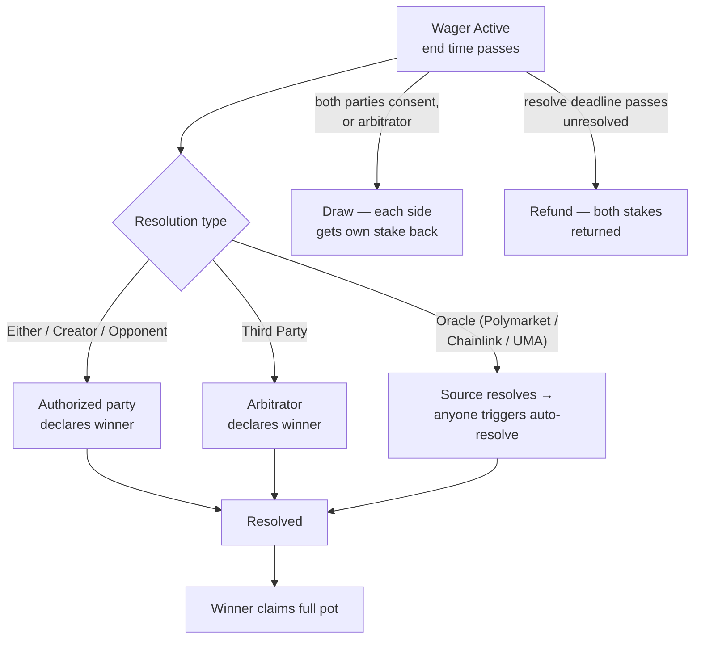

# Resolving a Wager

This guide covers the end of a wager's life: declaring a winner, draws, oracle
settlement, claiming the pot, and every way stakes come back if nothing
resolves.

## Resolution flow

## Declaring a winner

Who can declare depends on the resolution type fixed at creation:

| Resolution type | Who declares |
|----------------|--------------|
| Either | Creator or opponent |
| Creator only | The creator |
| Opponent only | The opponent |
| Third Party | The named arbitrator |
| Polymarket / Chainlink / UMA | Nobody — the oracle outcome is read on-chain; anyone can trigger it |

To declare:

1. Open *My Wagers* and find the wager (creators see resolution controls in
   the **Created** tab; arbitrators in the **Arbitrating** tab)
2. Click **Resolve** and select who won
3. Confirm the transaction (`declareWinner`)

The wager moves to **Resolved** and the winner can claim.

!!! tip "Encrypted wagers and arbitrators"
    If the terms were encrypted, the arbitrator received their own decryption
    key at creation, so they can read exactly what they're ruling on.

## Oracle settlement

For oracle-pegged wagers, the app shows *Awaiting Oracle* until the underlying
source resolves:

- **Polymarket** — the linked market settles on Polymarket
- **Chainlink Data Feed** — the price condition is evaluated at its deadline
- **Chainlink Functions** — the registered off-chain computation is fulfilled
- **UMA** — the assertion survives its dispute window

Once the source has resolved, **anyone** can trigger settlement on-chain (the
app exposes a button; the contract calls are `autoResolveFromPolymarket` /
`autoResolveFromOracle`). The outcome maps to whichever side the creator
declared they were taking when the wager was made. A tied or invalid oracle
outcome settles as a draw.

## Draws

If you both agree the bet was a push:

1. One party clicks **Propose Draw** (`declareDraw`) — this records consent
2. The other party clicks the same — the wager settles as a **Draw** and each
   side's own stake is returned automatically

Either party can withdraw consent (`revokeDraw`) before the other agrees. For
third-party wagers, the arbitrator's single draw declaration settles
immediately.

## Claiming the pot

Once resolved:

1. Open the wager (it's now in *My Wagers → History*)
2. If you won, click **Claim Winnings** and confirm (`claimPayout`)
3. The full pot — your stake plus your opponent's — transfers to your wallet

Claims are pull-based and can only be made once. There is no claim deadline;
the pot waits for you in escrow.

## Refunds

Stakes can never get stuck. Every dead end has a refund path:

| Situation | What to do |
|-----------|-----------|
| Nobody accepted before the acceptance deadline | **Reclaim Stake** from *My Wagers* (`claimRefund`); stale offers can also be expired in bulk |
| You changed your mind before acceptance | **Cancel** the open wager (`cancelOpen`) |
| Your opponent declined | Creator's stake returns automatically |
| Active wager passed its resolve deadline unresolved (e.g. oracle never reported, counterparty vanished) | Either party clicks **Refund** (`claimRefund`); both stakes return to their owners |

## Timeline summary

| Event | Default | Bound |
|-------|---------|-------|
| Acceptance deadline | 6 hours after creation | up to 30 days |
| End time | 1 day after creation | 1 hour – 21 days |
| Resolution window after end time | 48 hours | up to 180 days, then refundable |

## Troubleshooting

**"Not authorized" when resolving** — the resolution type names someone else
as the declarer; check the wager's resolution type.

**Resolve button missing** — the wager's end time hasn't passed yet, or you're
looking at a wager you can't resolve (e.g. opponent-only resolution).

**Oracle wager stuck on "Awaiting Oracle"** — the underlying source hasn't
resolved yet. If it never does, use the refund path after the resolve deadline.

**"Already claimed"** — the pot was already paid out; check the wager's
history entry.

## Related guides

- [Creating a Wager](create-wager.md)
- [Accepting a Wager](accept-wager.md)
- [How It Works](../system-overview/how-it-works.md) — the on-chain state machine
