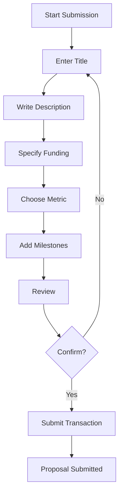

# Submitting Proposals

Learn how to submit proposals to the Prediction DAO for consideration.

## Overview

Proposals are how the DAO makes decisions about allocating resources. Anyone can submit a proposal by posting a bond and following the submission process.

## Requirements

Before submitting a proposal, ensure you have:

- ✅ **50 ETC bond**: Required for all proposals (returned upon good-faith resolution)
- ✅ **Proposal details**: Clear title, description, and justification
- ✅ **Funding request**: Amount and recipient address
- ✅ **Welfare metric**: Which metric will be used to evaluate success
- ✅ **Connected wallet**: With sufficient ETC balance

## Proposal Preparation

### 1. Define Your Proposal

A good proposal includes:

**Title** (max 100 characters)
: Clear, concise description of the proposal

**Description**
: Detailed explanation of what you want to accomplish

**Rationale**
: Why this proposal benefits the DAO

**Funding Amount**
: How much ETC you're requesting (max 50,000 ETC per proposal)

**Recipient Address**
: Where funds will be sent if approved

**Milestones** (optional)
: Specific deliverables and completion criteria

### 2. Choose a Welfare Metric

Your proposal will be evaluated against one of the welfare metrics:

=== "Treasury Value"
    
    **Best for**: Proposals expected to directly increase treasury value
    
    - Investment proposals
    - Treasury diversification
    - Revenue-generating initiatives

=== "Network Activity"
    
    **Best for**: Proposals that increase user engagement
    
    - Marketing campaigns
    - User acquisition
    - Feature development

=== "Hash Rate Security"
    
    **Best for**: Security and infrastructure proposals
    
    - Mining incentives
    - Security improvements
    - Network hardening

=== "Developer Activity"
    
    **Best for**: Development and community building
    
    - Grant programs
    - Hackathons
    - Documentation improvements

### 3. Set Milestones

Define clear completion criteria:

```markdown
Milestone 1: Design Phase (2 weeks)
- Complete technical specification
- Community feedback collected
- Design approved

Milestone 2: Development (6 weeks)
- Core functionality implemented
- Tests written and passing
- Security audit completed

Milestone 3: Deployment (1 week)
- Mainnet deployment
- Documentation published
- Monitoring setup
```

## Submission Process

### Step-by-Step Guide

#### 1. Navigate to Proposal Submission

1. Connect your wallet
2. Click **"Submit Proposal"** in the navigation
3. Ensure you have 50 ETC + gas fees

#### 2. Fill in Proposal Details



#### 3. Enter Required Information

=== "Basic Information"
    
    - **Title**: Keep it clear and descriptive
    - **Description**: Use markdown for formatting
    - **Funding Amount**: Enter in ETC (max 50,000)
    - **Recipient**: Valid ETC address

=== "Welfare Metric"
    
    - Select from dropdown
    - Explain why this metric is appropriate
    - Consider which metric best measures success

=== "Milestones"
    
    - Add one or more milestones
    - Include timelock periods
    - Define clear completion criteria

#### 4. Review and Submit

1. Review all details carefully
2. Check recipient address multiple times
3. Verify funding amount is correct
4. Click **"Submit Proposal"**
5. Approve transaction in MetaMask
6. Wait for confirmation

### Transaction Details

```solidity
// Approximate gas costs
Gas Limit: 300,000
Bond Required: 50 ETC
Total Cost: Gas fees + 50 ETC bond
```

!!! warning "Bond Recovery"
    Your 50 ETC bond is returned when the proposal resolves, provided it was submitted in good faith. Spam or malicious proposals may result in bond forfeiture.

## After Submission

### Review Period

Once submitted, your proposal enters a **7-day review period**:

- Community members can review and discuss
- No trading occurs yet
- You can't edit the proposal
- The bond is locked

### Market Creation

After review, markets are created:

1. **PASS tokens**: Represent belief proposal will succeed
2. **FAIL tokens**: Represent belief proposal will fail
3. **Initial price**: Both start at 0.50 ETC
4. **Liquidity**: LMSR provides automated market making

### Trading Phase

During the trading phase (7-21 days):

- Anyone can buy PASS or FAIL tokens
- Prices adjust based on demand
- All positions are encrypted
- You can trade on your own proposal

!!! tip "Trading Your Own Proposal"
    There's no restriction on trading your own proposal. However, consider the ethical implications and community perception.

### Resolution

After trading ends:

1. **Oracle Reporting**: Reporter submits welfare metric values
2. **Challenge Period**: 2 days for community to verify
3. **Finalization**: Market resolves to winner
4. **Execution**: If PASS > FAIL, proposal executes

## Proposal Best Practices

### Writing Effective Proposals

✅ **DO**:

- Be specific and detailed
- Provide clear success metrics
- Include realistic timelines
- Address potential concerns
- Show research and preparation
- Engage with community feedback

❌ **DON'T**:

- Submit vague or unclear proposals
- Request more funding than needed
- Ignore community concerns
- Submit duplicate proposals
- Make unrealistic promises

### Example Template

```markdown
# Proposal Title: [Clear, Descriptive Title]

## Executive Summary
[2-3 sentence overview]

## Problem Statement
[What problem does this solve?]

## Proposed Solution
[Detailed explanation of your proposal]

## Expected Outcomes
- Outcome 1
- Outcome 2
- Outcome 3

## Welfare Metric Justification
[Why this metric measures success]

## Budget Breakdown
- Item 1: X ETC
- Item 2: Y ETC
- Total: Z ETC

## Timeline
- Phase 1: [Duration]
- Phase 2: [Duration]
- Phase 3: [Duration]

## Team/Qualifications
[Your experience and credentials]

## Risks and Mitigation
[Potential issues and how you'll address them]
```

## Common Mistakes to Avoid

### Technical Errors

- **Wrong recipient address**: Double-check before submitting
- **Insufficient bond**: Ensure you have 50 ETC + gas
- **Wrong network**: Verify you're on the correct network

### Content Issues

- **Unclear objectives**: Be specific about what you'll deliver
- **Unrealistic timelines**: Set achievable deadlines
- **Missing details**: Provide comprehensive information
- **Poor formatting**: Use markdown for readability

## Monitoring Your Proposal

### Track Progress

Monitor your proposal through each phase:

=== "Review Phase"
    
    - Gather community feedback
    - Answer questions
    - Build support

=== "Trading Phase"
    
    - Watch PASS/FAIL prices
    - Monitor trading volume
    - Engage with traders

=== "Resolution"
    
    - Ensure oracle reports accurately
    - Be ready to provide evidence
    - Prepare for execution

### Responding to the Community

- Be responsive to questions
- Address concerns transparently
- Update the community on progress
- Accept constructive criticism

## Proposal Outcomes

### If Your Proposal Passes

1. **Timelock Period**: 2-day waiting period
2. **Ragequit Window**: Dissenting members can exit
3. **Execution**: Funds are transferred to recipient
4. **Bond Return**: Your 50 ETC bond is returned
5. **Delivery**: Complete your proposed work

### If Your Proposal Fails

1. **Market Resolution**: FAIL tokens win
2. **No Execution**: Proposal is not executed
3. **Bond Return**: Your 50 ETC bond is returned
4. **Learn and Iterate**: Consider feedback for future proposals

## Advanced Topics

### Multiple Milestones

For complex proposals with multiple phases:

```javascript
Milestone 1: {
  description: "Research and Design",
  duration: "4 weeks",
  timelock: "1 day"
}

Milestone 2: {
  description: "Development",
  duration: "8 weeks", 
  timelock: "2 days"
}

Milestone 3: {
  description: "Deployment",
  duration: "2 weeks",
  timelock: "3 days"
}
```

### Proposal Amendments

Cannot directly amend submitted proposals. Instead:

1. Wait for current proposal to resolve
2. Submit new proposal with changes
3. Reference original proposal
4. Explain what changed and why

### Linked Proposals

For proposals that depend on others:

- Reference prior proposals
- Explain dependencies
- Consider timing of submission
- Plan for different outcomes

## Frequently Asked Questions

**Q: What happens if I submit a spam proposal?**

A: Your 50 ETC bond may be forfeited. The community can identify spam during the review period.

**Q: Can I cancel a proposal after submission?**

A: No, proposals cannot be cancelled once submitted. Consider your proposal carefully before submitting.

**Q: How long does the entire process take?**

A: Minimum 16 days (7-day review + 7-day trading + 2-day resolution), typically 20-30 days.

**Q: Can I submit multiple proposals?**

A: Yes, but each requires a separate 50 ETC bond.

**Q: What if the oracle reports incorrectly?**

A: Anyone can challenge with a 150 ETC bond during the 2-day challenge period.

## Next Steps

- [Learn about trading on markets](trading-on-markets.md)
- [Understand the system workflow](using-the-system.md)
- [Check the FAQ](faq.md)
