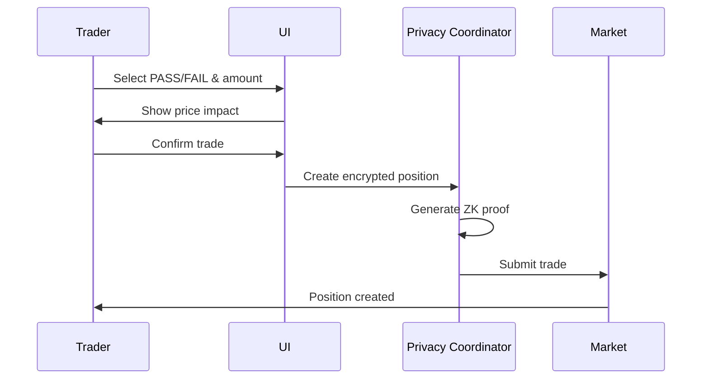
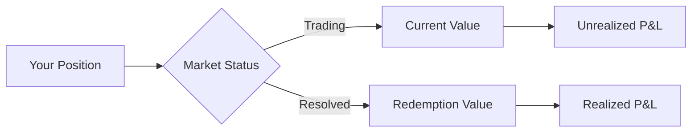

# Trading on Markets

Learn how to trade on prediction markets to express your beliefs about proposals.

## Overview

Trading on prediction markets allows you to:

- Express your beliefs about whether proposals will increase welfare metrics
- Earn profits if your predictions are accurate
- Participate in the futarchy decision-making process
- All while maintaining complete privacy

## Understanding Conditional Tokens

### PASS Tokens

**Buy PASS tokens if you believe:**

- The proposal will be executed
- The proposal will increase the welfare metric
- The final welfare metric value will be higher if the proposal passes

**PASS tokens redeem for**: The actual welfare metric value if the proposal passes

### FAIL Tokens

**Buy FAIL tokens if you believe:**

- The proposal will not be executed
- The proposal will decrease or not improve the welfare metric
- The final welfare metric value will be higher if the proposal fails

**FAIL tokens redeem for**: The actual welfare metric value if the proposal fails

### Token Pricing

Prices are determined by the market using LMSR (Logarithmic Market Scoring Rule):

```
P_pass + P_fail = 1
```

- If PASS = 0.70 ETC, then FAIL = 0.30 ETC
- Prices reflect aggregate market beliefs
- Higher price = higher probability according to the market

## Getting Started with Trading

### Prerequisites

Before trading, ensure you have:

- ✅ Connected wallet
- ✅ Sufficient ETC for trades + gas fees
- ✅ Understanding of the proposal you're trading on
- ✅ Knowledge of relevant welfare metric

### Your First Trade

#### 1. Find a Market

1. Navigate to **"Markets"** or **"Proposals"**
2. Browse active proposals
3. Click on a proposal to view its market
4. Review proposal details and market statistics

#### 2. Analyze the Proposal

Consider:

- **Proposal Quality**: Is it well-defined and achievable?
- **Team Credibility**: Does the proposer have relevant experience?
- **Budget Appropriateness**: Is the funding request reasonable?
- **Welfare Metric Fit**: Will this actually improve the chosen metric?
- **Market Sentiment**: What do current prices suggest?

#### 3. Choose Your Position

=== "Bullish (Buy PASS)"
    
    Buy PASS tokens if you believe:
    
    - The proposal will improve the welfare metric
    - Current PASS price undervalues true probability
    - You have information others might not

=== "Bearish (Buy FAIL)"
    
    Buy FAIL tokens if you believe:
    
    - The proposal won't improve the welfare metric
    - Current FAIL price undervalues true probability
    - The proposal has issues others haven't noticed

#### 4. Execute Your Trade



Steps:

1. Select **PASS** or **FAIL** token
2. Enter the amount you want to trade
3. Review the price and impact
4. Click **"Execute Trade"**
5. Confirm the transaction in MetaMask
6. Wait for confirmation

!!! tip "Price Impact"
    Large trades move prices more. Consider splitting large orders across multiple transactions.

## Trading Strategies

### Basic Strategies

#### Value Trading

Look for mispriced markets:

```
If you believe true probability is 80%:
- PASS price < 0.80: Buy PASS (undervalued)
- PASS price > 0.80: Buy FAIL (overvalued)
```

#### Information Trading

Trade based on unique information:

- Deep understanding of the proposal domain
- Technical analysis of feasibility
- Knowledge of team capabilities
- Awareness of external factors

#### Arbitrage Trading

Exploit price discrepancies:

- Compare similar proposals
- Look for inconsistent pricing
- Act quickly on opportunities

### Advanced Strategies

#### Portfolio Approach

Diversify across multiple markets:

- Don't put all funds in one market
- Balance PASS and FAIL positions across proposals
- Manage overall risk exposure

#### Time-Based Trading

Consider timing:

- **Early Trading**: Higher price impact, more uncertainty
- **Mid Trading**: More information available, moderate liquidity
- **Late Trading**: Most information known, prices may be efficient

#### Key-Change Strategy

Use key changes for privacy:

- If you suspect vote buying attempts
- To break potential collusion
- To maintain complete anonymity
- Invalidates previous commitments

## Market Mechanics

### LMSR Pricing

The system uses Logarithmic Market Scoring Rule:

```
Cost Function: C(q) = b * ln(e^(q_pass/b) + e^(q_fail/b))

Price Calculation:
P_pass = e^(q_pass/b) / (e^(q_pass/b) + e^(q_fail/b))
```

**Key Properties:**

- Prices always sum to 1
- Bounded loss for market maker
- Automatic liquidity provision
- Prices reflect aggregate beliefs

### Liquidity

Markets have automated liquidity via LMSR:

- No need for counterparty matching
- Always able to trade
- Price impact depends on liquidity parameter (b)
- Larger trades have proportionally higher impact

### Trading Fees

Current fee structure:

- **Trade Fee**: Included in price spread
- **Gas Fee**: Network transaction fee (varies)
- **No Exit Fee**: Redeeming tokens is free (except gas)

## Privacy Protection

### How Your Privacy is Protected

When you trade, multiple privacy layers activate:

1. **Position Encryption**
   - Your position is encrypted with Poseidon hash
   - Only aggregate data is public
   - Individual positions remain private

2. **Zero-Knowledge Proofs**
   - You generate a zkSNARK proof
   - Proves your trade is valid
   - Doesn't reveal position details

3. **Batch Processing**
   - Trades processed in epochs
   - Your trade mixed with others
   - Timing analysis prevented

4. **Key-Change Capability**
   - MACI-style key changes
   - Invalidate previous commitments
   - Prevent vote buying

### What's Visible vs. Private

=== "Public Information"
    
    ✅ Total trading volume
    
    ✅ Aggregate PASS/FAIL prices
    
    ✅ Number of traders (count only)
    
    ✅ Market statistics

=== "Private Information"
    
    🔒 Your position size
    
    🔒 Your trading direction
    
    🔒 Your identity
    
    🔒 Your profit/loss
    
    🔒 Your trading history

## Position Management

### Viewing Your Positions

Access your portfolio to see:

- **Active Positions**: Currently open positions
- **Position Value**: Current market value
- **Unrealized P&L**: Paper profit/loss
- **Settlement Status**: When positions can be redeemed

### Monitoring Market Prices

Track your positions:



### Exiting Positions

You can exit positions in two ways:

=== "Trade Before Resolution"
    
    Sell your tokens before the market resolves:
    
    - Click on your position
    - Select "Trade" or "Sell"
    - Accept current market price
    - Realize profit/loss immediately

=== "Redeem After Resolution"
    
    Wait for market resolution and redeem:
    
    - Market must be resolved
    - Navigate to your portfolio
    - Click "Redeem" on settled position
    - Receive payout based on outcome

## Resolution and Redemption

### How Markets Resolve

After the trading period ends:

1. **Oracle Report**
   - Oracle submits welfare metric values
   - Separate values for PASS and FAIL scenarios
   - Evidence provided (usually IPFS hash)

2. **Challenge Period**
   - 2-day window for challenges
   - Community can verify oracle data
   - Challengers post 150 ETC bond

3. **Finalization**
   - If no challenges: Oracle report accepted
   - If challenged: UMA arbitration
   - Winner determined: PASS vs. FAIL

### Redemption Process

Once resolved:

1. Go to **"Portfolio"**
2. Find settled positions
3. Click **"Redeem"** on winning tokens
4. Confirm transaction
5. Receive payout

**Payout Calculation:**

```
Winning PASS tokens:
Payout = token_amount × pass_welfare_value

Winning FAIL tokens:
Payout = token_amount × fail_welfare_value
```

## Risk Management

### Understanding Risks

=== "Market Risk"
    
    - Prices may move against you
    - Unexpected information may emerge
    - Your analysis may be incorrect

=== "Execution Risk"
    
    - Proposal may not be accurately evaluated
    - Oracle may report incorrectly
    - Resolution may be challenged

=== "Technical Risk"
    
    - Smart contract vulnerabilities
    - Oracle manipulation
    - Network issues

### Risk Mitigation Strategies

**1. Position Sizing**

- Never risk more than you can afford to lose
- Limit position size to small % of capital
- Diversify across multiple markets

**2. Due Diligence**

- Research proposals thoroughly
- Understand the welfare metric
- Verify proposal details
- Check team credentials

**3. Exit Planning**

- Set profit targets
- Define loss limits
- Monitor positions regularly
- Be ready to exit if needed

**4. Information Quality**

- Use multiple sources
- Verify claims independently
- Be skeptical of unverified information
- Consider confirmation bias

## Advanced Trading Topics

### Market Efficiency

As markets mature, they become more efficient:

- Early markets: More opportunities for informed traders
- Mature markets: Prices reflect available information
- Last hours: Usually most efficient (unless new info)

### Impact of Privacy

Privacy affects market dynamics:

- Reduced front-running
- Less toxic order flow
- More honest price discovery
- Reduced manipulation

### Oracle Dependency

Markets depend on accurate oracle reports:

- Research oracle reliability
- Understand reporting methodology
- Consider challenge likelihood
- Factor resolution risk into trades

## Troubleshooting

### Common Issues

**Transaction Failed**

- Insufficient gas
- Slippage too high
- Network congestion
- Try increasing gas limit

**Can't Redeem Tokens**

- Market not yet resolved
- Holding losing tokens
- Wrong network selected
- Wait for finalization

**Privacy Proof Failed**

- Browser compatibility issue
- Refresh and try again
- Clear cache
- Contact support if persists

## Trading Ethics

### Best Practices

✅ **DO**:

- Trade based on genuine beliefs
- Do your own research
- Respect others' privacy
- Report suspicious activity

❌ **DON'T**:

- Attempt to manipulate markets
- Engage in vote buying
- Share private information
- Spread misinformation

## Next Steps

- [Learn about submitting proposals](submitting-proposals.md)
- [Understand the system better](using-the-system.md)
- [Read the FAQ](faq.md)
- [Explore system architecture](../system-overview/how-it-works.md)
