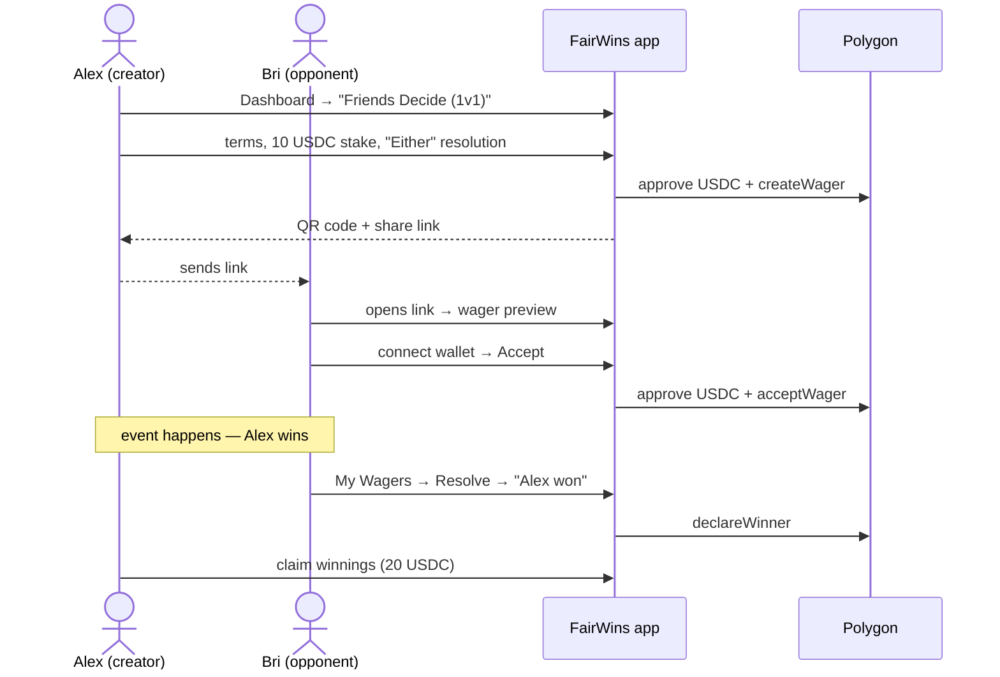
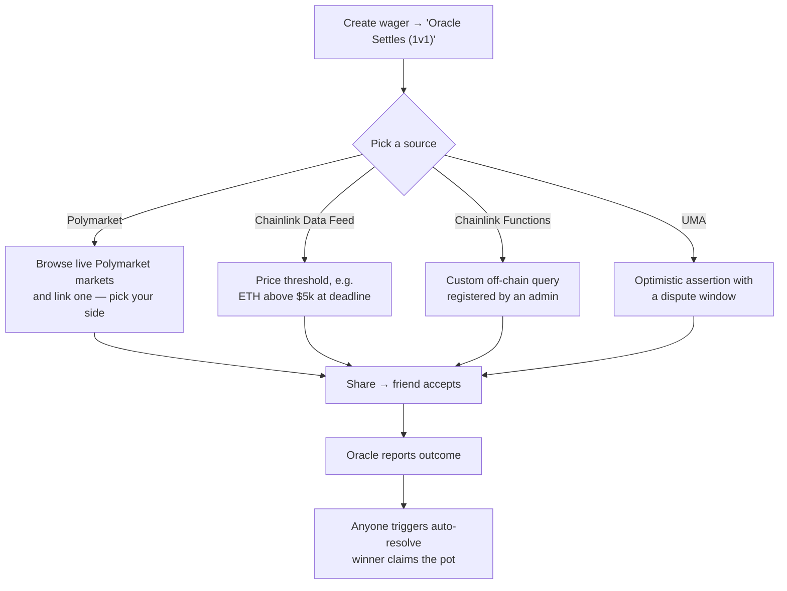
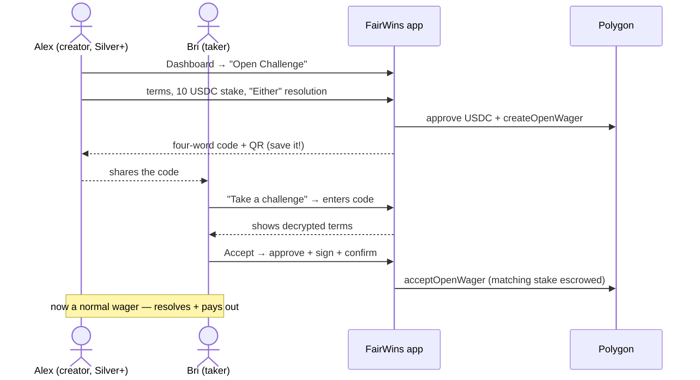
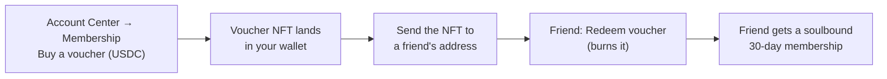

# User Journeys

End-to-end walkthroughs of every flow in the FairWins app, as two friends —
the **creator** and the **opponent** — would experience them. Each journey maps
to a detailed how-to guide linked along the way.

## Journey 1: An even-money bet between friends

The simplest case: two friends, equal stakes, and they trust each other to
declare the result.

1. **Alex creates.** From the Dashboard, *Friends Decide (1v1)* opens the
   wager form: description, 10 USDC stake each, an acceptance deadline
   (default 6 hours), an end time (default 1 day), and **Either** resolution —
   meaning either of them can declare the winner afterwards. Details:
   [Creating a Wager](create-wager.md).
2. **Alex shares.** After the transaction confirms, the app shows a QR code
   and a copyable deep link.
3. **Bri accepts.** The link opens an acceptance page showing the stake, the
   terms, the deadline, and who created it — viewable even before connecting a
   wallet. Bri connects, approves USDC, and accepts; both stakes are now in
   escrow. Details: [Accepting a Wager](accept-wager.md).
4. **Someone declares.** After the event, either of them opens *My Wagers* and
   declares the winner. Honest counterparties make this a one-click affair; if
   they both agree it was a tie, a mutual **draw** returns each stake. Details:
   [Resolving a Wager](resolve-wager.md).
5. **Winner claims.** The winner collects the whole pot — 20 USDC.

## Journey 2: An oracle settles it

When the friends don't want *any* human in the loop, they peg the wager to an
external data source at creation time.

The creation flow is the same as Journey 1, except the creator chooses
*Oracle Settles* and picks the source — for a Polymarket wager, an in-app
browser searches live Polymarket markets and the creator picks which side
they're taking. Once the underlying source resolves, the wager shows *Awaiting
Oracle* until anyone (either party, or any helpful third party) triggers
auto-resolution on-chain. No one has to trust anyone's word.

If the oracle never reports, the wager refunds after its resolve deadline —
stakes are never stranded.

## Journey 3: Make an Offer (asymmetric odds)

The creator can offer asymmetric stakes — e.g. *my 30 USDC against your 10* —
by choosing **Make an Offer** on the Dashboard and setting an odds multiplier.
The app derives the two stake amounts: whoever settles the wager puts up the
majority (insurer) stake, so picking **Me** vs **Them** as the settler flips
which side risks more. Everything else (sharing, acceptance, resolution) works
exactly like Journeys 1 and 2.

## Journey 4: A neutral arbitrator

For higher-stakes or easily-disputed bets, the creator chooses **A Friend** as
the settler and names an arbitrator's address at creation. Only the arbitrator
can declare the winner (or a draw). If the terms are encrypted, they're
encrypted for the arbitrator too, so they can actually read what they're
ruling on. Arbitrators see their pending cases in *My Wagers → Arbitrating*.

## Journey 5: Nothing happens — getting your money back

Every wager has two deadlines, and both protect you:

- **No one accepted in time?** After the acceptance deadline, reclaim your
  stake from *My Wagers* (the contract also lets anyone expire stale offers in
  batch).
- **Accepted but never resolved?** After the resolve deadline, either party
  can trigger a refund and both stakes return to their owners.
- **Changed your mind before acceptance?** Cancel the open wager any time; the
  opponent can likewise decline it.

## Journey 6: Managing your account

The **Account Center** (My Account) is home base:

| Tab | What it's for |
|-----|---------------|
| Account | Your address, connection status, disconnect |
| Membership | Your current tier and limits; buy/renew a tier, or buy/redeem a [membership voucher](membership-vouchers.md) |
| Security | Registering your encryption key for private wagers |
| Preferences | Polymarket category filters for oracle browsing |
| Swap | Swapping tokens via Uniswap (e.g. POL → USDC) |

A QR **scanner** is also available for accepting wagers in person — point it
at a friend's share code and you land directly on the acceptance page.

## Journey 7: An open challenge anyone can take

When the creator doesn't have one specific opponent in mind, they post an
**open challenge** — no named opponent, gated by a four-word code.

1. **Alex creates an open challenge.** Requires a **Silver** membership or
   above. Alex enters the terms, the (equal) stake, and a resolution method —
   *Either side* or a *named arbitrator*. The app returns a **four-word code**
   and a QR/link. **Alex saves the code** — it can't be recovered.
2. **Alex shares the code** with one person or many — whoever gets it first can
   take the other side.
3. **Bri takes it.** Any active membership tier works. Bri chooses *Take a
   challenge*, enters the four words, reads the decrypted terms, then
   **approves** the stake, **signs** to authorize, and **confirms** — escrowing
   the matching stake.
4. From here it's identical to Journey 1: it resolves, draws, or refunds.

Full guide: [Open Challenges](open-challenges.md).

## Journey 8: Gifting a membership with a voucher

A membership can be bought as a transferable token and given away.

1. **Buy a voucher** for a tier in Account Center → Membership (pays that tier's
   USDC price). It arrives as an ERC-721 in your wallet and confers no
   membership while held.
2. **Gift or resell it** — send the NFT to whoever you like (or list it).
3. **They redeem it.** Redemption burns the voucher and writes a soulbound,
   time-bound membership to the redeemer's wallet, unlocking wagering for them.

Full guide: [Membership Vouchers](membership-vouchers.md).

## What happens behind the scenes

Each journey above is a thin UI over a handful of contract calls — see
[How It Works](../system-overview/how-it-works.md) for the on-chain lifecycle
and state machine, and the
[Architecture guide](../developer-guide/architecture.md) for the full system
diagram.
