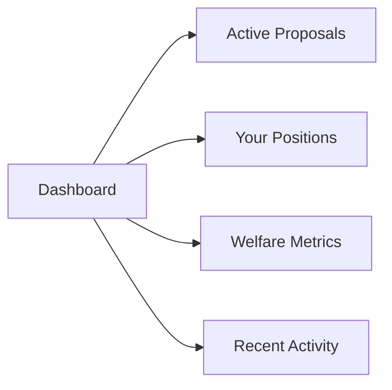
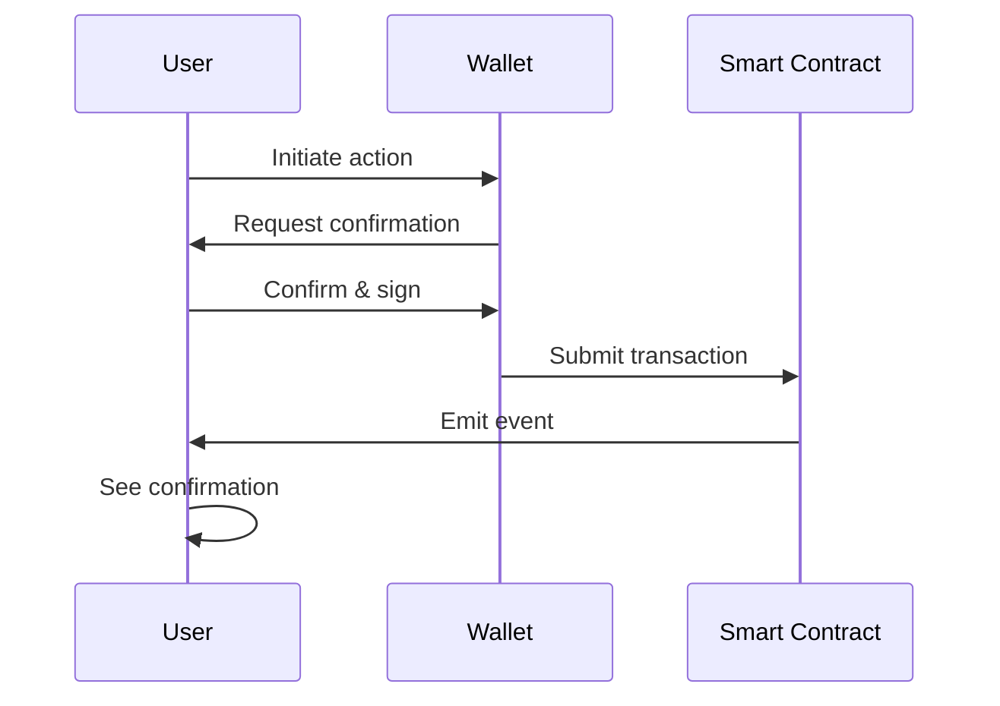
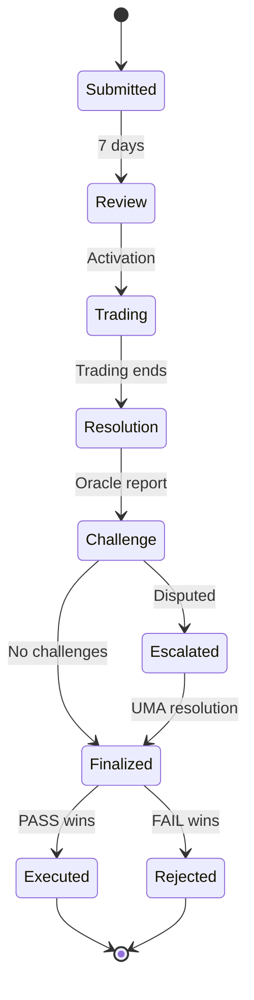

# Using the System

This guide provides an overview of how to use the Prediction DAO system effectively.

## Connecting Your Wallet

Before you can interact with the system, you need to connect your Web3 wallet.

### Steps to Connect

1. Click the **"Connect Wallet"** button in the top right corner
2. Select **MetaMask** (or your preferred wallet)
3. Approve the connection request
4. Confirm you're on the correct network

!!! tip "Multiple Wallets"
    You can switch between different wallet accounts. The interface will update to show positions and balances for the connected account.

## Navigating the Interface

### Dashboard

The dashboard is your home screen and shows:

- **Active Proposals**: View proposals currently in the trading phase
- **Your Positions**: See all your active market positions and their values
- **Welfare Metrics**: Check current and historical welfare metric values
- **Recent Activity**: Monitor recent proposals, trades, and resolutions

### Proposal Browser

Browse all proposals by status:

- **Active**: Currently accepting trades
- **Pending**: Awaiting activation
- **Resolving**: In oracle resolution phase
- **Executed**: Completed proposals
- **Rejected**: Not executed proposals

### Market View

For each proposal, you can view:

- Current PASS/FAIL token prices
- Total trading volume
- Number of traders (anonymous)
- Time remaining in trading period
- Welfare metric being evaluated

### Portfolio

Manage your assets:

- View all your token positions
- Check position values
- Redeem settled positions
- Track profit/loss
- Monitor bond status

## Key Interactions

### Viewing Proposals

1. Navigate to **"Proposals"** tab
2. Filter by status if desired
3. Click on any proposal to view details:
   - Title and description
   - Funding request
   - Welfare metric
   - Milestones
   - Market statistics

### Checking Welfare Metrics

1. Go to **"Metrics"** section
2. View current values:
   - Treasury Value (TWAP)
   - Network Activity Index
   - Hash Rate Security
   - Developer Activity
3. See historical trends
4. Participate in metric weight voting

### Managing Your Portfolio

1. Navigate to **"Portfolio"**
2. View your positions:
   - Active positions (still trading)
   - Settled positions (ready to redeem)
   - Bonds (proposal/oracle/challenge)
3. Redeem settled positions:
   - Click "Redeem" on settled position
   - Confirm transaction
   - Receive payout based on resolution

## Transaction Types

### Standard Transaction Flow

### Gas Fees

All transactions require gas fees:

- **Submit Proposal**: ~300,000 gas + 50 ETC bond
- **Trade**: ~150,000 gas (varies with privacy proofs)
- **Oracle Report**: ~200,000 gas + 100 ETC bond
- **Redeem Tokens**: ~80,000 gas

!!! tip "Gas Optimization"
    Batch multiple trades in a single epoch to reduce per-trade gas costs.

## Privacy Features

### Your Trading Privacy

When you trade, your position is private:

1. **Position Encrypted**: Your position size and direction are encrypted
2. **Zero-Knowledge Proof**: You generate a proof your trade is valid
3. **Batched Processing**: Trades are processed in groups
4. **Anonymous**: Your identity isn't linked to positions

### What's Public

The following information is publicly visible:

- Total trading volume
- Aggregate PASS/FAIL prices
- Number of positions (not identities)
- Market statistics

### What's Private

The following remains private:

- Your individual position size
- Your trading direction (PASS or FAIL)
- Your total holdings
- Your trading history

## Understanding Market Phases

### Proposal Lifecycle

### Phase Details

=== "Submission"
    
    - Proposer submits with 50 ETC bond
    - 7-day review period
    - Community can review and discuss

=== "Trading"
    
    - Markets open for 7-21 days
    - Anyone can trade PASS/FAIL tokens
    - Prices reflect aggregate beliefs
    - Privacy protection active

=== "Resolution"
    
    - Oracle submits welfare metric values
    - 3-day settlement window
    - Evidence must be provided

=== "Challenge"
    
    - 2-day challenge period
    - Anyone can challenge with 150 ETC bond
    - Evidence review

=== "Execution"
    
    - 2-day timelock
    - Ragequit window opens
    - Proposal executes if PASS > FAIL
    - Bonds returned

## Notifications and Events

### Stay Informed

The system emits events for important activities:

- Proposals enter new phases
- Oracle reports submitted
- Challenges initiated
- Markets resolved
- Positions settled

### Event Subscriptions

You can subscribe to notifications for:

- Your proposals
- Your positions
- Specific welfare metrics
- System-wide announcements

## Best Practices

### For All Users

1. **Verify Transactions**: Always review transaction details before confirming
2. **Monitor Gas Prices**: Trade when network congestion is low
3. **Keep Records**: Track your proposals and positions
4. **Stay Updated**: Follow system announcements

### Security Tips

!!! warning "Security Best Practices"
    
    - Never share your private keys or seed phrase
    - Verify the contract addresses before interacting
    - Use a hardware wallet for large amounts
    - Be cautious of phishing attempts
    - Double-check transaction details

### Privacy Tips

- Use key-change if you suspect collusion attempts
- Don't publicly discuss your position sizes
- Consider using multiple accounts for different strategies
- Remember: all on-chain activity is permanent

## Getting Help

If you encounter issues:

1. Check the [FAQ](faq.md) for common problems
2. Review transaction history for error messages
3. Verify your wallet connection and network
4. Join community support channels

## Next Steps

Learn more about specific features:

- [Submitting Proposals](submitting-proposals.md) - Create proposals for the DAO
- [Trading on Markets](trading-on-markets.md) - Participate in prediction markets
- [FAQ](faq.md) - Common questions and answers
